**Language:** English | [Українська](../../i18n/uk/course/lessons/01_sql_vstup.md)

<h2 align="center">Databases and their types</h2>

**DBMS scope:** [CORE] (portable SQL fundamentals).


Before starting a journey into the world of data where tables, columns and rows are
an integral part of it, and requests for receiving information are formulated
in SQL, let's consider the main "institutions" that ensure harmony
of this world 

📌 **Database** --- is an organized collection of data created to
to conveniently access, manage and update information.
It is stored and managed using special software
software. 
records or files that contain information such as sales transactions,
customer data, financial information and product information.

**Databases** are used to store, maintain and access
different types of data. 
providing centralized access and analysis of this data.

Companies use data stored in databases for **acceptance
sound business decisions**. 
are different. 

1. **Improving business processes**

Companies collect data about business processes such as sales, processing
orders and customer service. 
process efficiency, business expansion and increased profits.

2. **Customer Tracking**

Databases often store information about people, particularly customers
or users. 
to store information about users, such as their names,
email addresses and activity. 
to recommend content to users and improve custom
experience

3. **Secure storage of personal information**

Databases can also be used to store personal
information 
users to store media files such as photos in a convenient and
secure cloud environment.

<div align="center">
  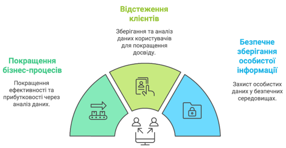
</div>

<h2 align="center">Relational databases</h2>

In today's world, where data has become an invaluable asset for businesses,
proper organization and management of databases becomes a key factor
success 
data is a **relational database model**.

📌 **Relational database model (RMDB)** is an approach to organization and
data management, which was proposed by Edgar Codd in 1970.

The **relational model** of databases is based on the concept of tables,
columns and rows. 
a table where **columns** represent **attributes** (characteristics)
of data, and **rows** are specific **records or tuples** of **data**.

For example, we might have a **table** 'Customers' where the **columns** are
FirstName, LastName, Email, and Phone, and the **strings** contain information
about individual customers. 

<div align="center">
  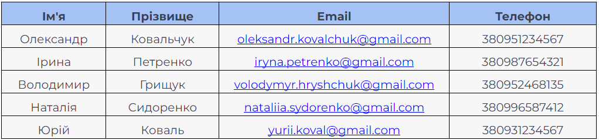
</div>

So, again: In the **relational model**, the data is represented in the
in the form of **tables**, **which are called relations**. 
consists of a set of records that contain information about a certain group
entities 
tables. 
tables. 
value format.

The elements of the relational model have different names, so it is important to know the different ones
options, but it is better to stick to one particular option so that
avoid confusion. 
models:
<div align="center">
  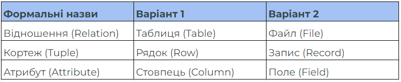
</div>

<div align="center">
  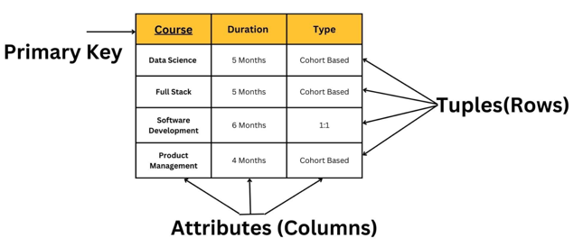
</div>

One of the **core principles** of the relational model is opportunity
establishing relationships between tables. 
done with **keys**. 
attributes that act as keys. 
identification of unique entries in the table and establishment of relationships between
different tables. 
common attributes that contain the same values ​​in the corresponding records
different tables.

Let's say we have another **table** "Orders" that contains information
about customer orders. 
(*table* "*Customers*" *and table* "*Orders*") using
a unique **customer id** as a foreign key in the table
"Order". 
tables and perform complex queries, for example, select all orders
a certain client.

💡 We will talk in more detail about **keys** and connections between relations at
next classes.

<h2 align="center">Advantages of the relational model</h2>

The main advantages of the relational model of databases:

- **Simplicity**. 
easily understood and used by database developers and clients
data

- **Flexibility**. 
data, including inserting, updating, deleting records, merging,
projection and sorting.

- **Independence from physical implementation**. 
separate the logical representation of data from their physical one
preservation. 
database, can work with the data, regardless of how
data is stored on disk or in computer memory.

- **Data integrity. 
ensuring data integrity. 
rules and restrictions that guarantee correctness of data in the database.
For example, you can set a limit on the value of a certain attribute,
so that it does not exceed a certain limit or is unique for everyone
recording

- **Scalability**. 
depending on system needs. 
database structure and optimize it to achieve better
productivity.

- **Security**. 
data access. 
users and roles to restrict access to confidential
information and ensure data security.

📎 *Despite numerous advantages, the relational model has some **limitations**.
For example, it may not be effective for some data types such as
columns or small pieces of data that do not fit into a table
structures.*

*However, with the help of extensions and additional functions of relational databases
can successfully cope with most of the problems of modern business.*

<h2 align="center">Let's summarize the main points related to relational models:</h2>

**Relational models** are the foundation of modern databases. 
allows you to efficiently store and organize large amounts of data.

Relational models use a **table structure** with columns
(attributes) and strings (tuples), which simplifies work with data and
provides their logical organization.

Relational models use **keys for unique
identifying** rows and establishing relationships between tables.

Relational models provide **data integrity** through usage
constraints and rules that allow you to keep consistent
data.

**Relational database queries** are made using language
structured query **SQL**, which provides powerful tools for
search, sorting, filtering and data analysis.

Relational models are **flexible** and can be applied in a variety of ways
industries, in particular in business, science, project management, etc.

Using relational models helps to **enhance
efficiency** of data processing, ensures **structuredness** **and
availability of information** to users and allows **to store
data** in a secure environment.

So, relational models are a powerful and reliable tool for
organization and management of data, allow high speed and
efficiently store large volumes of information, manage them and
analyze them.

<h2 align="center">Database management systems and their types</h2>

Thomas Connolly and Carolyn Begg define **database management system
(DBMS)** --- database management system (DBMS)** --- as software
provision that allows users to define, create, save
and control access to the database.
Examples of DBMSs include **MySQL, MariaDB, PostgreSQL, SQLite, Microsoft
SQL Server, Oracle Database, and Microsoft Access.**

*📎 The DBMS acronym is sometimes expanded to indicate the underlying database model
data, for example, RDBMS (relational database management
system) for the relational model, **OODBMS (object-oriented database
management system)** for object-oriented model and **ORDBMS
(object--relational database management
system)** for the object-relational model.*

*Other extensions may indicate the presence of other features,
for example, DDBMS (distributed database management
system) for a distributed database management system.*

<h2 align="center">DBMS functionality</h2>

The functionality provided by the DBMS can vary significantly. 
functionality consists of storing, retrieving, and updating data. 
offered the following functions and services that should be provided by a full-fledged
universal DBMS:

- Storing, retrieving and updating data.

- A catalog or data dictionary that describes metadata and to which metadata
can be accessed by the user.

- Support transactions and competitiveness.

- Means of restoring the database in case of its damage.

- Support for access authorization and data update.

- Support for access from remote locations.

Applying constraints helps to ensure data consistency in the database
data to certain rules.

<div align="center">
  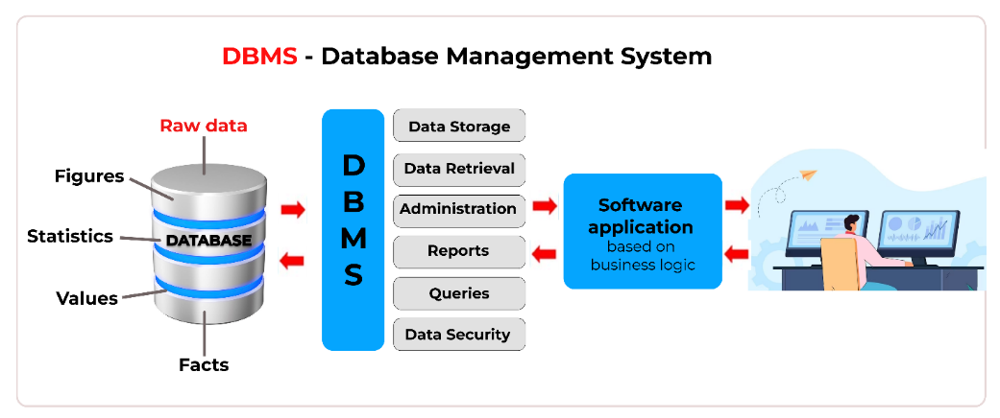
</div>

A DBMS can also be expected to provide a **set of utilities (software
means)** necessary for effective database administration,
in particular utilities for import, export, monitoring, defragmentation and
analysis 
the application interface, sometimes called the **base module** of the database.

Often there are **configuration options** in the DBMS that you can
configure both statically and dynamically, for example, maximum volume
RAM on the server that the database can use.
The trend is to minimize the amount of manual configuration. 
embedded databases, the need for zero is especially important
administration

<h2 align="center">Types of DBMS</h2>

There are many different database management systems (DBMS) with regard to
various user needs and requirements. 
there are many different DBMS**:

**Variety of Applications.** There is a wide range of applications, from
from small websites to large corporate systems. 
applications may have unique DBMS requirements, such as speed,
scalability, security, backup, etc. 
different sets of functions and capabilities, which allows you to choose a system that
will be best suited for a particular application.

**Data models.** DBMS can use different data models, such as
as relational, object-relational, hierarchical, network, columnar, etc.
Each model has its advantages and limitations, and the choice of a particular DBMS
depends on the needs of the project and the type of data it works with.

**Technical features.** Different DBMS may have different technical features
features that make them appropriate for certain scenarios. 
some DBMS may be specialized in operations with text or
geographic data and provide built-in support for these data types.

**Performance.** One DBMS may be superior in certain areas of performance,
while the other --- in others.

Let's consider some **DBMS** in more detail.

<div align="center">
  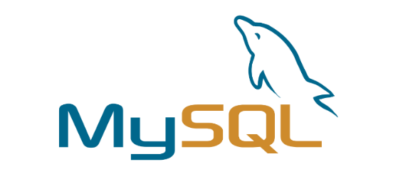
</div>

**MySQL** is one of the most popular relational databases. 
an open solution that appeared as a component of the LAMP stack (Linux, Apache,
MySQL, Perl/PHP/Python). 
compatibility with web applications and supported by well-known cloud
platforms.

<div align="center">
  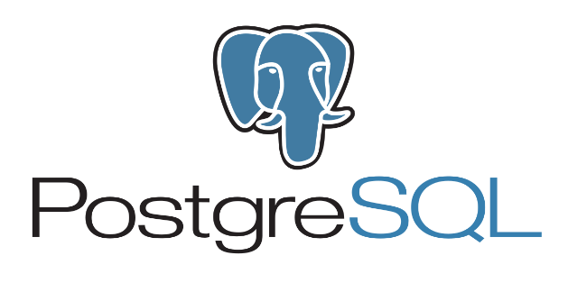
</div>

**PostgreSQL** is also an open source relational database
by code 
SQL. 
extensions for working with JSON and other non-relational data types.

<div align="center">
  
</div>

**Oracle** is one of the leading commercial relational databases. 
characterized by high reliability, scalability and performance. 
provides advanced data management capabilities, including support
transactions, a high level of security and distributed computing.

<div align="center">
  
</div>

**Microsoft SQL** **Server** is a commercial relational database,
developed by Microsoft. 
high performance, scalability and affordable tools for
business analysts. 
and supports cloud solutions.

<div align="center">
  
</div>

**MongoDB** is a document-oriented, non-relational database. 
stores data in the form of flexible JSON documents, which allows fast and
change the data structure flexibly. 
scaling and high data access speed.

<div align="center">
  
</div>

**Redis** is an open key-value database that provides
fast access and data processing in memory. 
data caching, saving user sessions, implementing queues,
supporting distributed systems and many other scenarios where important
speed and reliability.

<div align="center">
  
</div>

**BigQuery** is a cloud-based data analytics platform powered by Google
Cloud. 
to large volumes of data. 
computing power of cloud servers for distributed execution
requests on a large scale.

So **database management systems (DBMS)** are important
tools for effective data storage, management and access.
They allow you to **organize a data structure, perform a variety of
operations, promote safety and integrity**.

- There are many different DBMSs due to the variety of needs and requirements
users.

- Different DBMSs have different data models, functionality, features, etc
approaches to work with data.

- Each DBMS can be appropriate for a specific scenario or
application, depending on its size, data type, speed,
scalability and other requirements.

- DBMS applications are wide and cover various industries, in particular business,
education, science, medicine, e-commerce and many others.

- DBMS are used to create and manage databases,
execution of complex requests, data analysis, security assurance,
saving backup copies, working with multi-user systems
etc.

In conclusion, DBMS is an integral part of modern information
environment** that helps ensure efficient and reliable management
given in various fields. 
needs and requirements of the project, taking into account functionality, scalability,
speed and other factors.

<h2 align="center">Access control and password sharing rules</h2>

In today's world of data, data analysts play the role of superheroes who
protect information as a valuable secret. 
in childhood, we were forbidden to open the door to strangers, in the world of analytics
we face our own data protection problem. 
--- this is your home. 
so that no "strangers" get access to your valuable information,
even if temptation and curiosity make you wonder what it really is
is behind the door...

*📎 Companies use access control solutions for
authentication, authorization and audit of access to programs and IT systems. 
solutions are often part of an **identification and management system
(IAM).** Access management solutions help increase
level of security and reduce risk by strictly controlling access to
programs, services and IT infrastructure both on-site and in the cloud. 
help ensure that certain users have access to certain
resources during a certain time and for specific reasons.*

Most access control solutions include management tools
access privileges and tracking of login and access attempts. 
access control solutions were provided in the form of traditional software
software. 
as a Service (IDaaS) **which provides flexibility and ease of use
use 
login to your programs.

**Access control for clients and access control for
users**

Software developers and solution providers offer
two different types of access control solutions. 
client access** are used for authentication and
authorization of employees who have access to corporate programs and
IT systems. 
to support hundreds of thousands of users and have the ability to integrate with
corporate IT systems and catalogs.

*📎 Despite the fact that they are aimed at different audiences and
support different operating environments as an access control solution
for customers, and access control solutions for users
provide multi-factor authentication functionality and capabilities
for single sign-on.*

<h2 align="center">Multi-factor authentication</h2>

Most access control solutions support the functionality
**multi-factor authentication (MFA)** to protect against counterfeiting and
theft of user credentials. 
authentication the user must provide several forms of evidence for
gaining access to an application or system, such as a password and
one-time short-term SMS code.

Authentication factors include:

- Knowledge Factors --- Something the user knows, such as a password or
the answer to the security question.

- Possession factors --- something the user has, such as a mobile
device or access card.

- Hereditary factors --- something that is biologically unique to
of the user, for example, a fingerprint.

- Location Factors --- User's geographic location.

*📎 Top class solutions support adaptive methods
authentication with the use of artificial intelligence, using
contextual or behavioral analytics data and administratively defined
policy to set which authentication factors to apply to
a specific user in a specific situation.*

<h2 align="center">Single entry</h2>

Most access control solutions support
**single sign-on (SSO)** capabilities that allow users
access all your apps and services with one
set of credentials. 
eliminating problems with different passwords to different services.

📌 **Rules for password sharing (password sharing
rules)** are set to ensure security and restrictions
unauthorized access to accounts.

Here are some **general principles** of password sharing rules:

1. **Do not share the password** 🙂

Passwords must be personal and confidential. 
password to other people, even colleagues, friends or relatives.

2. **Do not use the same password for different accounts** 

Each account must have a unique password. 
the same password for different services can lead to
compromising all of your accounts in the event of a security breach
one of them

3. **Use strong passwords**

Create passwords that contain combinations of upper and lower case letters, numbers and
special characters. 
birth dates or simple sequences.

4. **Change passwords regularly**

It is recommended to change passwords periodically to prevent possible
compromise 

5. **Use two-step verification** 

Enable **two-factor authentication** for
increasing the security of accounts. 
security by requiring an additional form of authentication, such as
a one-time code that is sent to your mobile device.

6. **Do not store passwords in dangerous places** 

Avoid writing down passwords on paper, in notes on the computer or in
email messages.

7. **Use a password manager** 

Consider using a password manager to help
securely store and manage your passwords. 
generates strong passwords, remembers them for you and fills them in automatically
accounts.

8. **Change passwords immediately after potential compromise** 

If you suspect that your password may have been compromised, e.g.
through reports of suspicious activity or security breaches,
immediately change the password for the corresponding account.

9. **Give access only to necessary persons** 

Restrict access to your accounts to only those who really need it
need 
credentials.

10. **Learn about password security** 

Familiarize yourself with the latest security recommendations and practices
passwords 
preventing them.

<h2 align="center">Introduction to the SQL language</h2>

**SQL** is a programming language designed to manage data that
stored in a relational database management system (RDBMS).

Simply put, **SQL** is a language that allows us to interact with
databases. 
modify tables, establish relationships between data, aggregate and
analyze information, etc. 
with which you can implement your ideas and requests in real life
life

*📎 **SQL (Structured Query Language)** stands for language
structured requests.*

SQL consists of three main components:

- data definition language **(Data Definition Language --- DDL);**

- data manipulation languages ​​**(Data Manipulation Language --- DML);**

- data control languages ​​**(Data Control Language --- DCL);**

**Data Definition Language (DDL)** is used to create and
scheme modifications. 
a new table in the database, and the ALTER TABLE statement changes the structure
existing table.

**Data Manipulation Language (DML)** provides constructs for querying data,
such as the SELECT statement, and data updates such as
INSERT, UPDATE, and DELETE statements.

**Data Control Language (DCL)** consists of statements that
are responsible for user authorization and security, for example
GRANT or REVOKE statements.

<h2 align="center">The SQL standard</h2>

SQL was one of the first commercial database languages ​​since 1970. 
At the time, various database vendors were implementing SQL into their products with
some variations. 
suppliers,

**American Standards Institute (ANSI)** published the first standard
SQL in 1986.

ANSI then updated the SQL standard in 1992, known as SQL92 and SQL2, a
also in 1999 as SQL99 and SQL3. 
functions and commands to the SQL language.

*📎 The SQL standard is now supported by both **ANSI** and **International
by the standards organization as ISO/IEC 9075**. 
of the standard --- SQL:2016 and SQL:2023..*

The SQL standard formalizes the syntactic structures and behavior of SQL in
database products. 
code, such as MySQL and PostgreSQL, where RDBMSs are primarily developed
communities, not large corporations.

Below are the most popular SQL dialects:

PL/SQL stands for SQL Procedural Language. 
Oracle database.

Transact-SQL or T-SQL was developed by Microsoft for Microsoft SQL Server.

PL/pgSQL stands for PostgreSQL Procedural Language, which consists of a dialect
SQL and extensions implemented in PostgreSQL.

MySQL has its own procedural language since version 5.

Note that MySQL was acquired by Oracle.

Because SQL was designed specifically for non-technical people, it is very
simple and easy to understand. 
you need to say WHAT you want, NOT HOW you want it---as opposed to
how it is implemented in other imperative languages ​​like PHP, Java
and C++.

SQL is a user-friendly language because it is designed in
mainly for performing special requests and creating reports.

SQL is now used by highly qualified professionals such as
data analysts, data researchers, developers and database administrators
data

<h2 align="center">Basic rules of SQL syntax</h2>

SQL consists of many statements, each of which is usually
ends with a semicolon (;). 
instructions:

<div align="center">
  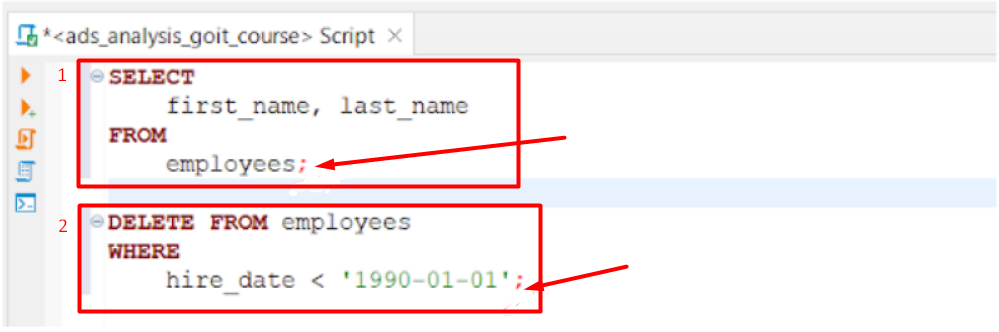
</div>

- In SQL, there are many keywords with special meanings,
for example, **SELECT**, **INSERT**, **UPDATE**, **DELETE**, and **DROP**.
These keywords are reserved and cannot be used
such as the names of tables, columns, indexes, views, stored procedures,
triggers or other database objects.

- To document SQL statements we use **comments
SQL**. 
data ignores characters in comments. 
consecutive hyphens (\--)**, which allow you to comment the rest
line 
you will use **C-style multiline notation ( /\*\*/)**

<div align="center">
  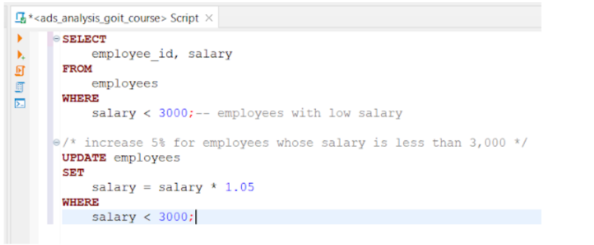
</div>

*💡 Remember these basic rules, as we will in the future
apply them already in practice!*

In conclusion---some **short abstracts** that emphasize the importance
SQL Basics:

- **SQL** is a structured query language that allows us
interact with databases, get information and manage
data

- Basic SQL requires knowledge of **basic commands** such as SELECT,
```sql
    INSERT, UPDATE і DELETE, що дозволяють нам працювати з даними в
    таблицях.
```
- Knowledge of **basic SQL statements** such as WHERE, JOIN, GROUP BY and
ORDER BY helps us filter data, join tables,
aggregate information and sort results.

- **Understanding** **database structure** including tables, columns and
relationships between them is a key aspect of working with SQL.

- Basic skills in writing **effective queries and optimization
requests** help improve performance and efficiency
working with databases.

- Knowing the **basics of SQL** opens the door to more complex concepts and
capabilities such as creating tables, managing access rights and
database design.

- **SQL** is one of the **most common languages** for working with data and
an essential tool for analysts, developers and everyone who
works with databases.

In general, understanding the basics of SQL plays an important role in achieving success in
working with data. 
valuable information from databases.

<h2 align="center">Basics of Query Writing (DQL)</h2>

**DQL** statements are used to query data in
scheme objects. 
Manipulation Language).**

We can define **DQL** as follows: It is a component of an SQL statement which
allows you to retrieve data from the database and put order on it. 
contains a **SELECT** statement. 
data to perform operations with them. 
to a table or tables, the result is compiled into the next temporary
a table that is displayed or possibly retrieved by the program.

In particular, the **SELECT** statement is used with the following commands:

-   **FROM**

-   **WHERE**

-   **GROUP BY**

-   **HAVING**

-   **ORDER BY**

-   **LIMIT**

*💡We will get to know each of these teams separately.*

<h2 align="center">SELECT</h2>

**SELECT** selects data from one or more tables. 
the basic syntax of the **SELECT** statement that selects data from one
tables:

```sql
SELECT select_list
```
FROM table_name;

In this syntax:

- First specify a comma-separated list of columns from the table, which
we need

- Then, in FROM, specify the name of the table from which we extract information.

When the **SELECT** statement is executed, the database system first
reads **FROM** followed by **SELECT**.

A semicolon (;) is not part of the query. 
it to separate two SQL statements.

If you want to extract all the columns of the table, instead of their list, you can
use the asterisk operator **(\*)**.

```sql
SELECT *
FROM table_name;
```

*📎 SQL is case insensitive. 
same value.*

For the demonstration, we will use the **employees** table.

<div align="center">
  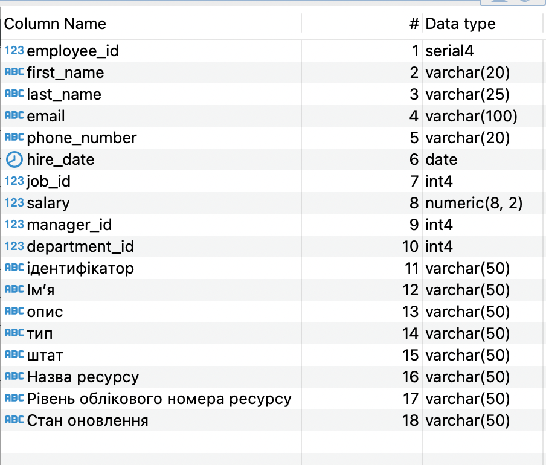
</div>

**<div align="center" style="text-align: font-size: 24px">Приклад 1. Отримання даних з усіх рядків і стовпців таблиці</div>**

The following SQL code example uses a SELECT statement for
obtaining data from all rows and columns of the **employees** table:

```sql
SELECT * 
FROM HR.employees;
```

Result:

<div align="center">
  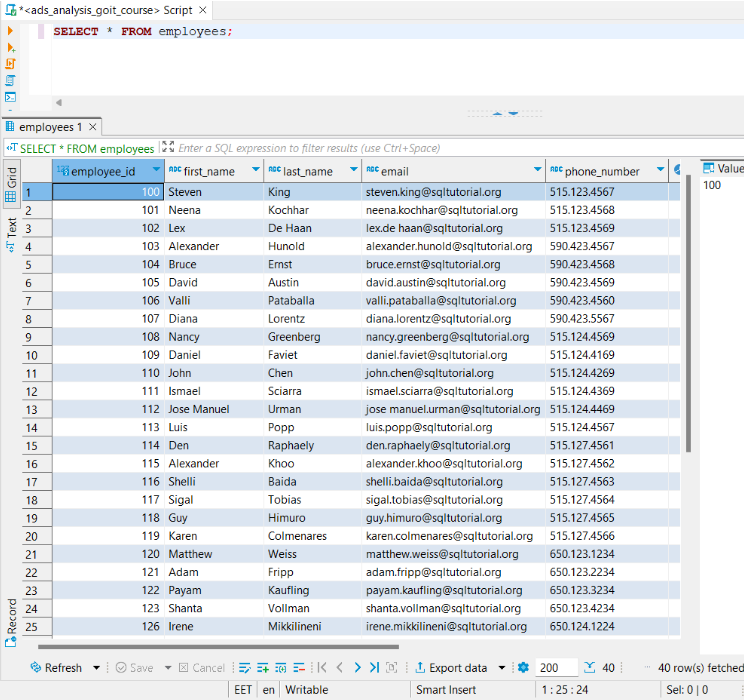
</div>

<h2 align="center">Importantly</h2>

Reads **SELECT \*** as a selection asterisk. 
for special requests. 
the selection asterisk should be avoided because **SELECT \***
returns data from all columns of the table. 
not from all columns, but only from one or more columns. 
you use **SELECT \***, the database needs more time to
read data from the disk and transfer it to the program. 
low performance if the table contains many columns with large
amount of data.

To select data from specific columns, you must specify a list of these
columns after the **SELECT** statement.

For example, the following data is selected from the employee ID,
first name, last name and date of employment from all rows in the employees table:

```sql
SELECT employee_id
    , first_name
    , last_name
    , hire_date
FROM "HR".employees;
```

Let's look at the result:

<div align="center">
  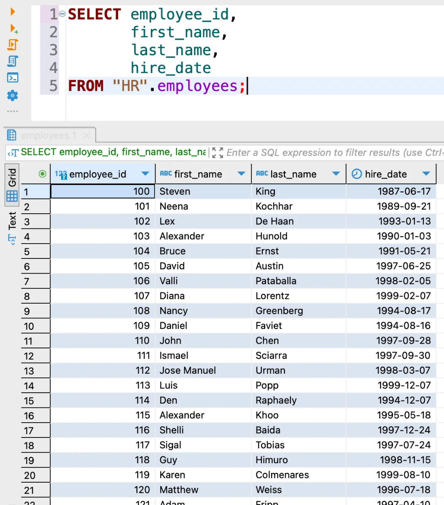
</div>

**<div align="center" style="text-align: font-size: 24px">Приклад 2. Отримання імені, прізвища, зарплати та нової зарплати</div>**

This example uses the **SELECT** statement to retrieve
name, surname, salary and new salary (By how much % did we increase
initial salary?):


```sql
SELECT first_name
     , last_name
     , salary
     , salary * 1.05
FROM HR.employees;
```

<div align="center">
  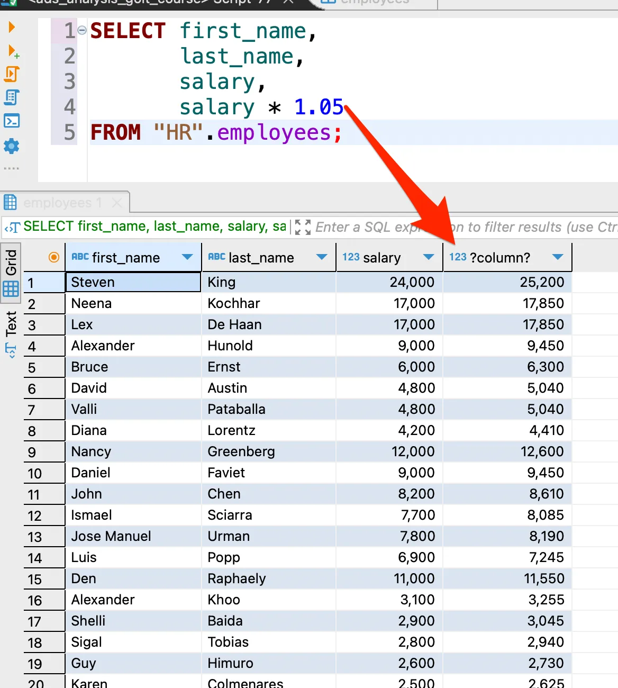
</div>

The expression **salary * 1.05** adds 5% to each employee's salary.

For example, the following **SELECT** statement uses **new_salary** as
column alias for **salary \* 1.05** expression:

```sql
SELECT first_name
     , last_name
     , salary
     , salary * 1.05 AS new_salary
FROM HR.employees;
```
<div align="center">
  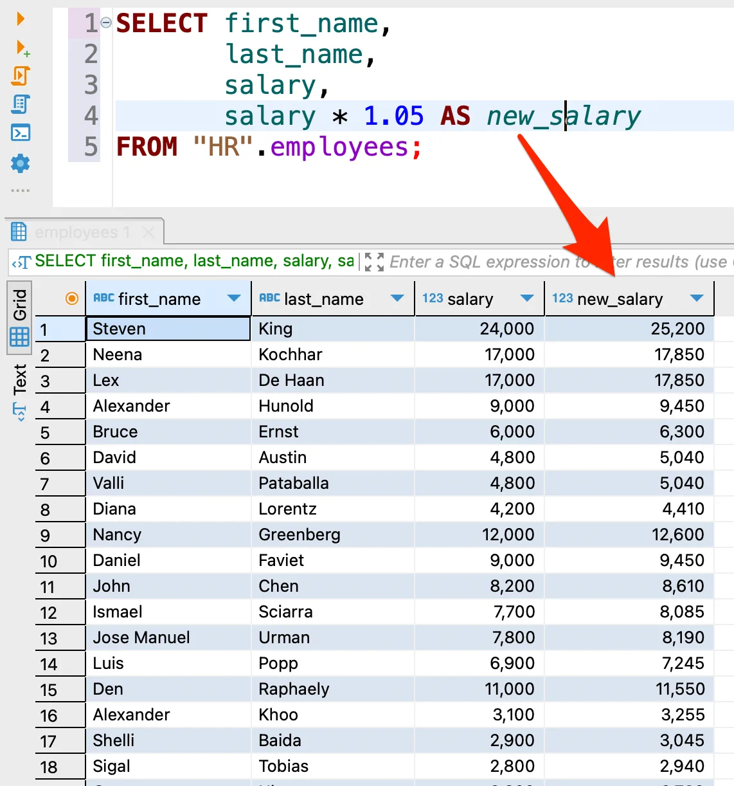
</div>

We also call **pseudonyms** **aliases** (it is better to use English
term --- **alias**)!

<h2 align="center">ORDER BY</h2>

**ORDER BY** is an optional clause of the **SELECT** statement.
The **ORDER BY** command lets you sort the rows returned by **SELECT**
ascending or descending order.

Below is the syntax for the **ORDER BY** command:

```sql
SELECT select_list
FROM table_bane
ORDER BY sort_expression [ASC | DESC];
```

In this syntax:

ORDER BY is always placed after **FROM**. 
**SELECT** statement with **ORDER BY** in the following order: FROM → SELECT →
ORDER BY**

**ASC** - sort by ascending order;\
**DESC** - sort in descending order;

ORDER BY also allows you to sort the result set by multiple
columns 
split two sort columns:

```sql
SELECT select_list
FROM table_bane
ORDER BY sort_expression_1 [ASC | DESC]
        ,sort_expression_2 [ASC | DESC];
```

Let's consider a few examples to demonstrate the work
operator **ORDER BY.**

1. In this example, the **SELECT** statement returns data from an identifier
employee, first name, last name, hire date and salary column of the table
    employees:


```sql
SELECT employee_id
     , first_name
     , last_name
     , hire_date
     , salary
FROM HR.employees;
```
```sql
SELECT employee_id
     , first_name
     , last_name
     , hire_date
     , salary
FROM HR.employees
ORDER BY salary DESC;
```
```sql
SELECT employee_id
     , first_name
     , last_name
     , hire_date
     , salary
FROM HR.employees
ORDER BY first_name;
```


<div align="center">
  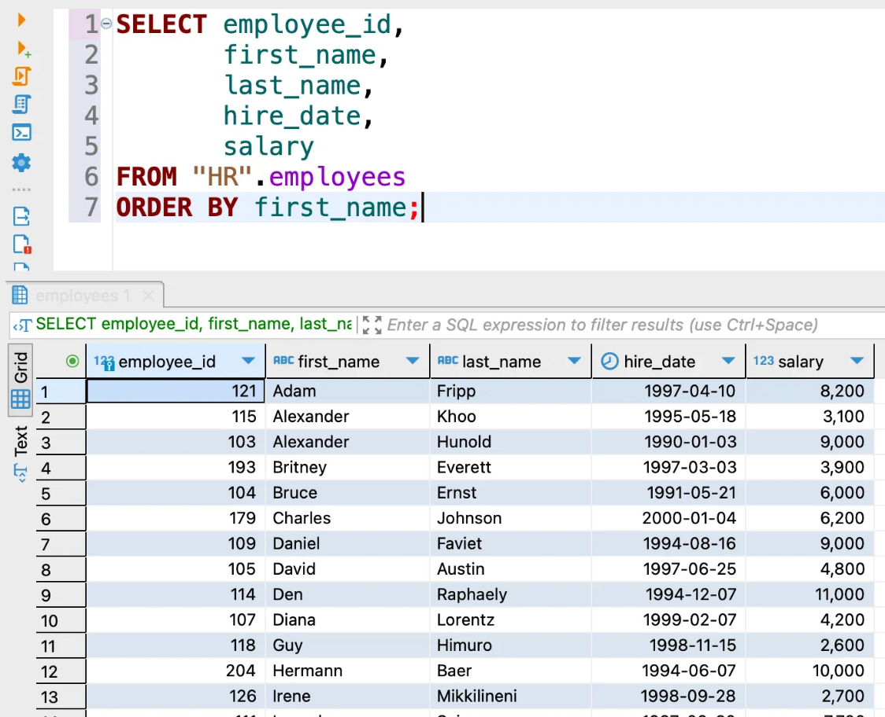
</div>

So we see that **ORDER BY** sorts the result by the values ​​of y
**first_name.** columns

3. The following example uses **ORDER BY** to sort
employees by first name in ascending order and last name in order
decrease:

```sql
SELECT employee_id
     , first_name
     , last_name
     , hire_date
     , salary
FROM HR.employees
ORDER BY first_name, last_name DESC;
```

<div align="center">
  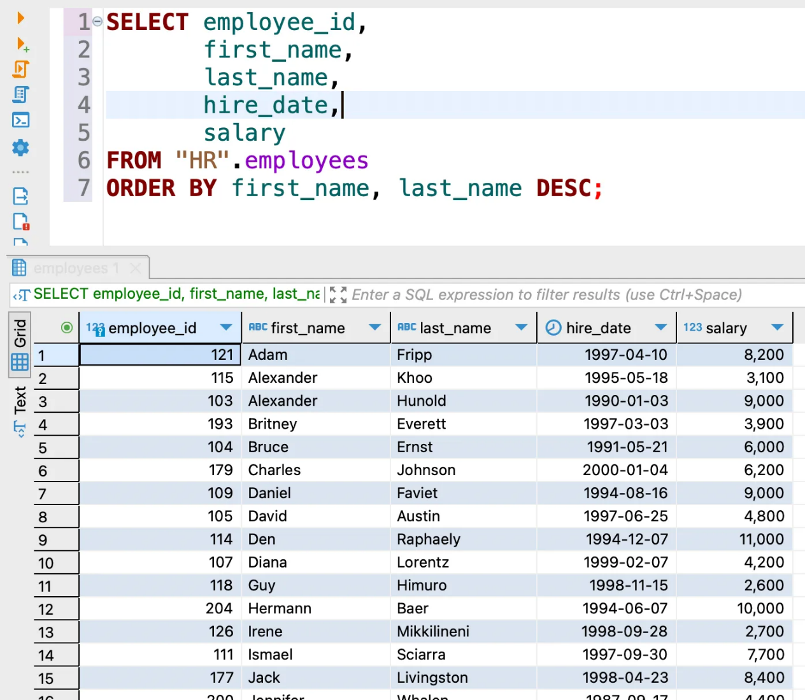
</div>

In this example, **ORDER BY** sorts the result set by first name
in ascending order and then sorts the already sorted result set
by last name in descending order.

4. The following example uses ORDER BY for sorting
employees by salary from high to low:

```sql
SELECT employee_id
     , first_name
     , last_name
     , hire_date
     , salary
FROM HR.employees
ORDER BY salary DESC;
```

<div align="center">
  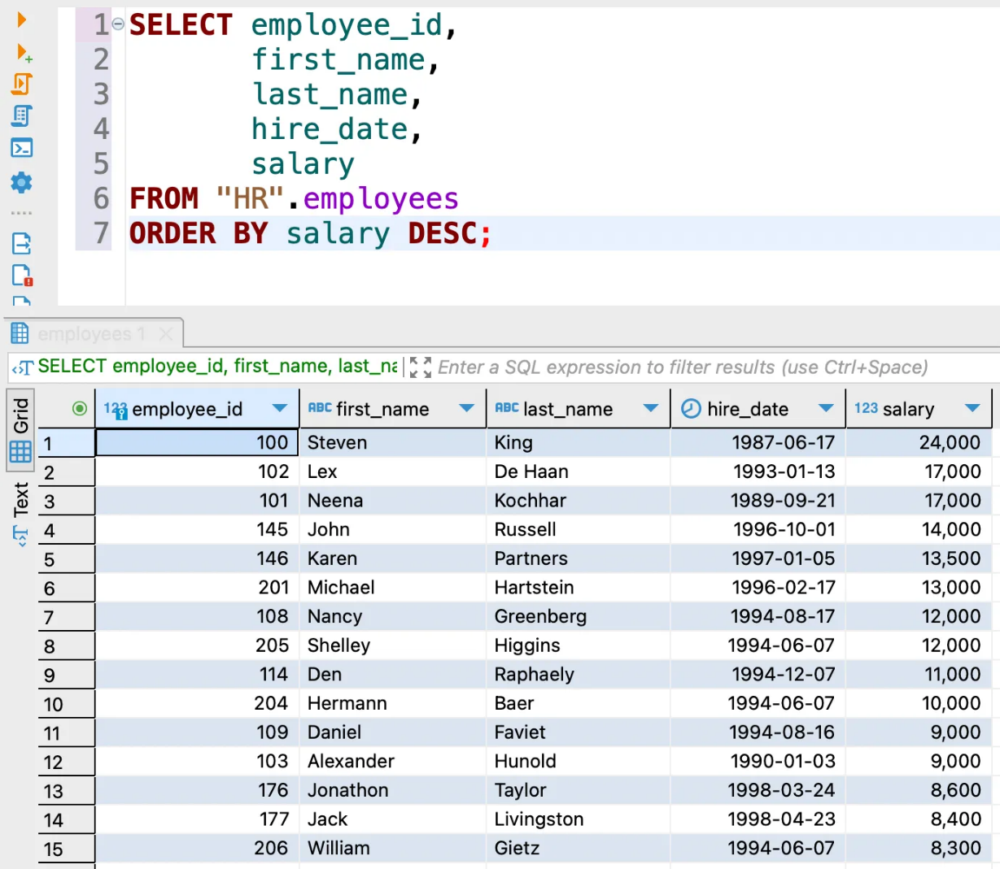
</div>

5. In addition to character and numeric data, you can use **ORDER
BY** to sort rows by date. 
uses

 
**hire_date** columns:

```sql
SELECT employee_id
ORDER BY hire_date;
```

```sql
SELECT employee_id
    , first_name
    , last_name
    , hire_date
    , salary
FROM "HR".employees
ORDER BY hire_date;
```

<div align="center">
  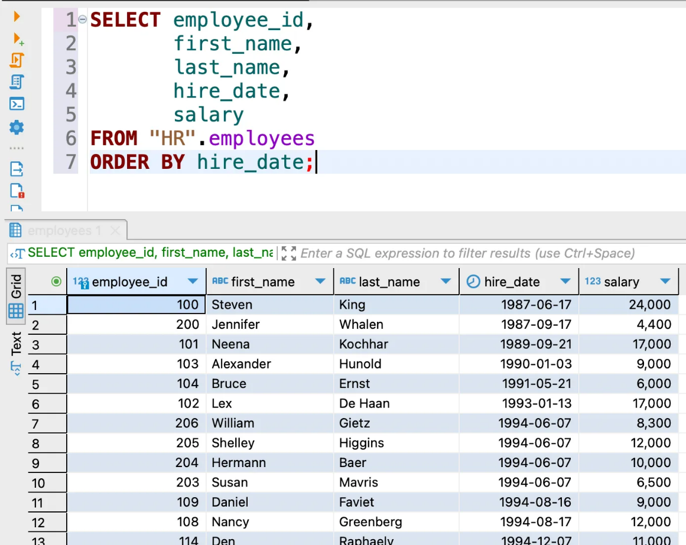
</div>

<h2 align="center">WHERE</h2>

To select specific rows from a table, we use the WHERE clause in
SELECT statements.

The following is the WHERE syntax in a SELECT statement:

```sql
SELECT column1
     , column2
     , ...
FROM table_name
  WHERE condition;
```

**WHERE** appears immediately after **FROM**.

Now our sequence of statements is:

<h2 align="center">FROM → WHERE → SELECT</h2>

WHERE contains one or more logical expressions that apply to
of each row of the table. 
true, it will be included in the result set; 
it will be excluded.

Note that SQL has three-valued logic: **TRUE**, **FALSE**, and **UNKNOWN**.
This means that if the string results in the condition has
**FALSE** or **NULL**, no string will be returned. 
let's talk later.

You can use different operators to form selection criteria
of strings used in **WHERE**.

The following table shows the **SQL** comparison statements:

<div align="center">
  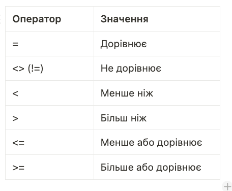
</div>

To form a simple expression, use one of the above
operators with two operands, which can be a column name from one
side and a literal value on the other, for example: **salary > 1000**.

**Literal values** used in the expression can be
numbers, symbols, dates and times, depending on the format used:

- **Number**. 
without any formatting. 

- **Symbol**. 
care must be taken with quotation marks, because in some implementations they can
only single ones should be used). 
    best school».

- **Date**. 
from the database system. 
\'yyyy-mm-dd\' format for storing date data.

- **Time**. 
to keep time. 
to store time data.

Let's consider an example.

This query finds employees with a salary greater than 14,000 and sorts the set
results based on salary in descending order.

```sql
SELECT employee_id
     , first_name
     , last_name
     , salary
FROM HR.employees
  WHERE salary > 14000
ORDER BY salary DESC;
```

<div align="center">
  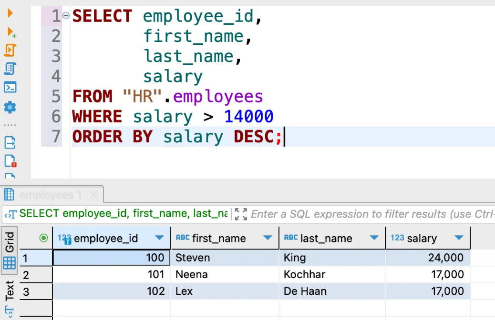
</div>

**SQL** is not case sensitive. 
values, it is case sensitive**.

For example, the following query finds an employee with the last name Chen.

```sql
SELECT employee_id
     , first_name
     , last_name
FROM HR.employees
  WHERE last_name = 'Chen';
```

<div align="center">
  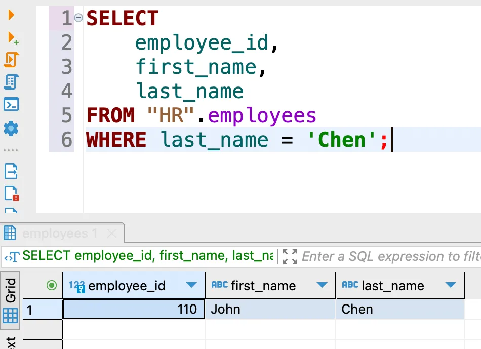
</div>

To get all employees who joined the company after *1
January 1999*, use the following query:

```sql
SELECT employee_id
     , first_name
     , last_name
     , hire_date
FROM HR.employees
  WHERE hire_date >= '1999-01-01'
ORDER BY hire_date DESC;
```

<div align="center">
  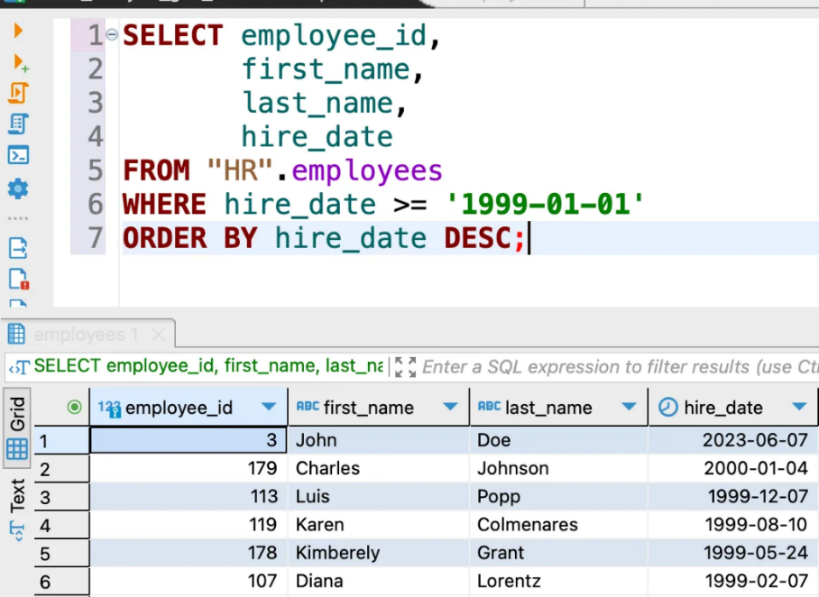
</div>

<h2 align="center">LIMIT</h2>

**LIMIT** is an operator that allows us to limit the output
results by a certain number of lines. 
specify how many first rows of the result should be displayed,
given the specified sorting.

For example, we can display information about the last employee,
who got a job by sorting the data by hire date for
descending and setting **LIMIT 1:**\
\
It is true that different constructions are used in different dialects

| 
|-----------------------------------|----------------|---------------------------------------------------------------------|
| **MySQL, PostgreSQL, SQLite**     | LIMIT          | `SELECT ... ORDER BY hire_date DESC LIMIT 1;`                      |
| **SQL Server (T-SQL)**            | TOP            | `SELECT TOP 1 employee_id, ... FROM ... ORDER BY hire_date DESC;`  |
| 
| 
| **SQL Server, Oracle, PostgreSQL**<br/>(SQL:2008) | OFFSET/FETCH | `SELECT ... ORDER BY hire_date DESC OFFSET 0 ROWS FETCH NEXT 1 ROW ONLY;` |


```sql
SELECT employee_id
     , first_name
     , last_name
     , hire_date
FROM HR.employees

ORDER BY hire_date DESC
LIMIT 1;
```

<div align="center">
  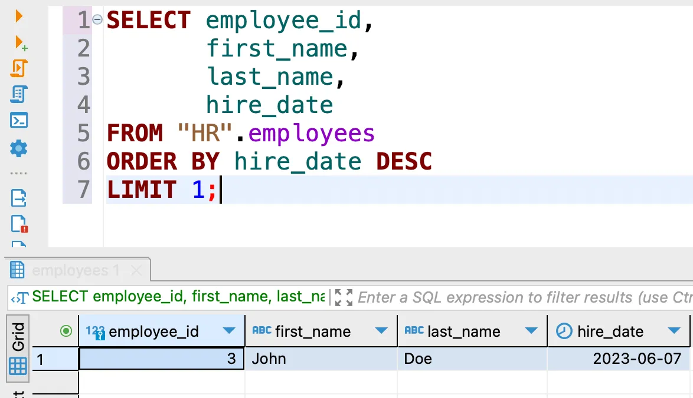
</div>

Also along with **LIMIT** we can use **OFFSET** to set
shift by a certain number of lines. 
information about the penultimate employee, we will set a shift of one
line:

```sql
SELECT employee_id
     , first_name
     , last_name
     , hire_date
FROM HR.employees
ORDER BY hire_date DESC

LIMIT 1
OFFSET 1;
```

<div align="center">
  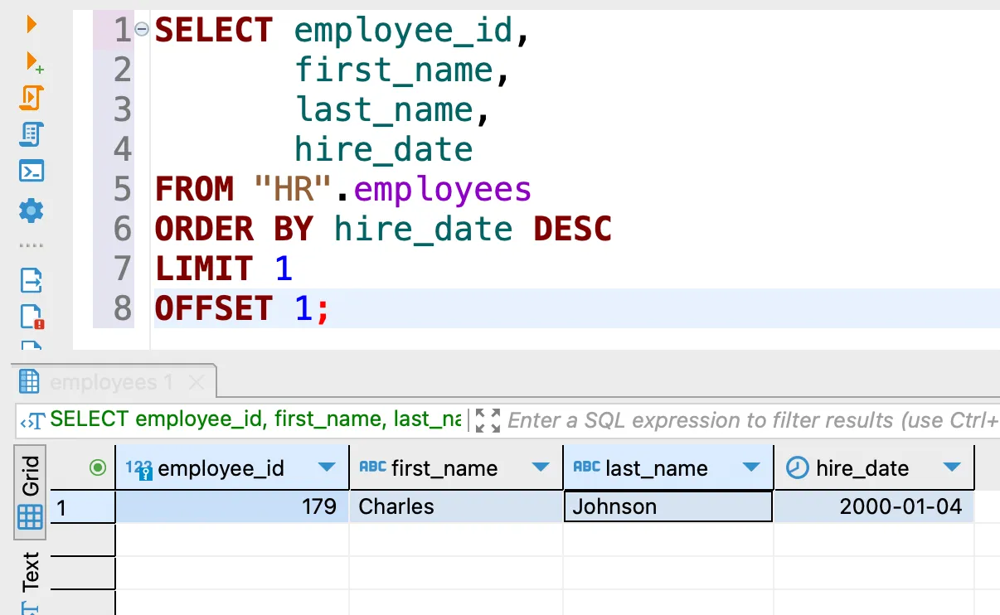
</div>

**LIMIT** can be used to get a quick overview of the data or
selection of extremes, formation of **"top"** results, etc.

We've looked at some basic operators that let you choose
data, impose conditions and sort them.

