**Language:** English | [Українська](../../i18n/uk/course/lessons/06_data_chas_vikonni_funkcii.md)

<h2 align="center">Optimization of SQL queries</h2>

**DBMS scope:** [CORE] (portable SQL fundamentals).

**Optimization of SQL queries** is an important component of database management systems
data just like any other component. 
queries that access data, database performance can
to go down 
users to quickly access the necessary information.

Let's talk about the different methods you can use to optimize SQL queries
use to improve their performance.

1. Instead of (\*), use **column names** in the SELECT statement

If you want to select **only a certain number of columns**, then you should
use column names instead of (\*) in the SELECT statement.

Although (\*) is easier to write, it will take more time for the database to
processing of such a request. 
reduce the size of the result table, reduce network traffic and
improve overall query performance.**

2. In relational databases such as PostgreSQL,
**HAVING** operator is used to filter the results
grouping, while the **WHERE** statement is for filtering rows
before grouping.

**It is recommended to use the WHERE statement to define filters,
whenever possible. 

<h2 align="center">Importantly</h2>

*The **HAVING** operator is still useful when you need to filter
grouping results based on the calculated values ​​of aggregate functions.
But if you do not need to use aggregate functions or
to group data, it is better to use the **WHERE** statement for filtering
rows before grouping.*

3. The **DISTINCT** operator is used to remove duplicates from
of the query results, that is, it ensures the uniqueness of the rows. 
in some cases it is used unnecessarily, which leads to
redundant data processing and loss of productivity.

Here are a few situations where you should avoid overdoing it
using **DISTINCT**:

- Columns in the query are already unique. 
guarantee the uniqueness of row values, then
using **DISTINCT** is redundant. 
are **PRIMARY KEY** or unique indexes on columns, results
will be unique by default.

- Redundant duplication of tables in **JOIN**. 
using **JOIN** operations can cause
duplicates as a result of the request. 
logic for joining tables to avoid duplicates, instead of
use **DISTINCT** to remove them.

- No duplicates in the source data. 
contain duplicates, for example, due to the use of aggregates
functions, then using **DISTINCT** is redundant.

**Avoiding unnecessary use of DISTINCT can improve
query performance, as processing and deduplication can
be expense transactions.**

So, if possible, it's worth checking if you really need it
use **DISTINCT** in the query and optimize it.

4. Using **JOIN** instead of **SUBQUERY**

A **subquery** makes a separate query to the database for retrieval
a subset of the data that is then used in the main query.
**Subqueries** can be useful in some situations, but at the same time in
in some cases they may not be effective and cause additional
database load.

The **JOIN** operation allows you to join different tables based on a condition
connection

Using **JOIN** instead of a subquery can have several advantages:

- Less data processing. 
to join, are used in a single query, which may result
to less data to be processed and transferred between
database and application.

- More efficient execution. 
use more optimal query execution plans such as
the use of indexes and joins in the early stages of a query.

- Better query readability. 
provides better query readability, especially in complex queries
with many tables and connection conditions.

However, it is worth considering that in some situations there may be **sub-requests**
appropriate or even necessary. 
grouping results or use a **subquery** to retrieve
subsets of the data before using **JOIN**.

<h2 align="center">Conclusions</h2>

We have covered only a few recommendations for optimizing SQL queries. 
time of work and gaining experience you will be able to expand this list for
increasing productivity and efficiency of working with databases.

Here we leave you the key optimization points that are worth it
remember:

- Optimization of SQL queries aimed at improving execution time
requests, reducing resource usage and optimal utilization
indexes and data structures.

- Proper design of the database taking into account normalization,
indexing and optimal data distribution can significantly improve
query performance.

- Analyzing and profiling requests to identify complex ones
locations and problematic queries that need optimization.

- Correct use
**SELECT, HAVING, WHERE, DISCTINCT, JOIN** statements and subqueries can
significantly improve query performance.

- Constantly monitoring and updating database statistics helps
maintain optimal query performance in the long term
perspective

- Optimizing SQL queries is a process that requires analysis,
experimentation and continuous improvement to achieve the best
results

It is important to remember that optimizing SQL queries is specific to each
database and requires an individual approach. 
improvements in the field of query optimization will help achieve
optimal performance and efficiency of working with data in SQL.

<h2 align="center">JSON --- a structured data exchange format</h2>

**JSON** stands for **JavaScript Object Notation**.

**JSON** is an open standard format that consists of pairs
"key-value".

The main purpose of **JSON** is to transfer data between the server and
web program. 
human readable

PostgreSQL supports its own **JSON** data type since version 9.2. 
many functions and operators for working with **JSON** data.

Let's start by creating a new table to practice with the data type
JSON.

```sql
CREATE TABLE orders (
    id serial NOT NULL PRIMARY KEY
, info json NOT NULL
);
```

The **orders** table contains two columns:

- The **"ID"** column is the primary order identification key.
- The **"Info"** column stores data in the form of **JSON**.

Before inserting data into a **JSON** column, it is important to make sure that
the data is in valid **JSON** format.

The following **INSERT** statement adds a new row to the **orders** table.

```sql
INSERT INTO orders (info)
VALUES (
'{
    "customer": "John Doe"
    , "items": {
            "product": "Beer"
        , "qty": 6
        }
}'
);
```

This means that John Doe purchased 6 bottles of beers

The following statement adds multiple rows at once.

```sql
INSERT INTO orders (info)
VALUES
(
    '{"customer": "Lily Bush", "items": {"product": "Diaper", "qty": 24}}'
)
, (
    '{"customer": "Josh William", "items": {"product": "Toy Car", "qty": 1}}'
)
, (
    '{"customer": "Mary Clark", "items": {"product": "Toy Train", "qty": 2}}'
);
```

To retrieve data in **JSON** format, use plain **SELECT**.

```sql
SELECT info FROM orders;
```
<div align="center">
  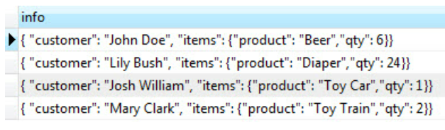
</div>

PostgreSQL returns a result set in JSON format.

<h2 align="center">JSON operators in PostgreSQL</h2>

**PostgreSQL** provides two custom operators to help you get
**JSON** data.

- **->** returns the field value of a JSON object by key.
- **->>** returns the field value of a JSON object by text.

The following query uses the -> operator to retrieve all customers in
JSON format:

<div align="center">
  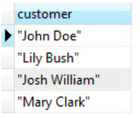
</div>
```sql
SELECT
    info -> 'customer' AS customer
,   info -> 'items'    AS items
FROM orders;
```

And the next query uses the -\>\> operator to get all of them
customers in the form of text:

```sql
SELECT info -\>\> \'customer\' AS customer

```
<div align="center">
  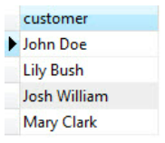
</div>

Since the -> operator returns a JSON object, you can concatenate it
with the ->> operator to get a specific node. 
the operator returns all sold products:

```sql
SELECT info -> 'items' ->> 'product' as product
ORDER BY product;
```

<div align="center">
  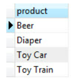
</div>

First, **info -> 'items'** returns the items as **JSON** objects.
And then **info -> 'items' ->> 'product'** returns all products as text.

<h2 align="center">A JSON statement in a WHERE clause</h2>

We can use **JSON** statements in the **WHERE** section,
to filter the rows.

For example, to find out who bought **Diaper**, we use the following
request:
```sql
SELECT
    info ->> 'customer' AS customer
,   info -> 'items' ->> 'product' AS product
FROM orders
    WHERE info -> 'items' ->> 'product' = 'Diaper';
```

<div align="center">
  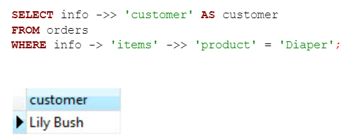
</div>

To find out who bought two items at the same time, we use the following
request:

```sql
SELECT info ->> 'customer' AS customer
     , info -> 'items' ->> 'product' AS product
FROM orders
    WHERE CAST(info -> 'items' ->> 'qty' AS INTEGER) = 2;
```

<div align="center">
  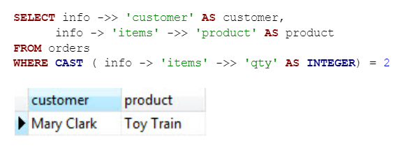
</div>

Note that we used type casting to convert **qty** to **INTEGER**.

<h2 align="center">Applying aggregate functions to JSON data</h2>

We can apply aggregate functions such as
like **MIN, MAX, AVERAGE, SUM** etc. to **JSON** data.

For example, the following statement returns the minimum quantity, the maximum
number, average number and total number of products sold.

```sql
SELECT
    MIN(CAST(info -> 'items' ->> 'qty' AS INTEGER))
  , MAX(CAST(info -> 'items' ->> 'qty' AS INTEGER))
  , SUM(CAST(info -> 'items' ->> 'qty' AS INTEGER))
  , AVG(CAST(info -> 'items' ->> 'qty' AS INTEGER))
FROM orders;
```

<div align="center">
  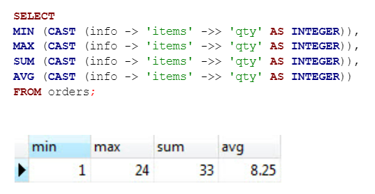
</div>

<h2 align="center">The json_each function</h2>

The **json_each()** function allows you to extend an external JSON object in
a set of key-value pairs. 

```sql
SELECT json_each (info)
FROM orders;
```

<div align="center">
  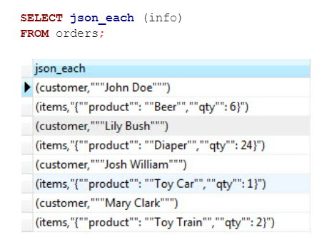
</div>

<h2 align="center">The json_each_text function</h2>

If you want to get a set of key-value pairs in the form
text, use the **json_each_text() function instead.**

**json_object_keys** function

To get a set of keys in an external **JSON** object,
use the **json_object_keys() function.**

The following query returns all the keys of the nested object **items** in
**info** columns.

```sql
SELECT json_object_keys ( info->'items' )
FROM orders;
```

<div align="center">
  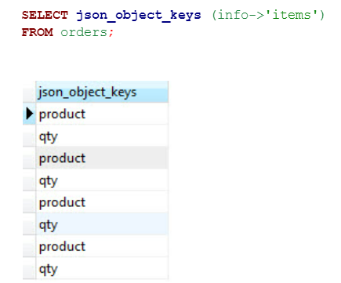
</div>

<h2 align="center">Advantages of using JSON</h2>

Using JSON in a PostgreSQL database has several advantages:

- **Data Flexibility**. 
with no fixed database schema requirements. 
different structure in one column, which allows easy storage
data sets with a variety of structures that can vary from
sometimes.

- **Ease of processing**. 
working with data in **JSON** format. 
filtering, sorting and aggregation using built-in
**JSON** operators and functions. 
support for indexing and full-text search of **JSON** data.

- **Integration with applications**. 
data exchange between different applications and systems. 
**JSON** in the database makes it easy to share data with others
applications and web services that support **JSON**.

- **Availability of operators and functions. 
operators and functions for working with **JSON**. 
operations with **JSON** objects, access elements,
search by key or value, perform manipulations with
**JSON** arrays and much more.

- **Support for built-in data types. 
data to store **JSON** such as **json** (no validation on
syntax correctness) and **jsonb** (validated
syntax and more efficient storage). 
allows you to perform more efficient search and filtering operations
**JSON** data.

In general, the use of the **JSON** format in the **PostgreSQL** database
allows you to store, process and exchange structured data
in a flexible and efficient way.
| 
|---|---:|---:|---:|
| 
| 
| 

Notes:
- In PostgreSQL `->` returns JSON, `->>` returns text.
- T‑SQL and Oracle use `JSON_VALUE` for simple scalar values, `JSON_QUERY` / `OPENJSON` to return subobjects.
- Substitute real column names and paths (`json_column`, `$.path`) according to the scheme.

<h2 align="center">Working with dates and time data in SQL</h2>

The ability to process **temporal arrays** of information is very important in work
analytics, because it provides opportunities for:

- **Sorting and filtering data.** In SQL, data can be sorted by
date and time, which allows effective search and
filtering by certain periods. 
records that were created within the last hour, or all
order for a certain period.

- **Interval Calculations.** SQL allows you to perform calculations on
based on dates and times. 
two dates, find the average order processing time or determine
how many days are left until a certain event.

- **Grouping and aggregation of data.** You can group data by certain
by time intervals (for example, by days, weeks or months) and
use aggregate functions (such as **SUM, COUNT, AVG**) for
calculating statistical data or obtaining summary results.

- **Working with time series.** Time series is an important component
many industries, such as financial analysis, demand forecasting,
web analytics, etc. 
analyze and perform operations with time series, which allows
extract valuable information from this data.

- **Planning and management**. 
and managing the schedule of events, tasks, or processes that occur
at a certain time 
timers or automatically perform certain actions based on certain dates or
time events.

<h2 align="center">Data types for storing dates and times</h2>

**PostgreSQL** has several data types for storing dates and times.
Chief among them are **DATE, TIME, TIMESTAMP** and their variations.

Here is a brief description of each type:

- **DATE** --- This data type is used to store a date without
time 
    **«2023-06-09».**

- **TIME** --- This data type is designed to store time without a date.
It displays the time in **"HH:MI:SS"** format (hours, minutes,
seconds). 

- **TIMESTAMP** --- This data type is used to store a date
and time 
HH:MI:SS".** For example, **"2023-06-09 12:34:56".**

- **TIMESTAMP WITH TIME ZONE** --- This data type is for
date and time storage that contains information about the time zone.
It displays date and time in **"YYYY-MM-DD HH:MI:SS TZ" format.**
For example, **"2023-06-09 12:34:56 +03".**

- **INTERVAL** --- This data type is used for storage
time intervals, such as the difference between two dates or times.

These data types allow you to store and perform operations on dates and
sometimes in PostgreSQL.

<h2 align="center">CURRENT_DATE and CURRENT_TIMESTAMP functions</h2>

PostgreSQL has two functions: **CURRENT_DATE and CURRENT_TIMESTAMP** --- which
return the current date and time respectively.

-   **CURRENT_DATE**

This function returns the current date (without time) in **DATE** format. 
useful when you only need to get the date without specifying the time.

Example of using CURRENT_DATE:

```sql
SELECT CURRENT_DATE;
```
-   **CURRENT_TIMESTAMP**

This function returns the current date and time in **TIMESTAMP** format. 
contains both date and time with millisecond accuracy. 
when you need to display the exact time and date.

Example of using **CURRENT_TIMESTAMP**:

```sql
SELECT CURRENT_TIMESTAMP;
```
Both functions **CURRENT_DATE** and **CURRENT_TIMESTAMP** are not
accepts arguments and returns a value of the corresponding date type. 
useful for getting the current date and time when performing queries in
PostgreSQL.

- **date_trunc function**

The **date_trunc** function in PostgreSQL is used to truncate or
clipping a portion of a date or time according to a specific unit
measurement.

This allows you to round the value up or down
measurement, depending on the need.

The syntax of the date_trunc function is as follows:
```sql
date_trunc('unit', timestamp)
```
In this syntax:

- **unit** specifies the unit to which the date or time portion should be trimmed.
- **timestamp** --- the date or time to be trimmed.

For demonstration, we will use the employees table from the HR department schema:

```sql
SELECT
    date_trunc(\'year\'
    , hire_date
    ) AS truncated_date
FROM HR.employees;
```

<div align="center">
  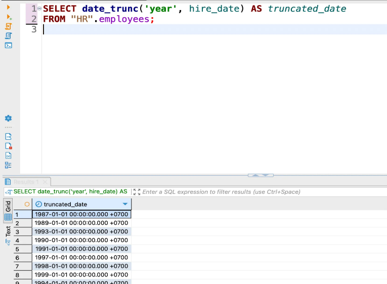
</div>

In this example, we use the **date_trunc** function for truncation
dates in the **hire_date** field to the year level. 
a year, and months, days, hours, minutes and seconds will remain in their own
initial values.

So the **date_trunc** function allows you to truncate a date or time to
of a certain unit of measurement, which can be useful in aggregation or
grouping of data by a certain period.

- **date_add function**

PostgreSQL doesn't have a built-in **date_add** function, but you can
achieve a similar result by using the operator **+** and
intervals to add to dates.

The **+** operator in PostgreSQL can be used to add
intervals to a date or time. 
measurements such as **year, month, day, hour, minute, second** etc.

For example, we have a **employees** table from the **HR** department schema and us
one year must be added to the **hire_date** value for each
employee:

```sql
SELECT hire_date + INTERVAL \'1 year\' AS new_date

```
FROM \"HR\".employees;

<div align="center">
  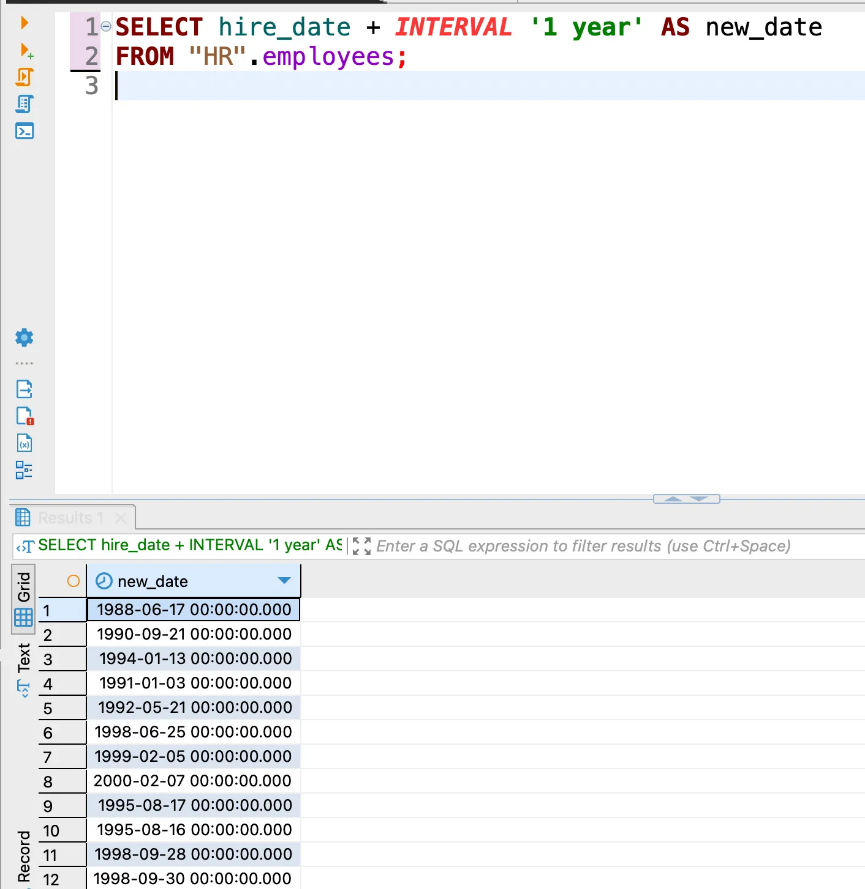
</div>

In this example, **INTERVAL "1 year"** indicates that we are adding 1 year to the
to give 
increased by 1 year.

- **date_diff function**

Many DBMSs have a **date_diff** function that returns the difference between
two dates, but in Postgre the situation is a little different.

You can use the **date_part** function to get the difference between
two dates or times in a specific unit of measurement.

The **date_part** function allows you to get the value of a specific unit
(eg year, month, day, hour, minute, second) from the date or
time 
or times and calculating their difference.

Here is the syntax for the **date_part** function:
```sql
date_part('unit', timestamp)
```
In this syntax:
- **unit** --- the unit of measurement for which you want to get
value.
- **timestamp** --- the date or time from which you get the value.

For example, to calculate the difference in years between two dates with
you can use the **employees** table from the **HR** department schema
with the following request:

```sql
SELECT date_part( 'year', age( '2023-01-01', hire_date ) ) AS diff_years
FROM HR.employees;
```

<div align="center">
  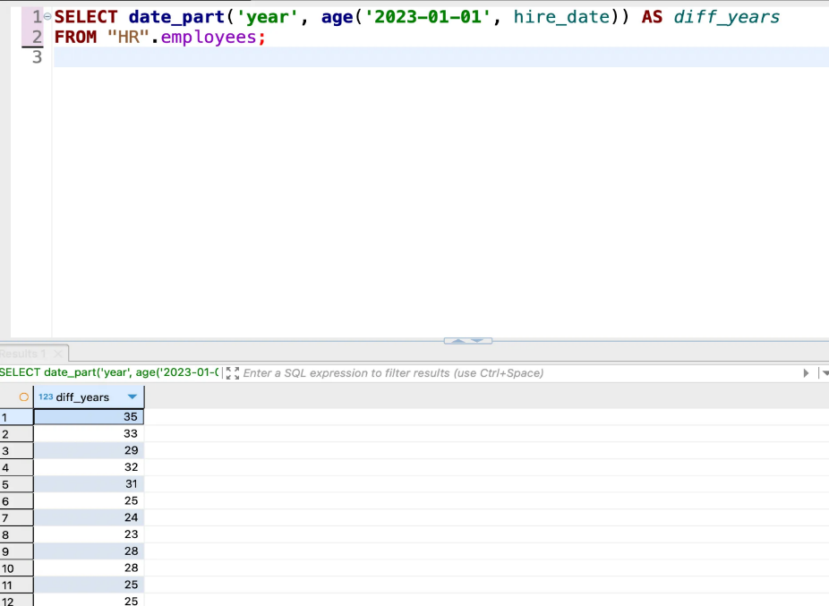
</div>

In this example we use the **age** function which returns the difference
between two dates or times in **interval** format. 
using the **date_part** function we get the difference in years from
of this **interval**.

So, while PostgreSQL doesn't have a built-in **date_diff** function, you can
use a combination of **age** and **date_part** functions to
calculate the difference between two dates or times in a specific unit
measurement.

- **EXTRACT function**

In PostgreSQL, the **EXTRACT** function is used to retrieve the value
a specific unit of measurement from a date or time. 
value of year, month, day, hour, minute, second, or other unit
measurement from date or time.

Here is the syntax for the **EXTRACT** function:
```sql
EXTRACT( 'unit' FROM timestamp )
```
In this syntax:
- **unit** --- the unit of measurement you want to get.
- **timestamp** --- the date or time from which you get the value.

For example, to retrieve the year value from the **hire_date** field in
the **employees** table from the **HR** department schema can be used as follows
request:

```sql
SELECT EXTRACT(year FROM hire_date) AS hire_year
FROM HR.employees;
```
<div align="center">
  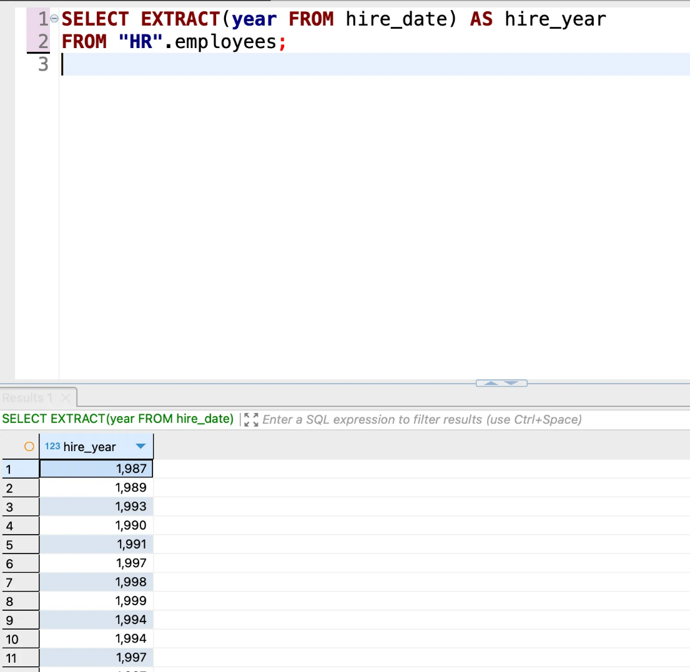
</div>

In this example, we use the **EXTRACT** function to retrieve
the year value from the **hire_date** field. 
a **hire_year** value that represents the year from each record.

**EXTRACT** can also be used to get other units
measurements such as month, day, hour, minute, second, etc.
For example, to get the month value from **hire_date** you can
replace **year** with **month** in the query.

<h2 align="center">Date and time type conversion functions</h2>

In PostgreSQL to convert date and time types
**CAST** and **TO_CHAR** functions are used.

- **Conversion to string**

To convert a date or time type to a string
the **TO_CHAR** function is used.

For example, to convert the **hire_date** field from the **date** type to a string
format **"YYYY-MM-DD"** in the **employees** table from the **HR** department schema
you can use the following query:

```sql
SELECT TO_CHAR( hire_date, 'YYYY-MM-DD' ) AS hire_date_str
FROM HR.employees;
```

<div align="center">
  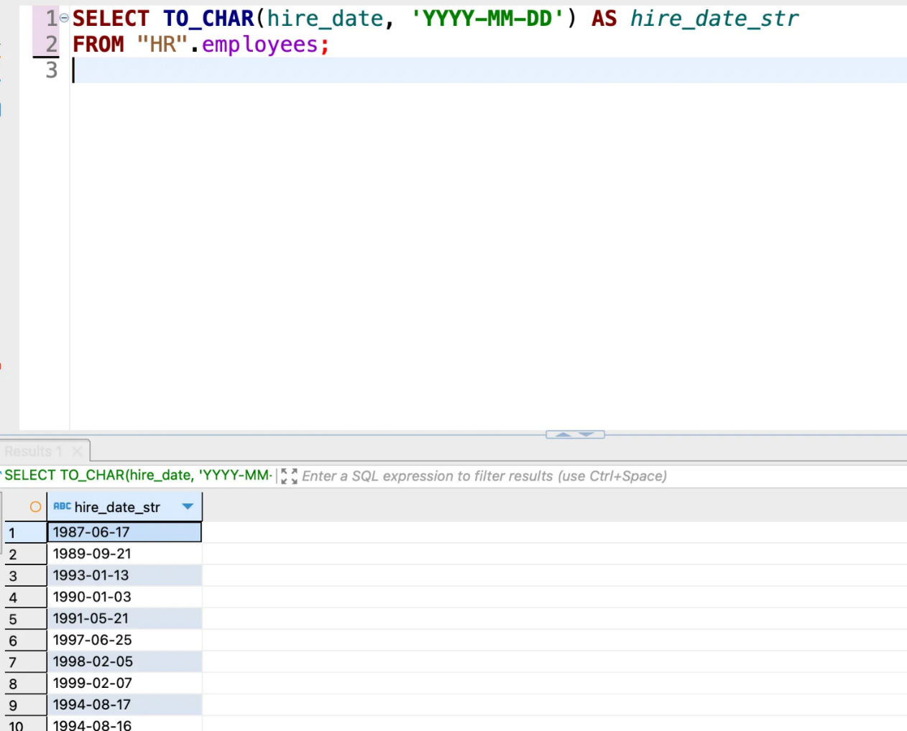
</div>

The result will contain **hire_date** values ​​as strings in the format
<h2 align="center">«YYYY-MM-DD».</h2>

- **Conversion from string to date or time type**

To convert a string to a date or time type
the **CAST** function is used.

For example, you can convert the string **"2022-05-10"** to the **date** type
use the following query:

```sql
SELECT CAST('2022-05-10' AS date) AS converted_date;
```
<div align="center">
  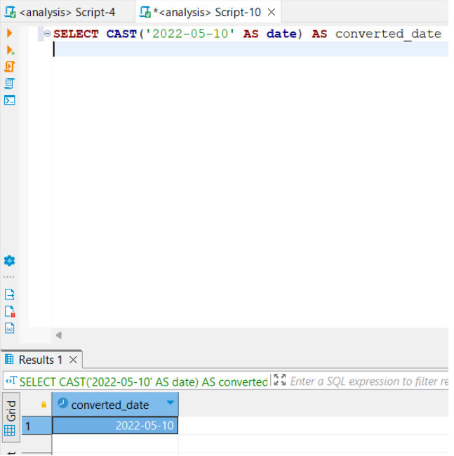
</div>

The result will contain the value **"2022-05-10"** in type format
**date**.

So the **TO_CHAR** function is used to convert date types and
time to a string, and the **CAST** function allows you to convert a string to a date type
or time

<h2 align="center">Conclusions</h2>

Working with dates and times in SQL using **DATE data types,
TIME** and **TIMESTAMP** are an important part of database design and analysis
data 

- The **DATE** data type is used to store only the date without
time 
comparison, obtaining date components, arithmetic operations with
dates

- The **TIME** data type is used to store only time without
to give 
obtaining time components, arithmetic operations with time.

- The **TIMESTAMP** data type represents a combination of date and time. 
allows you to keep accurate timestamps and allows you to execute
date and time operations at the same time.

- SQL provides various functions and operators to work with dates and times.
It contains functions for formatting date and time, receiving
date and time components, performing arithmetic operations and
conversion between different formats.

- Localization should be considered when working with dates and times in SQL
and time zones. 
time conversion between different time zones.

- Correct use of **DATE, TIME** and **TIMESTAMP** data types in
SQL allows efficient analysis of temporal data in a database such as
record and manage events, transactions or changes.

In general, an understanding and ability to work with dates and times in SQL is important
a skill for data analysts that allows you to effectively process and
analyze time data in databases.

<h2 align="center">Window functions (Window functions)</h2>

For a better understanding of this topic, we will create additional tables.

<div align="center">
  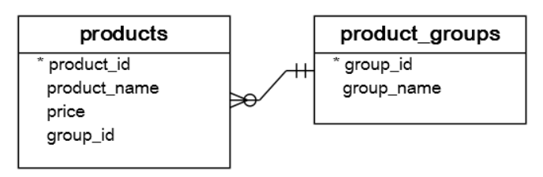
</div>

```sql
CREATE TABLE product_groups (
    group_id serial PRIMARY KEY
  , group_name VARCHAR(255) NOT NULL
);

CREATE TABLE products (
    product_id serial PRIMARY KEY
  , product_name VARCHAR(255) NOT NULL
  , price DECIMAL(11, 2)
  , group_id INT NOT NULL
  , FOREIGN KEY (group_id) REFERENCES product_groups (group_id)
);
```

Let's also add some information to our tables:

```sql
INSERT INTO product_groups (group_name)
VALUES
 ('Smartphone')
 , ('Laptop')
 , ('Tablet')
;

INSERT INTO products (product_name, group_id, price)
VALUES
 ('Microsoft Lumia', 1, 200)
 , ('HTC One', 1, 400)
 , ('Nexus', 1, 500)
 , ('iPhone', 1, 900)
 , ('HP Elite', 2, 1200)
 , ('Lenovo Thinkpad', 2, 700)
 , ('Sone VAIO', 2, 700)
 , ('Dell Vostro', 2, 800)
 , ('iPad', 3, 700)
 , ('Kindle Fire', 3, 150)
 , ('Samsung Galaxy Tab', 3, 200)
;
```

<div align="center">
  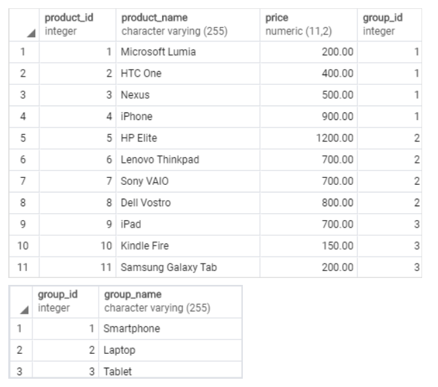
</div>

<h2 align="center">Comparison of aggregate functions with window functions</h2>

The easiest way to understand window features is to start with
viewing [**[aggregate
functions]{.underline}**](https://www.postgresqltutorial.com/postgresql-aggregate-functions/). 
function combines data from a set of rows into a single row.

The following example uses an aggregate
[**AVG**](https://www.postgresqltutorial.com/postgresql-avg-function/) function for
calculating the average price of all products in the **products** table.

```sql
SELECT AVG(price)
FROM products;
```
<div align="center">
  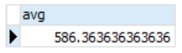
</div>

To apply an aggregate function to a subset of rows, we
we use **GROUP BY**. 
of each product group.

```sql
SELECT
    group_name
,   AVG(price)
FROM products
INNER JOIN product_groups USING (group_id)
GROUP BY group_name;
```
<div align="center">
  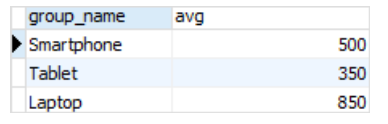
</div>

As we can see, aggregate functions reduce the number of rows.

Similar to the aggregate function, the window function works with a set of rows.

However, this does not reduce the number of rows returned by the query.

The term **"window"** describes the set of lines on which the windowing is performed
function.

The window function returns values ​​from the rows within the window.

For example, the following query returns product name, price, name
groups

products along with average prices for each product group.

```sql
SELECT product_name
    , price
    , group_name
    , AVG(price) OVER (
        PARTITION BY group_name
      ) AS avg_price_per_group
FROM products
INNER JOIN product_groups USING (group_id);
```

<div align="center">
  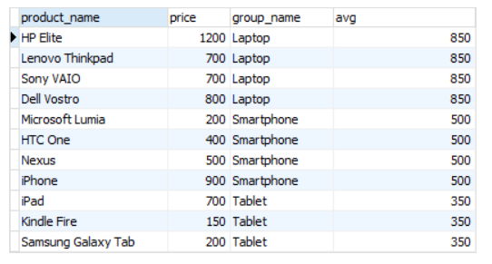
</div>

This query uses the **AVG (price) OVER window function
(PARTITION BY group_name)**.

Let's consider how it works:

1. First, name data is obtained from the products table
product **(product_name),** price** (price)** and name
groups **(group_name).**

2. Using **INNER JOIN** table **products** from
the table **product_groups** is merged by the common column **group_id**.
This allows you to get information about the group to which everyone belongs
product.

3. Window function **AVG (price) OVER (PARTITION BY
group_name)** is used to calculate the average
prices** (price)** within each group **(group_name).** This means,
that the data will be grouped by **group_name** and for each
the average price of a separate group will be calculated.

The query result will contain all selected columns **(product_name,
price, group_name)** and an additional column that displays
average price **( AVG (price) OVER (PARTITION BY group_name ))** for
of each product group.

The main idea behind window functions is to be able to calculate values
taking into account the context of the specified window (in this case, the group
products) instead of individual lines.

In this query, **AVG (price) OVER ( PARTITION BY group_name )** calculates
average price for each product group, allowing price analysis in
within each individual group instead of analyzing all products in general.

<h2 align="center">Syntax of PostgreSQL window functions</h2>

In PostgreSQL, the syntax of window functions contains keys
the words **OVER** and **PARTITION BY** and window pointers are as follows
like **ORDER BY, ROWS, RANGE** etc.

The basic syntax of window functions in Postgre looks like this:
```sql
<функція>
OVER ([PARTITION BY <стовпець1>, <стовпець2>, ...]
[ORDER BY <стовпець> [ASC|DESC], ...]
[ROWS <розмір_вікна>] [<додаткові_вказівники_вікна>]
)
```
Where:

- **<function>** is an expression that represents a window function,
eg **SUM, AVG, RANK** etc.

- **PARTITION BY <column1>, <column2>,** ... --- indicates, by
which columns should group the data before calculating the window
functions.

- **ORDER BY <column> [ASC|DESC],** ... --- specifies the order
sorting of lines within which the calculation of the window takes place
functions.

- **ROWS <window_size> **--- specifies what rows should be
included in the window. 
**(ROWS BETWEEN <start> PRECEDING AND <end> FOLLOWING)** or
range of values ​​**(RANGE BETWEEN <start> AND <end>).**

- **\<additional_window_pointers\>** --- additional window pointers,
such as **ROWS BETWEEN** **UNBOUNDED PRECEDING AND CURRENT ROW,
GROUPS, EXCLUDE** etc.

You can use this syntax to define window functions in
PostgreSQL where **OVER** indicates the start of the window function and pointers
windows allow you to set the function calculation context.

<h2 align="center">List of PostgreSQL window functions</h2>

PostgreSQL has many windowing functions available that you can use
for data analysis and processing. 
PostgreSQL:

- **ROW_NUMBER ()** --- Assigns a \*\*\*\* unique number to each
line within the window. 
sorting.

- **RANK ()** --- Assigns a rank to each row, according to
of the specified sort expression. 
the same rank, skipping the next ranks.

- **DENSE_RANK ()** --- Assigns a "dense" rank to each row,
according to the specified sort expression. 
values ​​receive the same rank without skipping the next ranks.

- **NTILE (n)** --- Divides the sample into n groups and assigns to each
line number of the group to which it belongs.

- **LAG (expression \[, offset \[, default\]\])** --- Returns
the value of the expression preceding the current line in the window. 
offset and the default value for the case where the previous
value not available.

- **LEAD (expression \[, offset \[, default\]\])** --- Returns
the value of the expression following the current line in the window. 
offset and the default value for the case where the following value
unavailable

- **FIRST_VALUE (expression)** --- Returns the value of the expression for
the first line in the window.

- **LAST_VALUE (expression)** --- Returns the value of the expression for
the last line in the window.

- **SUM (expression)** --- Computes the sum of the expression values ​​within the window.

- **AVG (expression)** --- Computes the average value of an expression within a range
windows

These are just a few examples of the windowing functions available in PostgreSQL.

Windowing functions allow for advanced analysis and processing
data using a window context that spans specific rows or groups
rows as a result of the query. 
occur in the analyst's work.

**ROW_NUMBER, RANK** and **DENSE_RANK** functions

- **ROW_NUMBER ()** --- This function assigns a unique ordinal
the number of each line within the window. 
the order in which rows are selected without sorting. 
row gets number 1, second --- 2 and so on.

- **RANK ()** --- This function assigns a rank to each row, respectively
to the specified sort order. 
rows with the same values. 
have the same value and occupy the second and third places, then the following
the row will get rank 4.

- **DENSE_RANK ()** --- This function assigns a "dense" rank to each
row, according to the specified sort order. 
are skipped even if there are rows with the same values.
For example, if two lines have the same value and occupy the second
and the third place, then the next line will receive rank 3.

Consider three queries and their results.

<h2 align="center">Request 1</h2>

```sql
SELECT product_name
    , group_name
    , price
    , ROW_NUMBER()
        OVER (
            PARTITION BY group_name
            ORDER BY price
        ) AS row_number
FROM products
INNER JOIN product_groups USING (group_id);
```

<div align="center">
  
</div>

The first query uses the ROW_NUMBER() function. 
function assigns a unique sequence number to each row within the range
windows in the specified order without sorting. 
row will be number 1, second row --- number 2 and so on.

<h2 align="center">Request 2</h2>

```sql
SELECT product_name
    , group_name
    , price
    , RANK() OVER (
        PARTITION BY group_name
        ORDER BY price
      ) AS rank_in_group
FROM products
INNER JOIN product_groups USING (group_id);
```

<div align="center">
  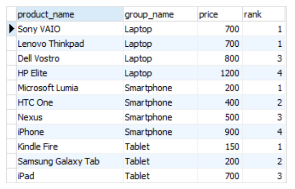
</div>

The second query uses the RANK() function. 
the rank of each row, according to the specified sort order. 
can be skipped if there are rows with the same values. 
if two rows have the same value and occupy the second and third places,
then the next line will get rank 4.

<h2 align="center">Request 3</h2>

```sql
SELECT product_name
    , group_name
    , price
    , DENSE_RANK() OVER (
        PARTITION BY group_name
        ORDER BY price
      ) AS dense_rank_in_group
FROM products
INNER JOIN product_groups USING (group_id);
```

<div align="center">
  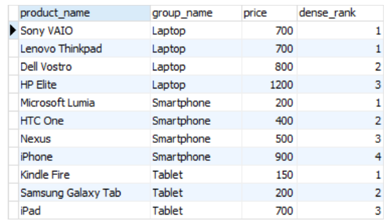
</div>

The third query uses the **DENSE_RANK()** function. 
function assigns a "dense" rank to each row, as specified
sorting order. 
the same values. 
and occupy the second and third places, then the next line will receive rank 3.

<h2 align="center">Functions FIRST_VALUE and LAST_VALUE</h2>

There are two window functions in PostgreSQL that allow you to retrieve
values ​​of the first and last rows within the range
windows: **FIRST_VALUE()** and **LAST_VALUE().**

Here is their description:

- **FIRST_VALUE (expression)** --- This function returns the value of an expression
for the first line of the window. 
the expression you want to get from the first line. 
is returned for each row within the window.

- **LAST_VALUE (expression)** --- This function returns the value of an expression
for the last line of the window. 
the expression you want to get from the last line. 
is returned for each row within the window.

The following statement uses **FIRST_VALUE (price)** to return
the lowest price for each group of products.

```sql
SELECT product_name
    , group_name
    , price
    , FIRST_VALUE(price) OVER (
        PARTITION BY group_name
        ORDER BY price
      ) AS lowest_price_per_group
FROM products
INNER JOIN product_groups USING (group_id);
```

<div align="center">
  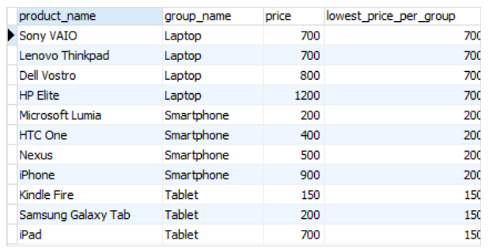
</div>

The following statement uses the **LAST_VALUE (price)** function to
returning the highest price for each product group.

```sql
SELECT product_name
    , group_name
    , price
    , LAST_VALUE(price) OVER (
        PARTITION BY group_name
        ORDER BY price
        RANGE BETWEEN UNBOUNDED PRECEDING AND UNBOUNDED FOLLOWING
      ) AS highest_price_per_group
FROM products
INNER JOIN product_groups USING (group_id);
```

<div align="center">
  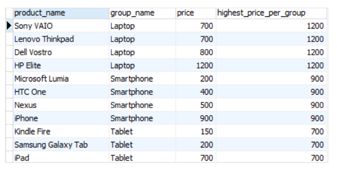
</div>

<h2 align="center">Expression RANGE BETWEEN UNBOUNDED PRECEDING AND UNBOUNDED FOLLOWING</h2>

📌 ***RANGE BETWEEN UNBOUNDED PRECEDING AND UNBOUNDED FOLLOWING** --- this
expression within an SQL window expression that defines the range for
window covering all lines from the first to the last line of the window, without
any restrictions.*

When the **RANGE BETWEEN UNBOUNDED PRECEDING AND expression is used
UNBOUNDED FOLLOWING**, it specifies that the window frame should span
all lines from the beginning of the window to its end, without limits on values
columns used for sorting.

This means that aggregation functions or window functions that use
this expression, will calculate the value based on all the rows of the window,
regardless of the values ​​of the sort columns.

<h2 align="center">LAG and LEAD functions</h2>

In PostgreSQL, there are two window functions that allow you to get
the value of the previous line **(LAG)** and the next line **(LEAD)** in
within the window.

Here is their description:

- **LAG (expression [, offset [, default]] )** --- This function
returns the value of the expression for the previous row of the window. 
be any column or expression you want to retrieve from
of the previous line.

- The **offset** parameter defines how many rows back from the current one
line of the window must be viewed (by default **offset = 1**,
i.e. previous line).

- The **default** parameter specifies the value to be returned if
previous row does not exist (default = NULL**).

<h2 align="center">An example of using the LAG function</h2>

The following statement uses the **LAG()** function to get prices from
of the previous line and calculating the difference between the price of the current line and
of the previous line.

```sql
SELECT
    product_name
  , group_name
  , price
  , LAG(price, 1) OVER (
        PARTITION BY group_name
        ORDER BY price
    ) AS prev_price
  , price - LAG(price, 1) OVER (
        PARTITION BY group_name
        ORDER BY price
    ) AS cur_prev_diff
FROM products
INNER JOIN product_groups USING (group_id);
```

<div align="center">
  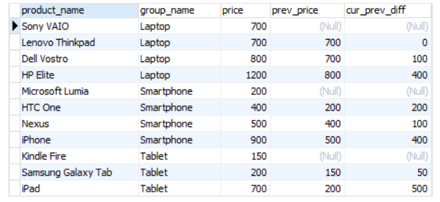
</div>

- **LEAD (expression [, offset [, default]])** -- This function
returns the value of the expression for the next line of the window. 
any column or expression you want to get from the following
line

- The **offset** parameter defines how many lines ahead of the current one
line of the window must be viewed (by default **offset = 1**,
i.e. the next line).

- The **default** parameter specifies the value to be returned if
the next line does not exist (by default **default = NULL**).

<h2 align="center">An example of using the LEAD function</h2>

The following statement uses the **LEAD ()** function to get prices from
of the next line and calculating the difference between the price of the current line and
next line
```sql
SELECT
    product_name
,   group_name
,   price
,   LEAD(price, 1) OVER (
        PARTITION BY group_name
        ORDER BY price
    ) AS next_price
,   price - LEAD(price, 1) OVER (
        PARTITION BY group_name
        ORDER BY price
    ) AS cur_next_diff
FROM products
INNER JOIN product_groups USING (group_id);
```

<div align="center">
  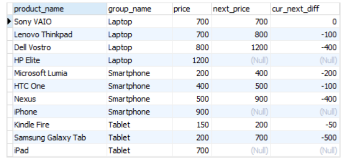
</div>

<h2 align="center">Conclusions</h2>

Window functions in SQL provide the ability to perform calculations that
aggregation and analysis of data within certain windows or groups of rows.
They complement standard aggregate functions that work with everyone
rows in the result set.

The main advantages of window functions:

- **Advanced functionality**. 
perform calculations and aggregations on subsets of data defined in
within the windows. 
analyze data at a more granular level.

- **Flexibility**. 
using various parameters, such as sorting, splitting on
groups and ranges. 
specific conditions and affect the distribution of results.

- **Efficiency**. 
based on windows without the need to use subqueries or
connection of tables. 
reduce query complexity.

The application of window functions can be extensive --- from **calculation
aggregate indicators for the analysis of trends, ratings, changes and patterns in
data**. 
data, which opens up new opportunities for obtaining insights from large
volumes of data.

<h2 align="center">Best practices for writing and formatting code</h2>

To be a successful data analyst, you need more than just deep
knowledge of analytical methods, but also be able to write and format effectively
SQL code.

That's why we've compiled the best writing and formatting practices for you
code in SQL, especially in the context of data analytics. 
will help improve the readability, maintainability and efficiency of SQL code,
which in turn will save time, avoid mistakes and increase
quality of analytical solutions.

Today we will look at the basic principles and standards of formatting,
correct naming of database objects, use of comments and
documentation.

<h2 align="center">Good style</h2>

Good code writing style is an integral part of development
software and SQL queries. 
which contribute to clean, understandable and maintainable code:

- **Identifiers and names.** Correct and meaningful naming
identifiers and database objects plays an important role in
code clarity. 
styles

- **Spaces and indents**. 
omissions and indents is of great importance to improve it
intelligibility 
create code with a more understandable structure.

- **Date and time**. 
use the standard **[ISO
8601](https://en.wikipedia.org/wiki/ISO_8601): YYYY-MM-DD and HH:MM:SS.SSSSS **---
to get the date and time in SQL.

- **SQL Functions.** One important aspect of good style is
using standard SQL functions instead of specific functions,
which are provided by a particular database provider. 
better query portability.

- **Code**. 
and support. 
parentheses or overuse of the WHERE statement.

- **Comments**. 
C-style comments are preferred **--- / (start) and \*/
(end)\*.** Or you can add --- before the comment, then at the end
the comment will be a new line.

Below are examples of requests that follow the guidelines
good style:

<div align="center">
  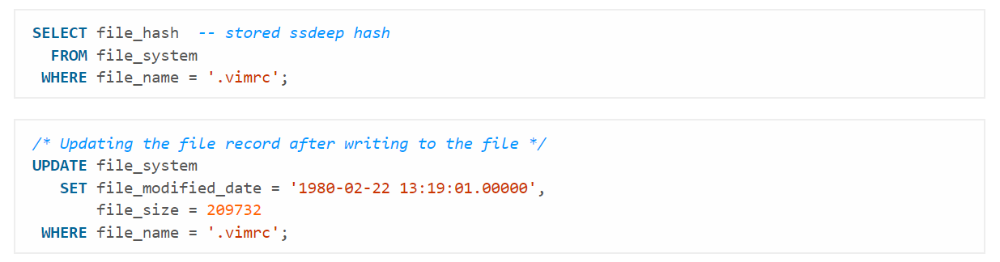
</div>

<h2 align="center">Bad style</h2>

Bad code style can lead to low comprehensibility, complexities in
support and understanding of the code by other developers. 
examples to avoid common mistakes and bad style in SQL code:

- **CamelCase**. 
capital letters except the first) for table, column, or other names
database objects can reduce code comprehensibility. 
use a word separator such as an underscore or
punctuation mark to make names more clear,
for example, order_date instead of orderDate.

- **Prefixes and [[Hungarian
notation]{.underline}](https://en.wikipedia.org/wiki/Hungarian_notation)**.
Using prefixes such as sp\_ for stored procedures
or tbl\_ for tables is redundant. 
information and make the code more difficult to read. 
use meaningful names without prefixes.

- **Plurality**. 
cause confusion 
collective concepts for names to improve code understanding.
For example, staff instead of employees or people instead of individuals.

- **Identifiers in quotation marks**. 
identifiers in quotes, double quotes should be used,
defined in
standards [[SQL-92]{.underline}](https://en.wikipedia.org/wiki/SQL-92).
This will ensure better code portability between different systems
database management.

<h2 align="center">Naming conditions</h2>

- Make sure the name is **unique** and not a reserved key
in a word

- The maximum length is 30 bytes --- in practice it is 30
characters unless you are using a multibyte character set.

- **Names must start with a letter** and cannot end
underscore character.

- Use only letters, numbers and underscores in names.

- **Avoid multiple consecutive underscores**
--- they are difficult to read.

- **Use underscores where you would naturally add them
would add a space** to the name (for example, the name would be **first_name**,
not **first name**).

- **Avoid abbreviations** and if you must use them,
make sure they are clear or widely applicable.

<div align="center">
  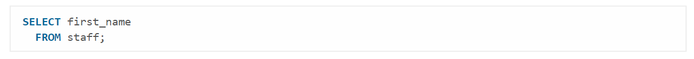
</div>

<h2 align="center">Tables</h2>

- **Use the collective name** or, less ideally, the plural form.
For example (in order of preference), staff and employees.

- **Do not use tbl prefix** or any other such descriptive
prefix, or Hungarian notation.

- **Never name a table the same as one of its columns**, and
vice versa.

- Avoid, where possible, joining two table names together to
create relationship table name. 
service preference.

<h2 align="center">Columns</h2>

- **Always use singular title**.

- **Avoid simply using id** as the primary if possible
identifier for the table (or use the conventions accepted
community).

- **Do not add a column with the same name as in the table**, and
vice versa.

- **Always use lower case**, except when
when uppercase can make sense, such as proper names.

<h2 align="center">Alias ​​or correlations</h2>

- Must be associated in a certain way with the object or expression that they are
create

- As a general rule, the correlation name should start with the first letter of each
words in the name of the object.

- If there is already a correlation with the same name, add the number.

- **Always add the AS keyword** --- it makes it easier to read,
because it is obvious.

- For calculated data (**SUM()** or **AVG()**) use the name
which you would give them if this column was defined in the schema.

<h2 align="center">Stored procedures</h2>

The name must contain a verb.

Do not use the **sp\_** prefix, or any other descriptive prefix,
or Hungarian notation.

<h2 align="center">Homogeneous suffixes</h2>

The following suffixes have a universal meaning that provides easy
reading and understanding columns from SQL code. 
suffix where appropriate.

- **\_id** --- a unique identifier, such as the column that is
primary key;

- **\_status** --- flag value or other status of any type,
for example, publication_status;

- **\_total** --- total sum or sum of a set of values;

- **\_num** --- indicates that the field contains any type of numbers;

- **\_name** --- denotes a name such as first_name;

- **\_seq** --- contains a continuous sequence of values;

- **\_date** --- denotes a column containing a date;

- **\_tally** --- tally;

- **\_size** --- the size of something, for example, a file or clothes;

- **\_addr** --- address to write, can be physical or
intangible, such as ip_addr.

<h2 align="center">Reserved words</h2>

It is best to avoid abbreviated keywords and use full keywords
keywords, if they are available (give
prefer **ABSOLUTE** instead of **ABS**).

Do not use database server-specific keywords unless
there is a corresponding **ANSI SQL** keyword that does the same thing
function 

<div align="center">
  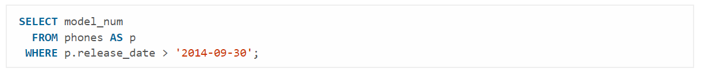
</div>

<h2 align="center">Empty space</h2>

It is important to use the correct and to make the code easier to read
consistent padding of spaces.

```sql
SELECT product_name
, group_name
, price
, LAG(price, 1) OVER (
    PARTITION BY group_name
    ORDER BY price
) AS prev_price
, price - LAG(price, 1) OVER (
    PARTITION BY group_name
    ORDER BY price
) AS cur_prev_diff
FROM products
INNER JOIN product_groups USING (group_id)
    WHERE price > 1000
        AND group_name IN ('Електроніка', 'Побутова техніка')
ORDER BY group_name
       , price DESC;
```

This formatting style combines the benefits of vertical alignment with
isolation of complex expressions, which ensures maximum readability,
maintainability and resistance to editing errors.

1. **Use of commas at the beginning of the line (Prefix Commas)**

Commas are placed at the beginning of each line containing a list item
(SELECT or ORDER BY).

Clear Isolation:

- Each element of the list begins with a separator (comma), which does
each line independent and easy to understand.

- Resistance to Errors (Debugging): To comment or delete
column (group_name), You do not need to change the previous row and
remove comma 
testing

- Easy Addition: Adding a new column is always done by a path
inserting a new line starting with ,.

2. **Vertical separation of window functions (LAG OVER)**

- **clause** **OVER** must be separated into separate lines with additional
retreat

- Clear Selection of Logic: Window functions **(LAG, ROW_NUMBER, SUM**
etc.) are the most difficult parts of the query. 
on individual lines **(PARTITION BY, ORDER BY)** makes logic
the definition of the window is instantly clear.

- Readability of Constituent Parts: Instead of one long line which
hides behind the field of vision, the logic is aligned vertically, which reminds
structure **GROUP BY** and **ORDER BY**.

3. **Grouping and indentation clause**

- **Main clauses** **(FROM, WHERE, ORDER BY)** start on a new one
line without indentation.

- **Logical Blocks**: Connection **(INNER JOIN)** and filtering conditions
(WHERE) start on a new line, but the following elements **(USING,
AND)** are also indented for visual communication with the parent
    clause.

- **Filtering Conditions**: Each independent condition in **WHERE** (connected
**AND** or **OR**) must be on a new line to see clearly
filtering logic.

This style ensures code consistency and transparency, which is critical
for long-term support and cooperation.

