****<div style="text-align: center; font-size: 24px;">Бази даних та їх види</div>****


Перш ніж розпочати подорож у світ даних, де таблиці, стовпці та рядки є
його невід'ємною частиною, а запити на отримання інформації формулюються
мовою SQL, розгляньмо основні «інститути», які забезпечують гармонію
цього світу. А саме --- **бази даних.**

📌 **База даних** --- це організована колекція даних, створена для того,
щоб мати зручний доступ до інформації, керувати нею та оновлювати її.
Вона зберігається та керується за допомогою спеціального програмного
забезпечення. Комп\'ютерні бази даних зазвичай зберігають агрегації
записів або файлів, які містять інформацію, таку як операції з продажу,
дані про клієнтів, фінансову інформацію та інформацію про товари.

**Бази даних** використовуються для зберігання, підтримки та доступу до
різних типів даних. Вони збирають інформацію про людей, місця або речі,
забезпечуючи централізований доступ та аналіз цих даних.

Компанії використовують дані, збережені в базах даних, для **прийняття
обґрунтованих бізнес-рішень**. Цілі використання баз даних організаціями
є різними. Ось деякі з них:

1.  **Покращення бізнес-процесів**

Компанії збирають дані про бізнес-процеси, такі як продажі, обробка
замовлень і обслуговування клієнтів. Ці дані аналізуються для покращення
ефективності процесів, розширення бізнесу та збільшення прибутку.

2.  **Відстеження клієнтів**

Бази даних часто зберігають інформацію про людей, зокрема про клієнтів
або користувачів. Наприклад, соціальні медіа використовують бази даних
для зберігання інформації про користувачів, такої як їхні імена,
електронні адреси й активність. Ці дані використовуються
для рекомендації контенту користувачам та покращення користувацького
досвіду.

3.  **Безпечне зберігання особистої інформації**

Бази даних також можуть використовуватися для зберігання особистої
інформації. Наприклад, особисте хмарне сховище дозволяє індивідуальним
користувачам зберігати медіафайли, такі як фотографії, у зручному та
безпечному хмарному середовищі.

<div align="center">
  
</div>

****<div style="text-align: center; font-size: 24px;">Реляційні бази даних</div>****

У сучасному світі, де дані стали безцінним активом для підприємств,
правильна організація та керування базами даних стає ключовим фактором
успіху. Одним із найпоширеніших підходів до зберігання та керування
даними є **реляційна модель баз даних**.

📌 **Реляційна модель баз даних (РМБД)** --- це підхід до організації та
керування даними, який був запропонований Едгаром Коддом у 1970 році.

**Реляційна модель** баз даних ґрунтується на концепції таблиць,
стовпців і рядків. Можна уявити таблицю як щось схоже на електронну
таблицю, де **стовпці** представляють **атрибути** (характеристики)
даних, а **рядки** --- конкретні **записи або кортежі** **даних**.

Наприклад, ми можемо мати **таблицю** «Клієнти», де **стовпці** ---
«Ім\'я», «Прізвище», «Email» і «Телефон», а **рядки** містять інформацію
про окремих клієнтів. Це є простим прикладом реляційної моделі.

<div align="center">
  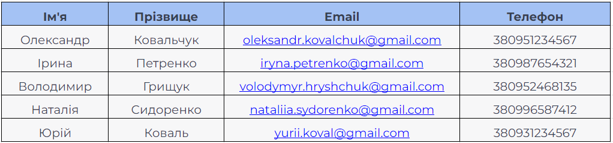
</div>

Отже, ще раз: у **реляційній моделі** дані представлені у
вигляді **таблиць**, **які називаються реляціями**. Кожна реляція
складається з множини записів, які містять інформацію про певну групу
сутностей. Кожен **запис **представляється **рядком** у
таблиці. **Атрибути** (поля) запису представлені **стовпцями** в
таблиці. Кожен стовпець має назву та тип даних, який визначає допустимий
формат значень.

Елементи реляційної моделі мають різні назви, тому важливо знати різні
варіанти, але краще дотримуватися одного конкретного варіанту, щоб
уникнути плутанини. Ось деякі назви та їх розташування в реляційній
моделі:
<div align="center">
  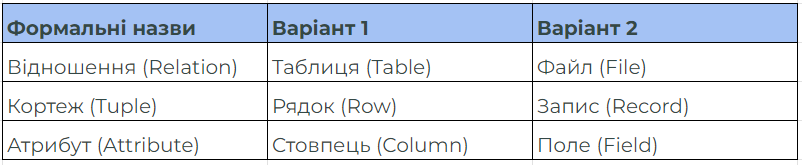
</div>

<div align="center">
  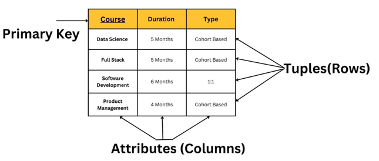
</div>

Один із **головних принципів** реляційної моделі --- це можливість
встановлення відношень (зв\'язків, relations) між таблицями. Це
здійснюється за допомогою **ключів**. Кожна реляція має один або більше
атрибутів, які виступають у ролі ключів. Ключі використовуються для
ідентифікації унікальних записів у таблиці та встановлення зв\'язків між
різними таблицями. Зв\'язки між реляціями визначаються за допомогою
спільних атрибутів, які містять однакові значення у відповідних записах
різних таблиць.

Уявімо, у нас є ще одна **таблиця** «Замовлення», яка містить інформацію
про замовлення клієнтів. Ми можемо встановити зв\'язок між таблицями
(*таблиця* «*Клієнти*» *і таблиця* «*Замовлення*»), використовуючи
унікальний **ідентифікатор клієнта** як зовнішній ключ у таблиці
«Замовлення». Таким чином, ми можемо легко зв\'язувати дані з обох
таблиць і виконувати складні запити, наприклад, вибрати всі замовлення
певного клієнта.

💡 Про **ключi** та зв\'язки між реляціями ми детальніше поговоримо на
наступних заняттях.

****<div style="text-align: center; font-size: 24px;">Переваги реляційної моделі</div>****

Основні переваги реляційної моделі баз даних:

-   **Простота**. Реляційна модель має просту структуру таблиць, яка
    легко зрозуміла та використовується розробниками й клієнтами баз
    даних.

-   **Гнучкість**. Реляційна модель підтримує багато різних операції з
    даними, зокрема вставку, оновлення, видалення записів, об\'єднання,
    проєкцію та сортування.

-   **Незалежність від фізичної реалізації**. Реляційна модель дозволяє
    відокремити логічне представлення даних від їхнього фізичного
    збереження. Це означає, що програми, які використовують реляційну
    базу даних, можуть працювати з даними, незалежно від того, як саме
    дані зберігаються на диску або в пам\'яті комп\'ютера.

-   **Цілісність даних. **Реляційна модель надає механізми для
    забезпечення цілісності даних. Це означає, що можна встановлювати
    правила й обмеження, які гарантують правильність даних у базі.
    Наприклад, можна встановити обмеження на значення певного атрибута,
    щоб воно не перевищувало певну межу або було унікальним для кожного
    запису.

-   **Масштабованість**. Реляційні бази даних можуть бути масштабовані
    залежно від потреб системи. Можна додавати нові таблиці, розширювати
    структуру бази даних та оптимізувати її для досягнення кращої
    продуктивності.

-   **Безпека**. Реляційні бази даних надають можливості для контролю
    доступу до даних. Можна встановлювати права доступу на рівні
    користувачів і ролей, щоб обмежити доступ до конфіденційної
    інформації та гарантувати безпеку даних.

📎 *Попри численні переваги, реляційна модель має деякі **обмеження**.
Наприклад, вона може бути неефективною для деяких типів даних, таких як
графи або невеликі фрагменти даних, які не підходять до табличної
структури.*

*Однак, за допомогою розширень і додаткових функцій реляційні бази даних
можуть успішно впоратися з більшістю проблем сучасного бізнесу.*

****<div style="text-align: center; font-size: 24px;">Підсумуємо основні пункти, які стосуються реляційних моделей:</div>****

**Реляційні моделі** є основою сучасних баз даних. Їхнє використання
дозволяє ефективно зберігати й організовувати великі обсяги даних.

Реляційні моделі використовують **табличну структуру** зі стовпцями
(атрибутами) і рядками (кортежами), що спрощує роботу з даними та
забезпечує їхню логічну організацію.

У реляційних моделях використовуються **ключі для унікальної
ідентифікації** рядків і встановлення зв\'язків між таблицями.

Реляційні моделі забезпечують **цілісність даних** через використання
обмежень (constraints) і правил, які дозволяють зберігати консистентні
дані.

**Запити до реляційних баз даних** виконуються за допомогою мови
структурованих запитів **SQL**, яка надає потужні інструменти для
пошуку, сортування, фільтрації та аналізу даних.

Реляційні моделі є **гнучкими** й можуть бути застосовані в різних
галузях, зокрема в бізнесі, науці, керуванні проєктами тощо.

Використання реляційних моделей сприяє **підвищенню
ефективності** обробки даних, забезпечує **структурованість** **і
доступність інформації** для користувачів та дозволяє **зберігати
дані** у безпечному середовищі.

Отже, реляційні моделі є потужним і надійним інструментом для
організації та керування даними, дозволяють з високою швидкістю та
ефективністю зберігати великі обсяги інформації, керувати ними й
аналізувати їх.

****<div style="text-align: center; font-size: 24px;">Системи управління базами даних та їх види</div>****

Томас Конноллі та Каролін Беґґ визначають **database management system
(DBMS)** --- систему **управління базами даних (СУБД)** --- як програмне
забезпечення, яке дозволяє користувачам визначати, створювати, зберігати
та контролювати доступ до бази даних.
Приклади СУБД включають **MySQL, MariaDB, PostgreSQL, SQLite, Microsoft
SQL Server, Oracle Database та Microsoft Access.**

*📎 Акронім СУБД іноді розширюють, щоб вказати основну модель бази
даних, наприклад, RDBMS (relational database management
system) для реляційної моделі, **OODBMS (object-oriented database
management system)** для об\'єктно-орієнтованої моделі та **ORDBMS
(object--relational database management
system)** для об\'єктно-реляційної моделі.*

*Інші розширення можуть вказувати на наявність інших характеристик,
наприклад, DDBMS (distributed database management
system) для розподіленої системи управління базами даних.*

****<div style="text-align: center; font-size: 24px;">Функціональність СУБД</div>****

Функціональність, яку надає СУБД, може значно варіюватися. Основна
функціональність полягає у зберіганні, вибірці й оновленні даних. Кодд
запропонував такі функції та сервіси, які повинна надавати повноцінна
універсальна СУБД:

-   Зберігання, вибірка й оновлення даних.

-   Каталог або словник даних, який описує метадані та до якого з них
    може отримати доступ користувач.

-   Підтримка транзакцій і конкурентності.

-   Засоби відновлення бази даних у разі її пошкодження.

-   Підтримка авторизації доступу й оновлення даних.

-   Підтримка доступу з віддалених місць.

Застосування обмежень допомагає забезпечити відповідність даних у базі
даних до певних правил.

<div align="center">
  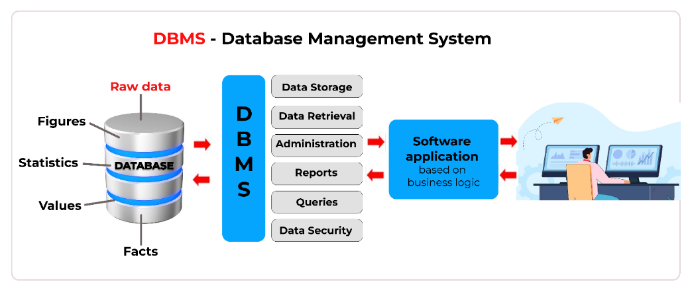
</div>

Також можна очікувати, що СУБД надає **набір утиліт (програмних
засобів)**, необхідних для ефективного адміністрування бази даних,
зокрема утиліти для імпорту, експорту, моніторингу, дефрагментації та
аналізу. Основна частина СУБД, яка взаємодіє між базою даних та
інтерфейсом програми, іноді називається **базовим модулем** бази даних.

Часто в СУБД присутні **конфігураційні параметри**, які можна
налаштувати як статично, так і динамічно, наприклад, максимальний обсяг
оперативної пам\'яті на сервері, який база даних може використовувати.
Тенденція полягає в мінімізації кількості ручної конфігурації. У разі
вбудованих баз даних особливо важлива необхідність нульового
адміністрування.

****<div style="text-align: center; font-size: 24px;">Види СУБД</div>****

Існує багато різних систем управління базами даних (СУБД) з огляду на
різноманітні потреби й вимоги користувачів. Ось **кілька причин, чому
існує багато різних СУБД**:

**Різноманітність застосувань.** Існує широкий спектр застосувань, від
невеликих вебсайтів до великих корпоративних систем. Кожне з цих
застосувань може мати унікальні вимоги до СУБД, такі як швидкодія,
масштабованість, безпека, резервне копіювання тощо. Різні СУБД надають
різні набори функцій і можливостей, що дозволяє вибрати систему, яка
буде найкраще підходити для конкретного застосування.

**Моделі даних.** СУБД можуть використовувати різні моделі даних, такі
як реляційні, об\'єктно-реляційні, ієрархічні, мережеві, колонкові тощо.
Кожна модель має свої переваги та обмеження, і вибір певної СУБД
залежить від потреб проєкту й типу даних, із якими вона працює.

**Технічні особливості.** Різні СУБД можуть мати різні технічні
особливості, які роблять їх доречними для певних сценаріїв. Наприклад,
деякі СУБД можуть бути спеціалізовані на операціях із текстом або
географічними даними й надають вбудовану підтримку для цих типів даних.

**Перформанс.** Одна СУБД може бути кращою в певних галузях швидкодії,
тоді як інша --- в інших.

Розглянемо деякі **СУБД** детальніше.

<div align="center">
  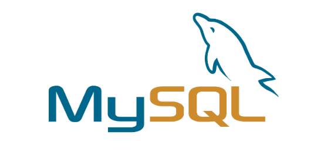
</div>

**MySQL** є однією з найпопулярніших реляційних баз даних. Вона є
відкритим рішенням, що зʼявилось як складова стеку LAMP (Linux, Apache,
MySQL, Perl/PHP/Python). MySQL простий у використанні, має високу
сумісність із вебзастосунками та підтримується відомими хмарними
платформами.

<div align="center">
  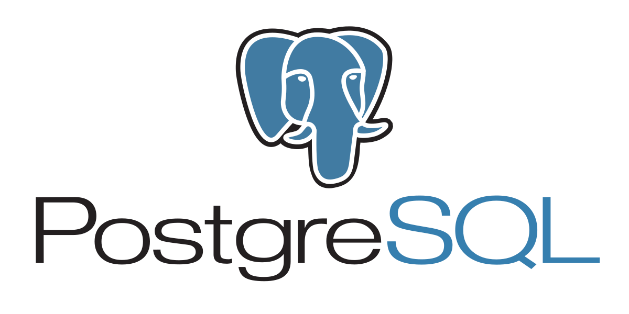
</div>

**PostgreSQL** також є реляційною базою даних із відкритим вихідним
кодом. Вона пропонує розширену функціональність і дотримання стандартів
SQL. PostgreSQL відрізняється гнучкістю, підтримкою географічних даних і
розширеннями для роботи з JSON та іншими нереляційними типами даних.

<div align="center">
  
</div>

**Oracle** є однією з провідних комерційних реляційних баз даних. Їй
властиві висока надійність, масштабованість і продуктивність. Oracle
надає розширені можливості керування даними, зокрема підтримку
транзакцій, високий рівень безпеки та розподілені обчислення.

<div align="center">
  
</div>

**Microsoft SQL** **Server** є комерційною реляційною базою даних,
розробленою Microsoft. Головними характеристиками цієї бази даних є
висока продуктивність, масштабованість і доступні інструменти для
бізнес-аналітики. MSSQL добре інтегрується з іншими продуктами Microsoft
і підтримує хмарні рішення.

<div align="center">
  
</div>

**MongoDB** є документно-орієнтованою нереляційною базою даних. Вона
зберігає дані у вигляді гнучких документів JSON, що дозволяє швидко та
гнучко змінювати структуру даних. MongoDB підтримує горизонтальне
масштабування та високу швидкість доступу до даних.

<div align="center">
  
</div>

**Redis** є відкритою базою даних типу «ключ-значення», яка забезпечує
швидкий доступ та обробку даних у пам\'яті. Вона використовується для
кешування даних, збереження сеансів користувачів, реалізації черг,
підтримки розподілених систем і багатьох інших сценаріїв, де важливі
швидкодія та надійність.

<div align="center">
  
</div>

**BigQuery** --- це хмарна платформа для аналізу даних на базі Google
Cloud. Вона розроблена для швидкого й масштабованого виконання запитів
до великих обсягів даних. Основна ідея BigQuery полягає у використанні
обчислювальної потужності хмарних серверів для розподіленого виконання
запитів на великому масштабі.

Отже, **системи управління базами даних (СУБД)** є важливими
інструментами для ефективного зберігання, керування та доступу до даних.
Вони дозволяють **організувати структуру даних, виконувати різноманітні
операції, сприяти безпеці та цілісності**.

-   Існує багато різних СУБД з огляду на різноманітність потреб і вимог
    користувачів.

-   Різні СУБД мають різні моделі даних, функціонал, особливості й
    підходи до роботи з даними.

-   Кожна СУБД може бути відповідною для конкретного сценарію або
    застосування, залежно від його розмірів, типу даних, швидкодії,
    масштабованості та інших вимог.

-   Застосування СУБД широкі й охоплюють різні галузі, зокрема бізнес,
    освіту, науку, медицину, електронну торгівлю та багато інших.

-   СУБД використовуються для створення й керування базами даних,
    виконання складних запитів, аналізу даних, гарантування безпеки,
    збереження резервних копій, роботи з багатокористувацькими системами
    тощо.

У підсумку, **СУБД** **є невід\'ємною частиною сучасного інформаційного
середовища**, яка допомагає забезпечити ефективне й надійне керування
даними в різних галузях. Вибір певної СУБД залежить від конкретних
потреб і вимог проєкту, з урахуванням функціональності, масштабованості,
швидкодії та інших факторів.

****<div style="text-align: center; font-size: 24px;">Правила управління доступом та спільного використання паролів</div>****

У сучасному світі даних дата-аналітики відіграють роль супергероїв, які
захищають інформацію, як цінний секрет. Але подібно до того, як у
дитинстві нам забороняли відчиняти двері незнайомцям, у світі аналітики
ми стикаємося з власною проблемою захисту інформації. Твоя база даних
--- це твій дім. Твоє завдання --- піклуватися про безпеку цього дому,
щоб ніякі «незнайомці» не отримали доступу до твоєї цінної інформації,
навіть якщо спокуса й цікавість змушують тебе задуматися, що насправді
знаходиться за дверима...

*📎 Компанії використовують рішення з керування доступом для
автентифікації, авторизації й аудиту доступу до програм та IT-систем. Ці
рішення часто входять до складу системи **ідентифікації та керування
доступом (IAM).** Рішення з керування доступом допомагають підвищити
рівень безпеки та знизити ризик, шляхом суворого контролю за доступом до
програм, сервісів та IT-інфраструктури як на місці, так й у хмарі. Вони
допомагають гарантувати, що певні користувачі мають доступ до певних
ресурсів протягом певного часу і з конкретних причин.*

Більшість рішень з керування доступом містить інструменти для керування
привілеями доступу й відстеження спроб входу та доступу. Історично
рішення з керування доступом надавалися у формі традиційного програмного
забезпечення. Сьогодні більшість компаній використовує** ідентифікацію
як сервіс (IDaaS), **який забезпечує гнучкість та легкість у
використанні. Простіше кажучи, готові сервіси надають функціонал для
входу до твоїх програм.

**Керування доступом для клієнтів та керування доступом для
користувачів**

Розробники програмного забезпечення та постачальники рішень пропонують
два різних типи рішень з керування доступом. **Рішення з керування
доступом для клієнтів** використовуються для автентифікації та
авторизації співробітників, які мають доступ до корпоративних програм та
IT-систем. **Рішення з керування доступом для користувачів** розроблені
для підтримки сотень тисяч користувачів і мають можливість інтеграції з
корпоративними IT-системами й каталогами.

*📎 Незважаючи на те що вони спрямовані на різні аудиторії та
підтримують різні операційні середовища, як рішення з керування доступом
для клієнтів, так і рішення з керування доступом для користувачів
надають функціональність багатофакторної автентифікації та можливості
для одноразового входу.*

****<div style="text-align: center; font-size: 24px;">Багатофакторна автентифікація</div>****

Більшість рішень з керування доступом підтримують функціональність
**багатофакторної автентифікації (MFA)**, щоб захистити від підробки та
крадіжки облікові дані користувача. За допомогою багатофакторної
автентифікації користувач повинен надати кілька форм доказів для
отримання доступу до програми або системи, наприклад, пароль і
одноразовий короткочасний SMS-код.

Фактори автентифікації включають:

-   Фактори знання --- щось, що користувач знає, наприклад, пароль або
    відповідь на запитання безпеки.

-   Фактори володіння --- щось, що користувач має, наприклад, мобільний
    пристрій або картка доступу.

-   Фактори спадковості --- щось, що є біологічно унікальним для
    користувача, наприклад, відбиток.

-   Фактори місцезнаходження --- географічне положення користувача.

*📎 Рішення найвищого класу підтримують адаптивні методи
автентифікації із застосуванням штучного інтелекту, використовуючи
контекстні або поведінкові аналітичні дані й адміністративно визначені
політики, щоб встановити, які фактори автентифікації застосовувати до
конкретного користувача в певній ситуації.*

****<div style="text-align: center; font-size: 24px;">Одноразовий вхід</div>****

Більшість рішень з керування доступом підтримує
можливості **одноразового входу (SSO)**, що дозволяє користувачам
отримувати доступ до всіх своїх програм і сервісів за допомогою одного
набору облікових даних. Одноразовий вхід поліпшує користувацький досвід,
усуваючи проблеми з різними паролями до різних сервісів.

📌 **Правила для обміну паролями (password sharing
rules)** встановлюються для гарантування безпеки та обмеження
неправомірного доступу до облікових записів.

Ось деякі **загальні принципи** правил обміну паролями:

1.  **Не ділися паролем** 🙂

Паролі повинні бути особистими й конфіденційними. Не передавай свій
пароль іншим особам, навіть колегам, друзям або родичам.

2.  **Не використовуй один пароль для різних облікових записів** 

Кожен обліковий запис повинен мати унікальний пароль. Використання
одного й того ж пароля для різних сервісів може призвести до
компрометації всіх твоїх облікових записів у разі порушення безпеки
одного з них.

3.  **Використовуй надійні паролі**

Створюй паролі, які містять комбінації великих і малих літер, цифр і
спеціальних символів. Уникай використання очевидних паролів, таких як
дати народження або прості послідовності.

4.  **Змінюй паролі регулярно**

Рекомендується періодично змінювати паролі, щоб запобігти можливій
компрометації. Ідеальною практикою є зміна паролів кожні 60-90 днів.

5.  **Використовуй двоетапну перевірку** 

Увімкни **двоетапну перевірку (two-factor authentication)** для
підвищення безпеки облікових записів. Це надасть додатковий рівень
безпеки, вимагаючи додаткової форми автентифікації, наприклад,
одноразового коду, який надсилається на твій мобільний пристрій.

6.  **Не зберігай паролі в небезпечних місцях** 

Уникай записування паролів на папері, у нотатках на комп\'ютері або в
повідомленнях електронної пошти.

7.  **Використовуй парольний менеджер** 

Розглянь можливість використання парольного менеджера, який допоможе
безпечно зберігати твої паролі та керувати ними. Парольний менеджер
генерує сильні паролі, запам\'ятовує їх за тебе й автоматично заповнює
облікові записи.

8.  **Негайно змінюй паролі після потенційної компрометації** 

Якщо ти підозрюєш, що твій пароль може бути скомпрометованим, наприклад,
через повідомлення про підозрілу активність або порушення безпеки,
негайно зміни пароль до відповідного облікового запису.

9.  **Надавай доступ тільки необхідним особам** 

Обмеж доступ до своїх облікових записів тільки для осіб, яким це дійсно
потрібно. Не дозволяй неуповноваженим особам використовувати твої
облікові дані.

10. **Вивчай про безпеку паролів** 

Знайомся з найновішими рекомендаціями та практиками щодо безпеки
паролів. Будь усвідомленим/-ою щодо потенційних загроз і способів
запобігання їм.

****<div style="text-align: center; font-size: 24px;">Вступ до мови SQL</div>****

**SQL** --- це мова програмування, призначена для керування даними, які
зберігаються в системі керування реляційною базою даних (RDBMS).

Простіше кажучи, **SQL** --- це мова, яка дозволяє нам взаємодіяти з
базами даних. За допомогою SQL ми можемо отримувати дані, створювати й
модифікувати таблиці, встановлювати зв\'язки між даними, агрегувати та
аналізувати інформацію тощо. Це щось на зразок магічної палички, за
допомогою якої ти можеш реалізовувати свої ідеї та запити в реальному
житті.

*📎 **SQL (Structured Query Language)** розшифровується як мова
структурованих запитів.*

SQL складається з трьох основних компонентів:

-   мови визначення даних **(Data Definition Language --- DDL);**

-   мови маніпулювання даними **(Data Manipulation Language --- DML);**

-   мови керування даними **(Data Control Language --- DCL);**

**Мова визначення даних (DDL)** використовується для створення й
модифікації схеми. Наприклад, оператор CREATE TABLE дозволяє створити
нову таблицю в базі даних, а оператор ALTER TABLE змінює структуру
наявної таблиці.

**Мова маніпулювання даними (DML)** надає конструкції для запиту даних,
такі як оператор SELECT, та оновлення даних, такі як
оператори INSERT, UPDATE та DELETE.

**Мова керування даними (DCL)** складається з операторів, що
відповідають за авторизацію та безпеку користувача, наприклад
операторів GRANT чи REVOKE.

****<div style="text-align: center; font-size: 24px;">Стандарт SQL</div>****

SQL була однією з перших комерційних мов баз даних з 1970 року. З того
часу різні постачальники баз даних впроваджували SQL у свої продукти з
деякими варіаціями. Щоб досягти більшої відповідності між
постачальниками,

**Американський інститут стандартів (ANSI)** опублікував перший стандарт
SQL у 1986 році.

Потім ANSI оновив стандарт SQL у 1992 році, відомий як SQL92 і SQL2, а
також у 1999 році, як SQL99 і SQL3. Кожного разу **ANSI** додавав нові
функції та команди до мови SQL.

*📎 Стандарт SQL зараз підтримується як **ANSI**, так і **Міжнародною
організацією стандартів як стандарт ISO/IEC 9075**. Останні випуски
стандарту --- SQL:2016 та SQL:2023..*

Стандарт SQL формалізує синтаксичні структури й поведінку SQL у
продуктах баз даних. Це особливо важливо для баз даних із відкритим
кодом, таких як MySQL і PostgreSQL, де RDBMS розробляються переважно
спільнотами, а не великими корпораціями.

Нижче наведено найпопулярніші діалекти SQL:

PL/SQL означає процедурну мову SQL. Він розроблений компанією Oracle для
бази даних Oracle.

Transact-SQL або T-SQL розроблено Microsoft для Microsoft SQL Server.

PL/pgSQL означає процедурну мову PostgreSQL, яка складається з діалекту
SQL і розширень, що реалізовані в PostgreSQL.

MySQL має власну процедурну мову, починаючи з версії 5.

Зауваж, що MySQL придбала Oracle.

Оскільки SQL була розроблена спеціально для нетехнічних людей, вона дуже
проста і легка для розуміння. Щоб написати оператор SQL, тобі просто
потрібно сказати, ЩО ти хочеш, а НЕ ТЕ, ЯК ти хочеш --- на відміну від
того, як це реалізовано в інших імперативних мовах, таких як PHP, Java
та C++.

SQL є зручною для користувача мовою, оскільки вона призначена в
основному для виконання спеціальних запитів і створення звітів.

Зараз SQL використовується висококваліфікованими фахівцями, такими як
аналітики даних, дослідники даних, розробники й адміністратори баз
даних.

****<div style="text-align: center; font-size: 24px;">Основні правила синтаксису SQL</div>****

SQL складається з багатьох інструкцій, кожна з яких зазвичай
завершується крапкою з комою (;). Наприклад, нижче наведено дві різні
інструкції:

<div align="center">
  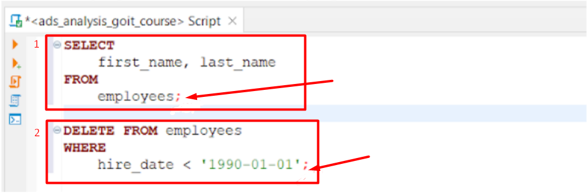
</div>

-   У SQL існує багато ключових слів зі спеціальними значеннями,
    наприклад, **SELECT**, **INSERT**, **UPDATE**, **DELETE** та **DROP**.
    Ці ключові слова є зарезервованими, тому не можна використовувати їх
    як імена таблиць, стовпців, індексів, подань, збережених процедур,
    тригерів або інших об'єктів бази даних.

-   Щоб документувати оператори SQL, ми використовуємо **коментарі
    SQL**. Під час аналізу операторів SQL із коментарями механізм бази
    даних ігнорує символи в коментарях. Коментар позначається **двома
    послідовними дефісами (\--)**, що дозволяють коментувати решту
    рядка. Щоб задокументувати код, який може охоплювати кілька рядків,
    ти використаєш **багаторядкову нотацію у стилі C ( /\*\*/)**

<div align="center">
  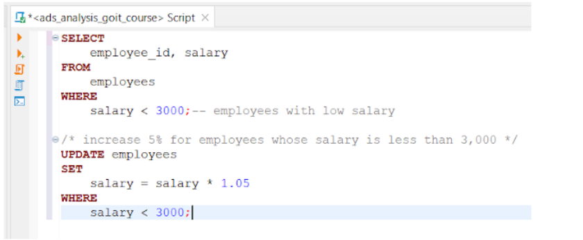
</div>

*💡 Запам\'ятай ці основні правила, оскільки надалі ми будемо
застосовувати їх уже на практиці!*

На завершення --- кілька **коротких тез**, які наголошують на важливості
основ SQL:

-   **SQL** --- це мова структурованих запитів, яка дозволяє нам
    взаємодіяти з базами даних, отримувати інформацію та керувати
    даними.

-   Основи SQL передбачають знання **основних команд**, таких як SELECT,
```sql
    INSERT, UPDATE і DELETE, що дозволяють нам працювати з даними в
    таблицях.
```
-   Знання **основних операторів SQL**, таких як WHERE, JOIN, GROUP BY і
    ORDER BY, допомагає нам фільтрувати дані, з\'єднувати таблиці,
    агрегувати інформацію та сортувати результати.

-   **Розуміння** **структури баз даних**, зокрема таблиць, стовпців і
    зв\'язків між ними, є ключовим аспектом роботи з SQL.

-   Базові навички написання **ефективних запитів й оптимізації
    запитів** допомагають покращити продуктивність та ефективність
    роботи з базами даних.

-   Знання **основ SQL** відчиняє двері до більш складних концепцій і
    можливостей, таких як створення таблиць, керування правами доступу і
    проєктування баз даних.

-   **SQL** є однією з **найпоширеніших мов** для роботи з даними й
    необхідним інструментом для аналітиків, розробників і всіх, хто
    працює з базами даних.

Загалом розуміння основ SQL відіграє важливу роль у досягненні успіху в
роботі з даними. Воно дає можливості для аналізу, керування й отримання
цінної інформації з баз даних.

****<div style="text-align: center; font-size: 24px;">Основи написання запитів (DQL)</div>****

Інструкції **DQL** використовуються для виконання запитів до даних в
об'єктах схеми. **DQL (Data Query Language)** є частиною **DML (Data
Manipulation Language).**

Ми можемо визначити **DQL** так: це компонент оператора SQL, який
дозволяє отримувати дані з бази даних і накладати на них порядок. Він
містить оператор **SELECT**. Ця команда дозволяє отримати дані з бази
даних для виконання операцій з ними. Коли **SELECT** застосовується
до таблиці або таблиць, результат компілюється в наступну тимчасову
таблицю, яка відображається або, можливо, отримується програмою.

Зокрема оператор **SELECT** використовується з такими командами:

-   **FROM**

-   **WHERE**

-   **GROUP BY**

-   **HAVING**

-   **ORDER BY**

-   **LIMIT**

*💡Ми будемо знайомитися з кожною з цих команд окремо.*

****<div style="text-align: center; font-size: 24px;">SELECT</div>****

**SELECT** вибирає дані з однієї або кількох таблиць. Нижче показано
базовий синтаксис оператора **SELECT**, який вибирає дані з однієї
таблиці:

```sql
SELECT select_list
```
FROM table_name;

У цьому синтаксисі:

-   Спочатку вкажи список стовпців, розділених комами, із таблиці, яка
    нам потрібна.

-   Потім у FROM вкажи назву таблиці, з якої витягуємо інформацію.

Під час виконання оператора **SELECT** система бази даних спочатку
зчитує **FROM**, а потім **SELECT**.

Крапка з комою (;) не є частиною запиту. Сервер бази даних використовує
його для розділення двох інструкцій SQL.

Якщо ти хочеш витягнути всі стовпці таблиці, замість їх переліку, можна
використовувати оператор «зірочка» **(\*)**.

```sql
SELECT *
FROM table_name;
```

*📎 SQL не враховує регістр. Тому ключові слова **SELECT** і select мають
однакове значення.*

Для демонстрації ми використаємо таблицю **employees**.

<div align="center">
  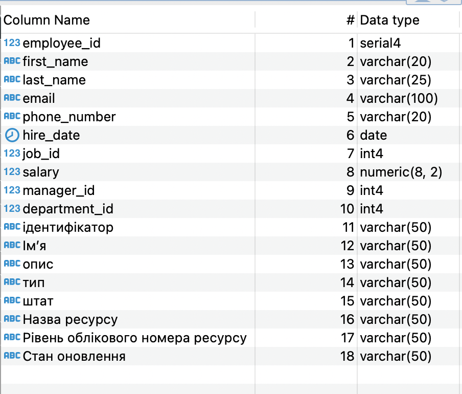
</div>

**<div style="text-align: font-size: 24px;">Приклад 1. Отримання даних з усіх рядків і стовпців таблиці</div>**

У наступному прикладі SQL-коду використовується оператор SELECT для
отримання даних з усіх рядків і стовпців таблиці **employees**:

```sql
SELECT * 
FROM HR.employees;
```

Результат:

<div align="center">
  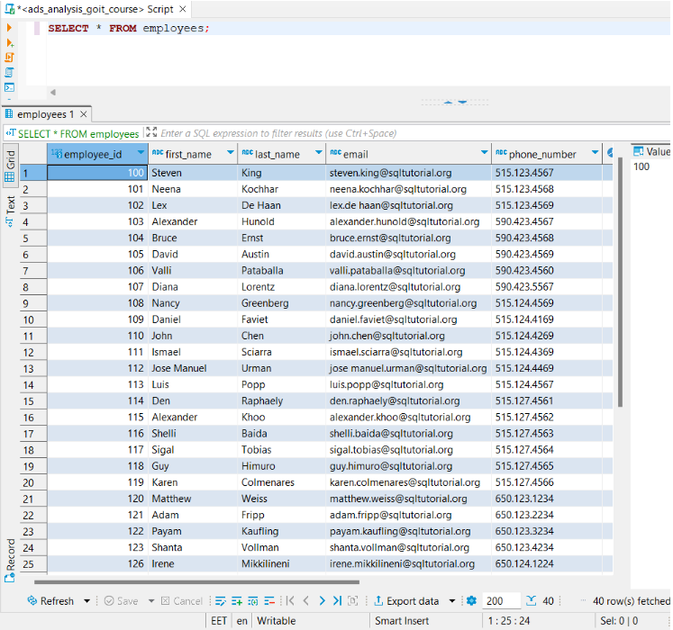
</div>

****<div style="text-align: center; font-size: 24px;">Важливо </div>****

Читається **SELECT \*** як зірочка вибору. Зірочка вибору корисна лише
для спеціальних запитів. Для розробки програми тобі
слід уникати використання зірочки вибору через те, що **SELECT \***
повертає дані з усіх стовпців таблиці. Часто на практиці потрібні дані
не з усіх стовпців, а лише з одного або кількох стовпців. Якщо ти
використовуєш **SELECT \***, базі даних потрібно більше часу, щоб
зчитати дані з диска та передати їх до програми. Це часто призводить до
низької продуктивності, якщо таблиця містить багато стовпців із великою
кількістю даних.

Щоб вибрати дані з певних стовпців, необхідно вказати список саме цих
стовпців після оператора **SELECT**.

Наприклад, наведені нижче дані вибираються з ідентифікатора працівника,
імені, прізвища й дати найму з усіх рядків у таблиці employees:

```sql
SELECT employee_id
    , first_name
    , last_name
    , hire_date
FROM "HR".employees;
```

Подивимося на результат:

<div align="center">
  
</div>

**<div style="text-align: font-size: 24px;">Приклад 2. Отримання імені, прізвища, зарплати та нової зарплати</div>**

У цьому прикладі використовується оператор **SELECT** для отримання
імені, прізвища, зарплати та нової зарплати (На скільки % ми збільшили
початкову зарплату?):


```sql
SELECT first_name
     , last_name
     , salary
     , salary * 1.05
FROM HR.employees;
```

<div align="center">
  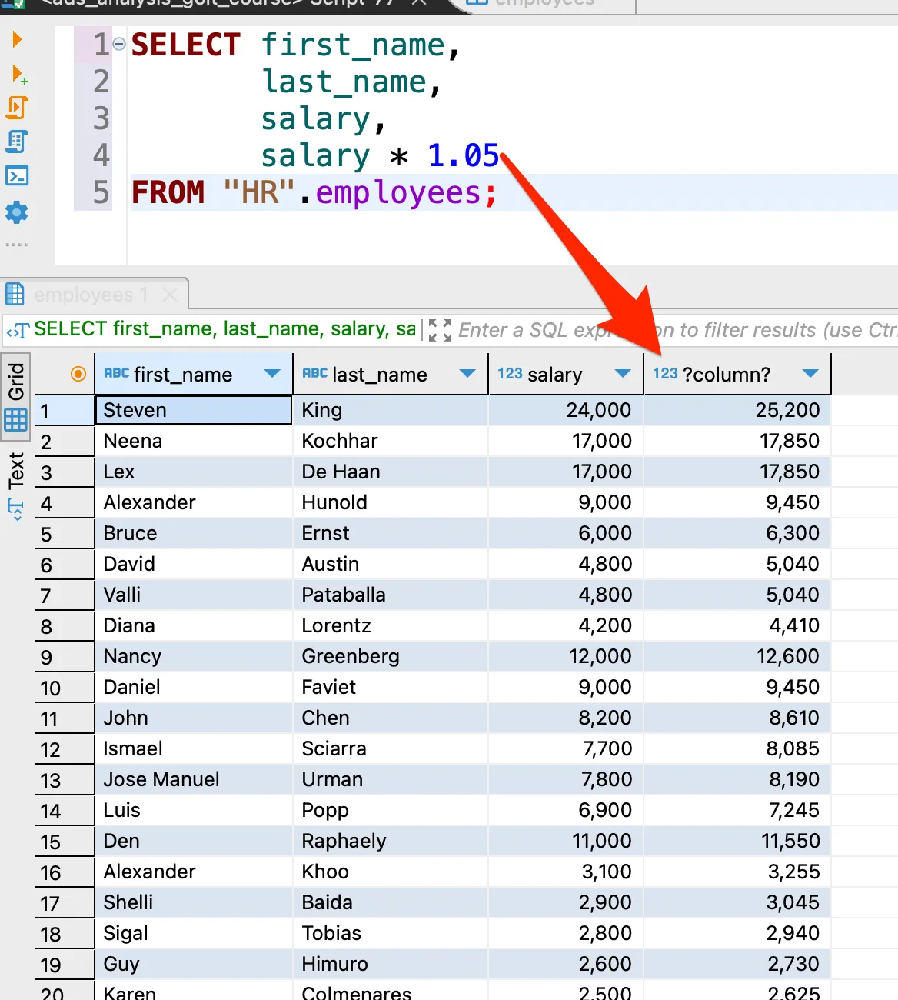
</div>

Вираз **salary * 1.05** додає 5% до зарплати кожного працівника.

Наприклад, наступний оператор **SELECT** використовує **new_salary** як
псевдонім стовпця для **salary \* 1.05** виразу:

```sql
SELECT first_name
     , last_name
     , salary
     , salary * 1.05 AS new_salary
FROM HR.employees;
```
<div align="center">
  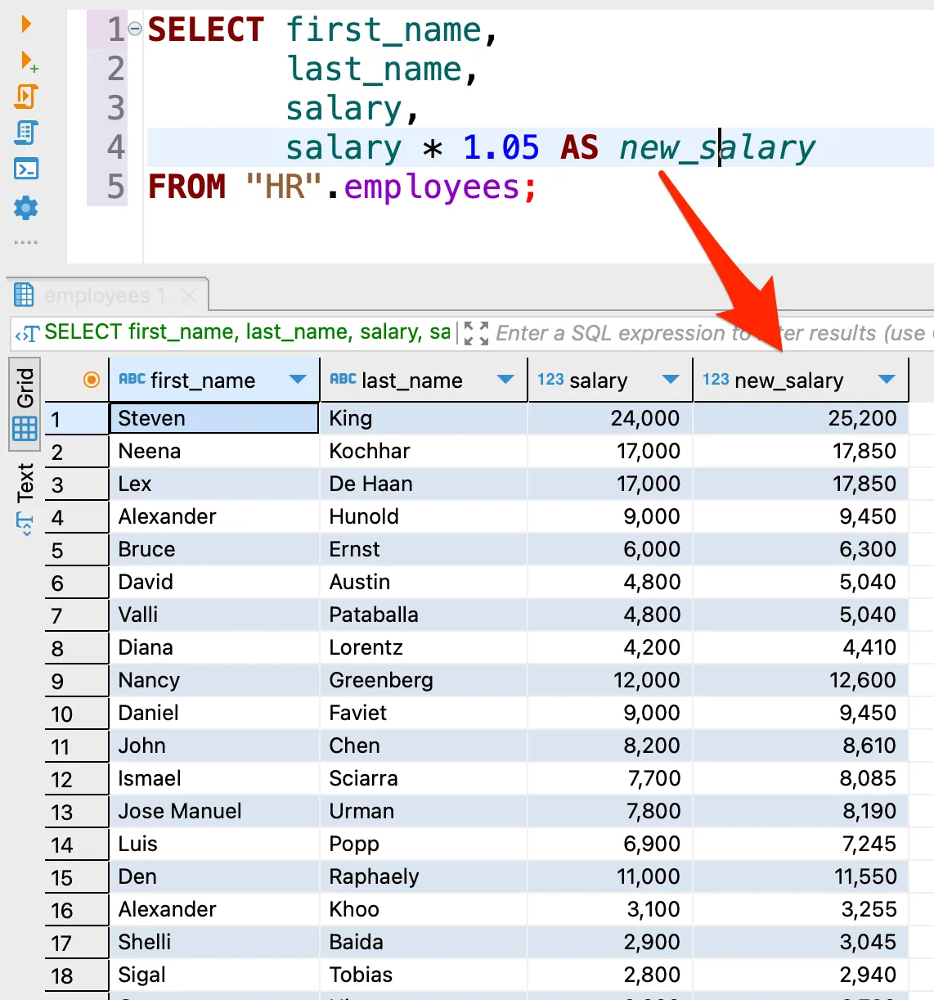
</div>

**Псевдоніми** ми ще називаємо **еліасами** (краще вживати англомовний
термін --- **alias**)!

****<div style="text-align: center; font-size: 24px;">ORDER BY</div>****

**ORDER BY** --- необов\'язковий пункт оператора **SELECT**.
Команда **ORDER BY** дозволяє сортувати рядки, які повертає **SELECT** у
порядку зростання або спадання.

Нижче показано синтаксис команди **ORDER BY**:

```sql
SELECT select_list
FROM table_bane
ORDER BY sort_expression [ASC | DESC];
```

У цьому синтаксисі:

ORDER BY завжди розміщується після **FROM**. База даних оцінить
оператор **SELECT** із **ORDER BY** у такому порядку:  FROM → SELECT →
ORDER BY**

**ASC** - сортування за зростанням;\
**DESC** - сортування за спаданням;

ORDER BY також дозволяє сортувати набір результатів за кількома
стовпцями. У цьому випадку тобі потрібно використовувати кому, щоб
розділити два стовпці сортування:

```sql
SELECT select_list
FROM table_bane
ORDER BY sort_expression_1 [ASC | DESC]
        ,sort_expression_2 [ASC | DESC];
```

Розглянемо декiлька прикладiв, щоб продемонструвати роботу
оператора **ORDER BY.**

1.  У цьому прикладi оператор **SELECT** повертає дані з ідентифікатора
    працівника, імені, прізвища, дати найму та стовпця зарплати таблиці
    employees:


```sql
SELECT employee_id
     , first_name
     , last_name
     , hire_date
     , salary
FROM HR.employees;
```
```sql
SELECT employee_id
     , first_name
     , last_name
     , hire_date
     , salary
FROM HR.employees
ORDER BY salary DESC;
```
```sql
SELECT employee_id
     , first_name
     , last_name
     , hire_date
     , salary
FROM HR.employees
ORDER BY first_name;
```


<div align="center">
  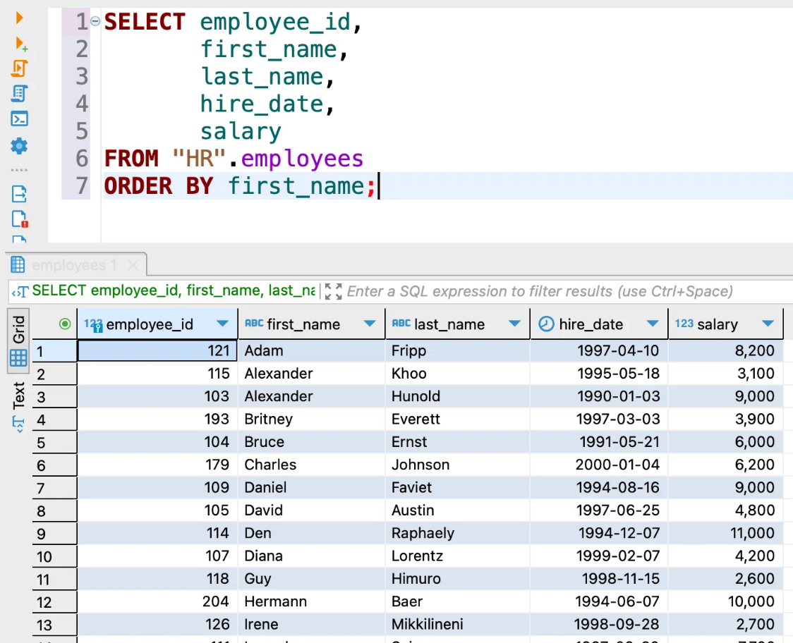
</div>

Отже, бачимо, що **ORDER BY** сортує результат за значеннями у
стовпці **first_name.**

3.  У наступному прикладі використовується **ORDER BY** для сортування
    співробітників за іменем у порядку зростання та прізвищем у порядку
    спадання:

```sql
SELECT employee_id
     , first_name
     , last_name
     , hire_date
     , salary
FROM HR.employees
ORDER BY first_name, last_name DESC;
```

<div align="center">
  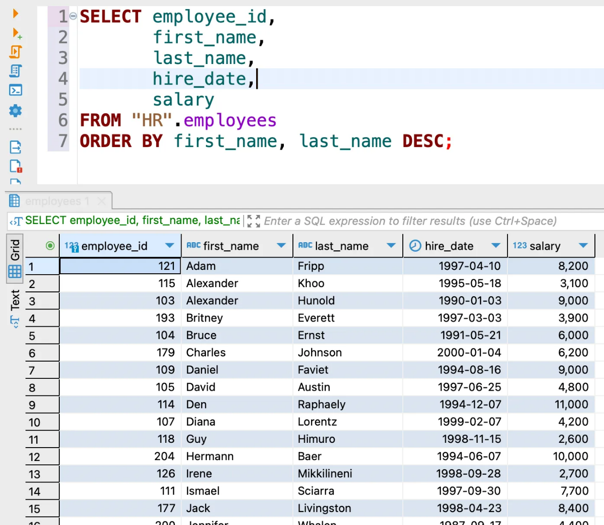
</div>

У цьому прикладі **ORDER BY** сортує набір результатів за першим іменем
у порядку зростання, а потім сортує вже відсортований набір результатів
за прізвищем у порядку спадання.

4.  У наступному прикладі використовується ORDER BY для сортування
    працівників за зарплатою від високої до низької:

```sql
SELECT employee_id
     , first_name
     , last_name
     , hire_date
     , salary
FROM HR.employees
ORDER BY salary DESC;
```

<div align="center">
  
</div>

5.  Окрім символьних і числових даних, ти можеш використовувати **ORDER
    BY**, щоб сортувати рядки за датою. Наприклад, наступний оператор
    використовує

 **ORDER BY** для сортування співробітників за значеннями у
стовпці **hire_date**:

```sql
SELECT employee_id
ORDER BY hire_date;
```

```sql
SELECT employee_id
    , first_name
    , last_name
    , hire_date
    , salary
FROM "HR".employees
ORDER BY hire_date;
```

<div align="center">
  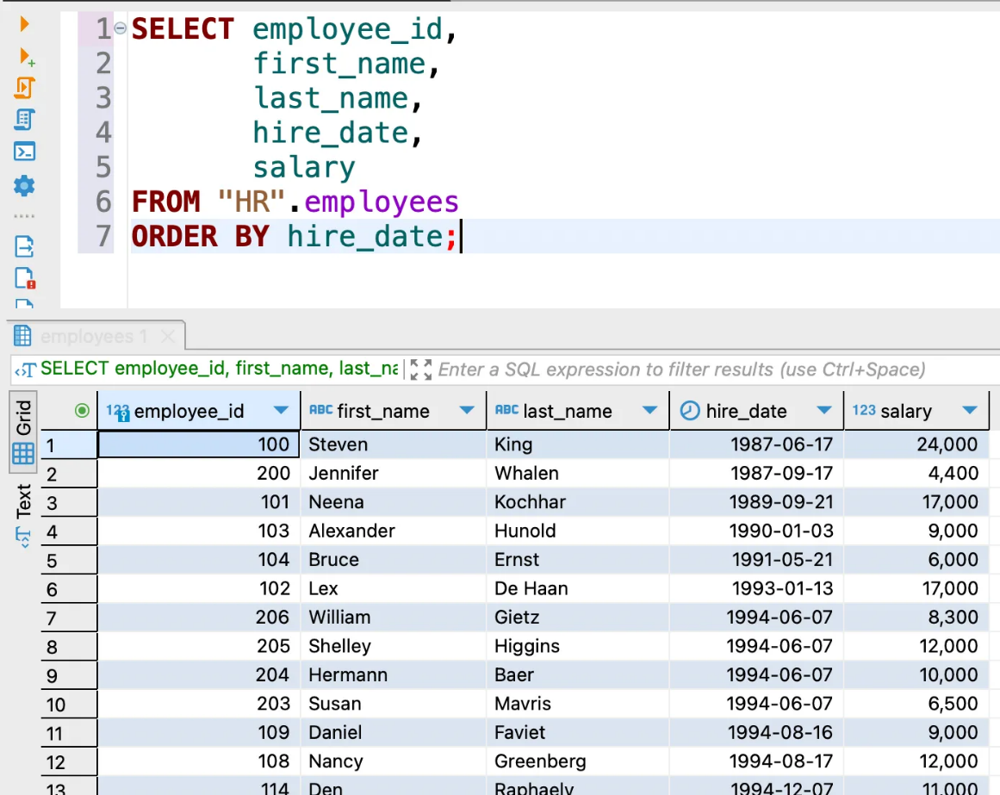
</div>

****<div style="text-align: center; font-size: 24px;">WHERE</div>****

Щоб вибрати певні рядки з таблиці, ми використовуємо команду WHERE в
операторі SELECT.

Нижче наведено синтаксис WHERE в інструкції SELECT:

```sql
SELECT column1
     , column2
     , ...
FROM table_name
  WHERE condition;
```

**WHERE** з'являється одразу після **FROM**.

Тепер наша послідовність операторів така:

****<div style="text-align: center; font-size: 24px;">FROM → WHERE → SELECT </div>****

WHERE містить один або кілька логічних виразів, які застосовуються до
кожного рядка таблиці. Якщо рядок, який викликає умову, виявляється
істинним, він буде включений до набору результатів; в іншому випадку
його буде виключено.

Зауваж, що SQL має тризначну логіку: **TRUE**, **FALSE** та **UNKNOWN**.
Це означає, що якщо рядок призводить до того, що умова має
значення **FALSE** або **NULL**, рядок не буде повернено. Але про це ми
ще поговоримо далi.

Ти можеш використовувати різні оператори для формування критеріїв вибору
рядків, які використовуються у **WHERE**.

У наведеній нижче таблиці показано оператори порівняння **SQL**:

<div align="center">
  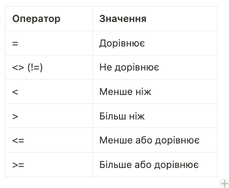
</div>

Щоб сформувати простий вираз, використовуй один із наведених вище
операторів із двома операндами, які можуть бути назвою стовпця з одного
боку та літеральним значенням з іншого, наприклад: **salary > 1000**.

**Літеральними значеннями**, які використовуються у виразі, можуть бути
числа, символи, дати та час, залежно від формату, який використовується:

-   **Число**. Використовуй число, яке може бути цілим або десятковим
    без будь-якого форматування. Наприклад, 100, 200, 5.

-   **Символ**. Використовуй символи в одинарних або подвійних лапках (з
    лапками треба бути обережними, тому що в деяких реалізаціях можуть
    використовуватися лише одинарні). Наприклад, «100», «GoIT --- the
    best school».

-   **Дата**. Використовуй формат, який зберігає база даних. Це залежить
    від системи бази даних. Наприклад, Postgre використовує
    \'yyyy-mm-dd\' формат для зберігання даних дати.

-   **Час**. Використовуй формат, який використовує система бази даних
    для зберігання часу. Наприклад, Postgre використовує \'HH:MM:SS\'
    для зберігання даних про час.

Давай розглянемо приклад.

Цей запит знаходить працівників із зарплатою понад 14 000 і сортує набір
результатів на основі зарплати в порядку спадання.

```sql
SELECT employee_id
     , first_name
     , last_name
     , salary
FROM HR.employees
  WHERE salary > 14000
ORDER BY salary DESC;
```

<div align="center">
  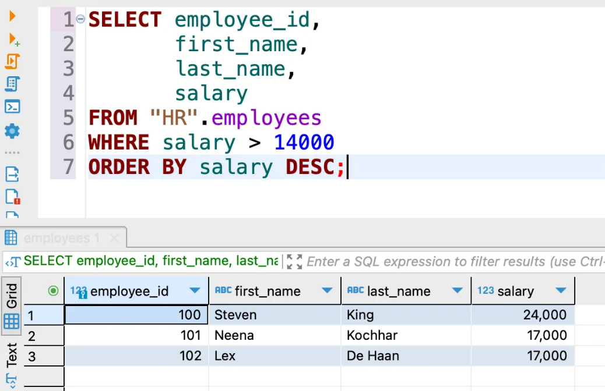
</div>

**SQL** не враховує регістр. Однак, коли мова йде **про порівняння
значень, він чутливий до регістру**.

Наприклад, наступний запит знаходить працівника із прізвищем Chen.

```sql
SELECT employee_id
     , first_name
     , last_name
FROM HR.employees
  WHERE last_name = 'Chen';
```

<div align="center">
  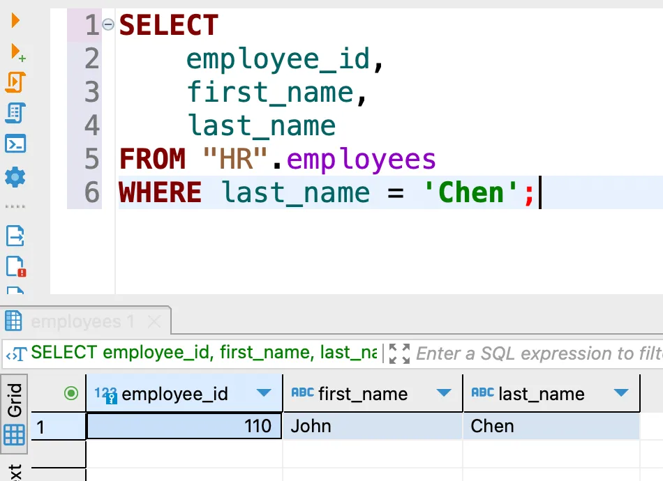
</div>

Щоб отримати всіх співробітників, які приєдналися до компанії після *1
січня 1999 року*, скористайся таким запитом:

```sql
SELECT employee_id
     , first_name
     , last_name
     , hire_date
FROM HR.employees
  WHERE hire_date >= '1999-01-01'
ORDER BY hire_date DESC;
```

<div align="center">
  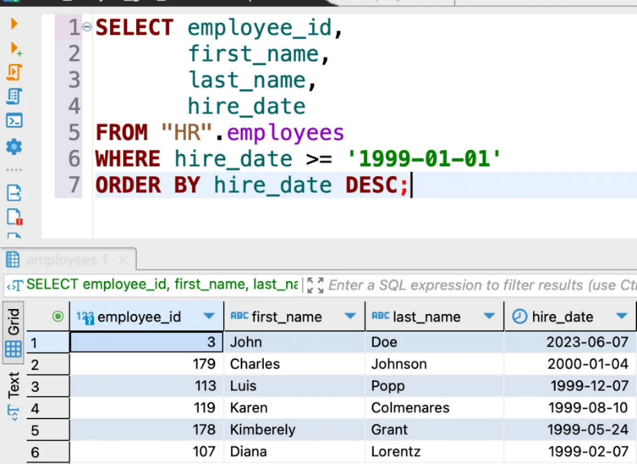
</div>

****<div style="text-align: center; font-size: 24px;">LIMIT</div>****

**LIMIT** --- це оператор, який дозволяє нам обмежити виведення
результатів певною кількістю рядків. За допомогою **LIMIT** ми можемо
задати, яку кількість перших рядків результату потрібно вивести,
враховуючи задане сортування.

Наприклад, ми можемо вивести інформацію про останнього співробітника,
який влаштувався на роботу, відсортувавши дані за датою найму за
спаданням і задавши **LIMIT 1:**\
\
Що правда в різних діалектах використовуються різні конструкти

| **СУБД (SQL Dialect)**            | **Оператор**   | **Приклад**                                                        |
|-----------------------------------|----------------|---------------------------------------------------------------------|
| **MySQL, PostgreSQL, SQLite**     | LIMIT          | `SELECT ... ORDER BY hire_date DESC LIMIT 1;`                      |
| **SQL Server (T-SQL)**            | TOP            | `SELECT TOP 1 employee_id, ... FROM ... ORDER BY hire_date DESC;`  |
| **Oracle (старі версії)**         | ROWNUM         | `SELECT ... FROM ... WHERE ROWNUM = 1 ORDER BY hire_date DESC;`    |
| **Oracle (сучасні, SQL:2008)**    | FETCH FIRST    | `SELECT ... ORDER BY hire_date DESC FETCH FIRST 1 ROW ONLY;`       |
| **SQL Server, Oracle, PostgreSQL**<br/>(SQL:2008) | OFFSET/FETCH | `SELECT ... ORDER BY hire_date DESC OFFSET 0 ROWS FETCH NEXT 1 ROW ONLY;` |


```sql
SELECT employee_id
     , first_name
     , last_name
     , hire_date
FROM HR.employees

ORDER BY hire_date DESC
LIMIT 1;
```

<div align="center">
  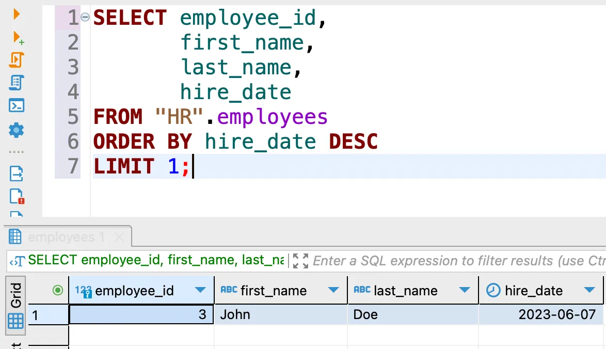
</div>

Також разом з **LIMIT** ми можемо використати **OFFSET**, щоб задати
зсув на певну кількість рядків. Наприклад, якщо ми хочемо отримати
інформацію про передостаннього співробітника, ми задамо зсув на один
рядок:

```sql
SELECT employee_id
     , first_name
     , last_name
     , hire_date
FROM HR.employees
ORDER BY hire_date DESC

LIMIT 1
OFFSET 1;
```

<div align="center">
  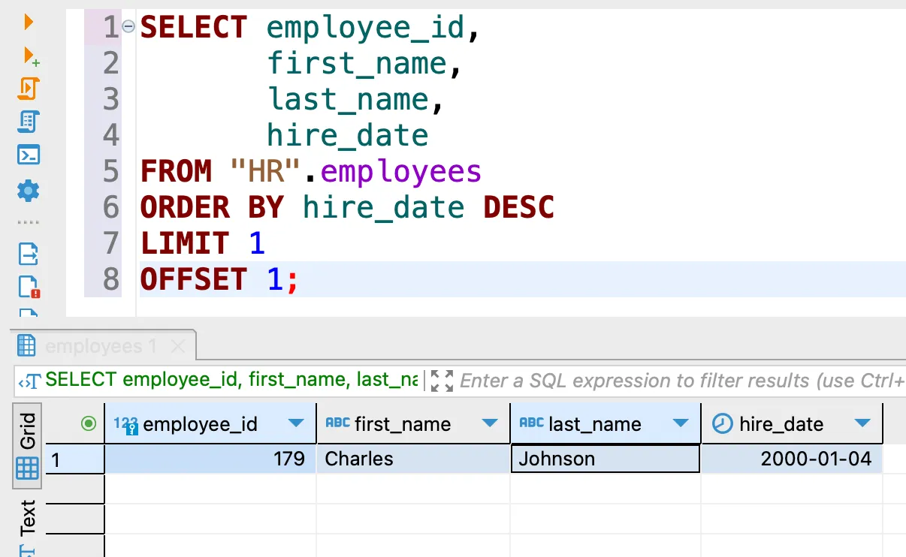
</div>

**LIMIT** можна використовувати для швидкого ознайомлення з даними або
вибору екстремумів, формування **«топ»** результатів тощо.

Ми ознайомилися з деякими базовими операторами, які дозволяють вибирати
дані, накладати умови й сортувати їх.
