****<div style="text-align: center; font-size: 24px;">Вступ</div>****

Ласкаво просимо на нове заняття, під час якого ми продовжимо
ознайомлюватися з інструментами **SQL**. Окрім того, поринемо в
дивовижний світ реклами з погляду аналітика даних.

-   Навчимося використовувати логічні оператори SQL, щоб за допомогою
    них здійснювати різні обчислення.

-   Дізнаємося, як змінювати типи даних в **SQL** за допомогою
    оператора **CAST** (практично, вправність рук і ніякої магії).

-   Розглянемо оператор **GROUP BY** і навчимося групувати дані та
    виконувати операції агрегації, такі як сумування, підрахунок,
    середнє значення тощо, для отримання загальних показників та
    зведеної інформації.

****<div style="text-align: center; font-size: 24px;">Логічні оператори SQL</div>****

Ми вже трішки познайомилися з оператором **WHERE**. Зараз спробуємо
показати тобі всі можливі логічні оператори, які можна застосувати під
час фільтрації даних.

**Логічні оператори** **SQL** --- це потужний інструмент, який дозволяє
здійснювати складні та гнучкі запити до бази даних. Вони
використовуються для комбінування умов і встановлення логічних зв\'язків
між ними.

Використання **логічних операторів** дозволяє виконувати пошук і
фільтрацію даних на основі різних умов. Це значно розширює можливості
аналізу й отримання необхідної інформації з бази даних, а також
допомагає встановити зв\'язки між різними умовами та керувати логікою
пошуку даних.

📎 *Логічний оператор дозволяє перевірити істинність умови. Подібно до
оператора порівняння, логічний оператор повертає значення **true,
false** або **unknown**.*

Наступна таблиця ілюструє логічні оператори **SQL**:

<div align="center">
  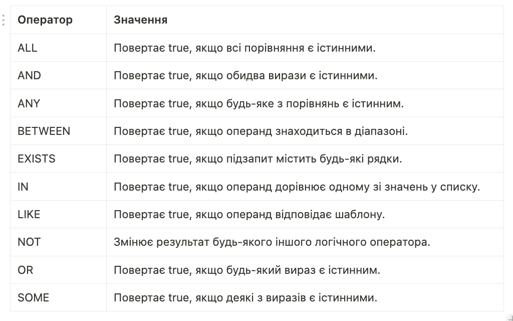
</div>

Попри великий перелік, сьогодні ми розглянемо лише певні оператори з
наведеного списку.

****<div style="text-align: center; font-size: 24px;">Оператор AND</div>****

Оператор **AND** повертає **true**, якщо обидва вирази мають
значення **true**.

Повертаємося до нашої HR-схеми та прикладів

У прикладі нижче відображено всіх працівників, зарплата яких **перевищує
5000** і **є меншою за 7000**:


```sql
SELECT first_name
         , last_name
         , salary
FROM HR.employees
WHERE salary > 5000
    AND salary < 7000
ORDER BY salary;
```

<div align="center">
  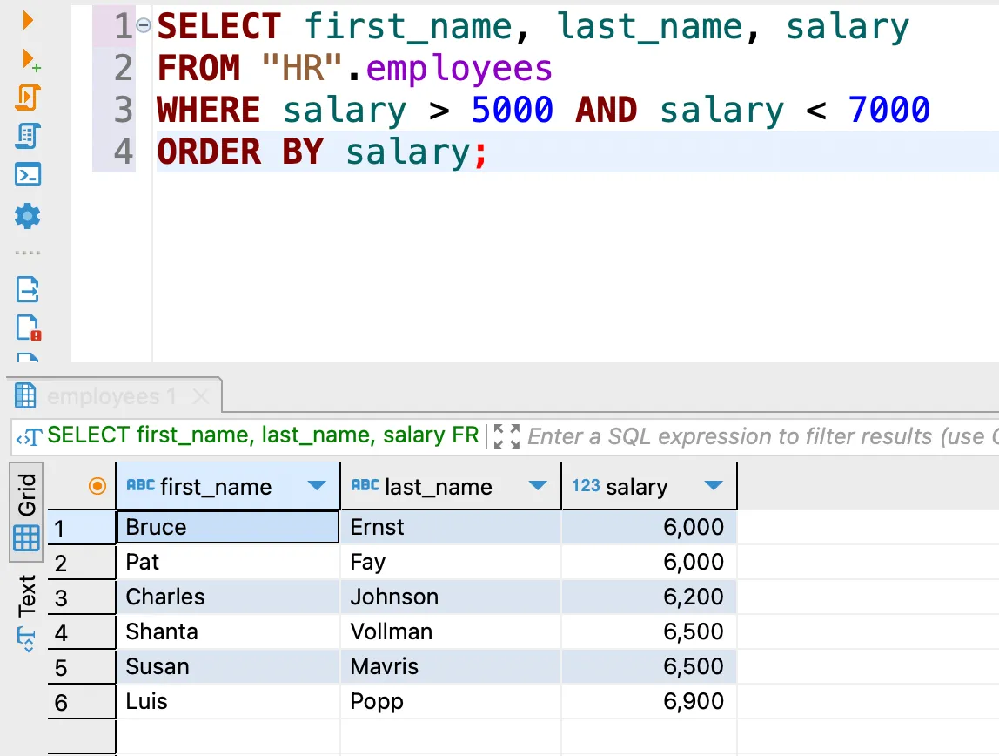
</div>

****<div style="text-align: center; font-size: 24px;">Оператор OR</div>****

Оператор **OR** повертає значення **true**, якщо хоча б один вираз має
значення **true**.

Наприклад, наступний оператор знаходить працівників із зарплатою
**7000** або **8000**:

```sql
SELECT first_name
     , last_name
     , salary
FROM HR.employees
WHERE salary = 7000
   OR salary = 8000
ORDER BY salary;
```

<div align="center">
  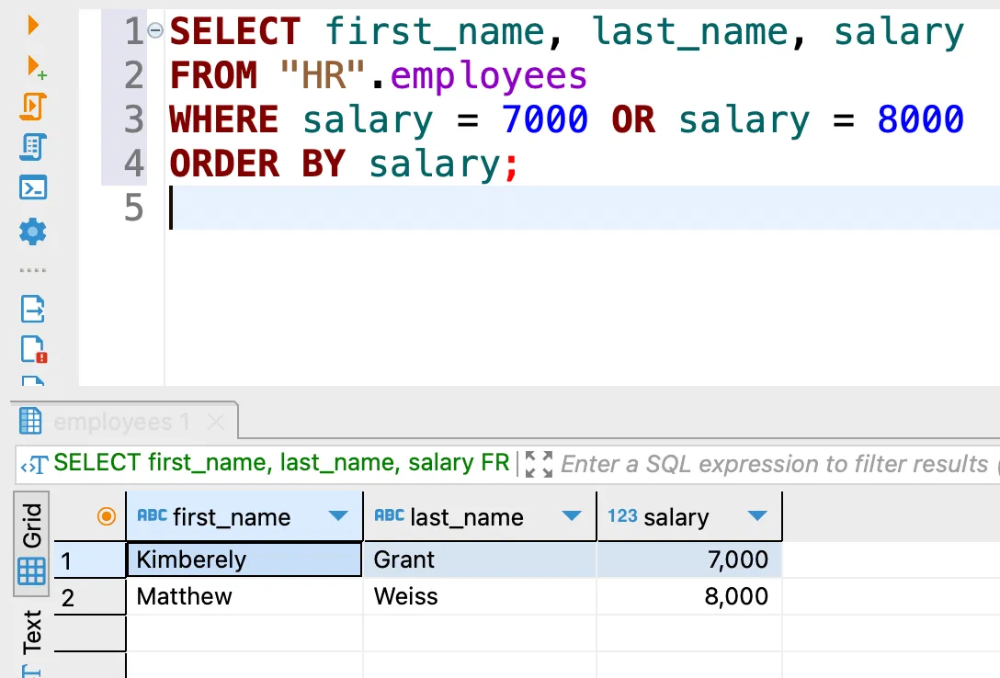
</div>

**<div style="text-align: center; font-size: 24px;">Оператор IS NULL</div>**

Оператор **IS NULL** порівнює значення з **NULL** значенням (тобто
пустим, відсутнім значенням) і повертає **true**, якщо порівнюване
значення нульове (пусте значення); в іншому випадку повертає **false**.

Наприклад, наступний оператор знаходить усіх співробітників, які не
мають номера телефону:

```sql
SELECT first_name
     , last_name
     , phone_number
FROM HR.employees
WHERE phone_number IS NULL
ORDER BY first_name, last_name;
```

<div align="center">
  
</div>

****<div style="text-align: center; font-size: 24px;">Оператор BETWEEN</div>****

Оператор **BETWEEN** шукає значення, які знаходяться в межах заданого
діапазону, враховуючи мінімальне та максимальне значення. Зауваж, що
мінімальне та максимальне значення включені як частина умовного набору.

Наприклад, наступний оператор знаходить усіх працівників із
зарплатою від **9000** до **12 000**.

```sql
SELECT first_name
     , last_name
     , salary
FROM HR.employees
WHERE salary BETWEEN 9000 AND 12000
ORDER BY salary;
```

<div align="center">
  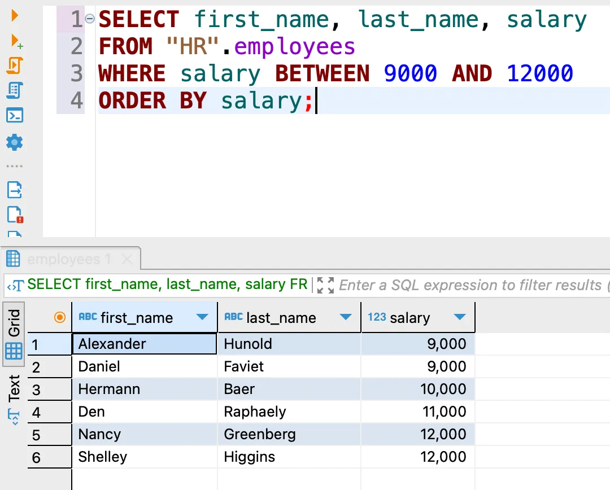
</div>

****<div style="text-align: center; font-size: 24px;">Оператор IN</div>****

Оператор **IN** порівнює значення зі списком заданих значень.
Оператор **IN** повертає **істину** (**true**), якщо порівнюване
значення збігається принаймні з одним значенням у списку; в іншому
випадку повертає **false**.

Наступний оператор знаходить усіх співробітників, які працюють у відділі
з ідентифікатором 8 або 9.

```sql
SELECT first_name
     , last_name
     , department_id
FROM HR.employees
    WHERE department_id IN (8, 9)
ORDER BY department_id;
```

<div align="center">
  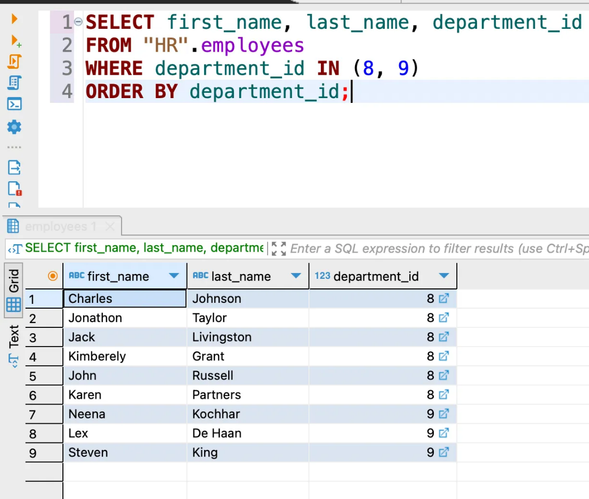
</div>

****<div style="text-align: center; font-size: 24px;">Оператор LIKE</div>****

Оператор **LIKE** порівнює значення зі схожими значеннями за допомогою
оператора підстановки. В SQL існують два символи підстановки, які
використовуються в поєднанні з оператором **LIKE**:

-   Знак відсотка ( **%** ) означає відсутність будь-якої
    кількості символів замість себе.

-   Знак підкреслення ( **_** ) позначає відсутність одного символу
    замість себе.

Наступний оператор знаходить усіх співробітників, ім'я яких починається
з рядка **Jo**:


```sql
SELECT employee_id
     , first_name
     , last_name
FROM HR.employees
    WHERE first_name LIKE 'Jo%'
ORDER BY first_name;
```

<div align="center">
  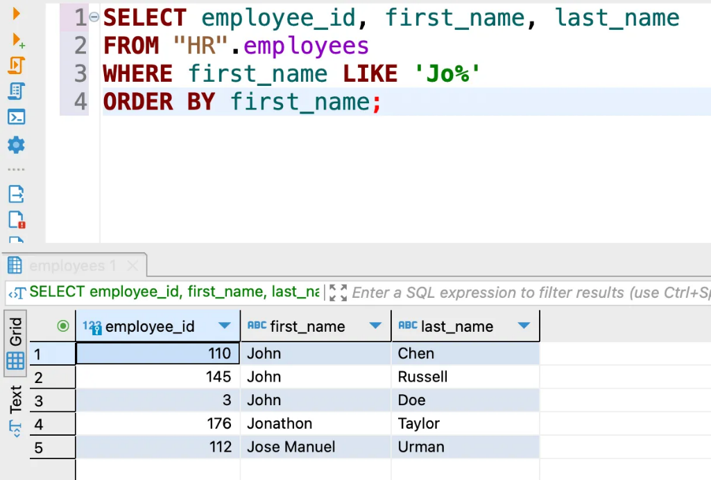
</div>

*📎 **Логічні оператори** також використовуються для створення складних
запитів, які містять різні умови сортування та групування даних. Вони
дозволяють виконувати велику кількість операцій з даними, спрощуючи
аналіз та отримання необхідної інформації.*

Наявність **логічних операторів** у SQL робить цю мову гнучкою та
потужною для виконання складних запитів до бази даних. Вони дозволяють
точно визначити умови пошуку, фільтрації та сортування даних, що є
важливим для отримання зрозумілих і цільових результатів.

Високий рівень гнучкості й можливостей, що надають **логічні оператори**
SQL, робить їх незамінними для створення складних запитів та оптимізації
роботи з базами даних. Використання цих операторів вимагає вміння
правильно створювати й комбінувати умови, що дозволяє ефективно та точно
обробляти дані.

Таким чином, знання **логічних операторів** SQL є важливим для
аналітиків і всіх, хто працює з базами даних. Вони дозволяють
здійснювати гнучкий і точний пошук, фільтрацію та обробку даних, що
сприяє ефективній і продуктивній роботі з інформацією.

****<div style="text-align: center; font-size: 24px;">Приведення типів (оператор CAST)</div>****

**Приведення типів**, також відоме як оператор **CAST**, є важливою
функціональністю SQL для дата-аналітика і для роботи з базами даних. Цей
оператор дозволяє змінювати типи даних стовпців або значень, що
уможливлює виконання різноманітних операцій та обробку даних.

Зміна типів даних у базі даних може бути необхідною з різних причин.

Наприклад:

1.  **Відповідність даних**. Зміна типу даних може бути необхідною для
    забезпечення відповідності даних збереженим правилам або обмеженням.
    Наприклад, якщо стовпець містить числові дані, але він визначений як
    рядок, може виникнути несумісність при виконанні арифметичних
    операцій. Зміна типу даних дозволяє забезпечити правильну обробку та
    збереження даних.

2.  **Оптимізація збереження й обробки**. Вибір правильного типу даних
    може позитивно вплинути на продуктивність та ефективність бази
    даних. Наприклад, використання більш ефективних типів даних для
    зберігання чисел може зменшити обсяг пам\'яті, який використовується
    базою даних і прискорити виконання запитів.

3.  **Аналіз даних**. Зміна типу даних може бути цінним інструментом для
    аналізу даних. Наприклад, перетворення рядків із датами на тип дати
    дозволяє виконувати операції порівняння, агрегації та фільтрації
    даних за датами. Це важливо для виявлення тенденцій, розрахунку
    метрик і виконання інших аналітичних завдань.

4.  **Інтеграція з іншими системами**. При інтеграції бази даних з
    іншими системами може виникати потреба у зміні типу даних для
    відповідності вимогам цих систем. Наприклад, якщо дані з бази даних
    передаються до зовнішньої системи, то може знадобитися виконати
    конвертацію типів даних для правильного сприйняття й обробки цими
    системами.

****<div style="text-align: center; font-size: 24px;">Аспекти оператора CAST</div>****

Приведення типів має такі важливі аспекти:

-   **Конвертація даних.** Оператор CAST дозволяє конвертувати значення
    з одного типу в інший. Наприклад, ти можеш перетворити рядок на
    число, дату на рядок або навпаки. Це корисно, коли потрібно
    здійснити обчислення чи порівняння між різними типами даних.

-   **Форматування дати та часу.** Приведення типів дозволяє змінювати
    формат дати та часу. Ти можеш перетворити дату в різні формати, такі
    як рік-місяць-день, місяць/день/рік або інші, щоб відповідати
    вимогам аналізу даних або зручності відображення.

-   **Агрегація та порівняння даних.** За допомогою оператора CAST можна
    здійснювати агрегацію та порівнювати дані з різних типів. Наприклад,
    ти можеш об\'єднати значення з різних стовпців або таблиць, які
    мають різні типи даних, для подальшого аналізу й обробки.

-   **Умовні операції**. Приведення типів дозволяє використовувати
    умовні операції, такі як CASE, для обробки даних різних типів. Ти
    можеш задавати умови на основі типів даних і виконувати відповідні
    дії залежно від умов.

****<div style="text-align: center; font-size: 24px;">Типи даних для перетворення</div>****

Для того щоб правильно перетворювати один тип даних в інший, варто добре
розібратися, які взагалі типи даних існують.

**PostgreSQL** підтримує такі типи даних:

1.  Логічні типи. **PostgreSQL** має підтримку логічних типів даних
    --- **BOOLEAN**. Цей тип може мати два
    значення: **TRUE** або **FALSE**. Він використовується для
    зберігання булевих значень, які вказують на істинність або хибність
    певних висловлювань.

2.  Символьні типи. **PostgreSQL** надає кілька типів для зберігання
    символьних даних. Наприклад:

-   **CHAR** --- фіксована довжина рядка.

-   **VARCHAR** --- рядок змінної довжини.

-   **TEXT** --- довгий рядок без обмежень довжини.

Символьні типи дозволяють зберігати тексти різної довжини й
використовуються для зберігання та обробки текстової інформації.

3.  Числові типи. **PostgreSQL** підтримує різні типи чисел, зокрема:

-   **INTEGER** --- цілі числа.

-   **FLOAT, REAL** --- числа з плаваючою комою.

-   **NUMERIC** --- числа з фіксованою точністю.

Ці типи дозволяють зберігати й виконувати різноманітні операції над
числовими значеннями, які використовуються в математичних розрахунках та
аналітиці.

4.  Типи дати і часу. **PostgreSQL** має типи даних для зберігання дати,
    часу та їх комбінацій. Деякі з них містять:

-   **DATE** --- дата без урахування часу.

-   **TIME** --- час без урахування дати.

-   **TIMESTAMP** --- комбінація дати й часу.

Ці типи дозволяють зберігати й опрацьовувати дати та час у різних
форматах.

\- **UUID (Universally Unique Identifier): PostgreSQL** також підтримує
тип UUID, який використовується для зберігання **універсальних
унікальних ідентифікаторів (Universally Unique Identifier). UUID** ---
це **128-бітний** числовий ідентифікатор, який гарантує унікальність
навіть при генерації на різних пристроях і в різний час.

Це не весь перелік типів, але в більшості наших задач будемо
використовувати саме його. А якщо нам трапиться незнайомий тип, ми легко
зможемо знайти потрібну інформацію
в [*[документації]{.underline}*](https://www.postgresql.org/docs/current/datatype.html).

****<div style="text-align: center; font-size: 24px;">Синтаксис і приклади оператора CAST</div>****

Давай розглянемо синтаксис оператора **CAST**:

```sql
CAST (expression AS target_type);
```

У цьому синтаксисі:

-   **expression** --- вираз або значення, яке потрібно привести до
    нового типу даних.

-   **target_type** --- це новий тип даних, до якого потрібно привести
    значення.

Розглянемо приклади:

Наступний оператор перетворює рядкову константу на ціле число:

```
SELECT CAST('100' AS INTEGER);
```
У цьому прикладі використовується CAST, щоб перетворити рядок на дату:

```sql
SELECT  CAST('2015-01-01' AS DATE)
      , CAST('01-OCT-2015' AS DATE);
```

У цьому прикладі використовується CAST, щоб перетворити рядок
«**true**», «**T**» на **true**, а «**false**», «**F**» на **false**:


```sql
SELECT CAST('true' AS BOOLEAN)
     , CAST('false' AS BOOLEAN)
     , CAST('T' AS BOOLEAN)
     , CAST('F' AS BOOLEAN);
```


****<div style="text-align: center; font-size: 24px;">Iнший оператор PostgreSQL приведення типу даних (::)</div>****

Окрім синтаксису оператора **CAST**, ти можеш використовувати такий
синтаксис для перетворення значення з одного типу на
інший: **(::) expression::type**

expression::type

У цьому синтаксисі:

-   **::** --- оператор перетворення значення з одного типу на iнший.

-   **expression** --- вираз або значення, яке потрібно привести до
    нового типу даних.

-   **type** --- це новий тип даних, до якого потрібно привести
    значення.

Наприклад, у першому рядку запиту **SELECT** ми перетворюємо рядкове
значення «**100**» на числове значення **100**.

А у другому рядку запиту --- перетворюємо текстову стрічку у
формат дати.

```sql
SELECT '100'::INTEGER
, '01-OCT-2015'::DATE;
```

<div align="center">
  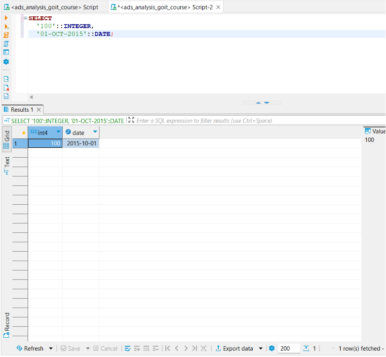
</div>

У цьому прикладі використовується оператор приведення **(::)** для
перетворення рядка на **мітку часу**:

```sql
SELECT '2019-06-15 14:30:20'::timestamp;
```
Отже, **зміна типів даних** дозволяє адаптувати їх до потреб аналітики
та забезпечити правильну обробку у базі даних. Наприклад, приведення
типів може бути корисним для обчислення, злиття, порівняння даних,
зберігання їх у певному форматі чи для виконання обчислювальних
операцій.

Знання **оператора CAST** і типiв даних дозволяє зручно й ефективно
маніпулювати даними в SQL для отримання необхідної інформації. Уміння
правильно використовувати оператор **CAST** **допомагає забезпечити
точність і коректність аналізу даних та розрахунків**.\
\
Існує ще притаманна тільки **T-SQL** функція -
[**convert**](https://learn.microsoft.com/ru-ru/sql/t-sql/functions/cast-and-convert-transact-sql?view=sql-server-ver17)

****<div style="text-align: center; font-size: 24px;">Агрегація даних у SQL</div>****

Ось зараз буде справді потужна тема! Ми розберемо, як генерувати зведені
(агреговані) таблиці та застосовувати агрегатні функції до цих таблиць.

📌 ***Агрегація даних** у SQL відіграє ключову роль в обробці й аналізі
великих обсягів інформації. Цей процес дозволяє сумувати, групувати,
знаходити середні значення, мінімуми, максимуми та інші агрегатні
функції в базі даних.

Уяви, що ти маєш велику таблицю з даними про продажі в
інтернет-магазині. Кожен рядок представляє окреме замовлення з
інформацією про товар, кількість, ціну та клієнта. Однак, для прийняття
стратегічних рішень і розуміння загальної картини нам потрібна
агрегована інформація, така як загальний дохід, найпопулярніші товари,
середній чек клієнта та інші показники.

**Агрегація даних** дозволяє нам зменшити обсяг інформації до керованих
та інформативних значень. Вона допомагає виявляти тенденції,
ідентифікувати ключові метрики та приймати обґрунтовані бізнес-рішення.
Зрештою, агрегація даних у SQL допомагає знайти відповіді на важливі
запитання й отримати цінну інформацію з океану даних.

**<div style="text-align: center; font-size: 24px;">Процес агрегації даних у SQL</div>**

Агрегація даних у SQL реалізовується за допомогою
спеціальних **агрегатних функцій**, які дозволяють сумувати, знаходити
середні значення та виконувати інші операції з групами даних.

Процес агрегації даних у SQL зазвичай містить наступні кроки:

-   **Вибірка даних.** Із бази даних вибираються потрібні таблиці та
    стовпці, з яких буде проводитись агрегація.

-   **Групування даних**. За допомогою оператора **GROUP BY** дані
    групуються за певним стовпцем або набором стовпців. Це дозволяє
    розділити дані на підгрупи для подальшої агрегації.

-   **Застосування агрегатних функцій.** За допомогою агрегатних
    функцій, таких як **SUM, COUNT, AVG, MIN, MAX** та інших,
    виконуються операції над групами даних. Наприклад, можна підрахувати
    суму значень у стовпці, підрахувати кількість записів у групі або
    знайти середнє значення.

-   **Фільтрація даних**. Для додаткової фільтрації даних можна
    використовувати ключове слово **HAVING**, яке застосовується після
    групування й агрегації.

-   Відображення результатів. Отримані результати агрегації можуть бути
    виведені на екран, збережені в нову таблицю чи використані для
    подальших обчислень або запитів.

****<div style="text-align: center; font-size: 24px;">Оператор GROUP BY</div>****

📌 ***GROUP BY** (групування за ознакою) --- не обов'язковий оператор
в SELECT.*

Оператор **GROUP BY** дозволяє групувати рядки на основі значень одного
або кількох стовпців. Він повертає один рядок для кожної групи.

Нижче показано базовий синтаксис оператора **GROUP BY:**
```sql
SELECT column1
     , column2
     , aggregate_function(column3)
FROM table_name
GROUP BY column1
        ,column2;
```
А ось як працює **GROUP BY** на прикладi таблицi з фруктами:

<div align="center">
  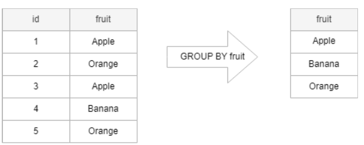
</div>

Таблиця зліва має два стовпці: **id** та **fruit**. Коли ти
застосовуєш **GROUP BY** до стовпця **fruit**, він повертає набір
результатів, який містить унікальні значення зі стовпця **fruit**:

```sql
SELECT fruit
FROM sample_table
GROUP BY fruit;
```

На практиці часто використовується **GROUP BY** з функціями агрегації,
такими як **MIN, MAX, AVG, SUM** або **COUNT**, для обчислення
показників, які надають інформацію для кожної групи.

Наприклад, нижче показано, як **GROUP BY** працює з **COUNT** (функція
для підрахунку кількості даних одного типу):

<div align="center">
  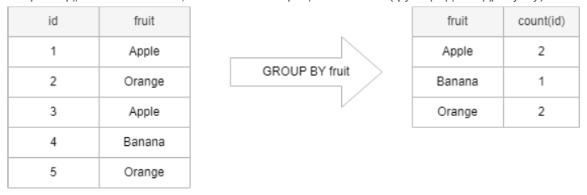
</div>

У цьому прикладі групуємо рядки за значеннями стовпця **fruit** і
застосовуємо **COUNT** до стовпця **id**. Набір результатів містить
унікальні значення стовпців фруктів і кількість відповідних рядків.
```sql
SELECT fruit
     , count(id)
FROM sample_table
GROUP BY fruit;
```

Стовпці, які з'являються у **GROUP BY,** називаються стовпцями
групування. Якщо стовпець групування містить значення **NULL**, усі
значення **NULL** підсумовуються в одну групу, оскільки пункт **GROUP**
**BY** вважає всі значення **NULL** рівними.

У наступному прикладі використовується **GROUP BY** для групування
значень у стовпці **department_id** у таблиці **employees**:

```sql
SELECT department_id
FROM HR.employees
GROUP BY department_id;
```
<div align="center">
  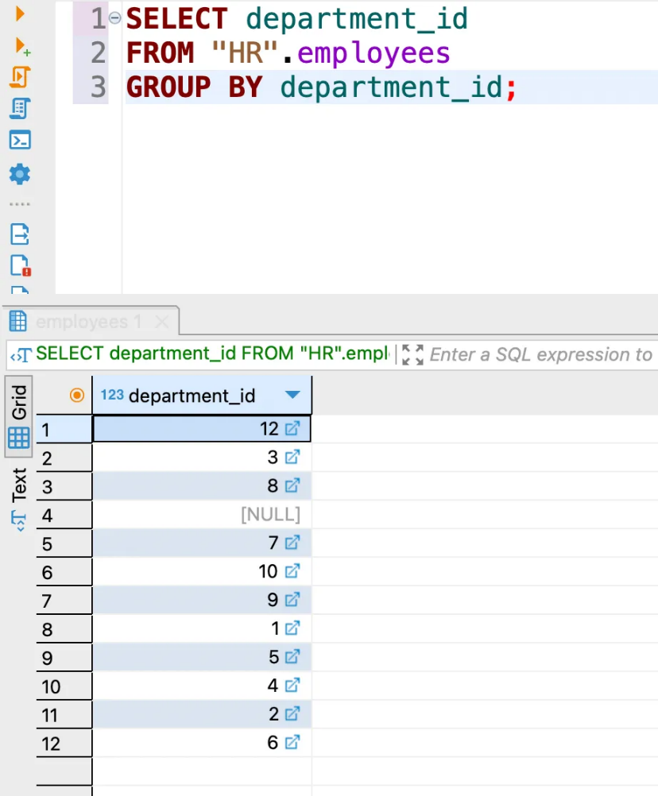
</div>

У цьому прикладі:

-   По-перше, оператор **SELECT** повертає всі значення зі
    стовпця **department_id** таблиці **employees**.

-   По-друге, оператор **GROUP BY** об'єднує всі значення у групи.

Стовпець **department_id** таблиці **employees** містить 40 рядків,
зокрема повторювані значення **department_id**. Однак **GROUP
BY** групує ці значення.

Без функції агрегації **GROUP BY** поводиться як **DISTINCT**:
```sql
SELECT DISTINCT department_id
FROM HR.employees
GROUP BY department_id;
```

Оператор **DISTINCT** використовується в мові запитів для видалення
повторюваних значень із результатів запиту. Цей оператор дозволяє
отримати унікальні значення з певного стовпця або комбінації стовпців у
таблиці. Коли оператор **DISTINCT** застосовується до запиту, він
видаляє дублікати й повертає тільки унікальні значення. Це дуже корисний
оператор, коли потрібно провести аналіз даних і отримати лише унікальні
записи з бази даних.

**GROUP BY** буде більш корисним, якщо ти використовуєш його з функцією
агрегації.

Наприклад, у наступному операторі використовується **GROUP
BY** з **COUNT** для підрахунку кількості співробітників за відділами:
```sql
SELECT department_id
     , COUNT(employee_id) AS headcount
FROM HR.employees
GROUP BY department_id;
```

<div align="center">
  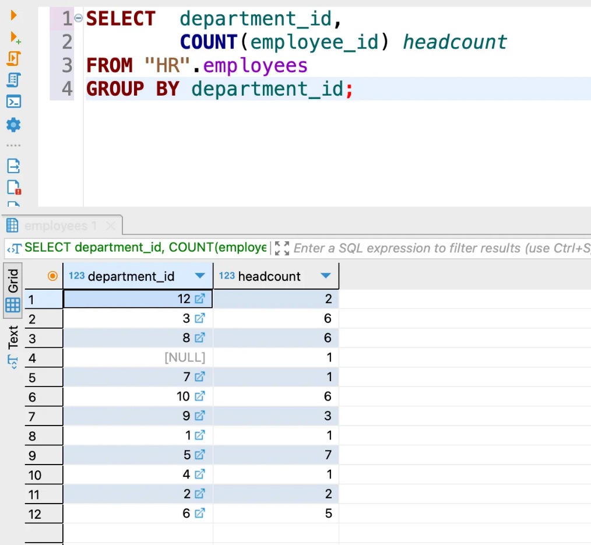
</div>

Як це працює:

-   По-перше, **GROUP BY** групує рядки в таблиці «**employees**» за
    ідентифікатором відділу.

-   По-друге, **COUNT(employee_id)** повертає кількість значень
    ідентифікаторів співробітників у кожній групі.

****<div style="text-align: center; font-size: 24px;">Функція AVG</div>****

📌 **Функція AVG** --- це функція агрегації, яка обчислює середнє
значення набору.

Нижче наведено синтаксис функції **AVG** (у квадратних дужках вказано
опціональні параметри):
```sql
AVG ([ALL | DISTINCT] expression)
```
Розглянемо два приклади застосування цієї функції.

Приклад 1. Функція **AVG** без **GROUP BY**

Щоб обчислити середню зарплату всіх працівників, застосовуємо
функцію AVG до стовпця зарплати таким чином:

```sql
SELECT AVG(salary)
FROM HR.employees;
```

<div align="center">
  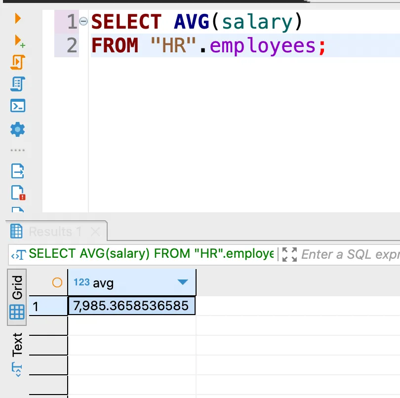
</div>

Приклад 2. Функція **AVG** із **GROUP BY**

Для обчислення середніх значень груп ми використовуємо
функцію **AVG** із **GROUP BY**. Наприклад, наступний оператор повертає
відділи та середню зарплату працівників у кожному відділі.

```sql
SELECT department_id
, AVG(salary)
FROM HR.employees
GROUP BY department_id;
```

<div align="center">
  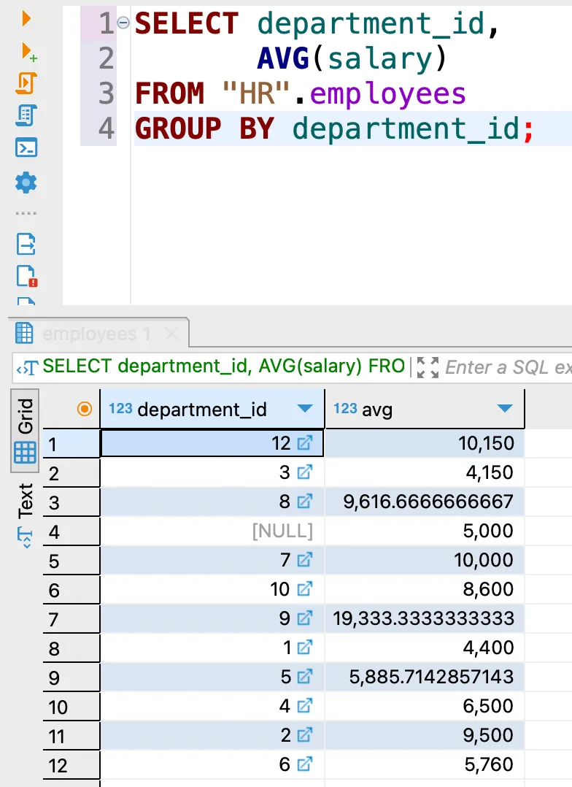
</div>

****<div style="text-align: center; font-size: 24px;">Функція COUNT</div>****

**📌 Функція COUNT** --- це функція агрегації, яка повертає кількість
рядків, повернутих запитом.

Ти можеш використовувати **COUNT** в операторі **SELECT**, щоб отримати
кількість співробітників, кількість співробітників у кожному відділі,
кількість співробітників, які виконують певну роботу тощо.

Нижче наведено синтаксис функції **COUNT** у **SQL**:
```sql
COUNT ([ALL | DISTINCT] expression);
```
Результат функції COUNT залежить від аргументу, який ти їй передаєш.

-   Ключове слово **ALL** матиме повторювані значення до результату.
    Наприклад, якщо в тебе є група (1, 2, 3, 3, 4, 4) і застосована
    функція **COUNT**, результатом буде 6. За замовчуванням
    функція **COUNT** використовує ALL незалежно від того, вказуєш ти
    його чи ні.

-   Ключове слово **DISTINCT** враховує лише унікальні значення.
    Наприклад, **COUNT** із ключовим словом **DISTINCT** повертає 4,
    якщо застосувати її до групи (1, 2, 3, 3, 4, 4).

-   Функція **COUNT(*)** повертає кількість рядків у таблиці. Вона
    підраховує повторювані рядки та рядки, які містять нульові значення.

Приклад **COUNT** із **GROUP** **BY**

У наступному прикладі використовується **COUNT** із **GROUP BY**, щоб
знайти кількість співробітників для кожного відділу:

```sql
SELECT department_id
      ,COUNT(*)
FROM HR.employees
GROUP BY department_id;
```
<div align="center">
  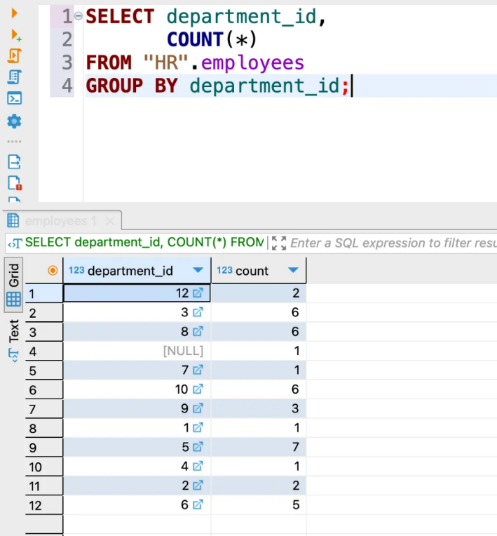
</div>

У наступному прикладі використовується **COUNT** із **DISTINCT** для
отримання кількості менеджерів:

```sql
SELECT COUNT(DISTINCT manager_id)
FROM HR.employees;
```

*💡 Який результат у тебе вийшов?*

У нас вийшло 10. Спробуй зробити самостійно та перевір.

Оператор **SELECT DISTINCT** використовується для повернення лише різних
(унікальних) значень.

Усередині таблиці стовпець часто містить багато повторюваних значень.
Іноді потрібно лише перерахувати унікальні значення.

****<div style="text-align: center; font-size: 24px;">Функції MAX і MIN</div>****

*📌 SQL надає функції **MAX і MIN**, які дозволяють знайти максимальне
та мінімальне значення відповідно в наборі даних.*

Нижче наведено синтаксис функцій **MAX** і **MIN**.
```sql
MAX(expression)
MIN(expression)
```

Функції **MAX/MIN** ігнорують значення **NULL**.

На відміну від функцій **SUM, COUNT і AVG**, параметр **DISTINCT** не
можна застосувати до функцій **MAX/MIN.**

Давай розглянемо наступний приклад, де
оператор **SELECT** повертає найвищу (максимальну) зарплату працівників
у таблиці **employees**.
```sql
SELECT MAX(salary)
FROM HR.employees;
```

<div align="center">
  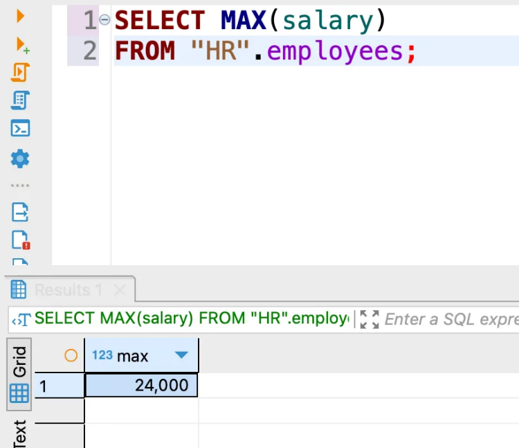
</div>

****<div style="text-align: center; font-size: 24px;">Приклад MAX/MIN із GROUP BY</div>****

Зазвичай ми використовуємо функцію **MAX/MIN** у поєднанні з **GROUP
BY**, щоб знайти максимальне/мiнiмальне значення для групи.

Наприклад, ми можемо використати функцію **MAX**, щоб знайти найвищу
зарплату працівника в кожному відділі, як показано нижче:

```sql
SELECT department_id
      ,MAX(salary)
FROM HR.employees
GROUP BY department_id;
```

<div align="center">
  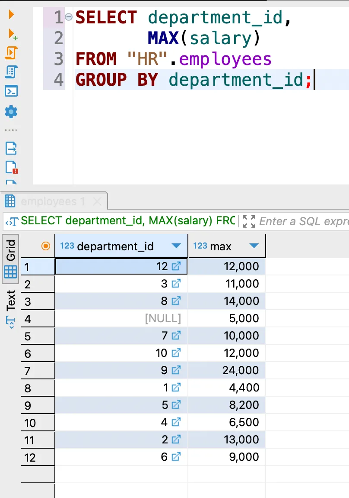
</div>

****<div style="text-align: center; font-size: 24px;">Функція SUM</div>****

📌 *Функція **SUM** --- це функція агрегації, яка повертає суму всіх чи
окремих значень. Ми можемо застосувати функцію **SUM** лише до числового
стовпця.*

Нижче наведено синтаксис функції **SUM**:
```sql
SUM ([ALL | DISTINCT] expression);
```

Оператор **ALL** дозволяє застосувати агрегат до всіх значень. Функція
**SUM** за замовчуванням використовує оператор **ALL**. Наприклад, якщо
в тебе є набір (1,2,3,3,NULL), функція **SUM** повертає 9. Зауваж, що
функція **SUM** ігнорує значення **NULL**.

Щоб обчислити суму унікальних значень, використовуємо
оператор **DISTINCT**. Наприклад, **SUM**(**DISTINCT**) набору (1,2,3,3,NULL) дорівнює 6**.**

****<div style="text-align: center; font-size: 24px;">Приклад SUM</div>****

Щоб отримати суму зарплат усіх співробітників, ми застосуємо
функцію **SUM** до стовпця зарплати, як у наступному запиті:

```sql
SELECT SUM(salary)
FROM HR.employees;
```

<div align="center">
  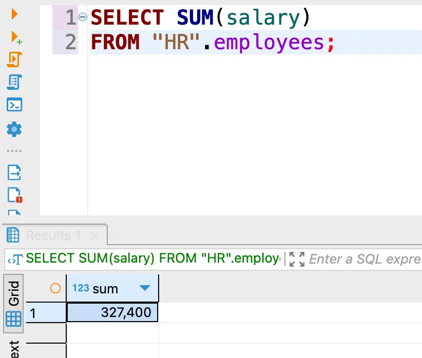
</div>

****<div style="text-align: center; font-size: 24px;">Приклад SUM із GROUP BY</div>****

Ми часто використовуємо функцію **SUM** у поєднанні **з GROUP BY**, щоб
обчислити суми для кожної групи.

Наприклад, щоб обчислити суму зарплат співробітників для кожного
відділу, ми застосовуємо функцію **SUM** до стовпця **salary** та
групуємо рядки за стовпцями **department_id**:

```sql
SELECT  department_id
      , SUM(salary)
FROM HR.employees
GROUP BY department_id
```

<div align="center">
  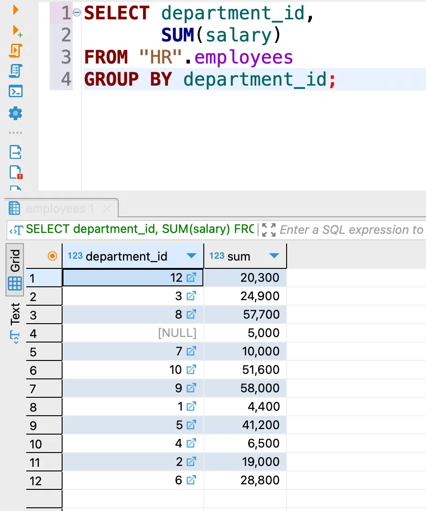
</div>

Отже, ми розібрали основні функції агрегації.

****<div style="text-align: center; font-size: 24px;">Використання HAVING для фільтрації агрегованих даних</div>****

При групуванні даних у **SQL** ми можемо використовувати
оператор **HAVING** для того, щоб фільтрувати дані на рівні агрегації.

**HAVING** можна використовувати як **WHERE**, якщо потрібна фільтрація
за ключами, які застосовуються у **GROUP BY**, або використовувати разом
з функціями агрегації.

Наприклад, ми можемо відфільтрувати департаменти за їхніми
ідентифікаторами:
```sql
SELECT department_id
, SUM(salary)
FROM HR.employees
GROUP BY department_id
HAVING department_id <= 5;
```
<div align="center">
  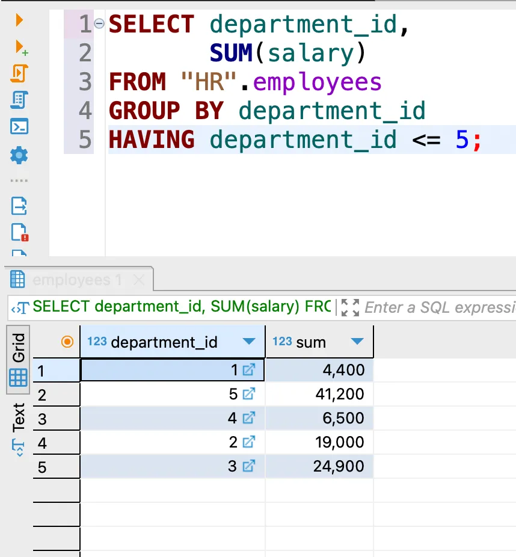
</div>

Або за сумою зарплат:
```sql
SELECT department_id
     , SUM(salary)
FROM HR.employees
GROUP BY department_id
HAVING SUM(salary) > 5000;
```

<div align="center">
  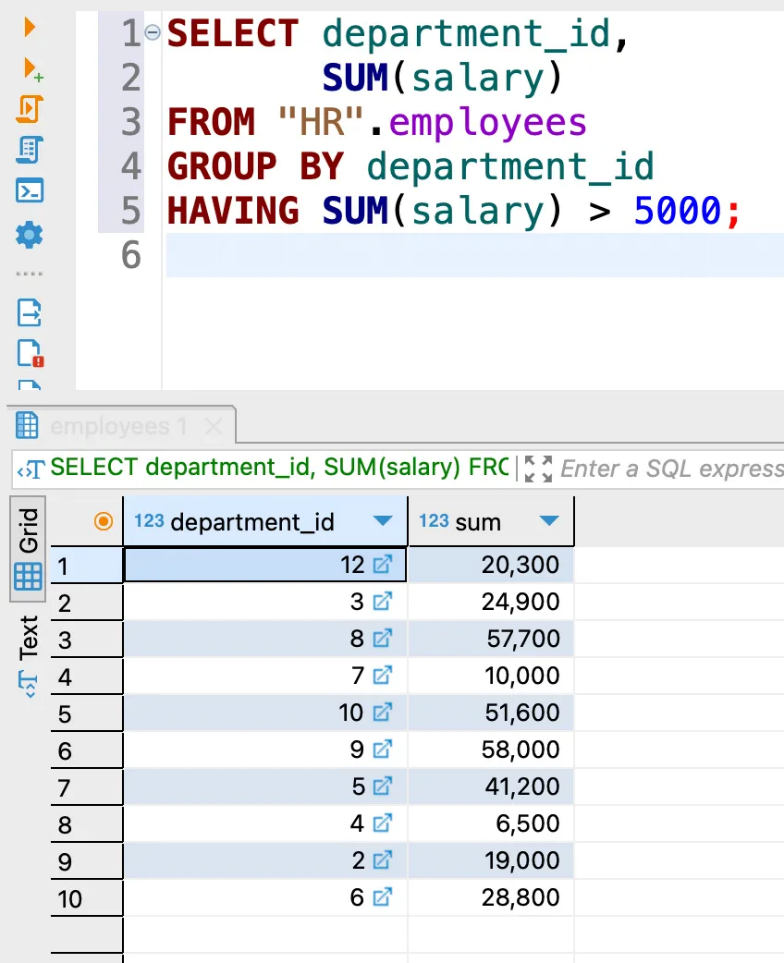
</div>

Результат, який ми отримаємо в першому випадку, не відрізнятиметься від
результату, який ми отримали б, використовуючи WHERE. Проте,
відрізнятиметься сам процес: фільтрація за допомогою WHERE відбувається
до групування й агрегації, а за допомогою **HAVING** --- уже після.

**<div style="text-align: font-size: 24px;">Підіб'ємо підсумки щодо теми агрегації даних:</div>**

-   **Агрегація даних у SQL** дозволяє сумувати, підраховувати,
    знаходити середні значення та виконувати інші **операції з групами
    даних**.

-   Операції агрегації виконуються за допомогою агрегатних функцій,
    таких як **SUM, COUNT, AVG, MIN, MAX** та інших.

-   Групування даних за допомогою оператора **GROUP BY** дозволяє
    розбити дані на підгрупи для агрегації.

-   Агрегація даних корисна для аналізу великих обсягів інформації та
    отримання узагальненої інформації.

-   Результати агрегації можуть бути виведені на екран, збережені в нову
    таблицю або використані для подальших обчислень і запитів.

-   **Агрегація даних у SQL є важливим інструментом для сумування й
    аналізу даних**, а також для прийняття обґрунтованих рішень на
    основі цих даних.

Загалом агрегація даних у **SQL** дозволяє перетворювати й
організовувати великі обсяги інформації, роблячи їх зручними для аналізу
та використання в бізнес-контексті.
