**Language:** English | [Українська](../../i18n/uk/course/lessons/lesson_2_bazovi_funkcii_sql.md)

<h2 align="center">Introduction</h2>

Welcome to a new session where we will continue
get familiar with **SQL** tools. 
the wonderful world of advertising from the perspective of a data analyst.

- Let's learn to use logical SQL statements to help
them to perform various calculations.

- We learn how to change data types in **SQL** using
operator **CAST** (basically sleight of hand and no magic).

- Consider the **GROUP BY** operator and learn how to group data and
perform aggregation operations such as summation, counting,
average value, etc., to obtain overall indicators and
summary information.

<h2 align="center">Logical SQL statements</h2>

We've already gotten a little familiar with the **WHERE** operator. 
show you all the possible logical operators that can be applied under
data filtering time.

**Boolean statements** **SQL** -- is a powerful tool that allows
perform complex and flexible queries to the database. 
are used to combine conditions and establish logical connections
between them

The use of **logical operators** allows you to search and
data filtering based on various conditions. 
analysis and obtaining the necessary information from the database, as well as
helps establish relationships between different conditions and manage logic
data search.

📎 *The logical operator allows you to check the truth of the condition. 
comparison operator, logical operator returns **true,
false** or **unknown**.*

The following table illustrates the **SQL** logical statements:

<div align="center">
  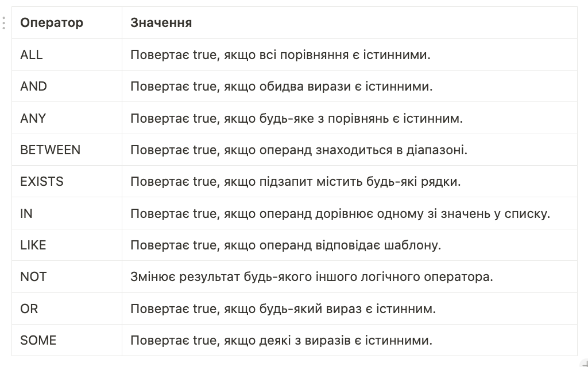
</div>

Despite the large list, today we will consider only certain operators with
of the given list.

<h2 align="center">AND operator</h2>

The **AND** operator returns **true** if both expressions are true
the value is **true**.

Let's go back to our HR diagram and examples

The example below displays all employees whose salary exceeds **
5000** and **is less than 7000**:


```sql
SELECT first_name
         , last_name
         , salary
FROM HR.employees
WHERE salary > 5000
    AND salary < 7000
ORDER BY salary;
```

<div align="center">
  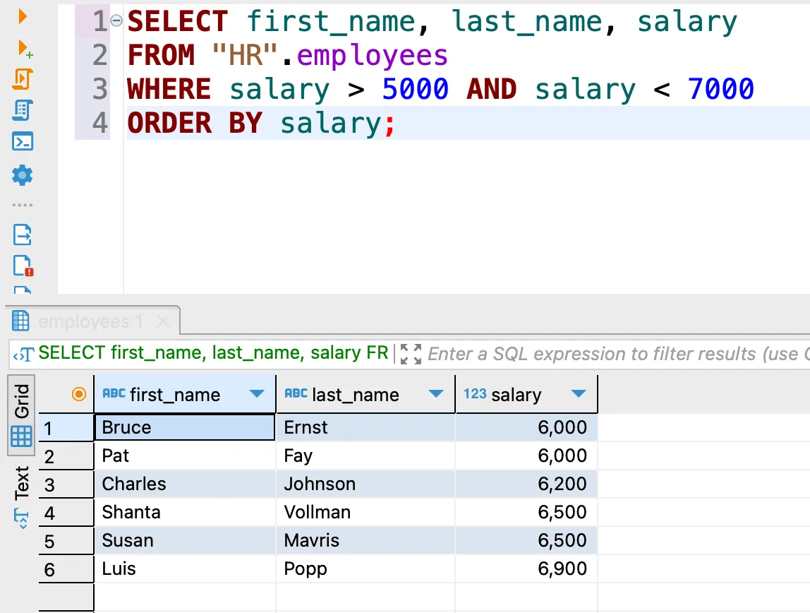
</div>

<h2 align="center">The OR operator</h2>

The **OR** operator returns **true** if at least one expression has
value **true**.

For example, the following operator finds employees with a salary
**7000** or **8000**:

```sql
SELECT first_name
     , last_name
     , salary
FROM HR.employees
WHERE salary = 7000
   OR salary = 8000
ORDER BY salary;
```

<div align="center">
  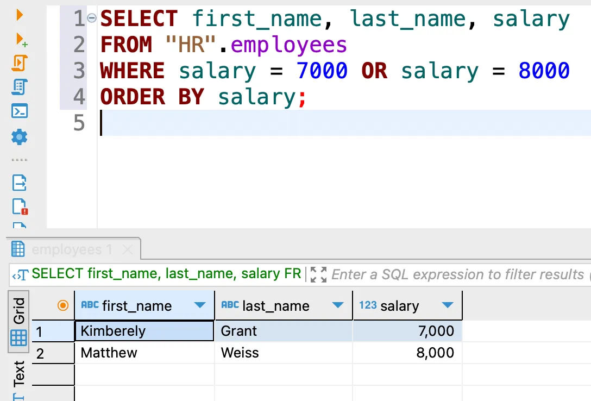
</div>

<h2 align="center">The IS NULL operator</h2>

The **IS NULL** operator compares a value to a **NULL** value (ie
empty, missing value) and returns **true** if compared
value is zero (empty value); 

For example, the following statement finds all employees who are not
have phone numbers:

```sql
SELECT first_name
     , last_name
     , phone_number
FROM HR.employees
WHERE phone_number IS NULL
ORDER BY first_name, last_name;
```

<div align="center">
  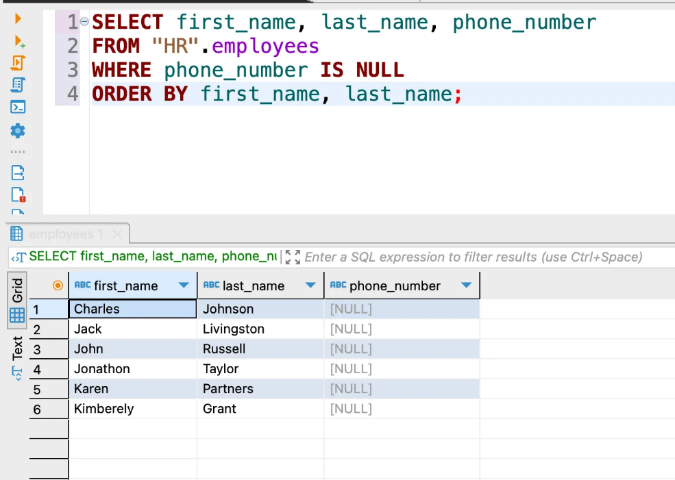
</div>

<h2 align="center">The BETWEEN operator</h2>

The **BETWEEN** operator looks for values ​​that are within a given range
range, taking into account the minimum and maximum value. 
the minimum and maximum values ​​are included as part of the conditional set.

For example, the following statement finds all employees from
salary from **9,000** to **12,000**.

```sql
SELECT first_name
     , last_name
     , salary
FROM HR.employees
WHERE salary BETWEEN 9000 AND 12000
ORDER BY salary;
```

<div align="center">
  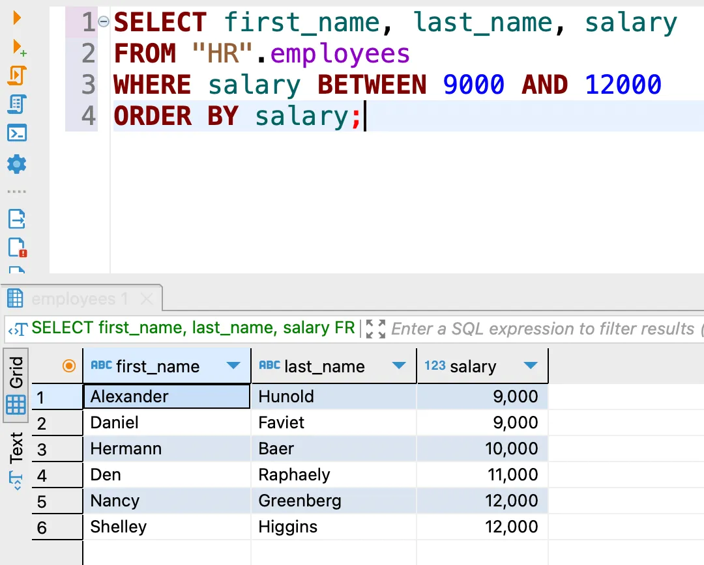
</div>

<h2 align="center">The IN operator</h2>

The **IN** operator compares a value to a list of given values.
The **IN** operator returns **true** if compared
the value matches at least one value in the list; 
case returns **false**.

The following operator finds all the employees who work in the department
with ID 8 or 9.

```sql
SELECT first_name
     , last_name
     , department_id
FROM HR.employees
    WHERE department_id IN (8, 9)
ORDER BY department_id;
```

<div align="center">
  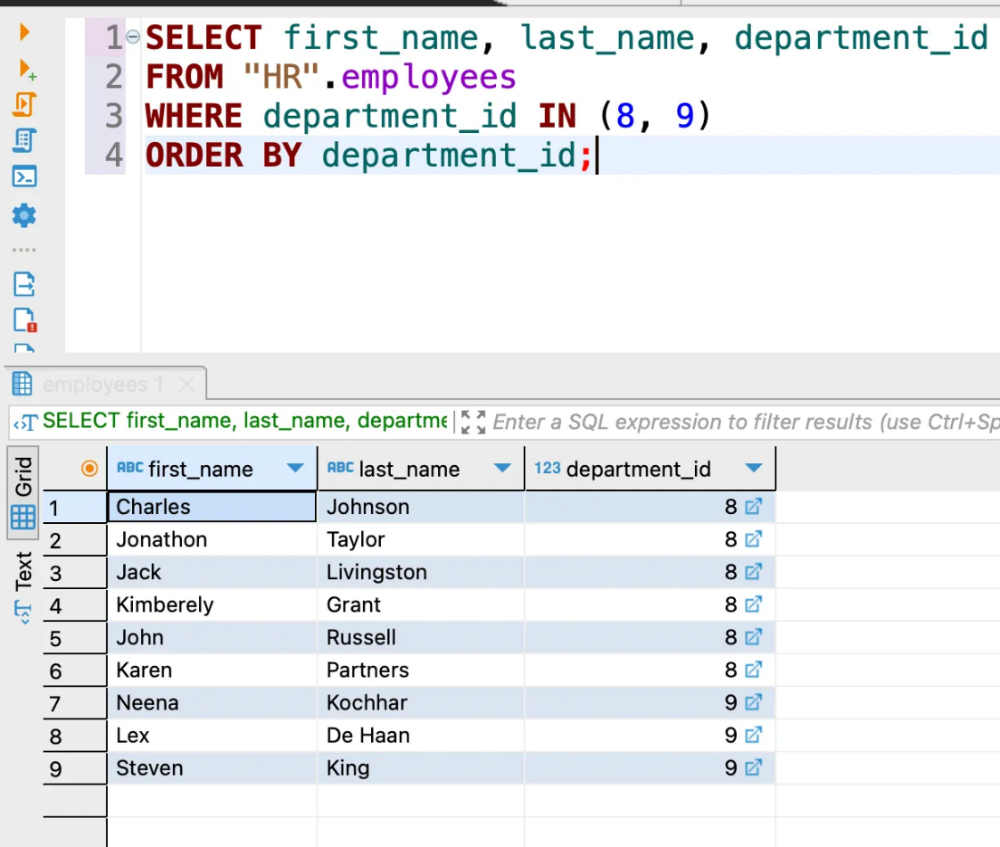
</div>

<h2 align="center">The LIKE operator</h2>

The **LIKE** operator compares values ​​with similar values ​​using
substitution operator. 
are used in conjunction with the **LIKE** operator:

- The percent sign (**%**) means there is none
number of characters instead of itself.

- An underscore (**_**) indicates the absence of a single character
instead of yourself

The following statement finds all employees whose name begins with
from **Jo** line:


```sql
SELECT employee_id
     , first_name
     , last_name
FROM HR.employees
    WHERE first_name LIKE 'Jo%'
ORDER BY first_name;
```

<div align="center">
  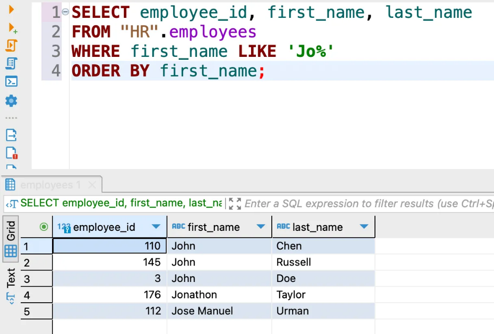
</div>

*📎 **Boolean operators** are also used to create complex ones
queries that contain various conditions for sorting and grouping data. 
allow you to perform a large number of operations with data, simplifying
analysis and obtaining the necessary information.*

The presence of **logical operators** in SQL makes this language flexible and
powerful for performing complex queries to the database. 
accurately determine the conditions for searching, filtering and sorting existing data
important for obtaining clear and targeted results.

High level of flexibility and possibilities provided by **logical operators**
SQL, making them indispensable for creating complex queries and optimization
working with databases. 
correctly create and combine conditions, which allows you to be efficient and accurate
process data.

Therefore, knowledge of the **logical statements** of SQL is essential to
analysts and everyone who works with databases. 
perform flexible and accurate search, filtering and processing of data that
promotes effective and productive work with information.

<h2 align="center">Casting types (CAST operator)</h2>

**Type casting**, also known as the **CAST** operator, is important
SQL functionality for a data analyst and for working with databases. 
operator allows you to change the data types of columns or values ​​that
enables various operations and data processing.

Changing data types in a database may be necessary for a variety of reasons.

For example:

1. **Compliance of data**. 
ensuring data compliance with stored rules or restrictions.
For example, if a column contains numeric data but is defined as
line, incompatibility may occur when performing arithmetic
operations 
data storage.

2. **Optimization of storage and processing**. 
can positively affect the productivity and efficiency of the database
data 
storing numbers can reduce the amount of memory used
database and speed up the execution of requests.

3. **Data analysis**. 
data analysis. 
allows you to perform comparison, aggregation and filtering operations
data by date. 
metrics and performance of other analytical tasks.

4. **Integration with other systems**. 
other systems may need to change the data type for
compliance with the requirements of these systems. 
are transferred to an external system, it may be necessary to perform
conversion of data types for correct perception and processing by them
systems

<h2 align="center">Aspects of the CAST operator</h2>

Casting types has the following important aspects:

- **Data conversion.** The CAST operator allows values ​​to be converted
from one type to another. 
number, date to line or vice versa. 
perform calculations or comparisons between different types of data.

- **Date and Time Formatting.** Casting types allows you to change
date and time format. 
like year-month-day, month/day/year, or others to match
requirements for data analysis or display convenience.

- **Aggregate and compare data.** With the CAST operator you can
aggregate and compare data from different types. 
you can combine values ​​from different columns or tables that
have different types of data for further analysis and processing.

- **Conditional transactions**. 
conditional operations, such as CASE, to process data of various types. 
you can set conditions based on data types and execute accordingly
actions depending on conditions.

<h2 align="center">Data types to convert</h2>

In order to correctly convert one type of data into another, it is worth it
understand what types of data exist in general.

**PostgreSQL** supports the following data types:

1. Logical types. 
--- **BOOLEAN**. 
value: **TRUE** or **FALSE**. 
storing boolean values ​​that indicate true or false
certain statements.

2. Character types. 
character data. 

- **CHAR** --- fixed string length.

- **VARCHAR** --- variable length string.

- **TEXT** --- long string with no length limit.

Character types allow you to store texts of different lengths and
are used to store and process text information.

3. Numerical types. 

- **INTEGER** --- integers.

- **FLOAT, REAL** --- floating point numbers.

- **NUMERIC** --- fixed precision numbers.

These types allow you to store and perform various operations on
numerical values ​​used in mathematical calculations and
analysts

4. Types of date and time. 
time and their combinations. 

- **DATE** --- date without time.

- **TIME** --- time excluding date.

- **TIMESTAMP** --- a combination of date and time.

These types allow you to store and process dates and times in different
formats

\- **UUID (Universally Unique Identifier): PostgreSQL** also supports
type of UUID used to store **universals
unique identifiers (Universally Unique Identifier). 
is a **128-bit** numeric identifier that guarantees uniqueness
even when generating on different devices and at different times.

This is not the entire list of types, but in most of our tasks we will
use it. 
we can find the necessary information
in [*[documentation]{.underline}*](https://www.postgresql.org/docs/current/datatype.html).

<h2 align="center">CAST statement syntax and examples</h2>

Let's consider the syntax of the **CAST** operator:

```sql
CAST (expression AS target_type);
```

In this syntax:

- **expression** --- the expression or value to cast to
new data type.

- **target_type** --- is the new data type to cast to
value.

Let's consider examples:

The following statement converts a string constant to an integer:

```
SELECT CAST('100' AS INTEGER);
```
This example uses CAST to convert a string to a date:

```sql
SELECT  CAST('2015-01-01' AS DATE)
      , CAST('01-OCT-2015' AS DATE);
```

This example uses CAST to convert a string
"**true**", "**T**" to **true** and "**false**", "**F**" to **false**:


```sql
SELECT CAST('true' AS BOOLEAN)
     , CAST('false' AS BOOLEAN)
     , CAST('T' AS BOOLEAN)
     , CAST('F' AS BOOLEAN);
```


<h2 align="center">Another PostgreSQL data type casting operator (::)</h2>

In addition to the **CAST** statement syntax, you can use the following
syntax for converting a value from one type to
other: **(::) expression::type**

expression::type

In this syntax:

- **::** --- operator of conversion of value from one type to another.

- **expression** --- the expression or value to cast to
new data type.

- **type** is the new data type to cast to
value.

For example, in the first line of the **SELECT** query, we convert to a string
value "**100**" to the numeric value **100**.

And in the second line of the query --- we convert the text strip into
date format

```sql
SELECT '100'::INTEGER
, '01-OCT-2015'::DATE;
```

<div align="center">
  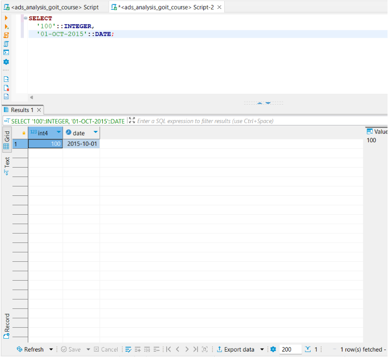
</div>

This example uses the **(::)** cast operator for
converting string to **timestamp**:

```sql
SELECT '2019-06-15 14:30:20'::timestamp;
```
So **changing data types** allows you to adapt it to your analytics needs
and ensure correct processing in the database. 
types can be useful for calculating, merging, comparing data,
storing them in a certain format or for computing
operations

Knowledge of **CAST operator** and data types allows convenient and efficient
manipulate data in SQL to obtain the necessary information. 
using the **CAST** operator correctly **helps ensure
accuracy and correctness of data analysis and calculations**.\
\
There is also a unique **T-SQL** function -
[**convert**](https://learn.microsoft.com/ru-ru/sql/t-sql/functions/cast-and-convert-transact-sql?view=sql-server-ver17)

<h2 align="center">Data aggregation in SQL</h2>

This is going to be a really powerful topic! 
(aggregated) tables and apply aggregate functions to these tables.

📌 ***Data Aggregation** in SQL plays a key role in processing and analysis
large volumes of information. 
find average values, minimums, maximums and other aggregate values
functions in the database.

Imagine that you have a large table with sales data in
online store. 
information about the product, quantity, price and customer. 
we need strategic decisions and an understanding of the overall picture
aggregated information such as total revenue, most popular items,
average customer check and other indicators.

**Data Aggregation** allows us to reduce the amount of information to a manageable amount
and informative values. 
identify key metrics and make informed business decisions.
Ultimately, data aggregation in SQL helps you find answers to important questions
questions and extract valuable information from the ocean of data.

<h2 align="center">Data aggregation process in SQL</h2>

Data aggregation in SQL is implemented using
special **aggregate functions** that allow you to search, find
average values ​​and perform other operations on groups of data.

The process of aggregating data in SQL usually includes the following steps:

- **Data Selection.** Required tables are selected from the database and
the columns from which the aggregation will be performed.

- **Grouping of data**. 
grouped by a specific column or set of columns. 
divide the data into subgroups for further aggregation.

- **Using Aggregate Functions.** Using Aggregate
functions such as **SUM, COUNT, AVG, MIN, MAX** and others,
operations are performed on groups of data. 
sum the values ​​in a column, count the number of records in a group, or
find the mean value.

- **Data filtering**. 
use the **HAVING** keyword that is applied after
grouping and aggregation.

- Displaying the results. 
displayed, saved to a new table, or used for
further calculations or queries.

<h2 align="center">The GROUP BY operator</h2>

📌 ***GROUP BY** (grouping by attribute) --- optional operator
in SELECT.*

The **GROUP BY** operator allows you to group strings based on values ​​of one
or multiple columns. 

Below is the basic syntax for the **GROUP BY:** operator.
```sql
SELECT column1
     , column2
     , aggregate_function(column3)
FROM table_name
GROUP BY column1
        ,column2;
```
And this is how **GROUP BY** works on the example of a table with fruits:

<div align="center">
  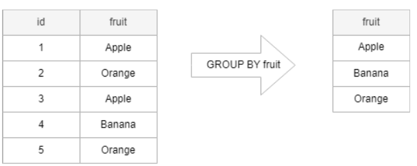
</div>

The table on the left has two columns: **id** and **fruit**. 
apply **GROUP BY** to the **fruit** column, it returns a set
result that contains unique values ​​from the **fruit** column:

```sql
SELECT fruit
FROM sample_table
GROUP BY fruit;
```

In practice, **GROUP BY** is often used with aggregation functions,
such as **MIN, MAX, AVG, SUM** or **COUNT** to calculate
indicators that provide information for each group.

For example, below shows how **GROUP BY** works with **COUNT** (function
to count the number of data of the same type):

<div align="center">
  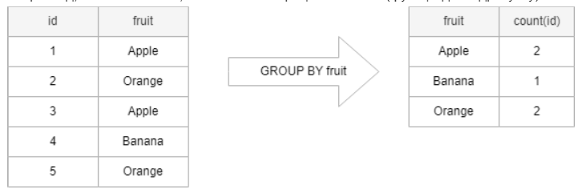
</div>

In this example, we group the rows by the values ​​of the **fruit** column and
apply **COUNT** to the **id** column. 
the unique values ​​of the fruit columns and the number of corresponding rows.
```sql
SELECT fruit
     , count(id)
FROM sample_table
GROUP BY fruit;
```

Columns that appear in a **GROUP BY** are called columns
grouping. 
**NULL** values ​​are summed into one group because the **GROUP** clause
**BY** treats all **NULL** values ​​as equal.

The following example uses **GROUP BY** for grouping
of the values ​​in the **department_id** column in the **employees** table:

```sql
SELECT department_id
FROM HR.employees
GROUP BY department_id;
```
<div align="center">
  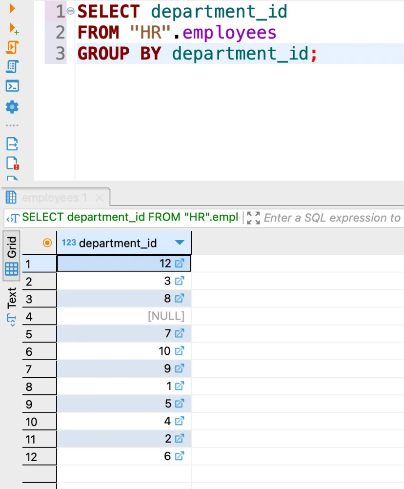
</div>

In this example:

- First, the **SELECT** statement returns all values ​​from
of the **department_id** column of the **employees** table.

- Second, the **GROUP BY** operator combines all values ​​into groups.

The **department_id** column of the **employees** table contains 40 rows,
including duplicate **department_id** values. 
BY** groups these values.

Without the aggregation function, **GROUP BY** behaves like **DISTINCT**:
```sql
SELECT DISTINCT department_id
FROM HR.employees
GROUP BY department_id;
```

The **DISTINCT** operator is used in the delete query language
duplicate values ​​from query results. 
retrieve unique values ​​from a specific column or combination of columns in
tables. 
removes duplicates and returns only unique values. 
operator when you need to analyze the data and get only unique ones
records from the database.

**GROUP BY** is more useful if you use it with a function
aggregation

For example, the following statement uses **GROUP
BY** with **COUNT** to count the number of employees by department:
```sql
SELECT department_id
     , COUNT(employee_id) AS headcount
FROM HR.employees
GROUP BY department_id;
```

<div align="center">
  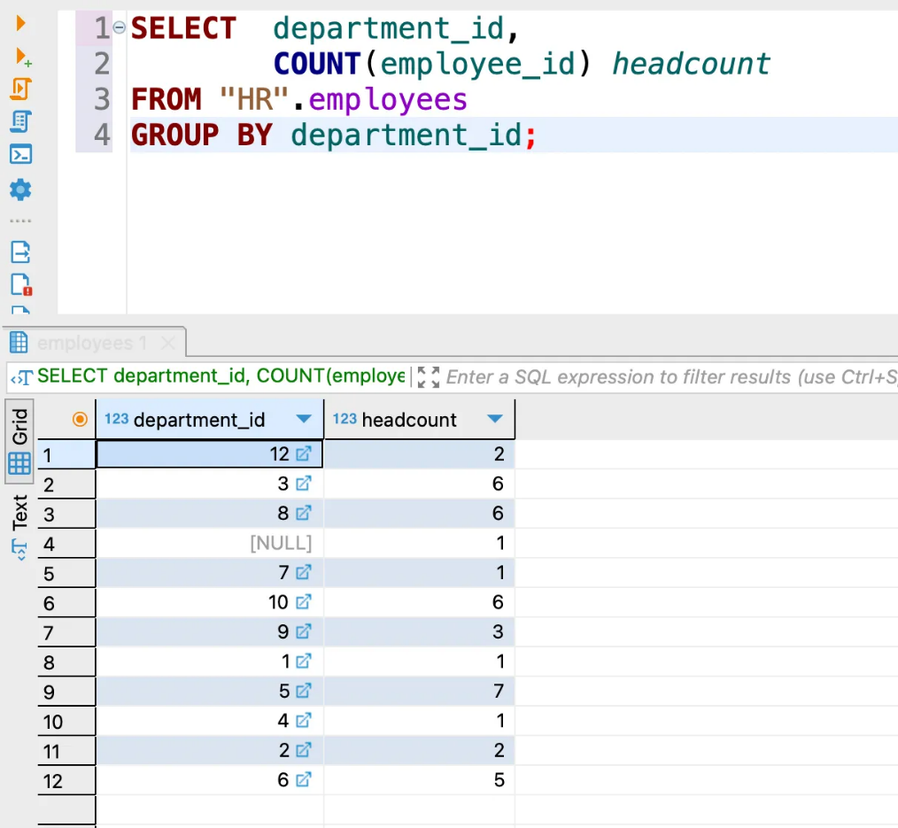
</div>

How it works:

- First, **GROUP BY** groups the rows in the "**employees**" table by
department identifier.

- Second, **COUNT(employee_id)** returns the number of values
IDs of employees in each group.

<h2 align="center">AVG feature</h2>

📌 **AVG function** is an aggregation function that calculates the average
set value.

The following is the syntax of the **AVG** function (in square brackets:
optional parameters):
```sql
AVG ([ALL | DISTINCT] expression)
```
Let's consider two examples of using this function.

Example 1. **AVG** function without **GROUP BY**

To calculate the average salary of all employees, we use
function AVG to the salary column as follows:

```sql
SELECT AVG(salary)
FROM HR.employees;
```

<div align="center">
  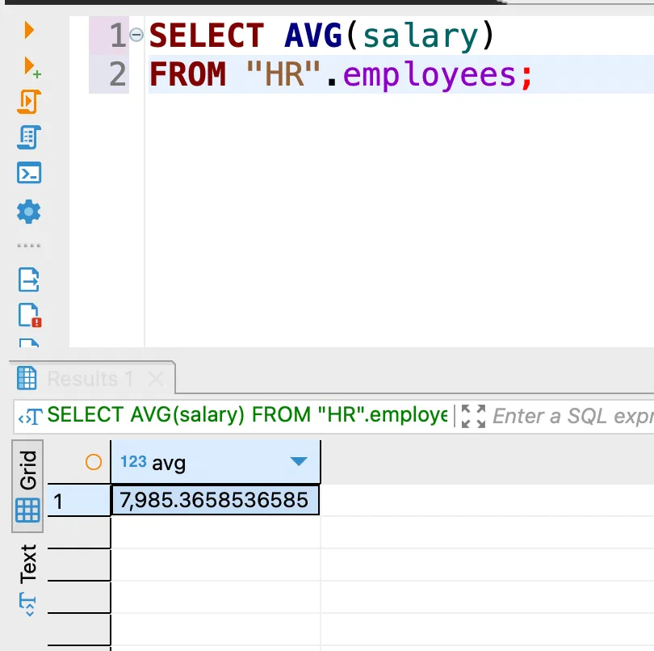
</div>

Example 2: **AVG** function with **GROUP BY**

To calculate the average values ​​of the groups, we use
**AVG** function with **GROUP BY**. 
departments and the average salary of employees in each department.

```sql
SELECT department_id
, AVG(salary)
FROM HR.employees
GROUP BY department_id;
```

<div align="center">
  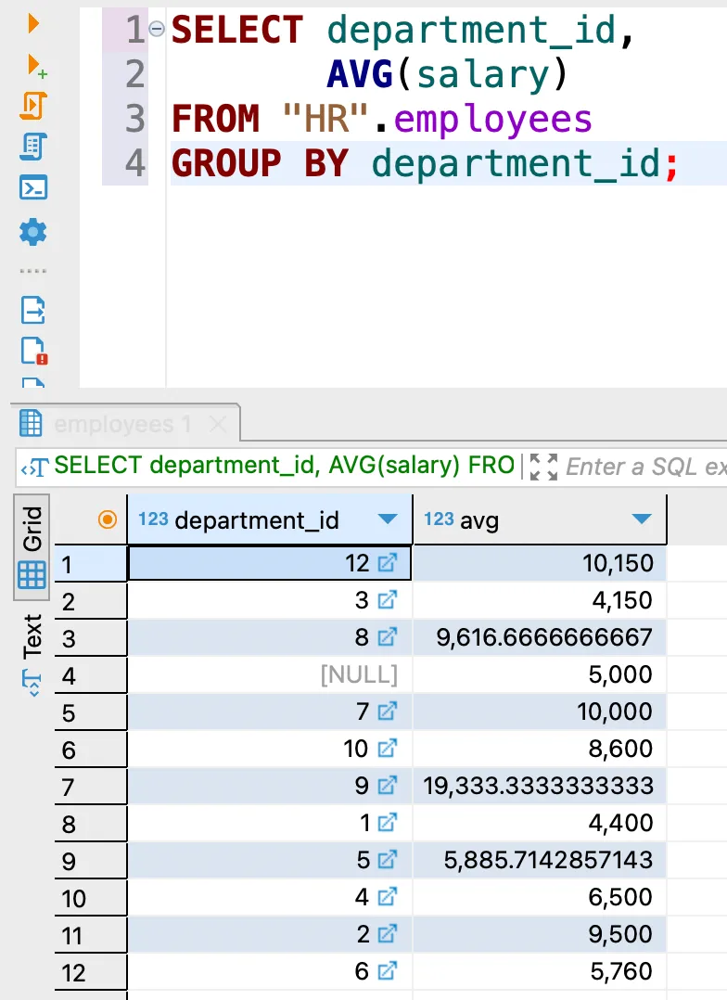
</div>

<h2 align="center">COUNT function</h2>

**📌 COUNT function** is an aggregation function that returns a count
rows returned by the query.

You can use **COUNT** in a **SELECT** statement to get
number of employees, number of employees in each department,
the number of employees performing a certain job, etc.

The following is the syntax of the **COUNT** function in **SQL**:
```sql
COUNT ([ALL | DISTINCT] expression);
```
The result of the COUNT function depends on the argument you pass to it.

- The **ALL** keyword will have repeated values ​​until the result.
For example, if you have a group (1, 2, 3, 3, 4, 4) and applied
**COUNT** function, the result will be 6. By default
the **COUNT** function uses ALL regardless of what you specify
his or not

- The **DISTINCT** keyword only considers unique values.
For example, **COUNT** with **DISTINCT** keyword returns 4,
if applied to the group (1, 2, 3, 3, 4, 4).

- The **COUNT(*)** function returns the number of rows in a table. 
counts duplicate rows and rows that contain null values.

Example **COUNT** with **GROUP** **BY**

The following example uses **COUNT** with **GROUP BY** to
find the number of employees for each department:

```sql
SELECT department_id
      ,COUNT(*)
FROM HR.employees
GROUP BY department_id;
```
<div align="center">
  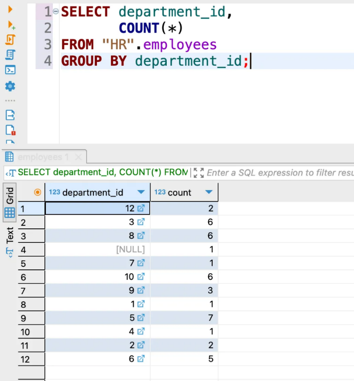
</div>

The following example uses **COUNT** with **DISTINCT** for
obtaining the number of managers:

```sql
SELECT COUNT(DISTINCT manager_id)
FROM HR.employees;
```

*💡 What was your result?*

We got 10. Try to do it yourself and check.

The **SELECT DISTINCT** statement is used to return only distinct ones
(unique) values.

Within a table, a column often contains many duplicate values.
Sometimes you just need to list the unique values.

<h2 align="center">MAX and MIN functions</h2>

*📌 SQL provides **MAX and MIN** functions that allow you to find the maximum
and the minimum value respectively in the data set.*

Below is the syntax for the **MAX** and **MIN** functions.
```sql
MAX(expression)
MIN(expression)
```

**MAX/MIN** functions ignore **NULL** values.

Unlike the **SUM, COUNT, and AVG** functions, the **DISTINCT** option does not
can be applied to **MAX/MIN functions.**

Let's consider the following example, where
the **SELECT** statement returns the highest (maximum) employee salary
in the **employees** table.
```sql
SELECT MAX(salary)
FROM HR.employees;
```

<div align="center">
  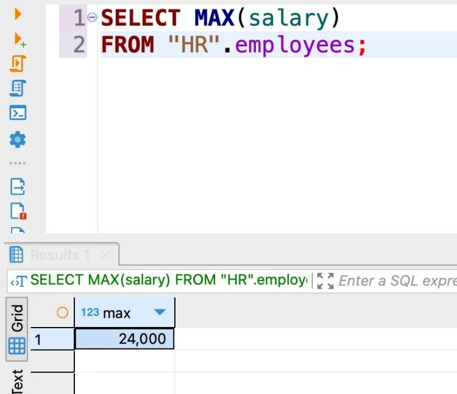
</div>

<h2 align="center">Example of MAX/MIN with GROUP BY</h2>

We usually use **MAX/MIN** function in combination with **GROUP
BY** to find the max/min value for a group.

For example, we can use the **MAX** function to find the highest
employee salary in each department as shown below:

```sql
SELECT department_id
      ,MAX(salary)
FROM HR.employees
GROUP BY department_id;
```

<div align="center">
  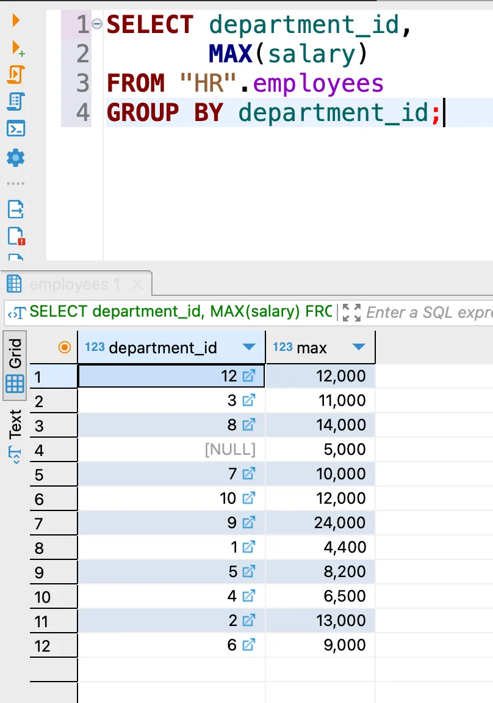
</div>

<h2 align="center">SUM function</h2>

📌 *The **SUM** function--- is an aggregation function that returns the sum of all or
individual values. 
column.*

The **SUM** function syntax is as follows:
```sql
SUM ([ALL | DISTINCT] expression);
```

The **ALL** operator allows you to apply an aggregate to all values. 
**SUM** uses the **ALL** operator by default. 
you have the set (1,2,3,3,NULL), the **SUM** function returns 9. Note that
the **SUM** function ignores **NULL** values.

To calculate the sum of unique values, we use
the **DISTINCT** operator. 

<h2 align="center">SUM example</h2>

To get the sum of salaries of all employees, we will apply
**SUM** function to the salary column, as in the following query:

```sql
SELECT SUM(salary)
FROM HR.employees;
```

<div align="center">
  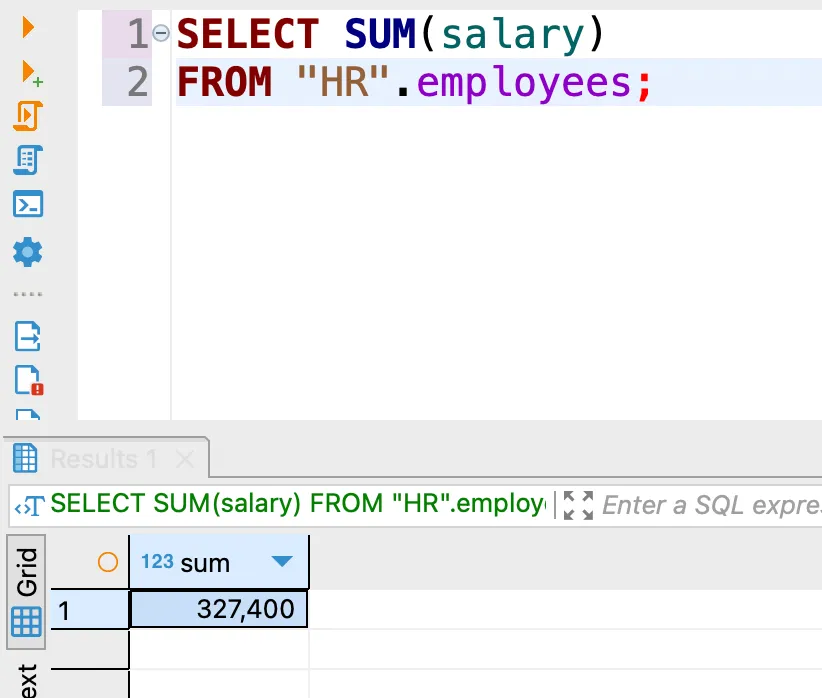
</div>

<h2 align="center">Example of SUM with GROUP BY</h2>

We often use the **SUM** function in combination **with GROUP BY** to
calculate the totals for each group.

For example, to calculate the sum of employees' salaries for each
department, we apply the **SUM** function to the **salary** column and
group rows by **department_id** columns:

```sql
SELECT  department_id
      , SUM(salary)
FROM HR.employees
GROUP BY department_id
```

<div align="center">
  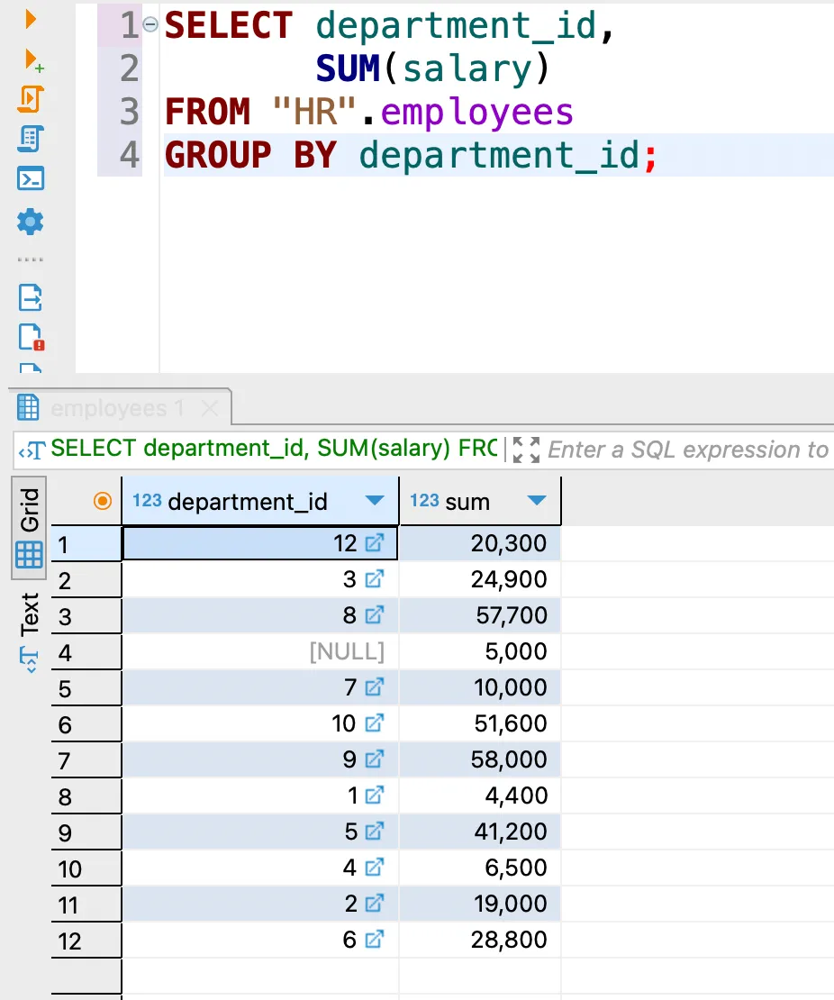
</div>

So, we analyzed the main functions of aggregation.

<h2 align="center">Using HAVING to filter aggregated data</h2>

When grouping data in **SQL** we can use
**HAVING** operator to filter data at the aggregation level.

**HAVING** can be used as **WHERE** if filtering is required
by keys used in **GROUP BY**, or used together
with aggregation functions.

For example, we can filter departments by their
identifiers:
```sql
SELECT department_id
, SUM(salary)
FROM HR.employees
GROUP BY department_id
HAVING department_id <= 5;
```
<div align="center">
  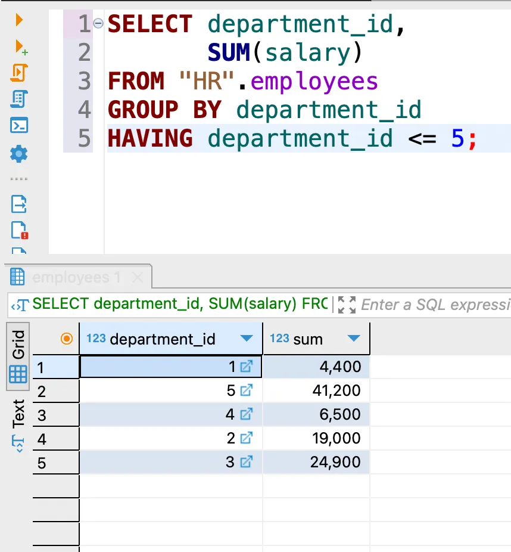
</div>

Or by the amount of salaries:
```sql
SELECT department_id
     , SUM(salary)
FROM HR.employees
GROUP BY department_id
HAVING SUM(salary) > 5000;
```

<div align="center">
  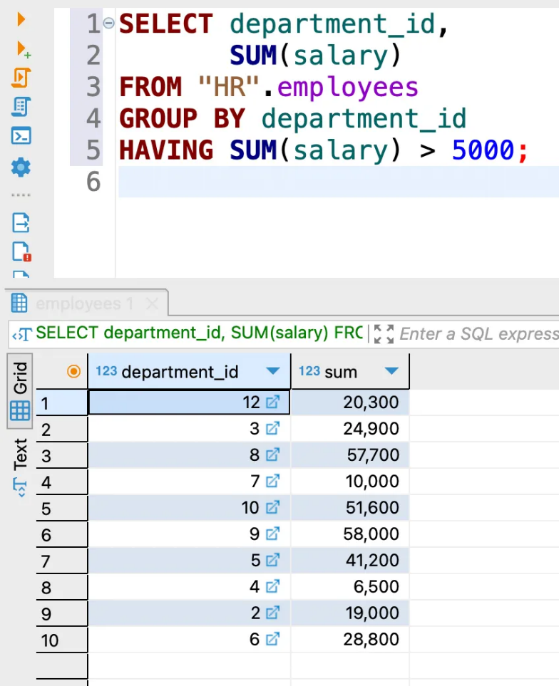
</div>

The result we get in the first case will not differ from
of the result we would get using WHERE. 
the process itself will be different: filtering using WHERE takes place
before grouping and aggregation, and with **HAVING** --- already after.

**<div align="center" style="text-align: font-size: 24px">Підіб'ємо підсумки щодо теми агрегації даних:</div>**

- **Data Aggregation in SQL** allows you to sum, count,
find averages and perform other **operations with groups
data**.

- Aggregation operations are performed using aggregate functions,
such as **SUM, COUNT, AVG, MIN, MAX** and others.

- Grouping data using the **GROUP BY** operator allows
break the data into subgroups for aggregation.

- Data aggregation is useful for analyzing large amounts of information and
obtaining generalized information.

- Aggregation results can be displayed, saved in a new
table or used for further calculations and queries.

- **Data Aggregation in SQL is an important tool for summarizing and
data analysis**, as well as for making informed decisions on
based on these data.

In general, data aggregation in **SQL** allows you to transform and
organize large amounts of information, making it easy to analyze
and use in a business context.
