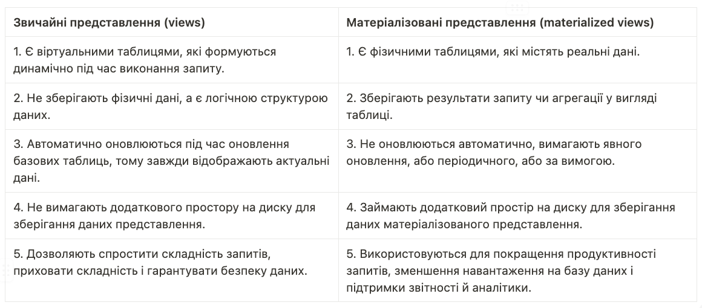
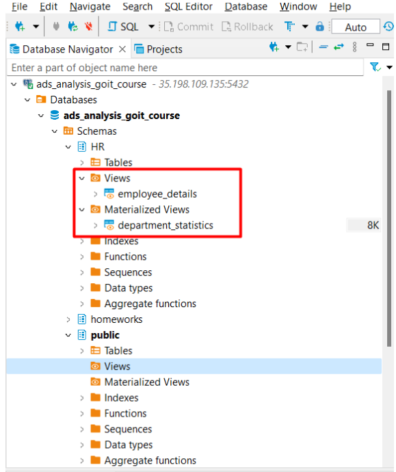
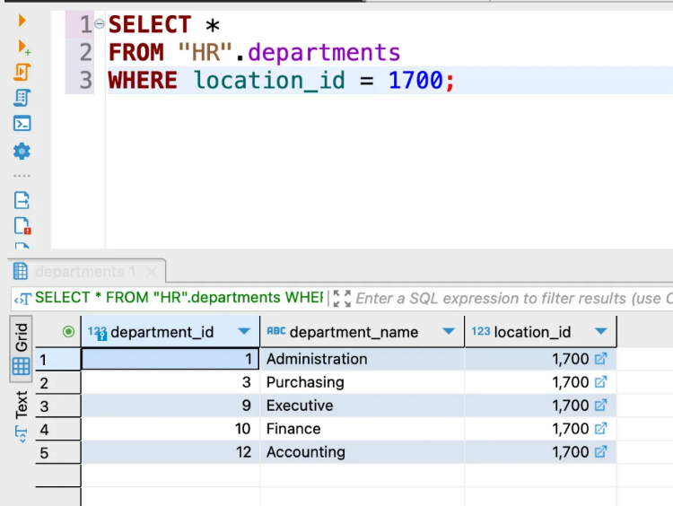
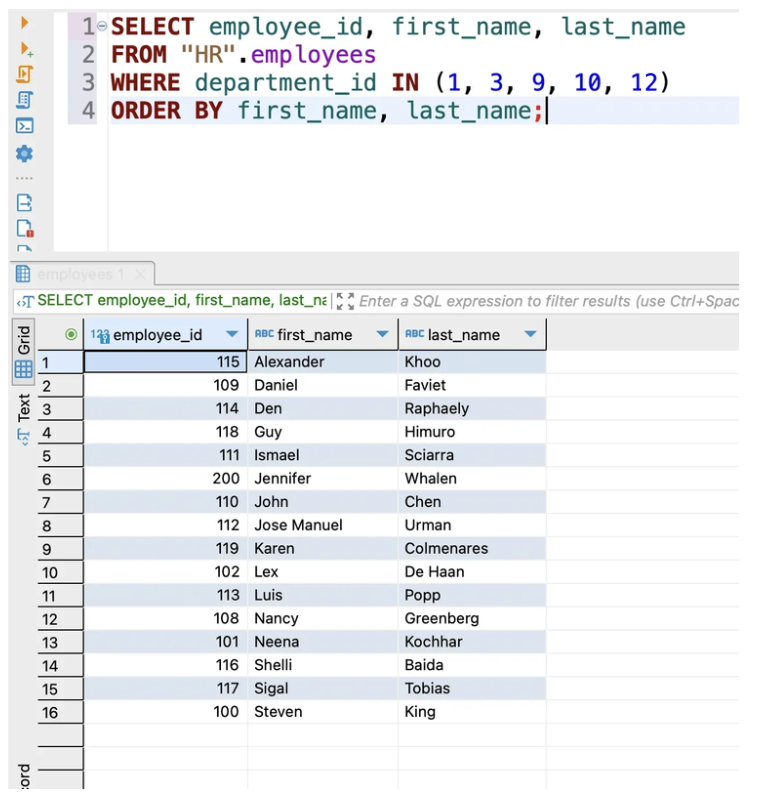
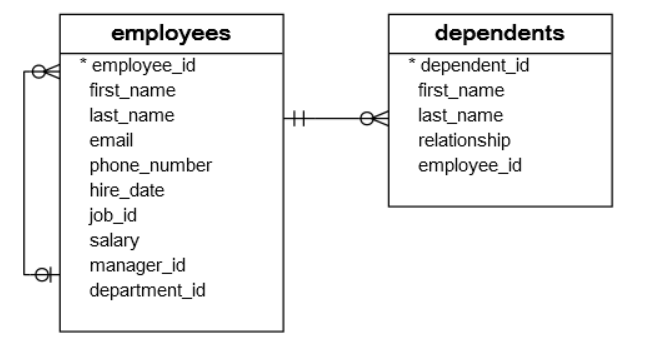
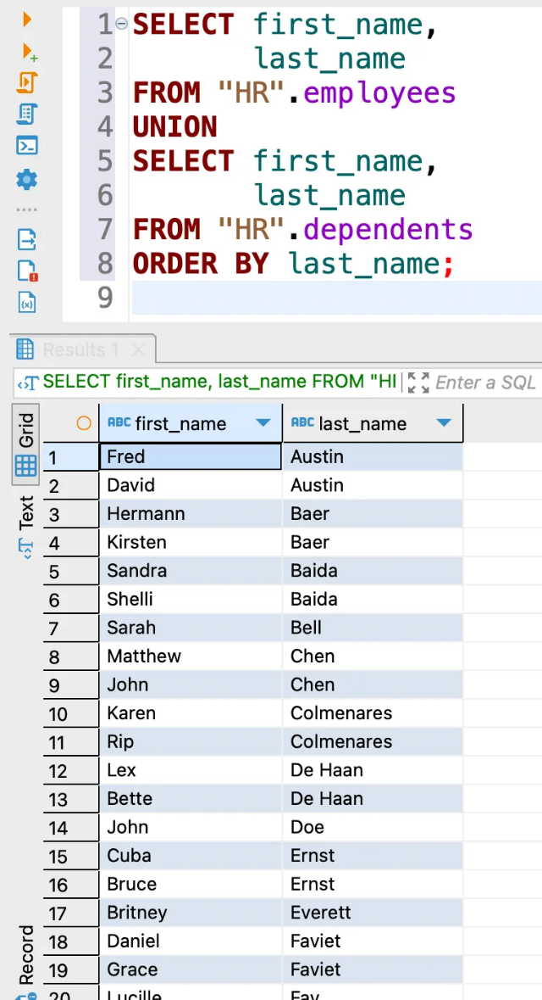
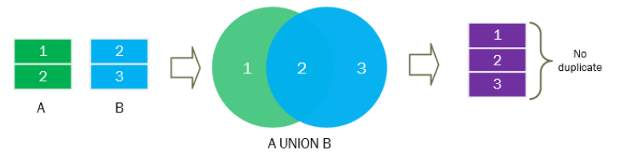
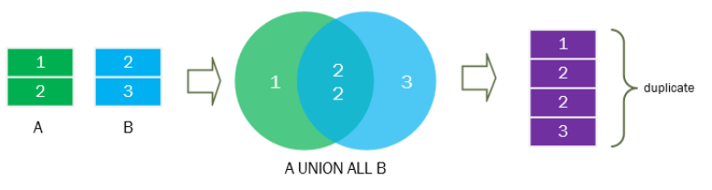

**Language:** English | [Українська](../../i18n/uk/course/lessons/lesson_3_stvorennia_tablets_struktur.md)

<h2 align="center">Data description language (DDL) (views, materialized views, tables)</h2>

**Data Definition Language (DDL)** is the language used to
creation, modification and deletion of database structures. 
us to create and modify tables, define columns, and
create indexes and constraints. 
managing other objects, such as schemas, views, and materialized views.**

- **Tables** --- these are the main database objects in which
actual data is stored. 
which organize information in a structured format. 
the basis for storing, managing and processing data in the database.

- **Views** --- these are virtual tables that are based
on real data from one or more tables. 
we need to create "views" of data that display only what we need
information and hide complex queries or sensitive data.
Views simplify working with data by providing convenient access
to the necessary information.

- **Materialized views (materialized views)** --- this
a special type of views that store actual data in a form
physical table. 
precomputed data to optimize query performance.
**Materialized views can significantly speed up execution
queries and improve database performance.**

*📎 Learning **data description language (DDL)** gives us the ability to create,
change the structure of the database and manage it. 
tables to store data, set data types and restrictions for
columns, and create views and materialized
presentation for convenient access to information.*

An understanding of **data description language (DDL)** helps to work efficiently with
databases, create correct data structures, optimize
query performance and provide convenient access to the necessary
information

<h2 align="center">DDL commands</h2>

DDL is a set of SQL commands used to create, modify
and deleting database structures but not data. 
are used by an ordinary user of the database. 
architects and business analysts.

List of DDL commands:

- The **CREATE** command is used to create a database or its
objects (tables, indexes, functions, representations, procedures
storage and triggers). 
to create a table, CREATE VIEW--- to create a view.

- The **DROP** command is used to remove objects from the database
data 
representation.

- The ALTER command is used to change the structure of a database.
For example, ALTER TABLE is used to add, modify, or
deleting columns in a table.

- **TRUNCATE** command is used to remove all records from
table, in particular to delete all places allocated for records. 
a faster way to delete data than using the DELETE command.

- The **RENAME** command is used to rename an object that
exists in the database. 
table

Let's take a closer look at the **CREATE** command, since it is frequent
appears in various documentation, so you'll see this one all the time
syntax. 

<h2 align="center">The CREATE command</h2>

To create a new table, you need to use **CREATE TABLE** with
with the following syntax:

```sql
CREATE TABLE table_name (
    column_name_1 data_type default value column_constraint,
    column_name_2 data_type default value column_constraint,
    ...
    table_constraint
);
```

The minimum information required to create a new table is a name
table and column name.

The table name must be unique in the database. 
table with a name that already exists, the database system will issue an error.

In **CREATE TABLE** you specify a list of columns separated by commas. 
column is defined by name, data type, default value, and
if necessary by one or more restrictions.

- The **DataType** of the column defines what types of data can be stored
in this column. 
discussed this earlier).

- **Column Constraint** determines the type of value that can be stored in
columns 
contains the value **NULL**.

- **Column may have multiple constraints**. 
have both **NOT NULL** and **UNIQUE** constraints.

Suppose you want to add a table with training values ​​to our scheme
programs for employees.

The following command creates a table with rates:

```sql
CREATE TABLE courses (
    course_id SERIAL PRIMARY KEY,
    course_name VARCHAR(50) NOT NULL
);
```

The **course_id** data type is denoted by the **SERIAL** keyword.

The **course_id** column value is **PRIMARY KEY**. 
when you insert a new line in courses without providing a value for
**course_id**, the database system will generate an integer value for the column.

- **Course_name** --- course names. 
**(VARCHAR)** with a maximum length of 50 characters.

- **NOT NULL** ensures that the column is not stored
the value **NULL** (because we are not interested in courses without names).

**Creation of special objects in SQL (presentation and
materialized views)**

<h2 align="center">Views in SQL</h2>

📌 Representation **(View)** --- is a logical and virtual copy of the table,
which is created by executing a **SELECT** statement. 
--- a logical data structure that does not contain physical values ​​of its own, a
is formed on the basis of data already stored in others
tables. 
whenever you need certain data, you need to perform a query to
corresponding representation. 

**View** have no storage/update cost. 
special architecture, which means that to define the structure
representation there is a standard **SQL**. 
when access to the data is rarely needed, but the data is frequently updated.

Why do we need **Views?** Here are some important reasons:

- **Simplification of requests**

Views allow us to create "views" of data that we represent
only the necessary information from one or more tables. 
combine, filter, and transform data in views to
get the results you want. 
more readable and understandable.

- **Hidden Difficulties**

If we have complex queries that are often used in our
application, we can create views for these queries. 
allows us to hide the complexity of the query behind a simple name
representation. 
a long and complex request every time.

- **Safety and Restrictions**

Views can be used to restrict access to data. 
can create views that show only certain columns or
rows of data, hiding sensitive information. 
provide different access rights to views for different users or
roles, ensuring data security.

- **Modularity and Reusability**

Representations can be applied to create modular blocks
data that can be reused in different parts of the system.
We can create views for various reports, analysis or others
tasks and use them in different queries or applications.

- **Performance optimization**

Presentations can be used to create a pre
calculated query results. 
contains a complex query with calculations or aggregate functions, and
save its results. 
because they can refer to precomputed data instead
performing complex operations every time.

📌 Presentations **(Views)** improve the readability of requests, contribute
data security, allow code reuse and improve
system performance.

<h2 align="center">Materialized views</h2>

📌 There are **Materialized views** (materialized views) in SQL
a special type of **(views)** that physically store data
in the form of a table. 
in contrast to ordinary representations, which are virtual and formative
dynamically during query execution. 
upon request

The performance of **materialized views** is better than that of ordinary views. 
that data is stored on disk.

Sometimes **Materialized views** are also called **"indexed".
views"**, since the table created after the query
is indexed, which allows you to access it faster and more efficiently.
Materialized views are used when you need to refer to frequently
data, and the data in the table is updated infrequently.

Why do we need materialized views? 
reasons:

- **Improving query performance**

Materialized views allow you to store complex results
queries or aggregate functions in the form of a physical table. 
allows you to speed up the execution of requests as they can receive
access precomputed data instead of executing
complex operations every time. 
useful in situations where queries require a significant amount of computation or
work with large volumes of data.

- **Reducing the load on the database**

If we have complex queries that are executed frequently and require significant
resources, materialized views allow you to reduce the load
to the database. 
queries in materialized views, which reduces the number of executions
complex operations and reduces system response time.

- **Reporting and analytics support**

Materialized views can be used for the former
preparation of data for reports and analytical tasks. 
a materialized view that contains complex calculations, aggregates
features or aggregated data, and update it periodically. 
quickly get results for reports and analysis without the need
perform long queries every time.

- **Support for data replication**

Materialized views can be used to create
local copies of data on remote servers or in different databases.
It provides fast access to data on remote nodes without
the need to transfer data over the network. 
can be updated on a schedule or on demand to synchronize
data with source.

<h2 align="center">The difference between views and materialized views</h2>


<div align="center" style="text-align:  font-size: 24px">Основна різниця між звичайними представленнями (views) і матеріалізованими представленнями (materialized views) в SQL:</div>


<div align="center">
  
</div>

How to create **views** and **materialized views**

Let's try to create two types of **View** in practice using
**CREATE** commands.

Request for **View**:

```sql
CREATE VIEW employees_details AS
SELECT employee_id
    , first_name
    , last_name
    , department_id
FROM HR.employees;
```

In this example, we create a **VIEW** named **"employee_details"**,
which displays information about employees, including their
identifiers, names and work department.

Request for **Materialized View**:

```sql
CREATE MATERIALIZED VIEW department_statistics AS
SELECT department_id
     , COUNT(employee_id) AS employee_count
FROM HR.employees
GROUP BY department_id;
```

In this example, we create a materialized **VIEW** named
**"department_statistics"**, which contains statistics for
departments 
which allows faster access to data, but may require an update to the
the process of changing data in the database.

They are located in a separate list in the data schema. 

<div align="center">
  
</div>

So, let's fix the most important thing:

- **Data Description Language** **(DDL)** and **DDL** commands** allow
create, modify and delete database objects efficiently
manage data structure and ensure database integrity.

- **Tables** **(tables)** --- the main objects of data storage in
database. 
them

- **Views** --- these are virtual tables that give
the ability to conveniently combine data from one or more tables and
present them in the form of a logical structure.

- **Views** improve readability and security
requests, allow code reuse and improve
productivity by providing simplified access to data.

- **Materialized views (materialized views)** --- this
a special type of representation that physically stores data in a form
tables.

- **Materialized views** are allowed
improve the performance of requests, reduce the load on the database
data, support reporting and analytics, and provide
local data replication.

<h2 align="center">Subqueries and CTE virtual tables</h2>

Subqueries and Virtual Tables **CTE (Common Table Expressions)** ---
is the functionality used in the query language **SQL**
to build complex and efficient queries.

📌 **Subqueries in SQL** --- these are queries that are nested in the main query and
are performed before him. 
used in the main query.

A subquery can be used in different parts of an **SQL** query, such as
as **SELECT, FROM, WHERE, JOIN**, or **UNION**, and can return one
or multiple values.

📌 **CTE (Common Table Expression)** --- this is the name of a temporary table,
which is created in memory during execution
**SQL** query. 
queries by breaking them into smaller, more understandable parts. 
**CTEs** can be used in the main query as if it were the only one
data source.

The main advantages of using subqueries and **CTE** are convenience,
the ability to make the request more readable and maintainable. 
they allow you to avoid code duplication, facilitate query optimization, and
provide greater flexibility when constructing complex queries.

Using subqueries and **CTE** allows more complex implementations
logical operations and queries in **SQL**, making them powerful
tools for working with databases.

<h2 align="center">Subqueries in SQL</h2>

Let's start with the problem.

Suppose we need to find all employees who are in
locations with the identifier 1700. This can be implemented as follows:

1. First, we will find all departments located in the location with **id** 1700:

```sql
SELECT * 
FROM HR.departments
WHERE location_id = 1700;
```

<div align="center">
  
</div>

2. Now we will find all the employees who belong to the department with
location 1700, using the list of identifiers of the department with
previous request:

```sql
SELECT employee_id
     , first_name
     , last_name
FROM HR.employees
    WHERE department_id IN (1, 3, 9, 10, 12)
ORDER BY first_name, last_name;
```

<div align="center">
  
</div>

<h2 align="center">However, this solution has two problems:</h2>

Let's start with the fact that you were looking at the **departments** table to
to check which department belongs to location 1700. But initial
the question was not about the departments but about the code location
1700.

Due to the small amount of data, you can easily get a list of department and
substitute it in another query. 
volume of data, this can become a problem.

A much better solution to this problem is to use a subquery.

Here's what it looks like for our problem:

```sql
SELECT employee_id
     , first_name
     , last_name
FROM HR.employees
    WHERE department_id IN
        (
        SELECT department_id
        FROM HR.departments
            WHERE location_id = 1700
            )
ORDER BY first_name
       , last_name;
```

You can use a subquery in many places, for example:

- with **IN** or **NOT IN** operator
- with the **SELECT** statement
- with **WHERE** statement

<h2 align="center">An SQL subquery with an IN or NOT IN statement</h2>

In the previous example, you saw how a subquery was used with
by the IN operator.

The following example uses a subquery with NOT IN to find all
employees who are not in location 1700:

```sql
SELECT employee_id
     , first_name
     , last_name
FROM HR.employees
    WHERE department_id NOT IN
        (
        SELECT department_id
        FROM HR.departments
        WHERE location_id = 1700
            )
ORDER BY first_name, last_name;
```

<h2 align="center">SQL subquery with comparison operators</h2>

- **Example 1 (comparison operator =)**

The following example shows the employees who have the highest
salary:

```sql
SELECT employee_id
     , first_name
     , last_name
FROM HR.employees
    WHERE salary =
        (
        SELECT MAX(salary)
        FROM HR.employees
            )
ORDER BY first_name
       , last_name;
```

In this example, the **subquery** returns the highest salary of all
employees, and the outer query finds employees whose salary
equal to this highest amount.

<h2 align="center">Example 2 (comparison operator \>)</h2>

The following query returns all employees whose salary exceeds
average salary:

```sql
SELECT employee_id
     , first_name
     , last_name
FROM HR.employees
    WHERE salary >
        (
        SELECT AVG(salary)
        FROM HR.employees
            )
ORDER BY first_name, last_name;
```

In this example, the **subquery** first returns the average salary of everyone
employees 
"more" to find all workers whose salary is higher than the average.

<h2 align="center">SQL subquery in the FROM clause</h2>

You can use a **subquery** in a **FROM** expression like this:

```sql
SELECT *
FROM (subquery) AS table_name;
```

In this syntax, the table alias is required because all
the tables in the FROM expression must have a name.

The following query returns the average salary for each department:

```sql
SELECT AVG(salary) AS average_salary
FROM HR.employees
GROUP BY department_id;
```

You can use this query as a **subquery** in the **FROM** expression for
calculation of the average salary of departments as follows:

```sql
SELECT ROUND(AVG(average_salary), 0)
FROM ( 
        SELECT AVG(salary) AS average_salary
        FROM HR.employees
        GROUP BY department_id
        ) department_salary;
```

<h2 align="center">An SQL subquery in a SELECT statement</h2>

A **subquery** can also be used in a **SELECT** expression. 
example, the value of the salary of all employees, their average, is found
salary and the difference between each employee's salary and the average
salary

```sql
SELECT employee_id
, first_name
, last_name
, salary
, ( 
    SELECT ROUND(AVG(salary), 0)
    FROM HR.employees
    ) AS average_salary
, salary - (
            SELECT ROUND(AVG(salary), 0)
            FROM HR.employees
              ) AS difference
FROM HR.employees
ORDER BY first_name
       , last_name;
```

As you can see, **subqueries** are a really powerful sampling tool
information 
**subqueries** or their incorrect use can significantly reduce
performance (i.e. execution speed) of requests.

<h2 align="center">CTE (Common Table Expression)</h2>

**CTE (Common Table Expression)** --- This is a named temporary
a subquery expression in SQL that can be used internally
request 
can be processed regardless of the main request.

Here is the **CTE** syntax in SQL:

```sql
WITH *імʼя_*CTE AS 
    ( *Запит* )
    
*Основний_запит*
```

Where:

**WITH** is the keyword that starts a **CTE** subquery expression.

***CTE_name*** --- the name you choose to name the **CTE**. 
name will be used to refer to the CTE inside main
request

***Request*** --- a request that is executed to create a temporary
tables.

***Main_query*** --- a request that uses a **CTE**. 
can refer to **CTE**_name and process **CTE** results.

The **CTE** provides a convenient way to create complex queries that can
contain recursive or iterative operations on data. 
allows you to improve the readability and maintainability of SQL queries.

**CTE** virtual tables allow you to create temporary data sets that
which can be used within a single request. 
and writing complex queries, allowing you to create temporary named
tables inside the query. 
**WITH** words and then defined as a normal table with its own
columns and data.

📎 *You can define several **STE** in one **WITH** query. 
the following **STE** is separated from the previous one by a comma. 
consecutively, then you can use the previous **STE** for calculation
next within the same query that started with **WITH**.*

In general, the use of **subqueries** and virtual tables **CTE** c
SQL allows you to work more flexibly and efficiently with data, to create
complex queries and simplify information analysis.

Let's summarize the main points:

- **Subqueries** allow one query to be nested inside another
request 
specific results, filtering data or obtaining related
values ​​from other tables. 
parts of the query, such as **SELECT, FROM, WHERE**, and can be
nested

- **CTE Virtual Tables** allow temporary sets to be created
data that can be used within a single request. 
make complex queries easier to read and write by allowing
create temporary named tables inside
request 
then defined as a normal table with its own columns and data.

- **Subqueries and CTE Virtual Tables** allow more flexible and
efficiently manage data and create complex queries. 
make it easier to read and understand queries by breaking them down into logical ones
part, and allow you to use the results of one query in
to another

- They also provide modularity and code reuse. 
you can define a complex **subquery** or **CTE** once and then
use it in different parts of the query or even in different ones
I asked 
in the future

- **Subqueries** and **virtual tables** **CTE** can be
used to perform various operations such as filtering
data, aggregation, connection of tables and much more. 
help to cope with complex requests and process effectively
large volumes of data.

<h2 align="center">UNION and UNION ALL commands</h2>

Let's talk about two special commands in SQL --- **UNION** and **UNION
ALL**, which will become your best assistants when working with
data

These commands are powerful tools for combining data and creating
a more complete picture. 
one place, which makes analysis and working with data easier and
more convenient

Also, understanding **UNION** and **UNION ALL** will help us build
complex queries and get the results you want.

These commands will allow you to put all the pieces of the puzzle together and see
their overall picture.

<h2 align="center">The UNION command</h2>

Imagine that you have several tables with information and want to combine them into one
one large table for more convenient analysis. 
team **UNION**! 
create a new table that contains all rows from all source tables.

The **UNION** operator combines the result sets of two or more
SELECT statements into a single result set. 
how to use the **UNION** operator to join result sets
two requests:

```sql
SELECT column1
     , column2
FROM table1
    UNION [ALL]
SELECT column3
     , column4
FROM table2;
```

To use the **UNION** operator, you must write separate
SELECT statements and join them using the **UNION** keyword.

<h2 align="center">Importantly</h2>

Columns returned by SELECT statements must be **equal
(or converted) data type, dimension and be in the same
of order**

The database system processes the query by first executing two
SELECT statements. 
one and removes duplicate lines. 
database sorts the combined result set by each column and
scans it for matching strings that are nearby.

In practice, we often use the **UNION** operator to join
data from different tables. 

<div align="center">
  
</div>

The following example uses the **UNION** operator for
combining the names and surnames of employees and their relatives (wife,
children, parents). 
is an employee of the company, then only one such name and surname will be found
once in the results table, that is, we will receive only unique records. 
we still want to save all records, considering duplicates, read on
about **UNION ALL**.) 
<div align="center">
  
</div>

```sql
SELECT first_name
     , last_name
FROM HR.employees
    UNION
SELECT first_name
     , last_name
FROM HR.dependents
ORDER BY last_name;
```

<h2 align="center">UNION ALL command</h2>

📎 *To save repeated rows in the result set, use
operator **UNION ALL**.*

The **UNION ALL** command works similarly, but with a small twist
difference 
without checking for duplicates. 
in different tables, **UNION ALL** will keep them all without deleting any.
It is like collecting all the books where no page will be missed or
thrown away

Suppose we have two result sets: **A (1,2)** and **B
(2,3)**. 

<div align="center">
  
</div>

And the following image illustrates **UNION ALL**:

<div align="center">
  
</div>

You can use the **UNION operator for the previous example
ALL** to combine the first and last names of employees and their relatives
(wife, children, parents), but with duplicates. 
a person is an employee and at the same time a relative of another employee --- that's it
first name and last name will be found twice in the result.

```sql
SELECT first_name
     , last_name
FROM HR.employees
UNION ALL
SELECT first_name
     , last_name
FROM HR.dependents
```
The main points to summarize:

- The commands **UNION** and **UNION ALL** allow you to combine data with
several tables into one, creating more complete and comprehensive sets
data for analysis.

- The **UNION** command combines data from different tables by deleting
duplicate rows. 
values ​​from multiple tables.

- The **UNION ALL** command also joins data from different tables, but not
removes duplicate rows. 
rows of source tables, even if they are repeated.

- When using the **UNION** and **UNION ALL** commands, it is important that
so that the number and types of columns in the joined tables
were compatible. 

- The **UNION** and **UNION ALL** commands are powerful tools for
creating complex queries that combine data and allow
get more complete information from multiple sources.

- Understanding the difference between **UNION** and **UNION ALL** will help you choose
appropriate option, depending on specific needs and data requirements.

- When using **UNION** and **UNION** **ALL** commands
pay attention to performance, especially when working with large
volumes of data. 
to improve the speed of execution of requests.

So **UNION** and **UNION** **ALL** commands provide powerful capabilities
for combining data in SQL. 
applications will help you effectively solve various problems
on the analysis and manipulation of data in databases.
