**<div style="text-align: center; font-size: 24px;">Мова маніпулювання даними (DML) (insert, update, delete statements)</div>**

Сьогодні ми розглянемо більш детально мову маніпулювання даними
**(DML)**, яка містить команди **INSERT, UPDATE і DELETE**. Навіщо нам
вивчати цю тему? Давай розбиратися!

Уяви, що твоя база даних --- це велика коробка з різнокольоровими
конструкторами. Спосіб, яким ти бажаєш створювати та змінювати дані в
таблицях, подібний до того, як ти будуєш і змінюєш різні моделі з
конструктора. І тут на сцену виходять команди **DML**:

-   Перша команда **INSERT** (додавання) дозволяє вставляти нові рядки
    даних у таблицю. Це схоже на додавання нових елементів до твоєї
    моделі з конструктора. Ти можеш вказати значення для кожного стовпця
    або використовувати значення з інших таблиць.

-   Наступна команда **UPDATE** (оновлення) дозволяє оновлювати вже
    наявні рядки даних у таблиці. Це подібно до зміни і вдосконалення
    вже створеної моделі. Ти можеш оновити значення в певних стовпцях
    або навіть змінити значення на основі певних умов.

-   І, нарешті, команда **DELETE** (видалення) дозволяє видаляти рядки
    даних з таблиці. Це подібно до розбирання або видалення частин твоєї
    моделі з конструктора. Ти можеш видалити один або кілька рядків
    даних або навіть очистити всю таблицю.

Навіщо нам вивчати команди **INSERT**, **UPDATE** і **DELETE**? Тому що
вони надають нам повний контроль над даними! Ми можемо створювати нові
записи, змінювати їх або видаляти, щоб наша база даних була актуальною
та відповідала нашим потребам.

Розглянемо кожну з команд та їхній синтаксис детальніше.

**<div style="text-align: center; font-size: 24px;">Команда INSERT (додавання)</div>**

*📌 Команда **INSERT** використовується для вставки (чи додавання) нових
записів у таблицю бази даних.*

Синтаксис команди **INSERT** виглядає так:

<div align="center">
  
</div>

Тут:

***«table_name»*** --- це ім\'я таблиці, у яку ти хочеш вставити дані.

***«column1, column2, \...»*** --- це список стовпців таблиці, у які ти
хочеш вставити значення.

***«value1, value2, \...»*** --- це відповідні значення, які ти хочеш
додати.

Важливо переконатися, що кількість стовпців і значень відповідає одна
одній. Також слід звернути увагу на типи даних, щоб значення відповідали
очікуваним типам стовпців.


**<div style="text-align: center; font-size: 24px;">Приклад команди INSERT</div>**

```sql
INSERT INTO Employees (EmployeeID, FirstName, LastName)
VALUES (1, 'Іван', 'Петров');
```

Якщо ми маємо таблицю **«Employees»** зі стовпцями **«EmployeeID»,
«FirstName»** і **«LastName»**, ми можемо додати нового співробітника за
допомогою команди INSERT таким чином:

<div align="center">
  
</div>

Також можна вставити кілька рядків даних одночасно, вказавши декілька
наборів значень через кому: 

<div align="center">
  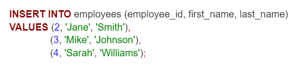
</div>

У цьому прикладі ми вставляємо три нові рядки даних у таблицю
**«employees»** із різними значеннями для кожного рядка.

Команда **INSERT** дозволяє нам додавати нові дані до таблиць,
розширюючи нашу базу даних і збагачуючи інформацію. Вона є важливим
інструментом у роботі з даними й дозволяє нам створювати, оновлювати та
керувати інформацією в наших таблицях.

**<div style="text-align: center; font-size: 24px;">Команда UPDATE (оновлення)</div>**

📌 *Команда **UPDATE** використовується для зміни вже наявних записів у
таблиці бази даних.*

Синтаксис команди **UPDATE** виглядає так:

<div align="center">
  
</div>

Тут:

***«table_name»*** --- це назва таблиці, у якій ти хочеш оновити дані.

***«column1, column2, \...»*** --- це стовпці, значення яких ти хочеш
змінити.

***«value1, value2, \...»*** --- це нові значення, на які ти хочеш
замінити наявні значення у вказаних стовпцях.

Ключове слово **WHERE** використовується для вказування умови, яка
визначає, які рядки повинні бути оновлені. Це дозволяє тобі вибрати
конкретні рядки для оновлення, відповідно до заданих критеріїв.


**<div style="text-align: center; font-size: 24px;">Приклад команди UPDATE</div>**

```sql
UPDATE Employees
SET LastName = 'Smith'
  WHERE EmployeeID = 1;
```

Якщо ми хочемо змінити прізвище співробітника з **ID 1** на **«Smith»**
у таблиці **«Employees»**, ми можемо використати
команду **UPDATE** таким чином:

<div align="center">
  
</div>

Команда **UPDATE** дозволяє змінювати дані в таблицях, що відповідно дає
нам змогу оновлювати й корегувати інформацію згідно з нашими потребами.
Вона є потужним інструментом у роботі з даними й дозволяє нам
підтримувати актуальність і точність інформації в нашій базі даних.

**<div style="text-align: center; font-size: 24px;">Команда DELETE (видалення)</div>**

*📌 Команда **DELETE** використовується для видалення записів із таблиці
бази даних.*

Синтаксис команди **DELETE** виглядає так:

<div align="center">
  
</div>

Тут:

***«table_name»*** --- це назва таблиці, з якої ти хочеш видалити дані.

Ключове слово **FROM** використовується для вказівки таблиці.

Ключове слово **WHERE** дозволяє тобі вказати умову, за якою будуть
вибрані рядки для видалення.


**<div style="text-align: center; font-size: 24px;">Приклад команди DELETE</div>**

```sql
DELETE FROM Employees
  WHERE EmployeeID = 1;
```

Якщо ми хочемо видалити співробітника з **ID 1** з таблиці
**«Employees»**, то ми можемо використати команду **DELETE** таким
чином:

<div align="center">
  
</div>

Важливо пам\'ятати, що перед застосуванням
команд **UPDATE** і **DELETE**, особливо з використанням
умови **WHERE**, рекомендується зробити резервну копію даних, щоб
уникнути їх втрати у разі помилкової дії.

Команда **DELETE** дозволяє нам видаляти дані з таблиць, що відповідно
дає нам змогу керувати інформацією в нашій базі даних і очищувати її.
Крім того, ця команда допомагає нам підтримувати актуальність і чистоту
даних у нашій базі даних, звільняючи місце та видаляючи непотрібні або
застарілі записи.

Як бачиш, мова маніпулювання даними надає нам засоби для керування
інформацією в базі даних. Вона дозволяє додавати нові дані, оновлювати
наявні та видаляти непотрібні записи, що є важливою частиною роботи з
базами даних. Усе просто і зрозуміло. Проте, як завжди, є свої
особливості, про які необхідно пам\'ятати:

**Мова маніпулювання даними (DML)** --- це частина мови SQL, яка
використовується для додавання, зміни та видалення даних у базі даних.

Команда **INSERT** дозволяє вставляти нові рядки даних до таблиці. Вона
дає нам можливість додавати нову інформацію до бази даних і розширювати
її вміст.

Команда **UPDATE** дозволяє змінювати значення в наявних рядках таблиці.
Вона дає можливість оновлювати дані та вносити корективи до вже наявної
інформації.

Команда **DELETE** використовується для видалення рядків даних із
таблиці. Вона надає можливість видаляти непотрібні або застарілі
записи, звільняючи місце й підтримуючи базу даних актуальною та чистою.

Під час використання команд** INSERT, UPDATE і DELETE** необхідно бути
обережними й ретельно перевіряти умови та значення, щоб уникнути
небажаних змін або втрати даних.

**<div style="text-align: center; font-size: 24px;">Операції CRUD</div>**

***📌CRUD** --- це абревіатура, яка походить зі світу комп'ютерного
програмування та стосується чотирьох основних функцій, які вважаються
необхідними для реалізації програми постійного зберігання:*

-   **Create** --- створення;

-   **Read** --- читання;

-   **Update** --- оновлення;

-   **Delete** --- видалення.

**Постійне зберігання** стосується будь-якого пристрою зберігання даних,
який утримує інформацію після вимкнення пристрою, наприклад, жорсткий
диск або твердотілий накопичувач. Це тип електронної пам\'яті, що
зберігає дані навіть за відсутності живлення. Вона отримала назву
«енергонезалежна» завдяки своїй здатності зберігати інформацію навіть
без електричної енергії. А от оперативна пам'ять і внутрішнє кешування є
прикладами енергозалежної пам'яті.

Організаціям, які ведуть облік даних клієнтів, облікових записів,
платіжної інформації, даних про стан здоров'я та інших записів,
необхідне обладнання та програми для постійного зберігання даних. Бази
даних саме відповідають цьому опису.

Користувачі можуть викликати чотири функції **CRUD** для виконання
різних типів операцій над вибраними даними в базі даних. Це можна
зробити за допомогою коду (який ми вивчаємо вже протягом чотирьох
занять) або через графічний інтерфейс користувача.

Давай детально розглянемо кожен із чотирьох компонентів, щоб повністю
оцінити їх загальне значення для спрощення взаємодії з базами даних.

Функція створення **(Create) **дозволяє користувачам створювати новий
запис у базі даних. Здогадуєшся, яка саме команда в SQL відповідає за
створення? Правильно, **INSERT**! Під час виконання
функції Create необхідно вказати значення для кожного поля, яке потрібно
заповнити. Наприклад, можна створити новий запис у таблиці
«Співробітники» і вказати ім\'я, прізвище, посаду та іншу інформацію про
співробітника.

Функція читання **(Read)** подібна до функції пошуку або вибірки даних.
У SQL за це відповідає наша улюблена команда **SELECT**. Функція
читання дозволяє отримати інформацію про наявні записи або об\'єкти в
базі даних. Під час виконання функції **Read** можна вказати певні умови
для вибірки даних, наприклад, отримати всі записи з таблиці
«Співробітники», де посада відповідає критерію «Менеджер».

Функція оновлення **(Update)** використовується для зміни наявних
записів у базі даних. Щоб повністю змінити запис, користувачам, можливо,
доведеться змінити інформацію в кількох полях. За це відповідає
команда **UPDATE**. Наприклад, ресторан, який зберігає рецепти для
пунктів меню в базі даних, може мати таблицю з атрибутами «страва», «час
приготування», «вартість» і «ціна». Одного разу шеф-кухар вирішує
замінити інгредієнт у страві якимось іншим. У результаті наявний запис у
базі даних потрібно змінити, тобто змінити значення відповідних
атрибутів, щоб відобразити характеристики нової страви.

Функція видалення **(Delete)** використовує команду **DELETE** для
видалення даних. Під час виконання функції **Delete** необхідно вказати
умови, що визначають, які саме дані треба видалити. Наприклад, можна
видалити записи про співробітника, який більше не працює в компанії, або
видалити клієнта, який більше не є активним.

Тут є сенс ввести поняття жорсткого або м'якого видалення. Жорстке
видалення остаточно видаляє записи з бази даних, тоді як м'яке
видалення може просто оновити статус рядка, позначити його як видалений,
зберігаючи дані на місці та недоторканими.

Операції **CRUD** широко використовуються в багатьох програмах, які
підтримують реляційні бази даних. Ці чотири основні функції **CRUD**
неймовірно універсальні, оскільки можуть підтримувати низку важливих
функцій у різних бізнес-моделях і галузевих вертикалях.

Розуміння операцій **CRUD** допомагає працювати з даними в аналітичних
завданнях більш ефективно. Це навичка, що дозволяє створювати,
отримувати, оновлювати та видаляти дані, які є важливими для роботи з
базами даних у сфері аналітики.

**<div style="text-align: center; font-size: 24px;">Об'єднання даних із декількох таблиць</div>**

Ми навчилися використовувати оператор SELECT для запиту даних з однієї
таблиці. Однак SELECT не обмежується даними запиту лише з однієї
таблиці. SELECT може зв'язувати декілька таблиць.

Процес зв\'язування таблиць називається з\'єднанням --- **JOIN**.

SQL надає багато видів з'єднань. Ось деякі з них:

-   внутрішнє з'єднання **(INNER JOIN)**;

-   ліве з'єднання **(LEFT JOIN)**;

-   праве з'єднання **(RIGHT JOIN)**;

-   повне зовнішнє з'єднання **(FULL JOIN)**;

-   перехресне з\'єднання **(CROSS JOIN)**.

**<div style="text-align: center; font-size: 24px;">INNER JOIN</div>**

Припустимо, у тебе є дві таблиці: **A** і **B**.

Таблиця A має чотири рядки з даними: **(1,2,3,4)**. Таблиця B має також
чотири рядки з даними: **(3,4,5,6)**.

Коли таблиця A об'єднується з таблицею B за допомогою внутрішнього
з\'єднання, ми отримуємо набір результатів **(3,4)**, який є перетином
таблиць **A** і **B**, тобто залишаються тільки спільні елементи.

Розгляньмо наступне зображення.

<div align="center">
  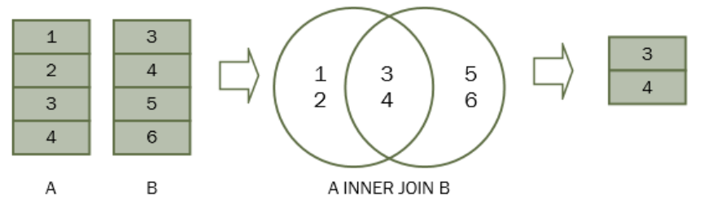
</div>

Для кожного рядка в таблиці **A** внутрішнє з\'єднання знаходить
відповідні рядки в таблиці B. Якщо рядок збігається, він включається в
остаточний набір результатів.

Припустимо, стовпці **a** і **b** знаходяться в таблицях **A** і **B**
відповідно. Наступний запит ілюструє синтаксис внутрішнього з'єднання:

```sql
SELECT A.n
FROM A
INNER JOIN B
  ON B.n = A.n;
```

Оператор **INNER JOIN** з'являється після **FROM**. Умова відповідності
між таблицями **A** і **B** вказується після ключового слова **ON**. Ця
умова називається умовою з'єднання, тобто **B.n = A.n**.

Оператор **INNER JOIN** може об'єднати три або більше таблиць, якщо вони
мають зв'язки, як правило, зв'язки зовнішнього ключа.

Наприклад, наступний оператор ілюструє, як об'єднати 3 таблиці: **A**,
**<div style="text-align: center; font-size: 24px;">B** і **C:</div>**

```sql
SELECT A.n
FROM A
INNER JOIN B
  ON B.n = A.n
INNER JOIN C
  ON C.n = A.n;
```

Давай використаємо таблиці **employees** і **departments**, щоб
продемонструвати, як працює **INNER JOIN.**

<div align="center">
  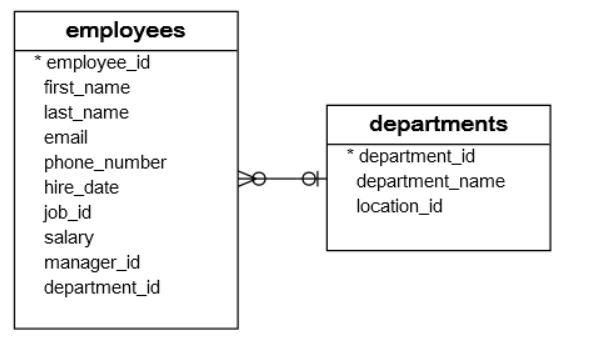
</div>

Кожен співробітник належить до одного й лише одного відділу, тоді як у
кожному відділі може бути більше одного співробітника. Відношення
між **departments** та **employees** --- «один до багатьох».

Стовпець **department_id** у таблиці **employees** є стовпцем
зовнішнього ключа, який пов'язує **employees** з
таблицею **departments**.

**<div style="text-align: center; font-size: 24px;">Запит 1</div>**

Щоб отримати інформацію про ідентифікатори відділів **1, 2** і **3**, ти
використаєш такий оператор (ми вже знаємо, як це писати):

```sql
SELECT department_id
     , department_name
FROM HR.departments
WHERE department_id IN (1, 2, 3);
```

<div align="center">
  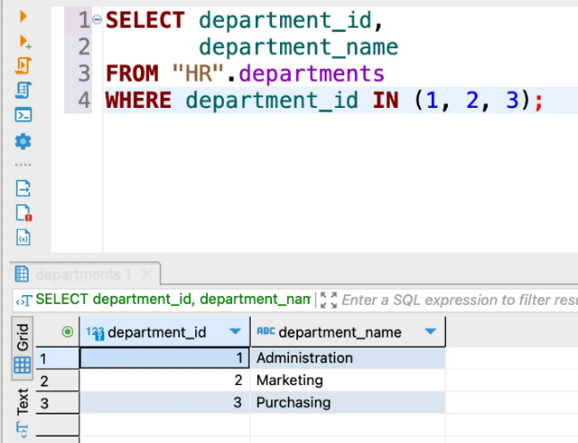
</div>

А тепер спробуємо об'єднати ці два запити за допомогою внутрішнього
з'єднання:

```sql
SELECT first_name
     , last_name
     , employees.department_id
     , departments.department_id
     , department_name
FROM HR.employees
INNER JOIN HR.departments
  ON departments.department_id = employees.department_id
    WHERE employees.department_id IN (1, 2, 3);
```

<div align="center">
  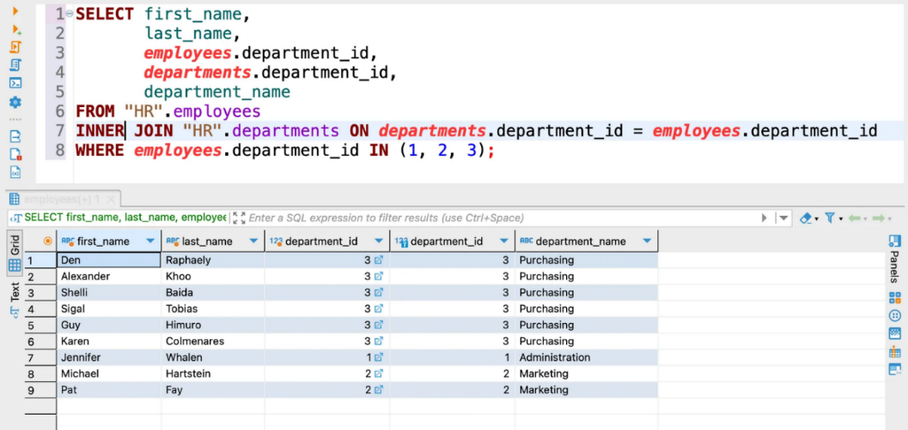
</div>

Для кожного рядка в **employees** оператор перевіряє, чи значення
стовпця **department_id** дорівнює значенню стовпця **department_id** у
таблиці **departments**.

Якщо умова **employees.department_id =
departments.department_id** задовольняється, то об'єднаний рядок, який
містить дані з рядків обох таблиць **(employees і departments),**
включається до набору результатів.

Зверни увагу, що обидві таблиці мають однакові назви
стовпців **department_id**, тому нам довелося позначити стовпець
**department_id** за допомогою синтаксису **table_name.column_name**.

**<div style="text-align: center; font-size: 24px;">Запит 2</div>**

Наступний запит використовує внутрішнє з'єднання, щоб об'єднати 3
таблиці: співробітники, відділи та вакансії --- для того, щоб отримати
ім'я, прізвище, посаду та назву відділу співробітників, які працюють у
відділі з ідентифікаторами **1**, **2** і **3**.

```sql
SELECT first_name
     , last_name
     , job_title
     , department_name
FROM HR.employees e
INNER JOIN HR.departments d
  ON d.department_id = e.department_id
INNER JOIN HR.jobs j
  ON j.job_id = e.job_id
WHERE e.department_id IN (1, 2, 3);
```

Круто, але є одна проблема. Внутрішнє з'єднання прибирає рядки, які не
збігаються з рядками іншої таблиці.

Тут на допомогу приходить **LEFT JOIN** --- ліве з\'єднання, що повертає
всі рядки з лівої таблиці, незалежно від того, чи є відповідний рядок у
правій таблиці.

**<div style="text-align: center; font-size: 24px;">LEFT JOIN</div>**

Припустимо, у нас є дві таблиці: A і B. Таблиця A має чотири рядки: **1,
2, 3** і **4**. Таблиця B також має чотири рядки: **3, 4, 5, 6**.

Коли ми об'єднуємо таблицю **A** з таблицею **B**, усі рядки в таблиці
**A** (ліва таблиця) включаються в набір результатів, незалежно від
того, чи є відповідний рядок у таблиці **B** чи ні.

<div align="center">
  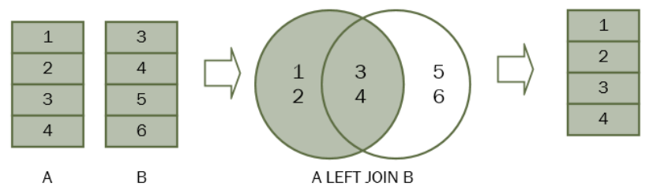
</div>

У SQL ми використовуємо наступний синтаксис для з'єднання таблиці **A**
з таблицею **B**.
```sql
SELECT A.n
FROM A
LEFT JOIN B
  ON B.n = A.n;
```

**LEFT JOIN** з'являється після **FROM**. Умова, що йде за ключовим
словом **ON**, називається умовою з'єднання.

Давай розглянемо таблиці **countries** і **locations**.

Кожна локація належить одній і лише одній країні, тоді як кожна країна
може мати нуль або більше локацій. Зв'язок між таблицями країн і локацій
--- «один до багатьох».

Стовпець **country_id** у таблиці **locations** є зовнішнім ключем, який
посилається на стовпець **country_id** у таблиці **country**.

Щоб вивести назви країн **(county_name)** США, Великобританії та Китаю,
ми використаємо такий оператор:

```sql
SELECT country_id

```
, country_name

FROM \"HR\".countries

WHERE country_id IN (\'US\', \'UK\', \'CN\');

Наступний запит виводить місцезнаходження (**street_address**) в США,
Великобританії та Китаї:

```sql
-- Locations in US, UK and CN
SELECT l.country_id
     , l.street_address
     , l.city
FROM HR.locations AS l
  WHERE l.country_id IN ('US', 'UK', 'CN');
```

**<div style="text-align: center; font-size: 24px;">Запит 1</div>**

Тепер ми використовуємо **LEFT JOIN**, щоб об'єднати таблицю країн із
таблицею локацій у вигляді наступного запиту:

```sql
-- Locations for US, UK and CN (LEFT JOIN countries -> locations)
SELECT c.country_name
     , c.country_id
     , l.location_id
     , l.street_address
     , l.city
FROM HR.countries AS c
LEFT JOIN HR.locations AS l
  ON l.country_id = c.country_id
    WHERE c.country_id IN ('US', 'UK', 'CN')
ORDER BY c.country_name;
```

<div align="center">
  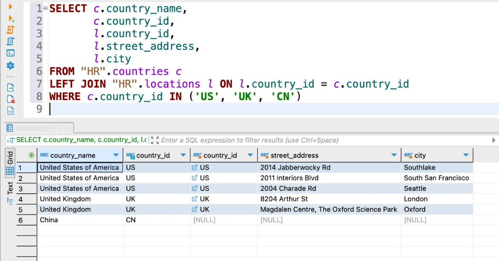
</div>

Умова **WHERE** застосована, щоб оператор отримував дані лише з рядків
**США**, **Великобританії** та **Китаю**.

Оскільки ми використовуємо **LEFT JOIN**, усі рядки, які задовольняють
умову **WHERE**, включаються до набору результатів.

Для кожного рядка в таблиці країн **LEFT JOIN** знаходить відповідні
рядки в таблиці локацій.

Якщо знайдено принаймні один відповідний рядок, то механізм бази даних
поєднає дані зі стовпців відповідних рядків в обох таблицях.

Якщо відповідного рядка не знайдено, наприклад, із **country_id CN**, то
рядок у таблиці країн включається в набір результатів, а рядок у таблиці
локацій заповнюється значеннями **NULL**.

Тепер дуже просто можна знайти країну, яка не має жодного розташування в
таблиці локацій:
```sql
-- Countries without any locations
SELECT c.country_name
FROM HR.countries AS c
LEFT JOIN HR.locations AS l
  ON l.country_id = c.country_id
    WHERE l.location_id IS NULL
ORDER BY c.country_name;
```

<div align="center">
  
</div>

**<div style="text-align: center; font-size: 24px;">Запит 2</div>**

Наступний запит демонструє, як об'єднати 3 таблиці: регіони, країни та
місця розташування:

```sql
SELECT r.region_name
     , c.country_name
     , l.street_address
     , l.city
FROM HR.regions AS r
LEFT JOIN HR.countries AS c
  ON c.region_id = r.region_id
LEFT JOIN HR.locations AS l
  ON l.country_id = c.country_id
    WHERE c.country_id IN ('US', 'UK', 'CN')
ORDER BY r.region_name, c.country_name;
```

<div align="center">
  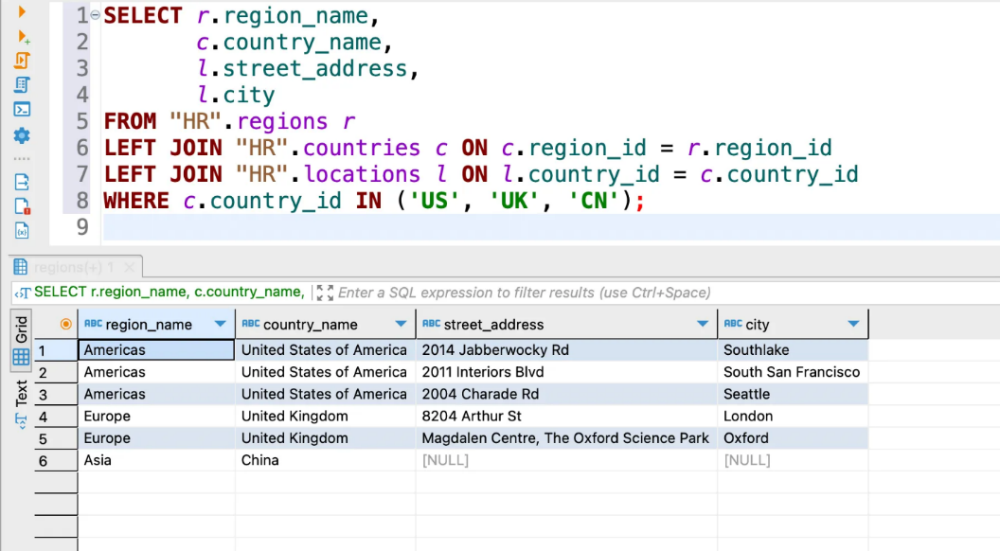
</div>

Праве з\'єднання **RIGHT JOIN** працює аналогічно, як ліве з\'єднання,
лише за **базову (основну)** таблицю використовується та, що справа.

**<div style="text-align: center; font-size: 24px;">FULL JOIN</div>**

*📌 Повне зовнішнє з\'єднання --- це комбінація лівого та правого
з'єднань. Повне зовнішнє з\'єднання включає всі рядки з об'єднаних
таблиць, незалежно від того, чи є в іншій таблиці відповідний рядок.*

Якщо рядки в об'єднаних таблицях не збігаються, то набір результатів
повного зовнішнього з\'єднання містить значення **NULL** для кожного
стовпця таблиці, у якому відсутній відповідний рядок. Для відповідних
рядків один рядок, який містить стовпці, заповнені з об'єднаної таблиці,
включається до набору результатів.

Наступний оператор ілюструє синтаксис повного зовнішнього
з\'єднання двох таблиць:

```sql
SELECT column_list
FROM A
FULL OUTER JOIN B
  ON B.n = A.n;
```

Зауваж, що ключове слово **OUTER** необов'язкове.

Наступна діаграма ілюструє повне зовнішнє з'єднання двох таблиць.

<div align="center">
  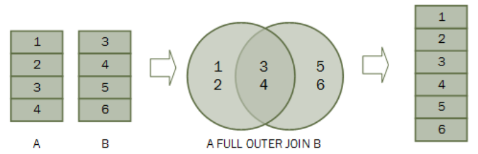
</div>

На практиці такий тип з'єднань зустрічається не так часто.

**<div style="text-align: center; font-size: 24px;">CROSS JOIN</div>**

**Перехресне з'єднання** --- це операція з'єднання, яка створює
**декартів добуток** двох або більше таблиць. Пам\'ятаєш зі шкільних
років, що це таке?

У математиці **декартів добуток** --- це математична операція, яка
повертає набір, що складається з **комбінацій елементів** інших наборів.

Наприклад, із двома наборами: **A {x,y,z}** і **B {1,2,3}** --- декартів
добуток **A x B** є набором усіх упорядкованих пар: **(x,1), (x,2),
(x,3), (y,1) (y,2), (y,3), (z,1), (z,2), (z,3).**

Наступне зображення ілюструє декартів добуток A і B:

<div align="center">
  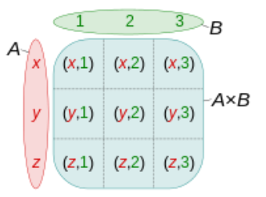
</div>

Подібним чином у SQL декартів добуток двох таблиць **(A** і **B)** є
набором результатів, у якому кожен рядок у першій таблиці **(A)**
поєднується з кожним рядком у другій таблиці **(B).** Припустимо,
що таблиця A має n рядків, а таблиця **B** має **m** рядків. Результат
перехресного з'єднання таблиць **A** і **B** має (**n) x (m)** рядків.

Нижче наведено синтаксис оператора **CROSS JOIN**:

```sql
SELECT column_list
FROM A
  CROSS JOIN B;
```

На наступному зображенні показано результат перехресного з'єднання між
таблицею **A** й таблицею **B**.

На цій ілюстрації таблиця A має три рядки: **1, 2** та **3**, а таблиця
B також має три рядки: **x, y** та **z. У** результаті декартів добуток
має дев\'ять рядків:

<div align="center">
  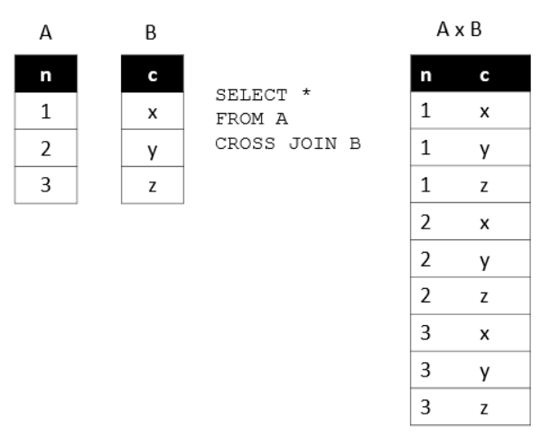
</div>

Такий тип запитів також не часто зустрічається в повсякденній роботі. В
основному ми його застосовуємо, щоб отримати всі можливі комбінації
даних із різних таблиць або ж комбінації в межах однієї таблиці.

**<div style="text-align: center; font-size: 24px;">Різниця між UNION і JOIN</div>**

Сьогодні ми розглядали команду **JOIN**, тому в тебе може виникнути
запитання --- а навіщо тоді потрібна команда **UNION** і чи є вона
дублікатом **JOIN**? Давай розберемось.

-   **UNION** відрізняється від **JOIN** тим,
    що **JOIN** поєднує стовпці кількох таблиць, тоді
    як **UNION** об'єднує рядки таблиць.

-   **JOIN** застосовується лише тоді, коли дві задіяні таблиці мають
    принаймні один стовпець, спільний для обох. Існує декілька
    типів **JOIN**: **INNER JOIN, LEFT JOIN, RIGHT JOIN, FULL OUTER
    JOIN.**

-   **UNION** застосовується, коли дві таблиці мають однакову кількість
    стовпців. Існують тільки два типи **UNION**: **UNION** та **UNION
    ALL**.

Отже, у **JOIN** рядок результатів має більший розмір, оскільки містить
стовпці з обох таблиць (якщо, звісно, ти не відібрав/-ла ті, які
потрібні тобі).

З іншого боку, в **UNION** кількість рядків збільшується, адже в
результат враховуються рядки з обох таблиць, які присутні в запиті.

<div align="center">
  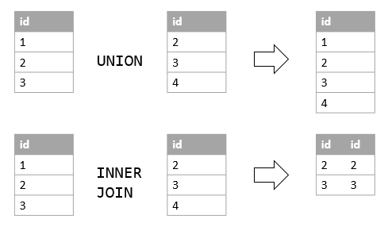
</div>

**<div style="text-align: center; font-size: 24px;">Приклад CTE з використанням JOIN</div>**

У минулій темі ми розглянули використання **CTE**, які бувають особливо
корисні, коли потрібно обʼєднати дані з різних таблиць, тому давай
розглянемо такий кейс на прикладі.

У цьому прикладі ми використовуємо **CTE** з назвою
**«employees_hierarchy»**, щоб побудувати ієрархію співробітників у
компанії.

```sql
WITH RECURSIVE employees_hierarchy AS (
  SELECT
    employee_id,
    first_name,
    last_name,
    manager_id,
    1 AS level
  FROM HR.employees
    WHERE manager_id IS NULL -- Вибрати кореневих співробітників (без менеджера)

  UNION ALL

  SELECT
    e.employee_id,
    e.first_name,
    e.last_name,
    e.manager_id,
    eh.level + 1
  FROM HR.employees AS e
  INNER JOIN employees_hierarchy AS eh
    ON e.manager_id = eh.employee_id
)
SELECT
  employee_id,
  first_name,
  last_name,
  manager_id,
  level
FROM employees_hierarchy
ORDER BY level, employee_id;
```

**RECURSIVE** у цьому запиті вказує SQL на те, що **CTE** має звертатися
сам до себе, тобто працює рекурсивно. Це потрібно для того, щоб запит
обробив усі рівні ієрархії працівників.

**<div style="text-align: center; font-size: 24px;">Запит містить дві частини:</div>**

1.  Перша частина вибирає кореневих співробітників, тобто тих, у яких не
    вказаний менеджер (кореневий рівень ієрархії). Вона використовує
    фільтр **WHERE manager_id IS NULL.**

2.  Друга частина використовує рекурсивне об\'єднання **(UNION ALL)**
    для приєднання до кожного співробітника його підлеглих. Вона
    використовує **JOIN** між таблицею **employees** і **CTE**
    **employees_hierarchy**, де **e.manager_id = eh.employee_id**.

У результаті отримуємо список співробітників з їхніми рівнями в
ієрархії, відсортований за рівнями й ідентифікаторами співробітників.

**<div style="text-align: center; font-size: 24px;">Ось декілька ключових висновків:</div>**

-   Об\'єднання таблиць дозволяє об\'єднати дані з двох або більше
    таблиць на основі збігу значень у певних стовпцях. Це дозволяє
    отримати одну розширену таблицю, яка містить інформацію з усіх
    вихідних таблиць.

-   Для об'єднання таблиць в SQL використовуються оператори **JOIN**.
    Найпоширеніші типи об'єднань **--- INNER JOIN, LEFT JOIN, RIGHT
    JOIN** і **FULL JOIN**. Кожен тип об'єднання має свої особливості й
    визначає, які рядки будуть включені до результату.

-   Під час об'єднання таблиць необхідно вказати умову
    відповідності (зіставлення) для визначення, які рядки повинні бути
    об'єднані. Зазвичай це робиться за допомогою оператора **ON**, який
    визначає стовпці, за якими відбувається порівняння.

-   Об'єднання таблиць дозволяє поєднувати інформацію з різних таблиць,
    щоб отримати повний набір даних для аналізу. Наприклад, можна
    об'єднати таблиці **«Замовлення»** і **«Клієнти»,** щоб отримати
    інформацію про клієнтів, які зробили замовлення, і пов\'язати їх
    дані для подальшого аналізу.

-   Під час проєктування баз даних рекомендується
    використовувати зв\'язки між таблицями, щоб уникнути надлишковості
    даних. Це дозволяє об\'єднувати таблиці за ключовими полями, які
    зв\'язують записи з різних таблиць і забезпечують цілісність даних.

-   Об\'єднання таблиць може бути виконано не тільки на основі рівності
    значень, але й з використанням інших операцій порівняння, таких як
    більше, менше або дано (містить). Це дозволяє більш гнучко
    фільтрувати дані під час об\'єднання.

-   Команди **JOIN** і **UNION** не є ідентичними одна одній, тому
    важливо пам\'ятати їх основні відмінності:

-   **JOIN** застосовується лише тоді, коли дві задіяні таблиці мають
    принаймні один стовпець, загальний для обох.

-   **UNION** застосовується, коли дві таблиці мають однакову кількість
    стовпців.

Загалом об'єднання даних із кількох таблиць у SQL є важливим
інструментом для роботи з великими обсягами даних та аналізу інформації
з різних джерел. Правильне використання операторів **JOIN** і розуміння
**типів об'єднань** сприятимуть створенню цілісного уявлення про
дані та допоможуть здобути важливі висновки з об'єднаних таблиць.