**Language:** English | [Українська](../../i18n/uk/course/lessons/lesson_4_robota_z_danymy_dml.md)

<h2 align="center">Data Manipulation Language (DML) (insert, update, delete statements)</h2>

**DBMS scope:** [CORE] (portable SQL fundamentals).

Today we will take a closer look at the data manipulation language
**(DML)** which contains the **INSERT, UPDATE and DELETE** commands. 
study this topic? 

Imagine that your database is a big box with different colors
designers. 
tables, similar to how you build and modify different models with
designer 

- The first **INSERT** command allows you to insert new lines
data into a table. 
models from the constructor. 
or use values ​​from other tables.

- The following command **UPDATE** (update) allows you to update already
existing rows of data in the table. 
already created model. 
or even change values ​​based on certain conditions.

- And finally, the **DELETE** command allows you to delete rows
data from the table. 
models from the constructor. 
data or even clear the entire table.

Why should we learn **INSERT**, **UPDATE** and **DELETE** commands? 
they give us full control over the data! 
records, change them or delete them to keep our database up to date
and met our needs.

Let's consider each of the commands and their syntax in more detail.

<h2 align="center">INSERT command</h2>

*📌 The **INSERT** command is used to insert (or add) new ones
entries in the database table.*

The syntax for the **INSERT** command is as follows:

<div align="center">
  
</div>

Here:

***"table_name"*** --- this is the name of the table into which you want to insert data.

***"column1, column2, \..."*** --- this is a list of table columns in which you
want to insert a value.

***"value1, value2, \..."*** --- these are the corresponding values ​​you want
to add

It is important to make sure that the number of columns and values ​​match one
one 
expected column types.


<h2 align="center">An example of the INSERT command</h2>

```sql
INSERT INTO Employees (EmployeeID, FirstName, LastName)
VALUES (1, 'Іван', 'Петров');
```

If we have a table **"Employees"** with columns **"EmployeeID",
"FirstName"** and **"LastName"**, we can add a new employee for
using the INSERT command as follows:

<div align="center">
  
</div>

You can also insert multiple rows of data at once by specifying multiple
sets of values ​​separated by a comma: 

<div align="center">
  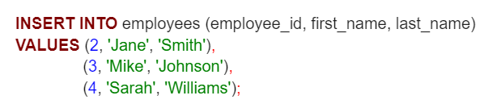
</div>

In this example, we insert three new rows of data into the table
**"employees"** with different values ​​for each row.

The **INSERT** command allows us to add new data to tables,
expanding our database and enriching information. 
tool in working with data and allows us to create, update and
manage the information in our tables.

<h2 align="center">UPDATE command</h2>

📌 *The **UPDATE** command is used to change already existing records in
database tables.*

The **UPDATE** command syntax looks like this:

<div align="center">
  
</div>

Here:

***"table_name"*** --- this is the name of the table in which you want to update the data.

***"column1, column2, \..."*** --- these are the columns whose values ​​you want
change.

***"value1, value2, \..."*** --- these are the new values ​​you want
replace the existing values ​​in the specified columns.

The **WHERE** keyword is used to specify a condition which
specifies which rows should be updated. 
specific rows to update, according to the specified criteria.


<h2 align="center">Example of the UPDATE command</h2>

```sql
UPDATE Employees
SET LastName = 'Smith'
  WHERE EmployeeID = 1;
```

If we want to change an employee's last name from **ID 1** to **"Smith"**
in the **"Employees"** table, we can use
**UPDATE** command as follows:

<div align="center">
  
</div>

The **UPDATE** command allows you to change the data in the tables, which accordingly gives
we can update and correct the information according to our needs.
It is a powerful tool in working with data and allows us
maintain the relevance and accuracy of the information in our database.

<h2 align="center">DELETE command</h2>

*📌 The **DELETE** command is used to delete records from a table
database.*

The **DELETE** command syntax is as follows:

<div align="center">
  
</div>

Here:

***"table_name"*** --- this is the name of the table from which you want to delete data.

The **FROM** keyword is used to specify a table.

The **WHERE** keyword allows you to specify the condition under which they will be
selected rows to delete.


<h2 align="center">Example of the DELETE command</h2>

```sql
DELETE FROM Employees
  WHERE EmployeeID = 1;
```

If we want to delete the employee with **ID 1** from the table
**"Employees"** then we can use **DELETE** command like this
as follows:

<div align="center">
  
</div>

It is important to remember that before use
**UPDATE** and **DELETE** commands, especially using
**WHERE** conditions, it is recommended to back up your data so that
avoid losing them in the event of a wrong action.

The **DELETE** command allows us to delete data from the respective tables
enables us to manage and clean the information in our database.
Additionally, this team helps us keep things current and clean
data in our database, freeing up space and deleting unnecessary or
outdated records.

As you can see, a data manipulation language provides us with tools to manipulate
information in the database. 
existing and delete unnecessary records, which is an important part of working with
databases. 
features that need to be remembered:

**Data Manipulation Language (DML)** is a part of the SQL language that
is used to add, modify and delete data in the database.

The **INSERT** command allows you to insert new rows of data into a table. 
gives us the ability to add new information to the database and expand
its content.

The **UPDATE** command allows you to change values ​​in existing table rows.
It provides an opportunity to update data and make corrections to existing data
information

The **DELETE** command is used to delete rows of data from
tables. 
records, freeing up space and keeping the database up-to-date and clean.

When using the **INSERT, UPDATE, and DELETE** commands, you must be
be careful and check conditions and values ​​carefully to avoid
unwanted changes or data loss.

<h2 align="center">CRUD operations</h2>

***📌CRUD** is an acronym that comes from the computer world
programming and refers to the four main functions that are considered
necessary for the implementation of the permanent storage program:*

- **Create** --- creation;

- **Read** --- reading;

- **Update** --- update;

- **Delete** --- deletion.

**Persistent storage** refers to any data storage device that
which retains information after the device is turned off, such as hard
disk or solid state drive. 
retains data even without power. 
"energy-independent" due to its ability to store information even
without electricity. 
examples of non-volatile memory.

Organizations that keep records of customer data, accounts,
payment information, health data and other records,
necessary equipment and programs for permanent data storage. 
data exactly matches this description.

Users can call four **CRUD** functions to execute
various types of operations on selected data in the database. 
to do with code (which we have been studying for four
classes) or through a graphical user interface.

Let's take a closer look at each of the four components in order to fully
evaluate their overall value for simplifying interaction with databases.

The Create function allows users to create a new one
record in the database. 
creation? 
the Create function must provide a value for each field that is required
to fill 
"Employees" and indicate the name, surname, position and other information about
an employee

The Read function is similar to the function of searching or retrieving data.
In SQL, our favorite **SELECT** command is responsible for this. 
reading allows you to obtain information about existing records or objects in
database. 
to sample data, for example, get all records from a table
"Employees", where the position corresponds to the criterion "Manager".

The update function **(Update)** is used to change the existing ones
records in the database. 
you will have to change the information in several fields. 
**UPDATE** command. 
menu items in the database, can have a table with the attributes "dish", "time
preparation", "cost" and "price". 
replace an ingredient in a dish with something else. 
database needs to be modified, i.e. change the values ​​of the relevant ones
attributes to reflect the characteristics of the new dish.

The Delete function uses the **DELETE** command to
data deletion. 
the conditions that determine which data should be deleted. 
delete records of an employee who no longer works for the company, or
delete a client that is no longer active.

Here it makes sense to introduce the concept of hard or soft deletion. 
delete permanently deletes records from the database, while soft
delete can simply update the status of the row, mark it as deleted,
keeping the data in place and intact.

**CRUD** operations are widely used in many applications that
support relational databases. 
incredibly versatile as they can support a number of important
functions in various business models and industry verticals.

Understanding CRUD operations helps you work with data in analytics
tasks more efficiently. 
get, update and delete data that is important to work with
databases in the field of analytics.

<h2 align="center">Combining data from several tables</h2>

We learned how to use the SELECT statement to query data from one
tables. 
tables. 

The process of linking tables is called joining --- **JOIN**.

SQL provides many types of joins. 

- internal connection **(INNER JOIN)**;

- left connection **(LEFT JOIN)**;

- right connection **(RIGHT JOIN)**;

- full external connection **(FULL JOIN)**;

- cross connection **(CROSS JOIN)**.

<h2 align="center">INNER JOIN</h2>

Suppose you have two tables: **A** and **B**.

Table A has four rows of data: **(1,2,3,4)**. 
four lines with data: **(3,4,5,6)**.

When table A is joined to table B using an inner
connection, we get the result set **(3,4)** which is the intersection
of tables **A** and **B**, that is, only common elements remain.

Consider the following image.

<div align="center">
  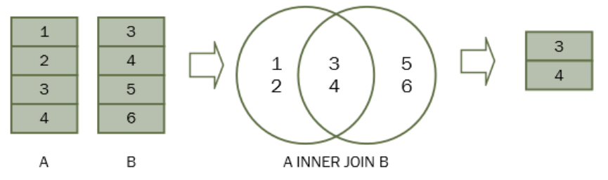
</div>

For each row in table **A**, the inner join is found
matching rows in Table B. If a row matches, it is included in the
the final set of results.

Suppose columns **a** and **b** are in tables **A** and **B**
in accordance. 

```sql
SELECT A.n
FROM A
INNER JOIN B
  ON B.n = A.n;
```

The **INNER JOIN** statement appears after the **FROM**. 
between tables **A** and **B** is specified after the **ON** keyword. 
the condition is called the join condition i.e. **B.n = A.n**.

The **INNER JOIN** operator can join three or more tables if they
have relationships, usually foreign key relationships.

For example, the following statement illustrates how to join 3 tables: **A**,
<h2 align="center">B** and **C:</h2>

```sql
SELECT A.n
FROM A
INNER JOIN B
  ON B.n = A.n
INNER JOIN C
  ON C.n = A.n;
```

Let's use the **employees** and **departments** tables to
demonstrate how **INNER JOIN works.**

<div align="center">
  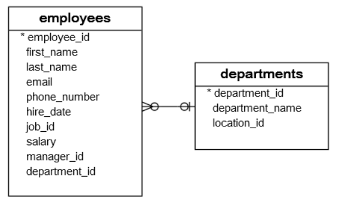
</div>

Each employee belongs to one and only one department, while in
each department may have more than one employee. 
between **departments** and **employees** --- "one to many".

The **department_id** column in the **employees** table is a column
of the foreign key that associates **employees** with
by the **departments** table.

<h2 align="center">Request 1</h2>

For information on Department IDs **1, 2** and **3**, you
use the following operator (we already know how to write it):

```sql
SELECT department_id
     , department_name
FROM HR.departments
WHERE department_id IN (1, 2, 3);
```

<div align="center">
  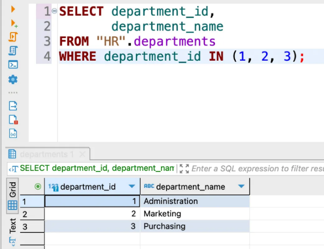
</div>

And now let's try to combine these two requests with the help of an internal one
connection:

```sql
SELECT first_name
     , last_name
     , employees.department_id
     , departments.department_id
     , department_name
FROM HR.employees
INNER JOIN HR.departments
  ON departments.department_id = employees.department_id
    WHERE employees.department_id IN (1, 2, 3);
```

<div align="center">
  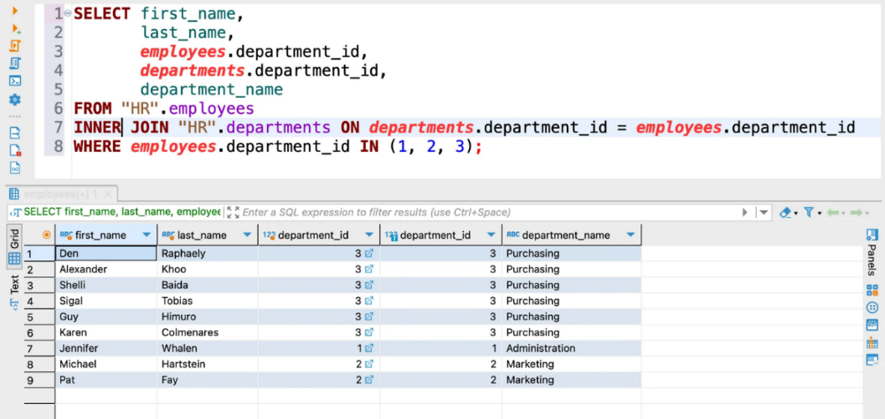
</div>

For each row in **employees**, the statement checks whether the value
of the **department_id** column is equal to the value of the **department_id** column in
**departments** tables.

If the condition **employees.department_id =
departments.department_id** is satisfied, then a concatenated string that
contains data from rows of both tables **(employees and departments),**
is included in the result set.

Note that both tables have the same names
**department_id** columns, so we had to label the column
**department_id** using **table_name.column_name** syntax.

<h2 align="center">Request 2</h2>

The following query uses an inner join to join the 3
tables: Employees, Departments, and Vacancies --- in order to get
name, surname, position and name of the department of employees working in
departments with identifiers **1**, **2** and **3**.

```sql
SELECT first_name
     , last_name
     , job_title
     , department_name
FROM HR.employees e
INNER JOIN HR.departments d
  ON d.department_id = e.department_id
INNER JOIN HR.jobs j
  ON j.job_id = e.job_id
WHERE e.department_id IN (1, 2, 3);
```

Cool, but there is one problem. 
match the rows of another table.

This is where **LEFT JOIN** comes to the rescue---the returning left join
all rows from the left table, regardless of whether the corresponding row is in
right table.

<h2 align="center">LEFT JOIN</h2>

Suppose we have two tables, A and B. Table A has four rows: **1,
2, 3** and **4**. 

When we join table **A** with table **B**, all the rows in the table
**A** (left table) are included in the result set regardless of
whether the corresponding row is in table **B** or not.

<div align="center">
  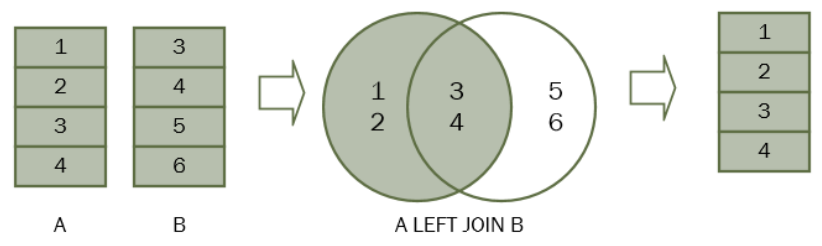
</div>

In SQL we use the following syntax to join table **A**
with table **B**.
```sql
SELECT A.n
FROM A
LEFT JOIN B
  ON B.n = A.n;
```

**LEFT JOIN** appears after **FROM**. 
with the word **ON** is called a connection condition.

Let's look at the **countries** and **locations** tables.

Each location belongs to one and only one country, while each country
can have zero or more locations. 
--- "one to many".

The **country_id** column in the **locations** table is a foreign key that
refers to the **country_id** column in the **country** table.

To output the country names of **(county_name)** US, UK and China,
we will use the following operator:

```sql
SELECT country_id

```
, country_name

FROM \"HR\".countries

WHERE country_id IN (\'US\', \'UK\', \'CN\');

The following query returns the location (**street_address**) in the US,
Great Britain and China:

```sql
-- Locations in US, UK and CN
SELECT l.country_id
     , l.street_address
     , l.city
FROM HR.locations AS l
  WHERE l.country_id IN ('US', 'UK', 'CN');
```

<h2 align="center">Request 1</h2>

Now we use **LEFT JOIN** to join the countries table with
a table of locations in the form of the following query:

```sql
-- Locations for US, UK and CN (LEFT JOIN countries -> locations)
SELECT c.country_name
     , c.country_id
     , l.location_id
     , l.street_address
     , l.city
FROM HR.countries AS c
LEFT JOIN HR.locations AS l
  ON l.country_id = c.country_id
    WHERE c.country_id IN ('US', 'UK', 'CN')
ORDER BY c.country_name;
```

<div align="center">
  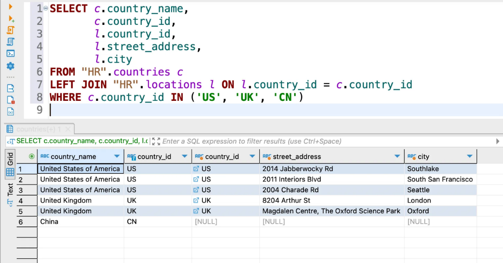
</div>

A **WHERE** condition is applied so that the statement only retrieves data from rows
**USA**, **Great Britain** and **China**.

Since we are using **LEFT JOIN**, all rows that satisfy
**WHERE** condition are included in the result set.

For each row in the countries table, **LEFT JOIN** finds matches
rows in the locations table.

If at least one matching row is found, then the database engine
will combine the data from the columns of the corresponding rows in both tables.

If no matching string is found, for example with **country_id CN**, then
a row in the countries table is included in the result set, and a row in the table
locations is filled with **NULL** values.

Now it is very easy to find a country that does not have any location in it
location tables:
```sql
-- Countries without any locations
SELECT c.country_name
FROM HR.countries AS c
LEFT JOIN HR.locations AS l
  ON l.country_id = c.country_id
    WHERE l.location_id IS NULL
ORDER BY c.country_name;
```

<div align="center">
  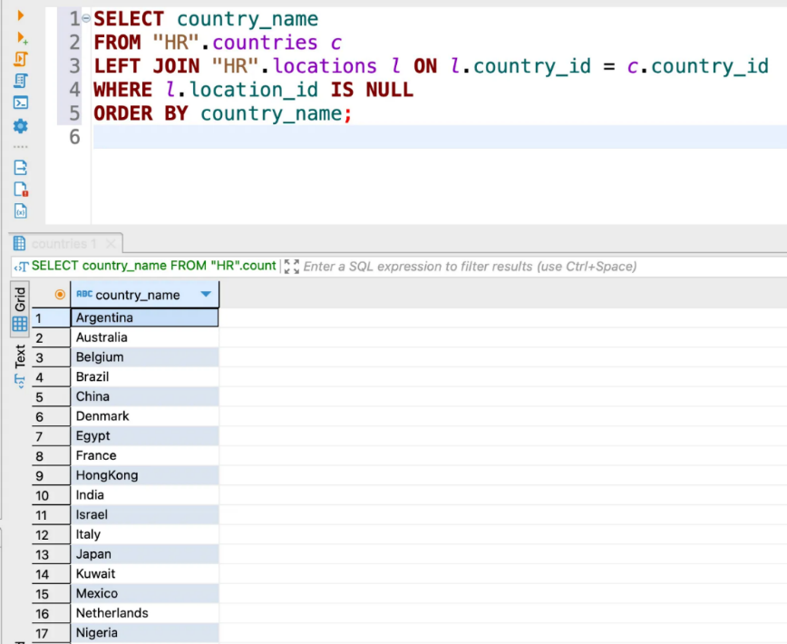
</div>

<h2 align="center">Request 2</h2>

The following query demonstrates how to join 3 tables: regions, countries, and
locations:

```sql
SELECT r.region_name
     , c.country_name
     , l.street_address
     , l.city
FROM HR.regions AS r
LEFT JOIN HR.countries AS c
  ON c.region_id = r.region_id
LEFT JOIN HR.locations AS l
  ON l.country_id = c.country_id
    WHERE c.country_id IN ('US', 'UK', 'CN')
ORDER BY r.region_name, c.country_name;
```

<div align="center">
  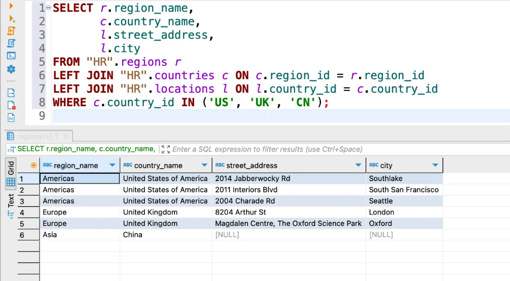
</div>

Right join **RIGHT JOIN** works similarly to left join,
only the one on the right is used for the **base (main)** table.

<h2 align="center">FULL JOIN</h2>

*📌 Full outer join is a combination of left and right
connections 
tables, regardless of whether there is a corresponding row in another table.*

If the rows in the joined tables do not match, then the result set
full outer join contains **NULL** for each
column of the table in which the corresponding row is missing. 
rows one row that contains the columns populated from the joined table,
is included in the result set.

The following statement illustrates the syntax of a full outer
joining two tables:

```sql
SELECT column_list
FROM A
FULL OUTER JOIN B
  ON B.n = A.n;
```

Note that the **OUTER** keyword is optional.

The following diagram illustrates a full outer join between two tables.

<div align="center">
  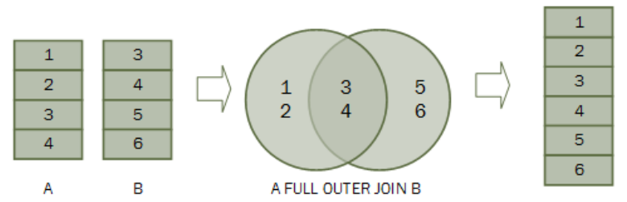
</div>

In practice, this type of connection is not so common.

<h2 align="center">CROSS JOIN</h2>

**Cross join** is a join operation that creates
**cartesian product** of two or more tables. 
years, what is it?

In mathematics, the Cartesian product is a mathematical operation that
returns a set consisting of **combinations of elements** of other sets.

For example, with two sets: **A {x,y,z}** and **B {1,2,3}** --- Cartesians
the product **A x B** is the set of all ordered pairs: **(x,1), (x,2),
(x,3), (y,1) (y,2), (y,3), (z,1), (z,2), (z,3).**

The following image illustrates the Cartesian product of A and B:

<div align="center">
  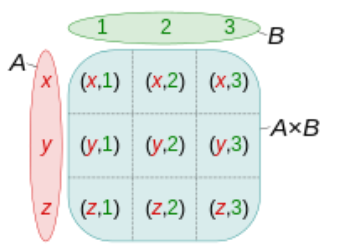
</div>

Similarly, Cartesian SQL has the product of two tables **(A** and **B)**
a result set in which each row in the first table **(A)**
is combined with each row in the second table **(B).** Suppose
that table A has n rows and table B has **m** rows. 
cross join of tables **A** and **B** has (**n) x (m)** rows.

Below is the syntax for the **CROSS JOIN** statement:

```sql
SELECT column_list
FROM A
  CROSS JOIN B;
```

The following image shows the result of a cross connection between
table **A** and table **B**.

In this illustration, table A has three rows: **1, 2**, and **3**, and the table
B also has three strings: **x, y** and **z. 
has nine lines:

<div align="center">
  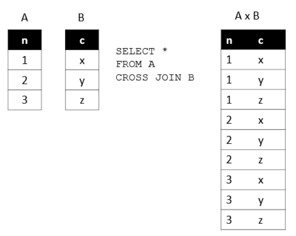
</div>

This type of request is also not often found in everyday work. 
we mainly apply it to get all possible combinations
data from different tables or a combination within the same table.

<h2 align="center">Difference between UNION and JOIN</h2>

Today we looked at the **JOIN** command, so you may have some
question --- then why is the **UNION** command needed and does it exist
by duplicate **JOIN**? 

- **UNION** differs from **JOIN** in that
that **JOIN** joins columns of multiple tables, then
how **UNION** joins the rows of tables.

- **JOIN** applies only when the two tables involved have
at least one column common to both. 
**JOIN** types: **INNER JOIN, LEFT JOIN, RIGHT JOIN, FULL OUTER
    JOIN.**

- **UNION** is applied when two tables have the same count
columns 
    ALL**.

So in **JOIN** the result string is larger because it contains
columns from both tables (unless, of course, you selected those which
you need).

On the other hand, in **UNION** the number of rows increases, because in
the result includes rows from both tables that are present in the query.

<div align="center">
  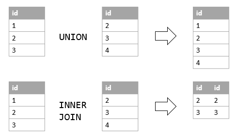
</div>

<h2 align="center">Example of CTE using JOIN</h2>

In the last topic, we covered the use of **CTE**, which are special
useful when you need to combine data from different tables, so go for it
consider such a case as an example.

In this example we use **CTE** named
**"employees_hierarchy"** to build a hierarchy of employees in
companies

```sql
WITH RECURSIVE employees_hierarchy AS (
  SELECT
    employee_id,
    first_name,
    last_name,
    manager_id,
    1 AS level
  FROM HR.employees
    WHERE manager_id IS NULL -- Вибрати кореневих співробітників (без менеджера)

  UNION ALL

  SELECT
    e.employee_id,
    e.first_name,
    e.last_name,
    e.manager_id,
    eh.level + 1
  FROM HR.employees AS e
  INNER JOIN employees_hierarchy AS eh
    ON e.manager_id = eh.employee_id
)
SELECT
  employee_id,
  first_name,
  last_name,
  manager_id,
  level
FROM employees_hierarchy
ORDER BY level, employee_id;
```

**RECURSIVE** in this query tells SQL that the **CTE** should be referenced
to itself, that is, it works recursively. 
processed all levels of the employee hierarchy.

<h2 align="center">The request contains two parts:</h2>

1. The first part selects the root employees, that is, those who do not have
the specified manager (the root level of the hierarchy). 
filter **WHERE manager_id IS NULL.**

2. The second part uses recursive union **(UNION ALL)**
to join each employee of his subordinates. 
uses **JOIN** between **employees** table and **CTE**
**employees_hierarchy** where **e.manager_id = eh.employee_id**.

As a result, we get a list of employees with their levels in
hierarchies sorted by employee levels and IDs.

<h2 align="center">Here are some key takeaways:</h2>

- Joining tables allows you to combine data from two or more
tables based on matching values ​​in certain columns. 
get one extended table that contains information from all
source tables.

- **JOIN** statements are used to join tables in SQL.
The most common types of joins **--- INNER JOIN, LEFT JOIN, RIGHT
JOIN** and **FULL JOIN**. 
specifies which rows will be included in the result.

- A condition must be specified when joining tables
matches (mappings) to determine which strings should be
united 
defines the columns on which the comparison takes place.

- Joining tables allows you to combine information from different tables,
to obtain a complete data set for analysis. 
join **"Orders"** and **"Customers"** tables to get
information about customers who placed an order and connect them
data for further analysis.

- It is recommended when designing databases
use relationships between tables to avoid redundancy
data 
link records from different tables and ensure data integrity.

- Tables can be joined not only on the basis of equality
values, but also using other comparison operations such as
more, less or given (contains). 
filter data during merging.

- The **JOIN** and **UNION** commands are not identical to each other, so
it is important to remember their main differences:

- **JOIN** applies only when the two tables involved have
at least one column common to both.

- **UNION** is applied when two tables have the same count
columns

In general, joining data from multiple tables in SQL is important
a tool for working with large volumes of data and information analysis
from various sources. 
**types of associations** will contribute to the creation of a holistic view of
data and help to draw important conclusions from the combined tables.
