<div style="text-align: center; font-size: 24px;">Рядкові функції та оператори</div>

**Рядкові функції та оператори** в SQL є невід\'ємною складовою мови
структурованих запитів до баз даних. Вони надають можливість ефективно
опрацьовувати рядки даних і маніпулювати ними.

За допомогою рядкових функцій ми можемо здійснювати різноманітні
операції над текстовими даними, такі як об\'єднання рядків, видалення
певних символів, заміна підрядків тощо.

Оператори зі свого боку дозволяють порівнювати й шукати рядки за певними
умовами, такими як перевірка на рівність, використання логічних
операторів, пошук підрядків тощо.

Ті ж самі базові операції, такі як об\'єднання рядків, видалення
символів, заміна підрядків тощо, також присутні в SQL. Це означає, що ти
вже маєш певний рівень знань і досвіду, які можна легко застосувати для
вивчення рядкових функцій та операторів у SQL.

У цій темі ми розглянемо основні рядкові функції та оператори в SQL і
детально розберемо їхній синтаксис та можливості. Вивчення цих функцій
та операторів допоможе нам ефективніше працювати з текстовими даними в
базах даних та отримувати більш точні й необхідні результати запитів.

<div style="text-align: center; font-size: 24px;">Оператор LIKE і регулярні вирази (regexp)</div>

*📌 Оператор **LIKE** і регулярні вирази **(regexp)** у PostgreSQL
використовуються для пошуку текстових шаблонів у рядках. Вони дозволяють
здійснювати операції зіставлення та пошуку з використанням шаблонів.*

<div style="text-align: center; font-size: 24px;">Оператор LIKE</div>

Оператор **LIKE** дозволяє здійснювати простий пошук з використанням
шаблонів у рядках. Він використовує спеціальні символи для позначення
шаблонів:

Знак відсотка **(%)** позначає будь-яку послідовність символів (зокрема
й пусту послідовність).

Нижнє підкреслення **(\_)** позначає будь-який один символ.

Наприклад, якщо ти хочеш знайти всі рядки, які починаються з «**ab**» і
мають будь-яку кількість символів після них, ти можеш використати такий
запит:


```sql
```sql
SELECT *
FROM table_name
WHERE column_name LIKE 'ab%';
```

```
<div style="text-align: center; font-size: 24px;">Регулярні вирази (regexp)</div>

Регулярні вирази **(regexp)** у PostgreSQL надають більші можливості для
пошуку й зіставлення текстових шаблонів. Вони дозволяють використовувати
складніші шаблони, зокрема повторення, альтернативи, групи символів
тощо.

📎 У PostgreSQL для регулярних виразів використовується
функція **\~** або **\~\*** для виконання пошуку за шаблоном, де:

-   **\~ **враховує регістр;

-   **\~\*** ігнорує регістр.

Наприклад, якщо ти хочеш знайти всі рядки, які містять слово «cat»,
незалежно від регістру, ти можеш використати регулярний вираз:


```sql
```sql
SELECT *
FROM table_name
WHERE column_name ~* 'cat';
```

```
Цей запит знайде рядки, які містять слово «**cat**», незалежно від того,
чи вони написані у верхньому чи нижньому регістрі.

Регулярні вирази в PostgreSQL дозволяють використовувати багато інших
можливостей, таких як пошук з використанням символів шаблону, валідація
даних, заміна шаблонів, розбивання рядків на частини тощо.

<div style="text-align: center; font-size: 24px;">Приклади застосування оператора LIKE:</div>

\-- Пошук працівників із прізвищем, що закінчується на \"son\"


```sql
```sql
SELECT *
FROM "HR".employees
WHERE last_name LIKE '%son';
```

```
\-- Пошук працівників, чиє імʼя починається на \"J\" і закінчується на
\"n\"


```sql
```sql
SELECT *
FROM "HR".employees
WHERE first_name LIKE 'J%n';
```

```
\-- Пошук працівників, чиє імʼя складається із трьох символів


```sql
```sql
SELECT *
FROM "HR".employees
WHERE first_name LIKE '___';
```

```
<div style="text-align: center; font-size: 24px;">Приклади застосування регулярних виразів:</div>

\-- Пошук працівників, які мають електронну адресу з доменом
\"example.com\"


```sql
```sql
SELECT *
FROM "HR".employees
WHERE email ~ '.+@example\\.com';
```

```
\-- Пошук працівників, у яких номер телефону починається на \"+1\" і
містить 10 цифр


```sql
```sql
SELECT *
FROM "HR".employees
WHERE phone_number ~ '^\\+1\\d{8}$';
```

```
\-- Пошук працівників, у яких опис містить слово \"description\"
незалежно від регістру

```sql
SELECT \*

```
FROM \"HR\".employees

WHERE опис \~\* \'description\'

Трішки розшифровки регулярних виразів у прикладах вище:

1.  У цьому регулярному виразі 

    -   **.** вказує нам на те, що на її місці може бути будь-який
        символ, 

    -   **\*** --- що їх може бути довільна кількість, починаючи з
        **0**.

    -   Далі ми вказуємо, що текстовий рядок має закінчуватися виразом
        **«@example.com»**, використовуючи **\\** для позначення того,
        що **.** є символом **«.»**, а не будь-яким символом.

2.  У цьому регулярному виразі 

    -   **\^** вказує нам на початок текстового рядка,
        тобто **\^\\+1** значить, що текст має починатися з **«+1»**. 

    -   **\\d **використовується для позначення будь-якої цифри (**d**
        --- від слова **«digit»**), число у фігурних дужках вказує на
        кількість таких символів **(тобто ми шукаємо 10 цифр підряд)**,

    -   а **\$** --- на кінець текстового рядка.

Для того щоб зручніше розшифровувати регулярні вирази та перевіряти, чи
правильно ти їх пишеш, можна використовувати онлайн-сервіси
типу [**Regex101**](https://regex101.com/) --- тут ти зможеш як
ознайомитися з повним списком доступних виразів, так і прочитати
пояснення для конкретного регулярного виразу.

<div style="text-align: center; font-size: 24px;">Функція CONCAT</div>

Функція **CONCAT** використовується для об\'єднання двох або більше
рядків в один рядок.

Нижче наведено синтаксис функції **CONCAT**:

CONCAT(string1, string2, \...);

Щоб об'єднати рядки, ти передаєш їх у функцію **CONCAT** як список
аргументів, розділених комами.

Функція **CONCAT** повертає рядок, який є комбінацією вхідних рядків.
Якщо один з аргументів має значення **NULL**, то повернений результат
також буде **NULL**.

*📎 Щоб ефективніше обробляти значення, можна використовувати оператор
**IS** **NULL** або функції **COALESCE** і **NULLIF**.*

*Більшість систем реляційних баз даних підтримують функцію **CONCAT** із
деякими відмінностями. Наприклад, функція **CONCAT** у MySQL дозволяє
об'єднувати більше двох рядків, тоді як функція **CONCAT** в Oracle
об'єднує тільки два рядки.*

Крім використання функції **CONCAT**, можна використовувати оператор
конкатенації. 

Наприклад:

-   в Oracle і PostgreSQL використовується оператор **\|\|** для
    конкатенації двох або більше рядків.

-   у Microsoft SQL Server використовується оператор **+.**

<div style="text-align: center; font-size: 24px;">Приклади використання CONCAT</div>

Наступний оператор використовує функцію CONCAT для того, щоб об'єднати
два рядки:

```sql
SELECT CONCAT(\'SQL CONCAT function\', \' demo\');

```
<div align="center">
  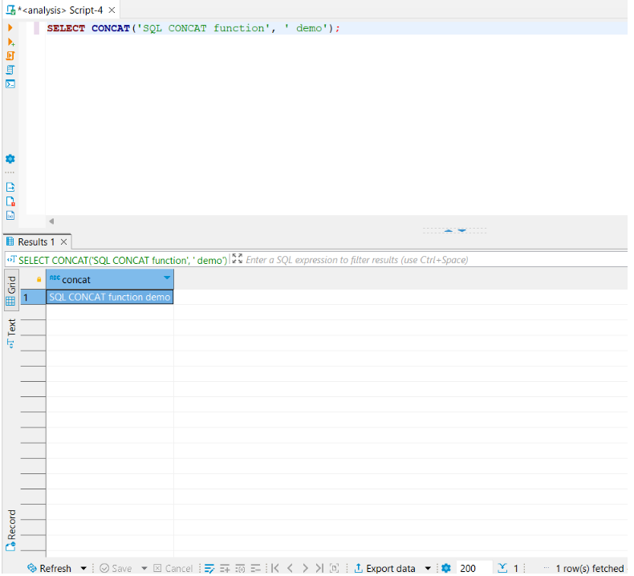
</div>

У наступному операторі використовується **CONCAT** для повернення повних
імен співробітників шляхом об'єднання імені, пробілу та прізвища.

```sql
SELECT CONCAT(first_name, \' \', last_name) AS name

```
FROM \"HR\".employees

ORDER BY name;

<div align="center">
  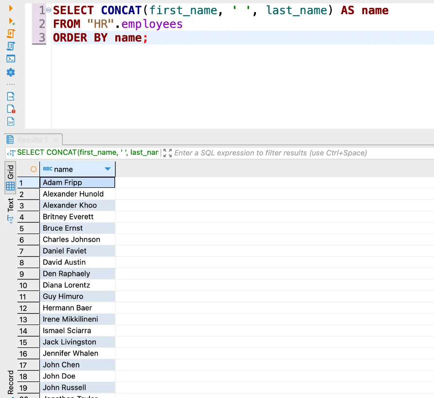
</div>

Наприклад, ти можеш використовувати **CONCAT_WS** для побудови повного
імені співробітника таким чином:

```sql
SELECT CONCAT_WS(\' \', first_name, last_name) AS name

```
FROM \"HR\".employees

ORDER BY name;

<div align="center">
  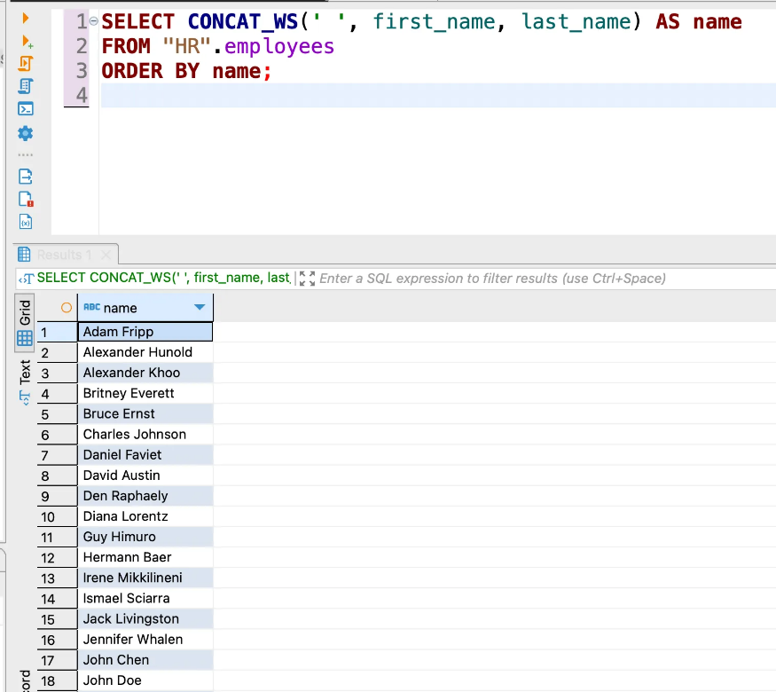
</div>

<div style="text-align: center; font-size: 24px;">Функція LENGTH</div>

Функція **LENGTH** повертає кількість символів у рядку. Вона доступна в
усіх системах реляційних баз даних. Деякі системи баз даних
використовують **LEN**-функцію, яка має той самий ефект, що
й **LENGTH**.

Нижче наведено синтаксис функції **LENGTH**.

LENGTH(string)

-   Якщо вхідний рядок є порожнім --- **LENGTH** повертає  **0**.

-   Якщо вхідний рядок є **NULL** --- повертає **NULL**.

Кількість символів така сама, як кількість байтів для рядків **ASCII**.
Для інших наборів символів вони можуть відрізнятися.
Функція **LENGTH** повертає кількість байтів у деяких системах
реляційних баз даних, таких як MySQL і PostgreSQL. Щоб
отримати кількість символів у рядку в MySQL і PostgreSQL, використай
замість цього функцію **CHAR_LENGTH**.

Наступний оператор повертає першу п'ятірку співробітників із найдовшими
іменами:

```sql
SELECT employee_id

```
, CONCAT(first_name, \' \', last_name) AS full_name

, LENGTH(CONCAT(first_name, \' \', last_name)) AS len

FROM \"HR\".employees

ORDER BY len DESC

LIMIT 5;

<div align="center">
  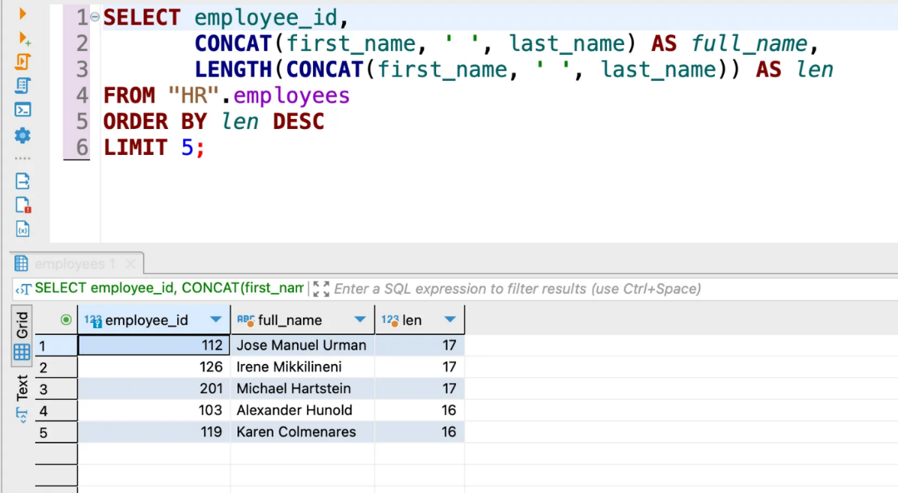
</div>

<div style="text-align: center; font-size: 24px;">Функція TRIM</div>

Функція **TRIM** дозволяє вирізати початкові та/або кінцеві символи з
рядка.

Нижче показано синтаксис функції TRIM.

TRIM( \[LEADING \| TRAILING \| BOTH\] trim_character FROM source_string
);

-   Спочатку вкажи символ **trim_character**, який **TRIM** буде
    видаляти. Якщо ти не
    вкажеш  **trim_character**, функція **TRIM** видалить пробіли з
    вихідного рядка.

-   Розмісти **source_string**, тобто стрічку, яку потрібно почистити.

-   Вкажи сторону --- **LEADING**, **TRAILING** і **BOTH** --- з
    якої **TRIM** буде видаляти **trim_character**:

-   Якщо вказати **LEADING**, то **TRIM** видалить усі початкові
    символи, які відповідають **trim_character**.

-   Якщо вказати **TRAILING**, то **TRIM** видалить усі кінцеві символи,
    які відповідають **trim_character**.

-   Якщо ти вкажеш **BOTH** або не вкажеш жодного із трьох,
    то **TRIM** видалить початкові й кінцеві символи, які
    відповідають **trim_characters**.

Функція **TRIM** повертає **NULL**, якщо один **trim_character** або
вихідний рядок має значення **NULL**.

Припустимо, у нас є рядок, який містить два пробіли на початку й один
пробіл у кінці рядка (\' SQL \').

<div align="center">
  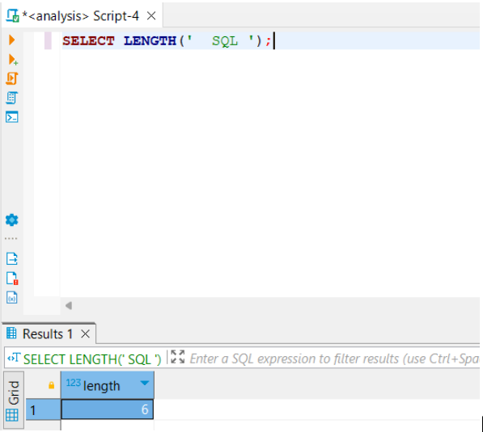
</div>

Наступний оператор використовує **TRIM** з опцією **LEADING** для
видалення всіх пробілів на початку рядка.

Ти можеш перевірити це за допомогою функції **LENGTH**. Довжина рядка
результату має бути чотири, оскільки функція TRIM видаляє два пробіли на
початку рядка.

```sql
SELECT LENGTH( TRIM( LEADING FROM \'  SQL \' ) );

```
<div align="center">
  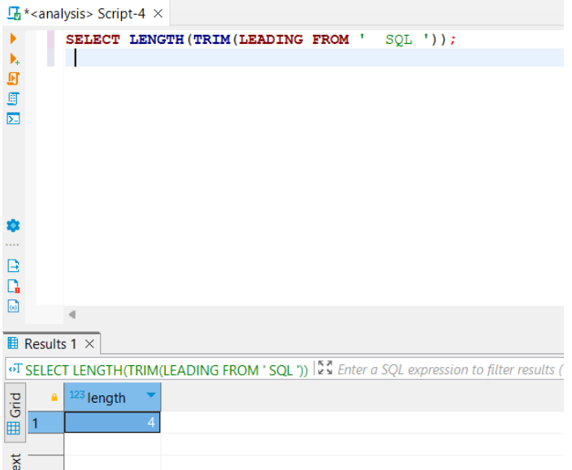
</div>

У наступному операторі використовується **TRIM** із
параметром **TRAILING**, що видаляє всі пробіли в кінці рядка. Довжина
рядка має бути п'ять, оскільки **TRIM** видаляє один пробіл у кінці
рядка.

```sql
SELECT LENGTH( TRIM( TRAILING FROM \'  SQL \' ) );

```
<div align="center">
  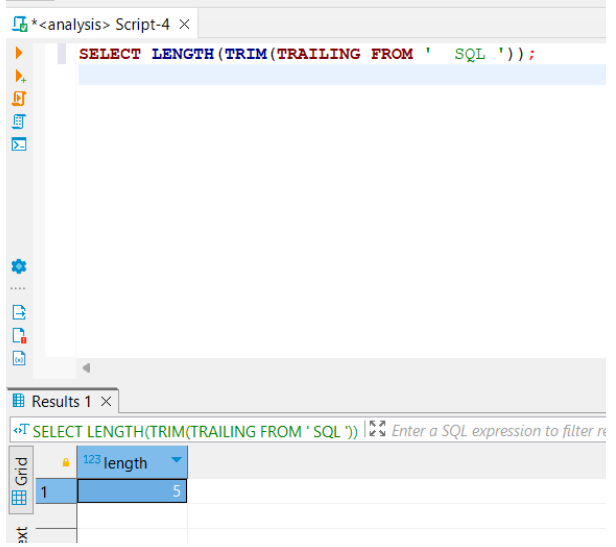
</div>

Наступний оператор видаляє пробіли на початку та в кінці рядка.
Звичайно, довжина рядка дорiвнює **3**.

```sql
SELECT LENGTH( TRIM( \'  SQL \' ) );

```
<div align="center">
  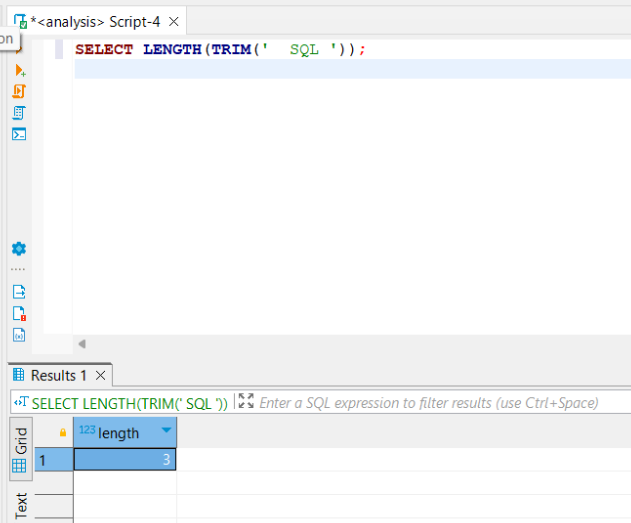
</div>

<div style="text-align: center; font-size: 24px;">Важливо</div>

Іноді, коли користувачі надсилають форму, яка містить такі поля
введення, як ім'я, прізвище, електронна адреса, телефон тощо, дані
можуть містити пробіли на початку та/або в кінці.

Перш ніж вставляти або оновлювати базу даних, потрібно перевірити й
видалити пробіли. Якщо цього не зробити, то існує можливість
неправильного зіставлення за допомогою умови **WHERE**.

Якщо тобі потрібно очистити дані, ти можеш скористатися
оператором **UPDATE** із функцією **TRIM**, щоб видалити всі небажані
символи з бази даних, зокрема пробіли.

У наступному прикладі оператор використовується для заміни всіх пробілів
на початку та в кінці у стовпцях **first_name, last_name, email,
phone_number**.

```sql
UPDATE employees

```
SET

first_name = TRIM( first_name )

last_name = TRIM( last_name )

email = TRIM( email )

phone_number = TRIM( phone_number )

<div style="text-align: center; font-size: 24px;">Функція UPPER</div>

Функція **UPPER** перетворює всі літери в рядку на верхній регістр. Якщо
ти хочеш перетворити рядок на нижній регістр, використовуй
функцію **LOWER**.

Синтаксис функції **UPPER** :

UPPER(string)

-   Якщо вхідний рядок є **NULL**, **UPPER** повертає **NULL**.

-   Iнакше повертає новий рядок з усіма літерами, перетвореними на
    верхній регістр.

Крім функції **UPPER**, деякі системи баз даних надають додаткову
функцію з назвою **UCASE**, яка працює аналогічним чином.

Наступний оператор перетворює рядок **'sql upper'** на **'SQL UPPER'**:

```sql
SELECT UPPER( \'sql upper\' );

```
<div align="center">
  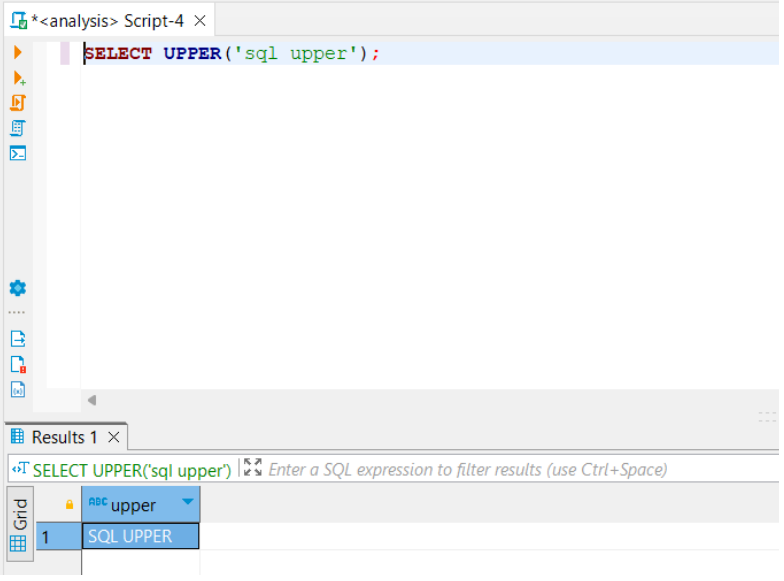
</div>

Наступний запит використовує функцію **UPPER** для перетворення прізвищ
співробітників на верхній регістр.

```sql
SELECT UPPER( last_name )

```
FROM \"HR\".employees

ORDER BY UPPER( last_name );

<div align="center">
  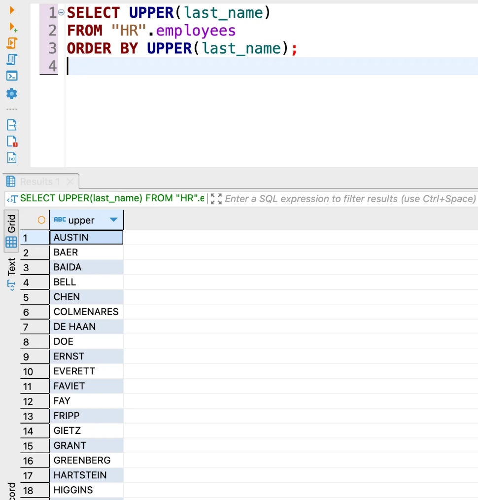
</div>

Запит просто зчитує дані з таблиці співробітників і перетворює їх на
льоту. Дані в таблиці залишаються незмінними.

Щоб перетворити дані на верхній регістр у таблиці бази даних, тобі
потрібно використати оператор UPDATE. Наприклад, наступний оператор
оновлює електронні адреси співробітників до верхнього регістру.

```sql
UPDATE employees

```
SET email = UPPER( email );

Коли ти здійснюєш запит за допомогою WHERE, системи баз даних часто
відповідають регістру даних. Наприклад, літеральний
рядок Bruce відрізняється від bruce.

Наступний запит не повертає результатів.

```sql
SELECT employee_id

```
, first_name

FROM "HR".employees

WHERE first_name = \'BRUCE\';

Щоб зіставити дані, незалежно від регістру, використай
функцію **UPPER**. Наприклад, наступний запит поверне рядок:

```sql
SELECT employee_id

```
, first_name

FROM "HR".employees

WHERE UPPER( first_name ) = \'BRUCE\';

Зверни увагу, що наведений вище запит сканує всю таблицю, щоб знайти
відповідний рядок. Якщо таблиця є великою, запит буде дуже повільним.

Аналогічно працює функція **LOWER**. Пропонуємо спробувати її
самостійно на практиці.

<div style="text-align: center; font-size: 24px;">Функція SUBSTRING</div>

Функція **SUBSTRING** дозволяє витягнути підрядок, який починається із
вказаної позиції і має задану довжину.

Нижче наведено синтаксис функції **SUBSTRING**:

SUBSTRING( source_string, position, length );

Функція SUBSTRING має три аргументи:

-   **source_string** --- це рядок, з якого ти хочеш отримати підрядок.

-   **position** --- це початкова позиція, з якої починається підрядок.

-   **length** --- це довжина підрядка (необов\'язковий аргумент).

Наступний приклад повертає підрядок, що починається з позиції **1** і
має довжину **3**.

```sql
SELECT SUBSTRING( \'Go it the best school\', 1, 3 );

```
<div align="center">
  
</div>

Наступний оператор повертає підрядок, що починається з позиції **4** і
має довжину **8**.

```sql
SELECT SUBSTRING( \'Go it the best school\', 4, 8 );

```
<div align="center">
  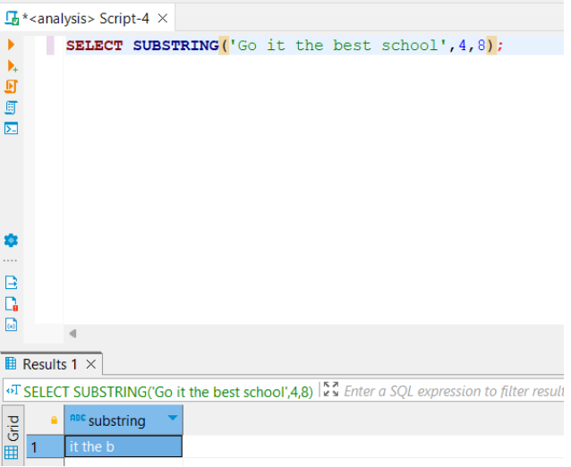
</div>

Наступний запит використовує **SUBSTRING** для вилучення перших символів
імен співробітників (ініціалів) і групує співробітників за їхніми
ініціалами:

```sql
SELECT SUBSTRING(first_name, 1, 1) initial

```
, COUNT(employee_id)

FROM \"HR\".employees

GROUP BY initial;

<div align="center">
  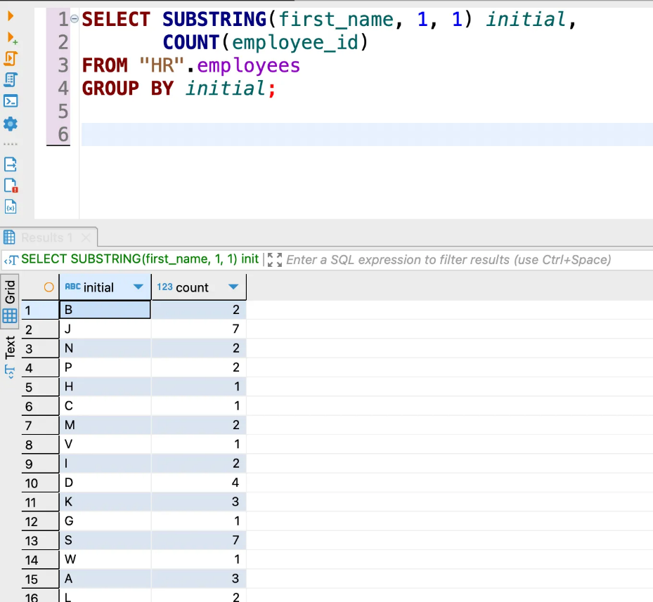
</div>

Загалом **рядкові функції в SQL** є важливою складовою мови запитів, яка
допомагає нам ефективно й точно обробляти рядкові дані в базі даних,
виконуючи різноманітні операції та забезпечуючи гнучкість і контроль над
обробкою даних. Список рядкових функцій великий і може відрізнятися
залежно від типу СУБД, проте ми розглянули саме ті, які найчастіше
використовуються в роботі аналітика.

**COALESCE --- обробка даних зі значеннями NULL або відсутніми
значеннями**

Під час роботи з SQL важливо розуміти концепцію **NULL** і правильно
опрацьовувати ці значення, оскільки вони можуть впливати на результати
запитів та обчислень.

*📎 У SQL, **NULL** представляє спеціальне значення, що вказує на
відсутність даних або невизначеність значення. Воно
використовується, коли ти не знаєш значення певного поля в таблиці або
коли значення не визначено.*

<div style="text-align: center; font-size: 24px;">Особливі властивості NULL у SQL:</div>

-   Відсутність значення. **NULL** вказує на відсутність значення в
    полі.

-   Відрізняється від порожнього рядка. **NULL** не є тим самим, що й
    порожній рядок (рядок з нульовою довжиною). Порожній рядок міститься
    в полі, але **NULL** вказує на відсутність значення.

-   Застосування до будь-якого типу даних. **NULL** можна
    використовувати з будь-яким типом даних: чи то числа, рядки, дати,
    чи інші типи.

-   Не порівнюється з іншими значеннями. **NULL** не можна порівнювати з
    будь-яким іншим значенням, включно з **NULL** самого себе. Умови
    порівняння з **NULL**, такі як **=, \<\>, \<, \>,** повертають
    невизначений результат.

<div style="text-align: center; font-size: 24px;">Функція COALESCE</div>

За допомогою відповідних методів та інструментів, таких як **COALESCE**,
можна ефективно обробляти дані зі значеннями **NULL** або відсутніми
значеннями.

*📌 **COALESCE** --- це функція або метод, який дозволяє
замінювати NULL чи відсутні значення в даних на інші значення. Вона
дозволяє встановлювати альтернативні значення, які будуть
використовуватися, якщо вихідне значення є NULL або відсутнім. Це може
бути корисно при обробці даних, коли необхідно забезпечити наявність
значень у всіх записах або при виконанні певних операцій над даними.*

Функція **COALESCE** приймає кілька аргументів і повертає перший
аргумент, відмінний від **NULL**. Нижче наведено синтаксис
функції **COALESCE**:

COALESCE( argument1, argument2, \... );

-   Функція **COALESCE** обчислює свої аргументи зліва направо. Вона
    зупиняє обчислення, як тільки знайде перший аргумент, відмінний від
    **NULL**, і виводить його значення. Це означає, що всі наступні
    аргументи не оцінюються взагалі.

-   Функція **COALESCE** повертає **NULL**, якщо всі аргументи
    дорівнюють **NULL**.

<div style="text-align: center; font-size: 24px;">Приклади COALESCE</div>

1\. Наступний оператор повертає значення 1, оскільки 1 є першим
аргументом, відмінним від NULL.

```sql
SELECT COALESCE( 1, 2, 3 ); \-- return 1

```
2\. Наступний оператор повертає Not NULL, оскільки це перший рядковий
аргумент, який не має значення NULL.

```sql
SELECT COALESCE( NULL, \'Not NULL\', \'OK\' ); \-- return Not NULL

```
Майже всі системи реляційних баз даних підтримують функцію **COALESCE**,
наприклад, MySQL, PostgreSQL, Oracle, Microsoft SQL Server, Sybase --
тому її використання є більш пріорітетним над альтернативними методами,
притаманними лише конкретному типу БД.

<div style="text-align: center; font-size: 24px;">Приклад 1</div>

Припустимо, у нас є таблиця products з такою структурою та даними:

```sql
CREATE TABLE products (

```
ID INT PRIMARY KEY

, product_name VARCHAR(255) NOT NULL

, product_summary VARCHAR(255)

, product_description VARCHAR(4000) NOT NULL

, price NUMERIC (11, 2) NOT NULL

, discount NUMERIC (11, 2)

);

```sql
INSERT INTO products

```
(id

,product_name

,products_summary

,product_description

,price

,discount)

VALUES

(1,\'McLaren 675LT\',\'Inspired by the McLaren F1 GTR
Longtail\',\'Performance is like striking and the seven-speed
dual-clutch gearbox is twice as fast now.\',349500,1000)

, (2,\'Rolls-Royce Wraith Coupe\',NULL,\'Inspired by the words of sir
Henry Royce, this Rolls-Royce Wraith Coupe is an imperceptible
force.\',304000,NULL)

, (3,\'2016 Lamborgini Avendator Convertible\',NULL,\'Based on V12, this
superveloce has been developed as the Lamborgini with the sportied
DNA.\',271000,500);

Бачимо, що у списку продуктів є запис, у якого
поле **discount** (знижка) має значення **NULL**. Далі розглянемо, як це
відображається при виконанні запиту:

```sql
SELECT \* FROM products;

```
<div align="center">
  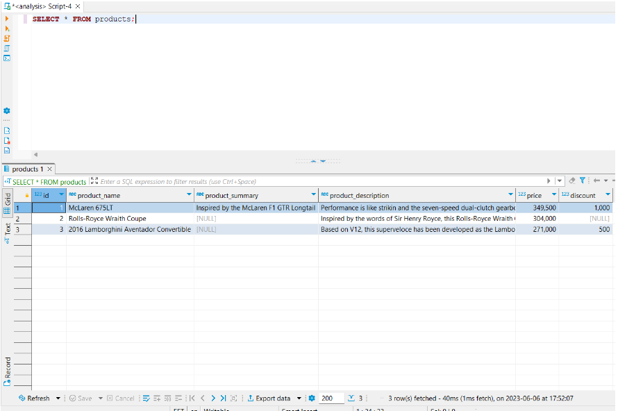
</div>

<div style="text-align: center; font-size: 24px;">Приклад 2</div>

Припустимо, тобі потрібно відобразити продукти на вебсторінці з усією
інформацією в таблиці **products**. Деякі продукти можуть мати опис, а
інші --- ні.

У такому випадку ти можеш скористатися функцією **COALESCE**,
щоб повернути короткий опис продукту. Якщо короткий опис продукту не
надано, ти отримаєш перші 50 символів з опису продукту.

```sql
SELECT ID

```
, product_name

, COALESCE( product_summary, LEFT( product_description, 50 ) ) excerpt

, price

, discount

FROM products;

Також ти можеш скористатися функцією **CONCAT**, щоб додати (...) в
кінці уривка. Це буде сигналом для користувачів про те, що вони читають
лише уривок, і якщо вони натиснуть посилання «Читати далі», то буде
доступно більше інформації.

```sql
SELECT id

```
```sql
, product_name
```

, coalesce( product_summary ,concat( LEFT( product_description ,50
),\'\...\' ) ) excerpt

, price

, discount

FROM products;

<div style="text-align: center; font-size: 24px;">Приклад 3</div>

Припустимо, що тобі потрібно обчислити чисту ціну всіх продуктів, і ти
написав/-ла такий запит:

```sql
SELECT id

```
, product_name

, ( price -- discount ) AS net_price

FROM products;

Чиста ціна для продукту **Rolls-Royce Wraith Coupe **вказана
як **NULL**. Це через те, що знижка на цей продукт має
значення **NULL**, і коли ми використовуємо це значення **NULL** у
розрахунку, отримуємо значення **NULL**.

Тому нам потрібний запит, який дозволить вивести коректну інформацію:

```sql
SELECT id

```
, product_name

, price

, ( price - COALESCE( discount, 0 ) ) AS net_price

FROM products;

<div align="center">
  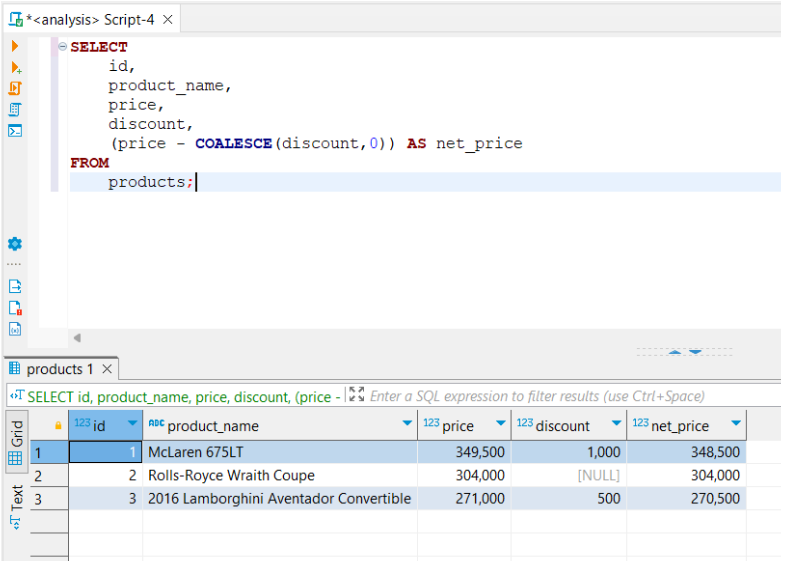
</div>

<div style="text-align: center; font-size: 24px;">Висновки</div>

Функція **COALESCE** є корисним інструментом у SQL для роботи зі
значеннями за замовчуванням. Вона дозволяє повернути перше ненульове
значення з набору аргументів.

Основні висновки щодо функції **COALESCE**:

-   Зручність та ефективність. Функція **COALESCE** дозволяє швидко й
    легко обробляти значення за замовчуванням без необхідності складних
    конструкцій **IF** або **CASE**.

-   Гнучкість. Функція **COALESCE** може бути використана
    для комбінування декількох стовпців або значень у запиті, що
    дозволяє вибирати найбільш відповідні значення.

-   Заміна нульових значень. Функція **COALESCE** особливо корисна при
    роботі з нульовими значеннями, оскільки може замінити їх на
    альтернативні значення або значення за замовчуванням.

-   Порівняння з аналогами. Хоча існують інші функції, такі
    як **ISNULL** і **NVL** (рекомендуємо самостійно ознайомитися з
    ними), функція **COALESCE** відрізняється своєю універсальністю,
    оскільки може обробляти більше ніж два аргументи й повертає перше
    ненульове значення.

Загалом гнучкість функції **COALESCE** і можливості заміни нульових
значень роблять її незамінним інструментом для роботи з рядками даних у
базах даних.

<div style="text-align: center; font-size: 24px;">Вибір альтернативних значень для заповнення NULL</div>

Вибір альтернативних значень для заповнення **NULL** у SQL може залежати
від контексту задачі та твоїх вимог. Ось кілька прикладів ситуацій і
можливих альтернативних значень:

-   Заповнення нулем **(0)** або порожнім рядком. Це може бути варіант,
    якщо **NULL** означає відсутність даних, і ти хочеш мати конкретне
    значення для обробки чи відображення. Наприклад, якщо в тебе є
    стовпець, що зберігає кількість товарів, і **NULL** означає
    відсутність товару, ти можеш заповнити **NULL** нулем **(0).**

-   Заповнення значеннями за замовчуванням. Ти можеш використати
    значення за замовчуванням для заповнення **NULL**, якщо воно є
    придатним для твого контексту. Наприклад, якщо в тебе є стовпець
    дати замовлення і **NULL** означає, що дата невідома, ти можеш
    встановити значення за замовчуванням як поточну дату або спеціальне
    значення «невідома».

-   Використання середніх значень або статистичних показників. Іноді
    можна використовувати агрегатні функції, такі як **AVG** (середнє
    значення) або **MAX** (максимальне значення), для обчислення
    альтернативного значення на основі наявних даних. Наприклад, якщо в
    тебе є стовпець, що містить вік користувачів, і деякі значення
    є **NULL**, ти можеш використати **AVG** для обчислення середнього
    віку й застосовувати його як альтернативне значення для **NULL**.

**‼‼‼ Однак заповнення NULL альтернативними значеннями може призвести до
деяких потенційних проблем, зокрема до втрати інформації або спотворення
даних.**

<div style="text-align: center; font-size: 24px;">Ось кілька проблем, на які варто звернути увагу:</div>

-   **Втрата інформації**. Заповнення **NULL** альтернативними
    значеннями може призвести до втрати оригінальних даних. Наприклад,
    якщо **NULL** означає відсутність даних, а ти заповнюєш його нулем
    **(0)**, то втрачаєш можливість розрізняти відсутні дані і справжнє
    значення **0**.

-   **Спотворення аналізу**. Заповнення **NULL** альтернативними
    значеннями може призвести до спотворення аналізу даних. Наприклад,
    якщо ти заповнюєш відсутні значення середнім значенням, це може
    призвести до заниження або завищення фактичних показників, таких як
    середнє значення, медіана тощо.

-   **Помилкова інтерпретація даних**. Використання альтернативних
    значень для заповнення **NULL** може призвести до помилкової
    інтерпретації даних. Інші користувачі можуть припустити, що
    заповнені значення є дійсними даними, що може призвести до
    неправильних висновків або рішень.

-   **Спотворення статистичних
    аналізів**. Заповнення **NULL** альтернативними значеннями може
    спотворити статистичні аналізи, такі як розподіл даних, кореляція
    тощо. Вставка альтернативних значень може змінити характеристики
    даних і призвести до неточних аналітичних результатів.

Отже, під час заповнення **NULL** альтернативними значеннями важливо
розуміти можливі наслідки та природу даних. Ретельний аналіз контексту
задачі та врахування потенційних проблем допоможуть уникнути
неправильної інтерпретації даних і зберегти якість аналізу.

<div style="text-align: center; font-size: 24px;">CASE у мові запитів SQL</div>

**CASE** є потужним і гнучким інструментом, який дозволяє виконувати
умовні операції та розгалуження в запитах SQL.
Використання **CASE** дозволяє змінювати логіку запиту залежно від
заданих умов, що робить його незамінним для різних завдань з обробки
даних.

За допомогою **CASE** можна реалізувати різноманітні логічні операції,
які забезпечують умовну логіку, обробку вибіркових даних і трансформацію
результатів запиту. Цей інструмент є важливим компонентом SQL для
розширення функціональності й виразності запитів, що дозволяє ефективно
маніпулювати даними в базі даних.

Вираз **CASE** дозволяє оцінити список умов і повертає один із можливих
результатів. Вираз **CASE** має два формати:

1.  простий **CASE**;

2.  пошуковий **CASE**.

Ти можеш використовувати **CASE** у реченні або в операторі. Наприклад,
ти можеш використовувати **CASE** у таких операторах,
як **SELECT**, **DELETE** та **UPDATE** або в **SELECT, ORDER
BY** та **HAVING**.

<div style="text-align: center; font-size: 24px;">Простий CASE</div>

<div style="text-align: center; font-size: 24px;">Нижче наведено простий вираз CASE.</div>

CASE expression

WHEN when_expression_1 THEN result_1

WHEN when_expression_2 THEN result_2

\...

ELSE else_result

END

У цьому виразі кожна умова (**condition**) перевіряється по черзі, і
коли вона є істинною, повертається відповідний результат (**result**).
Якщо ж жодна з умов не задовольняється, повертається значення, вказане у
блоці **ELSE**.

-   Оператор **CASE** повертає **result_1, result_2** або **result_3**,
    якщо вираз збігається з відповідним виразом у реченні **WHEN**.

-   Якщо вираз не відповідає жодному виразу в реченні **WHEN**, він
    повертає **esle_result** у реченні **ELSE**. Речення **ELSE** є
    необов'язковим.

-   Якщо пропустити пропозицію **ELSE**, і вираз не відповідає жодному
    виразу **WHEN**, вираз **CASE** повертає **NULL**.

<div style="text-align: center; font-size: 24px;">Приклади використання простого CASE</div>

Ми можемо використовувати простий вираз CASE, щоб отримати робочі ювілеї
співробітників, застосовуючи такий оператор:

```sql
SELECT first_name

```
, last_name

, hire_date

, CASE ( 2000 - EXTRACT( YEAR FROM hire_date ) )

       WHEN 1 THEN \'1 year\'

       WHEN 3 THEN \'3 year\'

       WHEN 5 THEN \'5 year\'

       WHEN 10 THEN \'10 year\'

       WHEN 15 THEN \'15 year\'

       WHEN 20 THEN \'20 year\'

       WHEN 25 THEN \'25 year\'

       WHEN 30 THEN \'30 year\'

     END anniversary

FROM \"HR\".employees

ORDER BY first_name;

<div align="center">
  
</div>

Як ти вже помітив/-ла у прикладі вище, функція **EXTRACT** повертає рік,
коли працівник приєднався до компанії. Ми отримуємо кількість років,
протягом яких робітник працює в компанії, і віднімаємо рік приєднання до
компанії. База HR є актуальною на **2000** рік, тому саме це значення
використовуємо для розрахунку різниці.

Потім ми порівнюємо результат із числами **1, 3, 5, 10, 15, 20, 25,
30**.

-   Якщо рік роботи дорівнює одному з цих чисел, вираз **CASE** повертає
    річницю роботи працівника.

-   Якщо рік роботи працівника не відповідає жодному з цих чисел,
    вираз **CASE** повертає **NULL**.

<div style="text-align: center; font-size: 24px;">Пошуковий вираз CASE</div>

Вираз **CASE** порівнює вираз із набором виразів **(when_expression_1,
when_expression_2, when_expression_3, ...)** за допомогою оператора
рівності **(=)**.

Якщо ти хочеш використовувати інші оператори порівняння, такі як більше
ніж **(\>)**, менше ніж **(\<)** тощо, тобі потрібно
застосувати пошуковий вираз **CASE**.

Нижче наведено приклад пошукового виразу **CASE**:

CASE

WHEN boolean_expression_1 THEN result_1

WHEN boolean_expression_2 THEN result_2

\...

ELSE else_result

END;

Система бази даних обчислює логічний вираз для кожного
речення **WHEN** у порядку, зазначеному у виразі **CASE**.

Якщо логічний вираз у реченні **WHEN** має значення **true**, то
пошуковий оператор **CASE** повертає результат із
відповідного **THEN** і припиняє перевірку. Тобто якщо у **CASE** два
істинні вирази, ми отримаємо відповідь, що відповідає першому з них.

-   Якщо жоден логічний вираз не повертає значення **true**,
    вираз **CASE** повертає результат **else_result**, вказаний у
    реченні **ELSE**.

-   Як і в простому виразi **CASE**, речення **ELSE** є необов'язковим.

-   Якщо ти опустиш речення **ELSE** і жоден логічний вираз не отримає
    значення **true**, вираз **CASE** поверне значення **NULL**.

<div style="text-align: center; font-size: 24px;">Приклад пошукового виразу CASE</div>

```sql
SELECT first_name

```
, last_name

, CASE

```sql
WHEN salary \< 3000 THEN \'Low\'

WHEN salary \>= 3000

AND salary \<= 5000 THEN \'Average\'

WHEN salary \> 5000 THEN \'High\'
```

END evaluation

FROM "HR".emplyees;

-   Якщо зарплата менша за **3000**, вираз **CASE** повертає значення
    **«Low»** (низька).

-   Якщо зарплата знаходиться в діапазоні від **3000** до **5000**,
    повертається значення **«Average»** (середня).

-   Коли зарплата перевищує **5000**, вираз **CASE** повертає значення
    **«High»** (висока).

<div style="text-align: center; font-size: 24px;">Отже, коротко підсумуємо основні моменти:</div>

-   Вираз **CASE** є потужним інструментом для виконання умовних
    операцій і заміни значень у SQL-запитах.

-   Вираз **CASE** дозволяє змінювати логіку запиту залежно від заданих
    умов, що робить його корисним для різноманітних сценаріїв обробки
    даних.

-   Вираз **CASE** можна використовувати для заміни значень стовпців,
    створення нових стовпців або визначення значень для групування або
    сортування даних.

-   Вираз **CASE** може містити декілька умов і результатів, які
    перевіряються послідовно, а також використовувати блок **ELSE** для
    визначення значення за замовчуванням.

-   Використання **CASE** дозволяє розширити функціональність
    SQL-запитів, забезпечуючи більшу гнучкість і можливість
    персоналізації результатів запиту.

Загалом вираз **CASE** є важливим інструментом для керування умовною
логікою та обробки даних у SQL. Використання цього виразу дозволяє
ефективно маніпулювати даними, забезпечуючи більш точні й адаптовані
результати запитів.

<div style="text-align: center; font-size: 24px;">Функції та процедури в SQL</div>

Функції та процедури в SQL є ключовими компонентами мови запитів, які
дозволяють створювати повторно використовувані блоки коду й виконувати
комплексні операції над даними в базі даних. Знання та розуміння процесу
створення й використання функцій і процедур в SQL має велике значення з
кількох причин.

Функції та процедури дозволяють забезпечити модульність і повторне
використання коду або запитів, що сприяє покращенню продуктивності та
уникненню дублювання. Ти можеш створювати функції та процедури, які
виконують певні завдання, і використовувати їх у різних запитах і
програмах, що забезпечує ефективну розробку та підтримку баз даних.

Функції та процедури дозволяють виконувати складні операції над даними,
які враховують обчислення, обробку, агрегацію та зміну даних у базі
даних. Ти можеш створювати функції, які повертають значення, а також
процедури, які виконують набір інструкцій. Це дозволяє тобі створювати
більш складні запити й операції, що відповідають потребам твого проєкту
або бізнес-логіки.

Якщо пояснити простими словами, то замість того щоб кожного разу писати
одні й ті самі запити, зручніше групувати їх разом і зберігати, щоб
можна було використовувати їх багато разів. Що стосується гнучкості, то
кожного разу, коли змінюється логіка запитів, можна передавати новий
параметр для функцій і збережених процедур.

<div style="text-align: center; font-size: 24px;">Різниця між функціями та процедурами</div>

У SQL функції та процедури є двома різними типами об\'єктів, які можуть
бути створені й використані для виконання операцій над даними. Основна
різниця між функціями та процедурами полягає в тому, як вони повертають
результати.

<div align="center">
  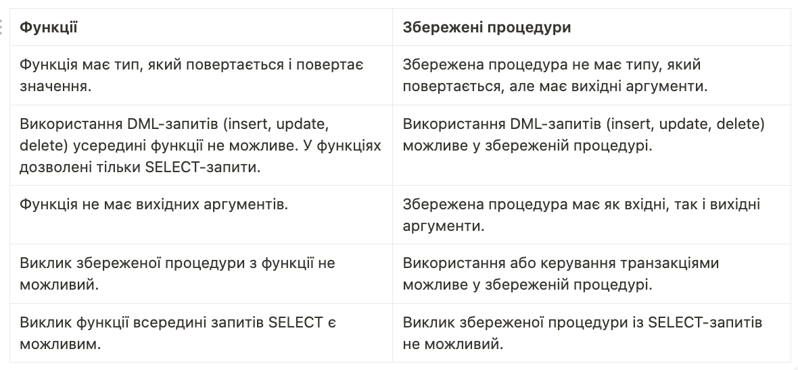
</div>

Отже, функції використовуються для обчислень і повернення результатів,
тоді як процедури служать для виконання послідовних дій і зміни стану
даних. Обидва типи мають свої використання, залежно від потреб розробки
та керування базами даних.

<div style="text-align: center; font-size: 24px;">Створення функцій</div>

Давай розглянемо процес створення функції в PostgreSQL. Наступний блок
коду ілюструє, як створювати функцію:

```sql
CREATE \[or REPLACE\] FUNCTION function_name( param_list )

```
RETURNS return_type

LANGUAGE plpgsql as \$\$

DECLARE \-- variable declaration

BEGIN

```sql
\--logic
```

END \$\$;

<div style="text-align: center; font-size: 24px;">Пояснення операторів:</div>

-   **create \[or replace\] function function_name** --- створює або
    замінює функцію, якщо вона існує, із вказаним ім\'ям та параметрами;

-   **returns return_type** --- тип даних, який повертає функція;

-   мова **plpgsql** --- вказує на процедурне розширення PostgreSQL;

-   всередині знака **\$** --- це тіло функції;

-   **declare** --- показує, як оголошуються або ініціалізуються змінні;

-   блок коду **\[begin --- end\]** --- містить усю логіку функції;

-   **begin** --- вказує на початок запитів;

-   **end** --- вказує на кінець функції.

Наступний приклад ілюструє створення та виклик окремої функції. Ця
функція повертає загальну кількість записів у таблиці **employees**:

```sql
CREATE OR REPLACE FUNCTION totalRecords ()

```
RETURNS integer AS \$total\$

DECLARE total integer;

BEGIN

```sql
SELECT count(\*) into total

FROM "HR".employees;
```

RETURN total;

END;

\$total\$ LANGUAGE plpgsql;

Тепер давай виконаємо виклик цієї функції та перевіримо записи в таблиці
**employees**.

```sql
SELECT totalRecords()

```
<div align="center">
  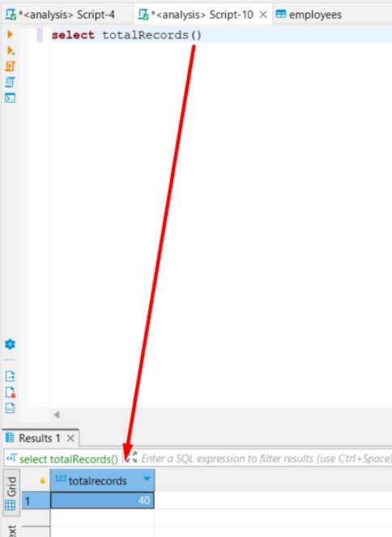
</div>

Отже, наша функція повернула кількість рядків у таблиці **employees**,
для цього нам достатньо було просто викликати її. Тепер у нас є
можливість повторного застосування цієї функції в різних частинах
запиту, що спрощує написання коду.

Список усіх функцій, доступних у нашому дереві елементів бази даних:

<div align="center">
  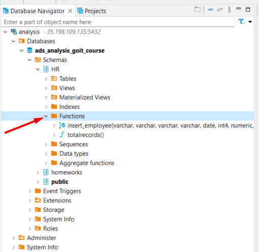
</div>

<div style="text-align: center; font-size: 24px;">Створення збереженої процедури</div>

Створення збереженої процедури, як показано у блоці коду нижче, майже
аналогічне створенню функції, але з невеликою відмінністю --- у ній нема
**return**. 

```sql
CREATE \[OR REPLACE\] PROCEDURE procedure_name(parameter_list)

```
LANGUAGE language_name AS \$

stored_procedure_body;

\$;

Давай розглянемо приклад процедури для додавання нового співробітника:

```sql
CREATE OR REPLACE PROCEDURE insert_employee(

```
p_first_name varchar(20)

, p_last_name varchar(25)

, p_email varchar(100)

, p_phone_number varchar(20)

, p_job_id date

, p_salary int

, p_manager_id numeric(8,2)

, p_department_id int

, p_identifier int

, p_name varchar(50)

, p_description varchar(50)

, p_type varchar(50)

, p_state varchar(50)

, p_resource_name varchar(50)

, p_resource_account_level varchar(50)

, p_update_status varchar(50)

)

AS \$\$

> BEGIN
```sql
INSERT INTO employees (
```
> first_nam
```sql
, last_name

, email

, phone_number

, job_id

, salary

, manager_id

, department_id

, \"ідентифікатор\"

, \"Імʼя\"

, опис

, тип

, штат

, \"Назва ресурсу\"

, \"Рівень облікового номера ресурсу\"

, \"Стан оновлення\")

VALUES (
```
> p_first_nam
```sql
, p_last_name

, p_email

, p_phone_number

, p_job_id

, p_salary

, p_manager_id

, p_department_id

, p_identifier

, p_name

, p_description

, p_type

, p_state

, p_resource_name

, p_resource_account_level

, p_update_status);

END;
```

\$\$

LANGUAGE plpgsql;

Тепер спробуємо запустити таку процедуру:

CALL insert_employee (

\'John\'

, \'Doe\'

, \'john.doe@example.com\'

, \'+123456789\'

, \'2023-06-07\'

, 1

, 5000.00

, NULL

, NULL

, \'identifier\'

, \'name\'

, \'description\'

, \'type\'

, \'state\'

, \'resource name\'

, \'account level\'

, \'update status\'

);

Що ж нам дала ця процедура? **Ми спростили процес додавання нових
записів до бази даних** і можемо **повторно використовувати** цей
об\'єкт, коли нам зручно.

<div style="text-align: center; font-size: 24px;">Висновки</div>

Отже, функції та процедури використовуються для створення згрупованих
блоків коду, які можна викликати з SQL-запитів або з іншого коду. Вони
забезпечують зручний спосіб структурування й повторного
використання логіки, а також можуть призначати ролі побічних ефектів.

Однак перед використанням функцій і процедур рекомендується ретельно
розробити логіку й уважно спланувати використання цих об\'єктів,
оскільки неправильне використання може призвести до накопичення великої
кількості внутрішніх об\'єктів бази даних та вплинути на продуктивність.

Знання функцій і процедур у SQL є важливим для аналітиків даних, адже
вони дозволяють **створювати розширені запити, автоматизувати обробку
даних, полегшувати керування базами даних і покращувати продуктивність
системи**. Це важлива навичка, яка допомагає впроваджувати більш
ефективні та гнучкі рішення з обробки й аналізу даних.

Ознайомлення з функціями та процедурами в SQL відкриває широкі
можливості та робить цю тему важливою для усіх, хто працює з базами
даних та виконує аналіз даних.
