**Language:** English | [Українська](../../i18n/uk/course/lessons/lesson_5_ochystka_danyh_riadkovi_funkcii.md)

<h2 align="center">String functions and operators</h2>

**DBMS scope:** [CORE] (portable SQL fundamentals).

**String functions and operators** in SQL are an integral part of the language
structured queries to databases. 
process data strings and manipulate them.

With string functions we can do a variety of things
operations on text data, such as string concatenation, deletion
certain characters, replacing substrings, etc.

Operators, on the other hand, allow you to compare and search for specific strings
conditions, such as checking for equality, using booleans
operators, search for substrings, etc.

The same basic operations, such as string concatenation, deletion
characters, substring substitution, etc., are also present in SQL. 
already have a certain level of knowledge and experience that can be easily applied to
learning string functions and operators in SQL.

In this topic, we will look at the basic string functions and operators in SQL and
let's analyze their syntax and capabilities in detail. 
and operators will help us work more efficiently with text data in
databases and get more accurate and necessary query results.

<h2 align="center">The LIKE operator and regular expressions (regexp)</h2>

*📌 **LIKE** operator and **(regexp)** regular expressions in PostgreSQL
are used to find text patterns in strings. 
perform matching and searching operations using templates.*

<h2 align="center">The LIKE operator</h2>

The **LIKE** operator allows a simple search using
patterns in rows. 
templates:

The percent sign **(%)** represents any sequence of characters (in particular
and an empty sequence).

An underscore **(\_)** indicates any single character.

For example, if you want to find all strings that start with "**ab**" and
have any number of characters after them, you can use one
request:

```sql
SELECT *
FROM table_name
    WHERE column_name LIKE 'ab%';
```

<h2 align="center">Regular expressions (regexp)</h2>

Regular expressions **(regexp)** in PostgreSQL provide greater possibilities for
search and match text patterns. 
more complex patterns, including repetitions, alternatives, character groups
etc.

📎 In PostgreSQL, regular expressions are used
function **\~** or **\~\*** to perform a pattern search where:

- **\~ **case sensitive;
- **\~*** ignores case.

For example, if you want to find all strings that contain the word "cat",
regardless of the case, you can use a regular expression:

```sql
SELECT *
FROM table_name
    WHERE column_name ~* 'cat';
```

This query will find strings that contain the word "**cat**" regardless of
whether they are written in upper or lower case.

Regular expressions in PostgreSQL allow you to use many others
capabilities such as search using pattern characters, validation
data, replacing templates, splitting lines into parts, etc.

<h2 align="center">Examples of using the LIKE operator:</h2>

-- Search for employees with a last name ending in "son"

```sql
SELECT *
FROM HR.employees
    WHERE last_name LIKE '%son';
```

-- Search for employees whose name starts with "J" and ends with "n"


```sql
SELECT *
FROM HR.employees
    WHERE first_name LIKE 'J%n';
```

-- Search for employees whose name consists of three characters


```sql
SELECT *
FROM HR.employees
    WHERE first_name LIKE '___';
```
<h2 align="center">Examples of using regular expressions:</h2>

-- Search for employees who have an email address with a domain
"example.com"

```sql
SELECT *
FROM HR.employees
    WHERE email ~ '.+@example\\.com';
```

-- Search for employees whose phone number starts with "+1" and
contains 10 digits

```sql
SELECT *
FROM HR.employees
    WHERE phone_number ~ '^\\+1\\d{8}$';
```

-- Search for employees whose description contains the word "description" regardless of case
```sql
SELECT *
FROM HR.employees
WHERE опис ~* 'description';
```

A little decoding of regular expressions in the examples above:
1. In this regular expression (email example)
   
- **.** — any character (usually, except for line feed);
- **\*** — the quantifier "0 or more" is applied to the previous token;
- **+** — quantifier "1 or more" (convenient for the expression .+);
- Escaping: \ is used to denote a literal dot.

An example of a correct expression for searching for an address with the example.com domain:
   ```regex
   .+@example\.com
   ```
(if you put this line in an SQL literal, in some DBMS you need to additionally escape the slash: '.+@example\\.com')

2. In this regular expression (example for phones starting with "+1" and having 10 digits)
   
- ^ is the beginning of the line;
- \+ — literal plus (must be escaped, because + is a special symbol);
- \d — any number; 
- $ is the end of the line.

Example expression:
   ```regex
   ^\+1\d{10}$
   ```
(often written as '^\\+1\\d{10}$' in the SQL line)

In short: use \. 

To make it easier to decode regular expressions and check if
you write them correctly, you can use online services
like [**Regex101**](https://regex101.com/) --- here you can as
get acquainted with the full list of available expressions, and read
explanation for a specific regular expression.

<h2 align="center">CONCAT function</h2>

The **CONCAT** function is used to combine two or more
lines into one line.

The following is the syntax for the **CONCAT** function:
```sql
CONCAT(string1, string2, ...);
```
To concatenate strings, you pass them to the **CONCAT** function as a list
arguments separated by commas.

The **CONCAT** function returns a string that is a combination of the input strings.
If one of the arguments is **NULL**, then the result is returned
will also be **NULL**.

*📎 To process values ​​more efficiently, you can use an operator
**IS** **NULL** or **COALESCE** and **NULLIF** functions.*

*Most relational database systems support the **CONCAT** function
some differences. 
concatenate more than two strings, while the **CONCAT** function in Oracle
joins only two lines.*

In addition to using the **CONCAT** function, you can use the operator
concatenation 

For example:

- Oracle and PostgreSQL use the **\|\|** operator for
concatenation of two or more strings.

- Microsoft SQL Server uses the **+.** operator

<h2 align="center">CONCAT usage examples</h2>

The following statement uses the CONCAT function to concatenate
two lines:

```sql
SELECT CONCAT('SQL CONCAT function', ' demo');
```
<div align="center">
  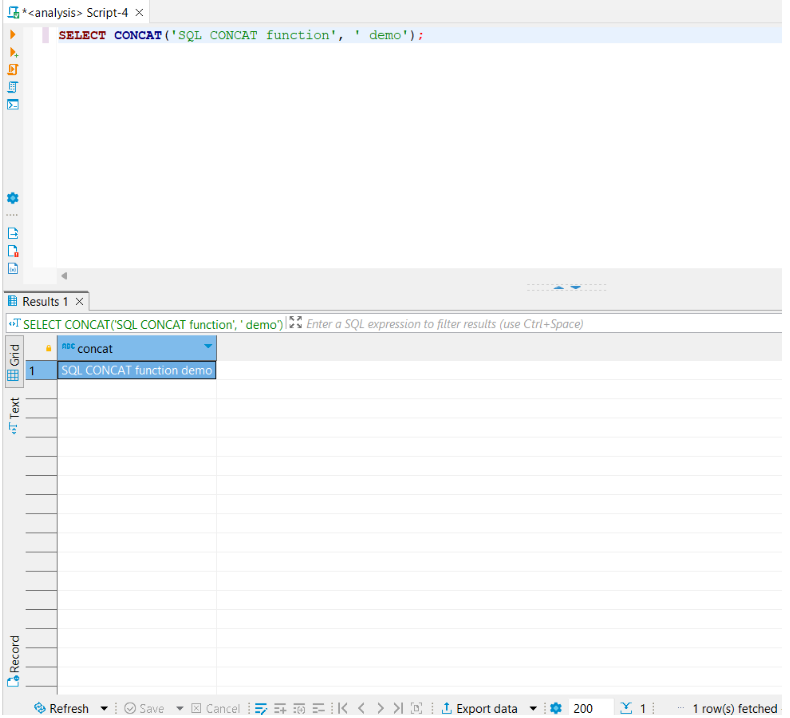
</div>

The following statement uses **CONCAT** to return integers
names of employees by combining first name, space and last name.

```sql
SELECT CONCAT(first_name, ' ', last_name) AS name
```
FROM \"HR\".employees

ORDER BY name;

<div align="center">
  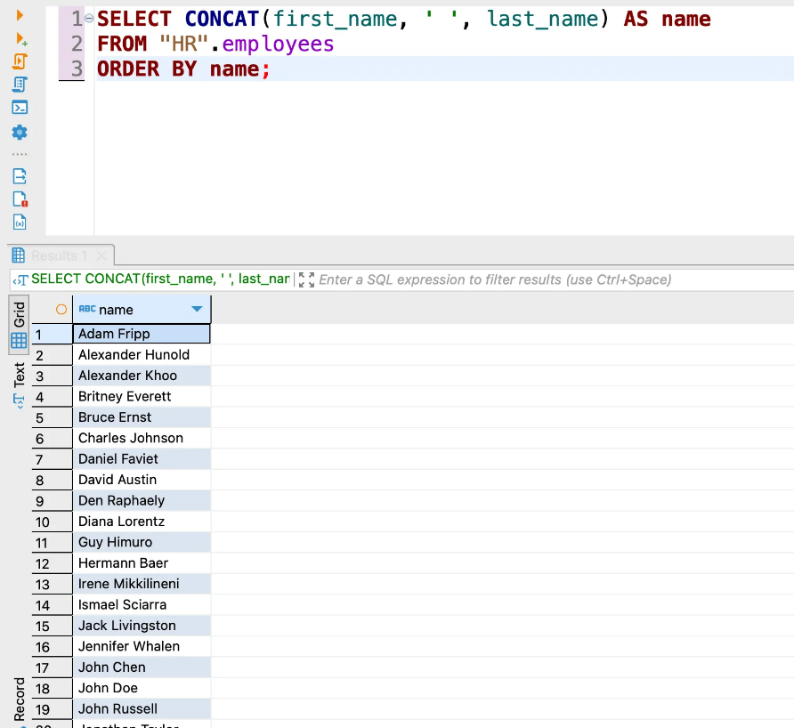
</div>

For example, you can use **CONCAT_WS** to build a complete
employee's name as follows:

```sql
SELECT CONCAT_WS(' ', first_name, last_name) AS name
FROM HR.employees
ORDER BY name;
```

<div align="center">
  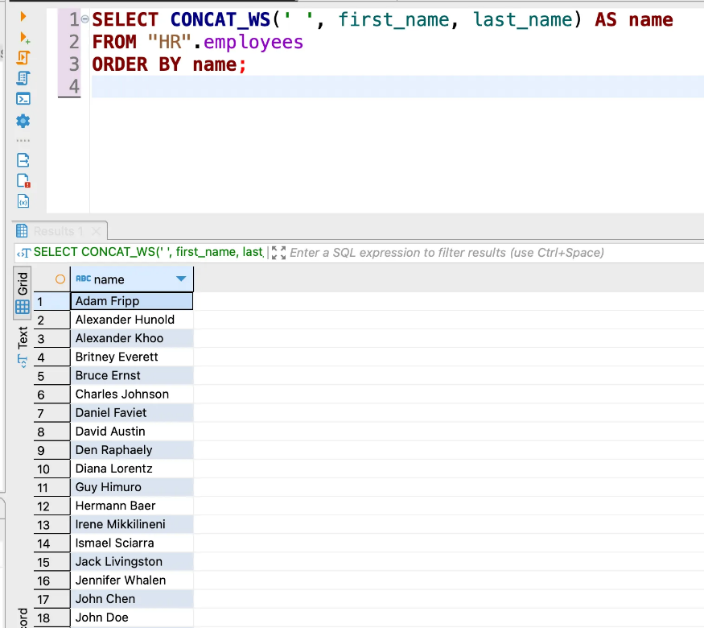
</div>

<h2 align="center">The LENGTH function</h2>

The **LENGTH** function returns the number of characters in a string. 
all relational database systems. 
use the **LEN** function, which has the same effect as
and **LENGTH**.

Below is the syntax for the **LENGTH** function.

LENGTH(string)

- If the input string is empty---**LENGTH** returns **0**.
- If input string is **NULL** --- returns **NULL**.

The number of characters is the same as the number of bytes for **ASCII** strings.
They may differ for other character sets.
The **LENGTH** function returns the number of bytes on some systems
relational databases such as MySQL and PostgreSQL. 
to get the number of characters in a string in MySQL and PostgreSQL, use
**CHAR_LENGTH** function instead.

The following statement returns the first five employees with the longest tenure
by names:

```sql
SELECT employee_id
     , CONCAT(first_name, ' ', last_name) AS full_name
     , LENGTH(CONCAT(first_name, ' ', last_name)) AS len
FROM HR.employees
ORDER BY len DESC
LIMIT 5;
```

<div align="center">
  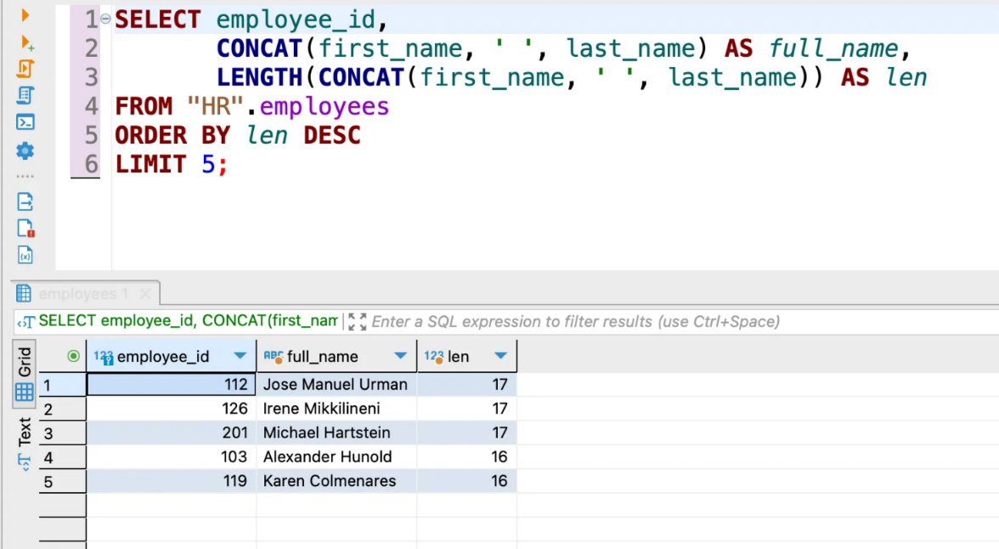
</div>

<h2 align="center">TRIM function</h2>

The **TRIM** function allows you to trim leading and/or trailing characters from
line

The syntax for the TRIM function is shown below.
```sql
TRIM( [LEADING | TRAILING | BOTH] trim_character FROM source_string
);
```

- First specify the **trim_character** that **TRIM** will be
remove. 
specify **trim_character**, the **TRIM** function will remove spaces from
of the output line.

- Place the **source_string** i.e. the stream to be scrubbed.

- Specify side --- **LEADING**, **TRAILING** and **BOTH** --- with
whose **TRIM** will remove the **trim_character**:

- If **LEADING** is specified, **TRIM** will remove all leads
characters that match **trim_character**.

- If **TRAILING** is specified, **TRIM** will remove all trailing characters
which match **trim_character**.

- If you specify **BOTH** or do not specify any of the three,
then **TRIM** will remove leading and trailing characters that
match **trim_characters**.

The **TRIM** function returns **NULL** if one **trim_character** or
the output string is **NULL**.

Suppose we have a string that contains two leading spaces and one
a space at the end of a line (\' SQL \').

<div align="center">
  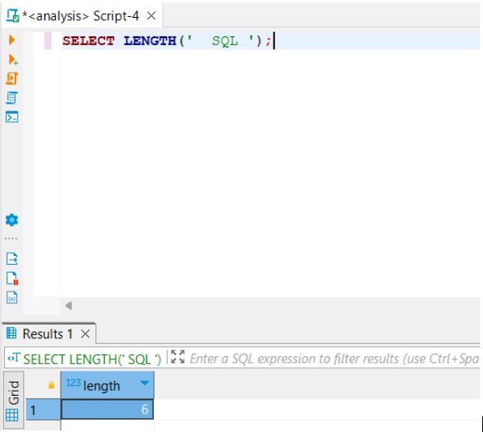
</div>

The following statement uses **TRIM** with the **LEADING** option for
removing all spaces at the beginning of a line.

You can check this with the **LENGTH** function. 
the result should be four because the TRIM function removes two spaces per
beginning of line

```sql
SELECT LENGTH( TRIM( LEADING FROM '  SQL ' ) );
```

<div align="center">
  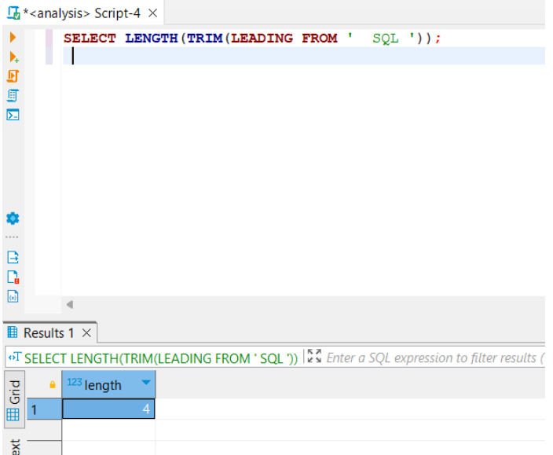
</div>

The following statement uses **TRIM** with
**TRAILING** parameter, which removes all trailing spaces. 
line should be five because **TRIM** removes one trailing space
line

```sql
SELECT LENGTH( TRIM( TRAILING FROM '  SQL ' ) );
```
<div align="center">
  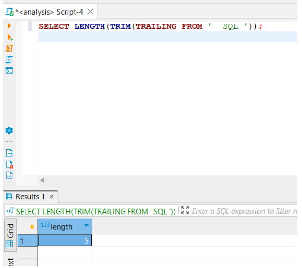
</div>

The following statement removes spaces at the beginning and end of a string.
Of course, the length of the string is equal to **3**.

```sql
SELECT LENGTH( TRIM( '  SQL ' ) );
```
<div align="center">
  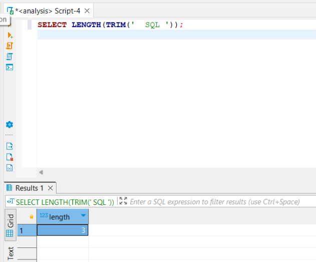
</div>

<h2 align="center">Importantly</h2>

Sometimes when users submit a form that contains the following fields
input like first name, last name, email address, phone, etc. data
may contain leading and/or trailing spaces.

Before inserting or updating a database, you need to check and
remove spaces. 
invalid mapping using the **WHERE** condition.

If you need to clear data, you can use
**UPDATE** statement with **TRIM** function to remove all unwanted ones
characters from the database, including spaces.

In the following example, the operator is used to replace all spaces
at the beginning and at the end in the columns **first_name, last_name, email,
phone_number**.

```sql
-- Trim leading/trailing spaces only for rows that actually change (handles NULLs)
UPDATE employees
SET
    first_name   = TRIM(first_name),
    last_name    = TRIM(last_name),
    email        = TRIM(email),
    phone_number = TRIM(phone_number)
;
```

<h2 align="center">UPPER function</h2>

The **UPPER** function converts all letters in a string to upper case. 
you want to convert a string to lower case, use
**LOWER** function.

**UPPER** function syntax:
```sql
UPPER(string)
```
- If the input string is **NULL**, **UPPER** returns **NULL**.
- Otherwise returns a new string with all letters converted to
upper case

In addition to the **UPPER** function, some database systems provide an additional one
a function called **UCASE** that works in a similar way.

The following statement converts the string **'sql upper'** to **'SQL UPPER'**:

```sql
SELECT UPPER( 'sql upper' );
```
<div align="center">
  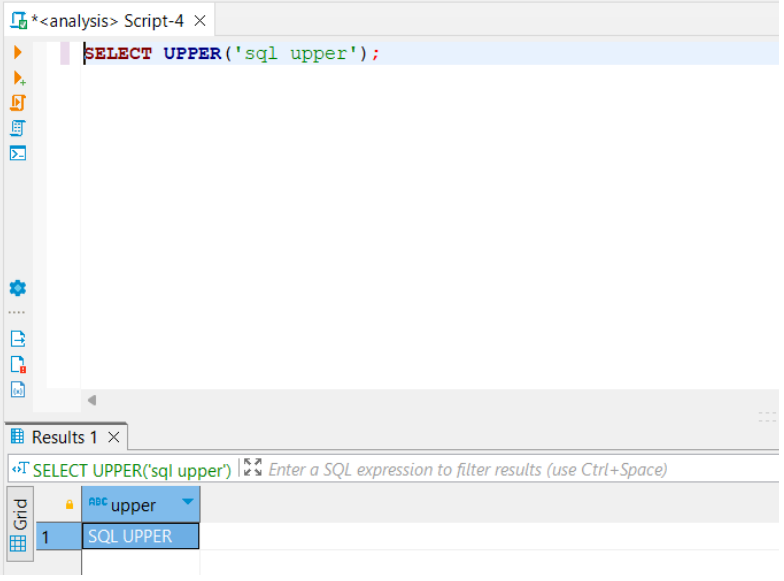
</div>

The following query uses the **UPPER** function to convert last names
employees to the upper register.

```sql
SELECT UPPER(last_name) AS last_name_upper
FROM HR.employees
ORDER BY last_name_upper;
```

<div align="center">
  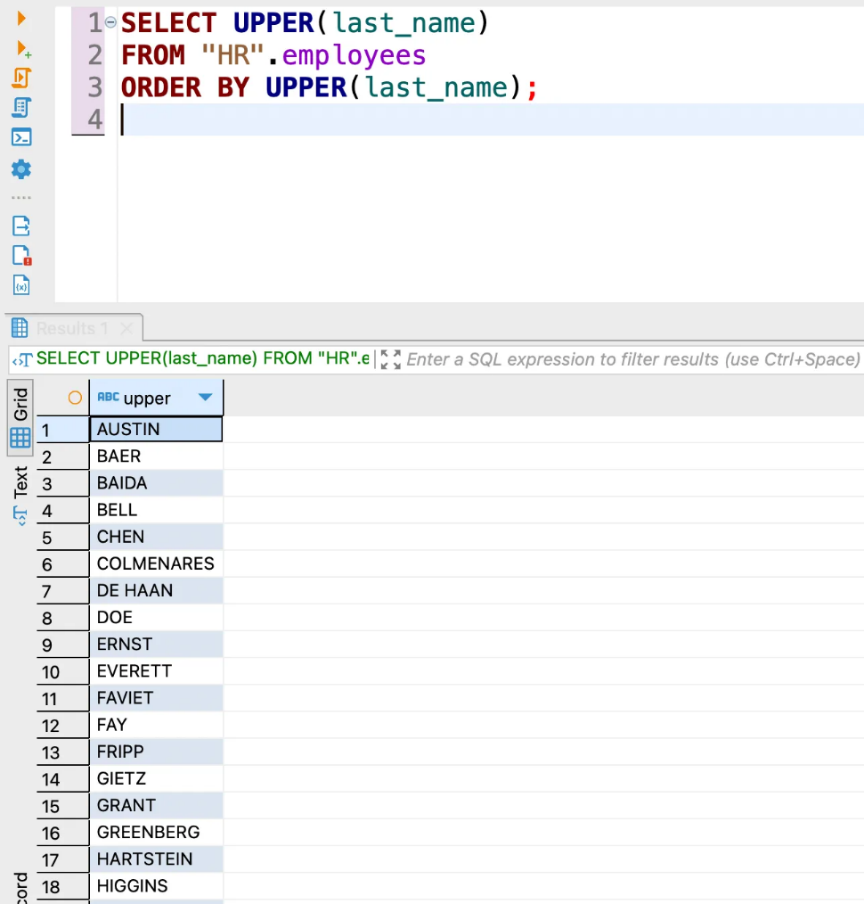
</div>

The query simply reads the data from the employees table and converts it to
flying 

To convert data to upper case in a database table, you
the UPDATE statement must be used. 
updates employee email addresses to upper case.

```sql
UPDATE employees
SET email = UPPER( email );
```

When you query using WHERE, database systems often
correspond to the data register. 
the string Bruce is different from bruce.

The following query returns no results.

```sql
SELECT employee_id
     , first_name
FROM HR.employees
    WHERE first_name = 'BRUCE';
```

To match data, regardless of case, use
function **UPPER**. 

```sql
SELECT employee_id
     , first_name
FROM HR.employees
    WHERE UPPER( first_name ) = 'BRUCE';
```

Note that the above query scans the entire table to find
corresponding line. 

The **LOWER** function works similarly. 
independently in practice.

<h2 align="center">SUBSTRING function</h2>

The **SUBSTRING** function allows you to extract a substring that starts with
of the specified position and has a specified length.

The syntax for the **SUBSTRING** function is as follows:
```sql
SUBSTRING( source_string, position, length );
```
The SUBSTRING function has three arguments:

- **source_string** --- is the string from which you want to get the substring.
- **position** --- is the starting position from which the substring starts.
- **length** is the length of the substring (optional argument).

The following example returns a substring starting at position **1** and
has a length of **3**.

```sql
SELECT SUBSTRING( 'Go it the best school', 1, 3 );
```
<div align="center">
  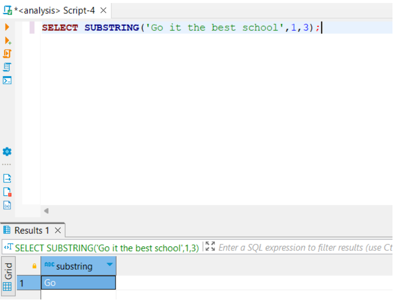
</div>

The following statement returns the substring starting at position **4** and
has a length of **8**.

```sql
SELECT SUBSTRING( 'Go it the best school', 4, 8 );
```
<div align="center">
  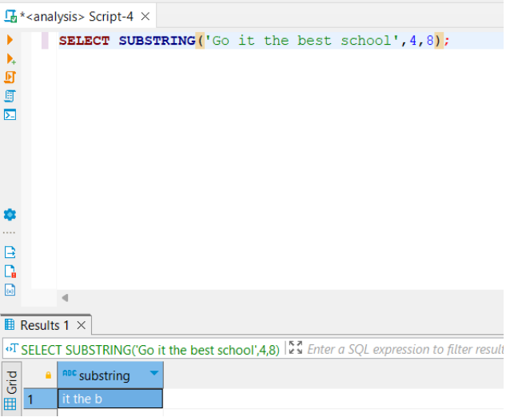
</div>

The following query uses **SUBSTRING** to extract the first characters
names of employees (initials) and groups employees by their
initials:

```sql
SELECT COALESCE( UPPER(TRIM(SUBSTRING(first_name, 1, 1))) , '') AS initial
     , COUNT(*) AS employees_count
FROM HR.employees
GROUP BY initial
ORDER BY initial;
```

<div align="center">
  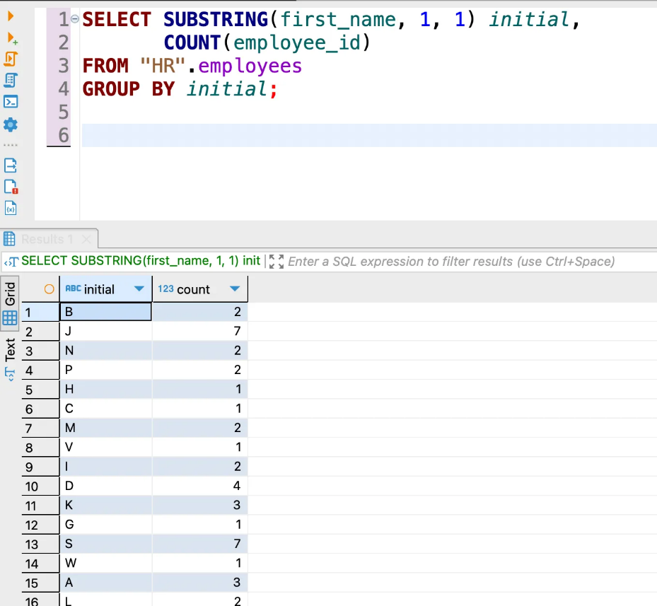
</div>

In general, **string functions in SQL** are an important component of the query language, which
helps us efficiently and accurately process string data in the database,
performing a variety of operations and providing flexibility and control over
data processing. 
depending on the type of DBMS, however, we considered the most common ones
are used in the analyst's work.

**COALESCE --- handle data with NULL or missing values
values**

When working with SQL, it is important to understand the concept of **NULL** and get it right
work out these values ​​as they may affect the results
queries and calculations.

*📎 In SQL, **NULL** represents a special value that points to
missing data or uncertain value. 
is used when you do not know the value of a certain field in a table or
when the value is undefined.*

<h2 align="center">Special properties of NULL in SQL:</h2>

- Lack of meaning. 
poly.

- Different from an empty string. 
an empty string (a zero-length string). 
in the field, but **NULL** indicates no value.

- Applies to any type of data. 
use with any type of data: be it numbers, strings, dates,
or other types.

- Not compared to other values. 
any other value, including **NULL** itself. 
comparisons with **NULL** such as **=,\<\>,\<,\>,** return
indeterminate result.

<h2 align="center">COALESCE function</h2>

Using appropriate methods and tools such as **COALESCE**,
data with **NULL** or missing values ​​can be handled efficiently
values

*📌 **COALESCE** is a function or method that allows
replace NULL or missing values ​​in the data with other values. 
allows you to set alternative values ​​that will
to be used if the original value is NULL or missing. 
be useful in data processing when it is necessary to ensure availability
values ​​in all records or when performing certain operations on data.*

The **COALESCE** function takes multiple arguments and returns the first one
non-NULL argument. 
**COALESCE** functions:
```sql
COALESCE( argument1, argument2, \... );
```
- The **COALESCE** function calculates its arguments from left to right. 
stops the computation as soon as it finds the first argument other than
**NULL**, and outputs its value. 
arguments are not evaluated at all.

- **COALESCE** function returns **NULL** if all arguments
are equal to **NULL**.

<h2 align="center">Examples of COALESCE</h2>

1. The following statement returns 1 because 1 is the first
non-NULL argument.

```sql
SELECT COALESCE( 1, 2, 3 ); -- return 1
```
2. The following statement returns Not NULL because it is the first string
a non-NULL argument.

```sql
SELECT COALESCE( NULL, 'Not NULL', 'OK' ); -- return Not NULL
```
Almost all relational database systems support the **COALESCE** function,
for example, MySQL, PostgreSQL, Oracle, Microsoft SQL Server, Sybase --
therefore, its use is a priority over alternative methods,
specific only to a specific type of database.

<h2 align="center">Example 1</h2>

Suppose we have a products table with the following structure and data:

```sql
CREATE TABLE products (
    id                   INT           PRIMARY KEY
  , product_name         VARCHAR(255)  NOT NULL
  , product_summary      VARCHAR(255)
  , product_description  VARCHAR(4000) NOT NULL
  , price                NUMERIC(11,2) NOT NULL
  , discount             NUMERIC(11,2)
);

INSERT INTO products (
    id
  , product_name
  , product_summary
  , product_description
  , price
  , discount
) VALUES
(
    1
  , 'McLaren 675LT'
  , 'Inspired by the McLaren F1 GTR Longtail'
  , 'Performance is like striking and the seven-speed dual-clutch gearbox is twice as fast now.'
  , 349500.00
  , 1000.00
),
(
    2
  , 'Rolls-Royce Wraith Coupe'
  , NULL
  , 'Inspired by the words of Sir Henry Royce, this Rolls-Royce Wraith Coupe is an imperceptible force.'
  , 304000.00
  , NULL
),
(
    3
  , '2016 Lamborghini Aventador Convertible'
  , NULL
  , 'Based on a V12, this Superveloce has been developed as the Lamborghini with a sportier DNA.'
  , 271000.00
  , 500.00
);
```

We see that there is an entry in the list of products that has
**discount** field is **NULL**. 
is displayed when the request is executed:

```sql
SELECT * FROM products;
```
<div align="center">
  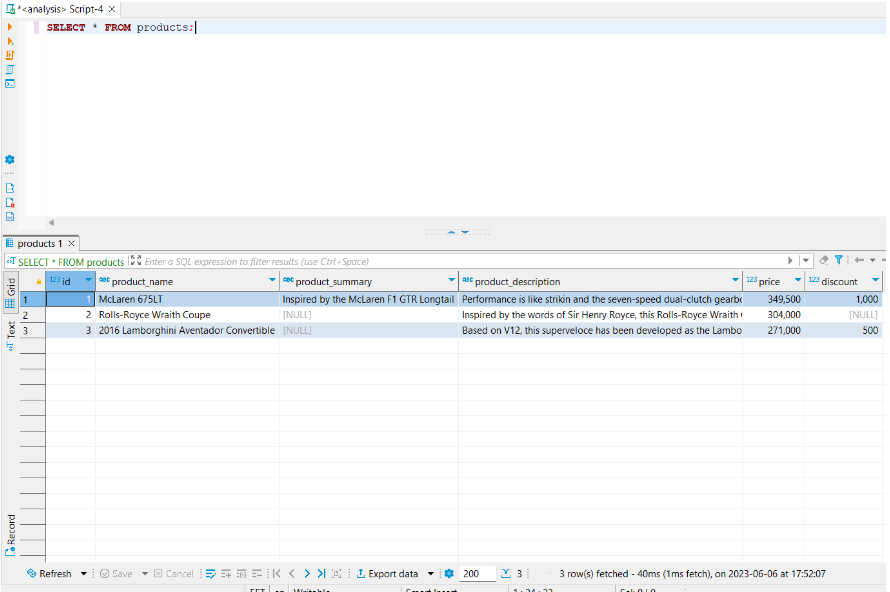
</div>

<h2 align="center">Example 2</h2>

Suppose you need to display products on a web page with everything
with the information in the **products** table. 
others --- no.

In this case, you can use the **COALESCE** function,
to return a brief description of the product. 
provided, you will receive the first 50 characters of the product description.
```sql
SELECT id
    , product_name
    , COALESCE(
        product_summary,
        CONCAT(SUBSTRING(product_description, 1, 50), '...')
      ) AS excerpt
    , price
    , discount
FROM products;
```

You can also use the **CONCAT** function to add (...) to
the end of the passage. 
just an excerpt, and if they click on the Read More link, it will
more information is available.

```sql
SELECT
    id
  , product_name
  , COALESCE(
      product_summary
    , CONCAT(LEFT(product_description, 50), '...')
    ) AS excerpt
  , price
  , discount
FROM products;
```

<h2 align="center">Example 3</h2>

Suppose you need to calculate the net price of all products, and you
wrote the following request:
```sql
SELECT
    id
  , product_name
  , price
  , ( price - COALESCE( discount, 0 ) ) AS net_price
FROM products;
```

The net price for the product Rolls‑Royce Wraith Coupe is 304000.00 (discount = NULL → COALESCE(discount, 0) = 0).
as **NULL**. 
**NULL** value and when we use this **NULL** value in
calculation, we get the value **NULL**.

Therefore, we need a query that will allow us to display the correct information:
```sql
-- Calculate net price: treat NULL discount as 0
SELECT
    id
  , product_name
  , price
  , (price - COALESCE(discount, 0)) AS net_price
FROM products;
```

<div align="center">
  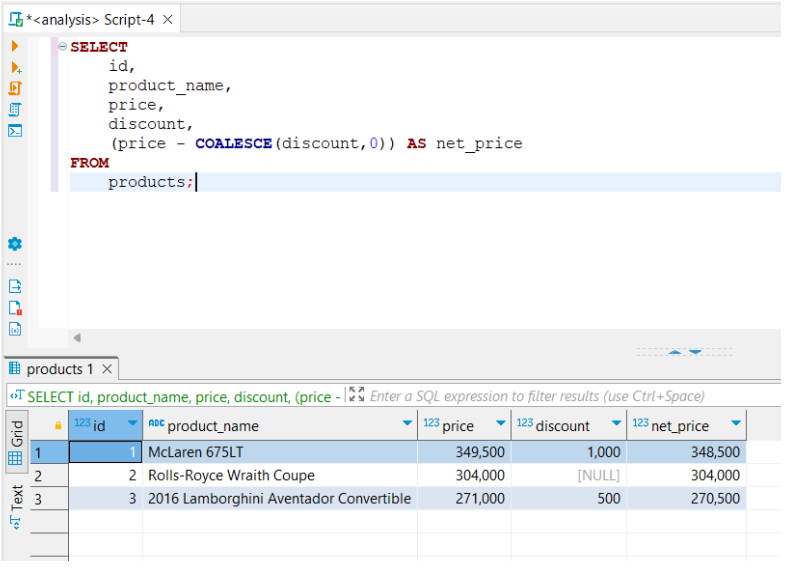
</div>

<h2 align="center">Conclusions</h2>

The **COALESCE** function is a useful tool in SQL to work with
default values. 
value from a set of arguments.

Key takeaways from the **COALESCE** feature:

- Convenience and efficiency. 
easy to handle default values ​​without the need for complex ones
**IF** or **CASE** constructs.

- Flexibility. 
to combine multiple columns or values ​​in a query that
allows you to choose the most appropriate values.

- Replacement of zero values. 
work with zero values, because it can replace them with
alternate or default values.

- Comparison with analogues. 
such as **ISNULL** and **NVL** (recommended to familiarize yourself with
them), the **COALESCE** function is distinguished by its universality,
because it can handle more than two arguments and returns the first one
non-zero value.

In general, the flexibility of the **COALESCE** function and the ability to replace nulls
values ​​make it an indispensable tool for working with strings of data
databases.

<h2 align="center">Selection of alternative values ​​for NULL padding</h2>

The choice of alternative values ​​for filling **NULL** in SQL can depend
from the context of the task and your requirements. 
possible alternative values:

- Padding with zero **(0)** or an empty string. 
if **NULL** means no data and you want specifics
value to process or display. 
column that stores the number of items and **NULL** means
no product, you can fill **NULL** with zero **(0).**

- Filling with default values. 
default value to fill **NULL** if present
appropriate for your context. 
order dates and **NULL** means the date is unknown, you can
set default value to current date or custom
the value is "unknown".

- Use of average values ​​or statistical indicators. 
you can use aggregate functions such as **AVG** (avg
value) or **MAX** (maximum value) to calculate
alternative value based on available data. 
you have a column containing the age of the users and some values
is **NULL**, you can use **AVG** to calculate the average
age and use it as an alternative value for **NULL**.

**‼‼‼ However, filling NULL with alternative values ​​can lead to
some potential problems, including information loss or distortion
data.**

<h2 align="center">Here are a few issues to look out for:</h2>

- **Loss of information**. 
values ​​may result in loss of original data. 
if **NULL** means no data and you fill it with zero
**(0)**, then you lose the ability to distinguish missing data from real data
value **0**.

- **Analysis distortion**. 
values ​​can lead to distortion of data analysis. 
if you fill in the missing values ​​with the average value, it can
lead to an understatement or overstatement of actual figures such as
mean, median, etc.

- **Wrong interpretation of data**. 
**NULL** padding values ​​may result in false positives
data interpretation. 
the filled values ​​are valid data which may result in
wrong conclusions or decisions.

- **Statistical distortions
analyses**. 
distort statistical analyses, such as data distribution, correlation
etc. 
data and lead to inaccurate analytical results.

So when filling **NULL** with alternate values ​​is important
understand the possible implications and nature of the data. 
tasks and taking into account potential problems will help to avoid them
misinterpretation of data and maintain the quality of the analysis.

<h2 align="center">CASE in the SQL query language</h2>

**CASE** is a powerful and flexible tool that allows you to execute
conditional operations and branching in SQL queries.
Using **CASE** allows you to change the query logic based on
given conditions, which makes it indispensable for various processing tasks
data

**CASE** can be used to implement a variety of logical operations,
which provide conditional logic, sample data processing and transformation
query results. 
expanding the functionality and expressiveness of requests, which allows effective
manipulate data in the database.

The **CASE** expression evaluates a list of conditions and returns one of the possible ones
results 

1. simple **CASE**;
2. search **CASE**.

You can use **CASE** in a sentence or in a statement. 
you can use **CASE** in statements like
as **SELECT**, **DELETE** and **UPDATE** or in **SELECT, ORDER
BY** and **HAVING**.

<h2 align="center">A simple CASE</h2>

<h2 align="center">Below is a simple CASE expression.</h2>

```sql
CASE expression
    WHEN when_expression_1 THEN result_1
    WHEN when_expression_2 THEN result_2
    -- ...
    ELSE else_result
END
```

In this expression, each condition (**condition**) is checked in turn, and
when it is true, the corresponding result (**result**) is returned.
If none of the conditions is satisfied, the value specified in is returned
**ELSE** blocks.

- The **CASE** operator returns **result_1, result_2** or **result_3**,
if the expression matches a matching expression in the **WHEN** clause.

- If the expression does not match any expression in the **WHEN** clause, it
returns **esle_result** in **ELSE** clause. 
optional.

- If the **ELSE** clause is omitted and the expression does not match any
**WHEN** expression, **CASE** expression returns **NULL**.

<h2 align="center">Examples of simple CASE usage</h2>

We can use a simple CASE expression to get the working anniversaries
employees using the following operator:

```sql
SELECT first_name
    , last_name
    , hire_date
    , CASE (2000 - EXTRACT(YEAR FROM hire_date))
        WHEN 1  THEN '1 year'
        WHEN 3  THEN '3 year'
        WHEN 5  THEN '5 year'
        WHEN 10 THEN '10 year'
        WHEN 15 THEN '15 year'
        WHEN 20 THEN '20 year'
        WHEN 25 THEN '25 year'
        WHEN 30 THEN '30 year'
      END AS anniversary
FROM HR.employees
ORDER BY first_name;
```

<div align="center">
  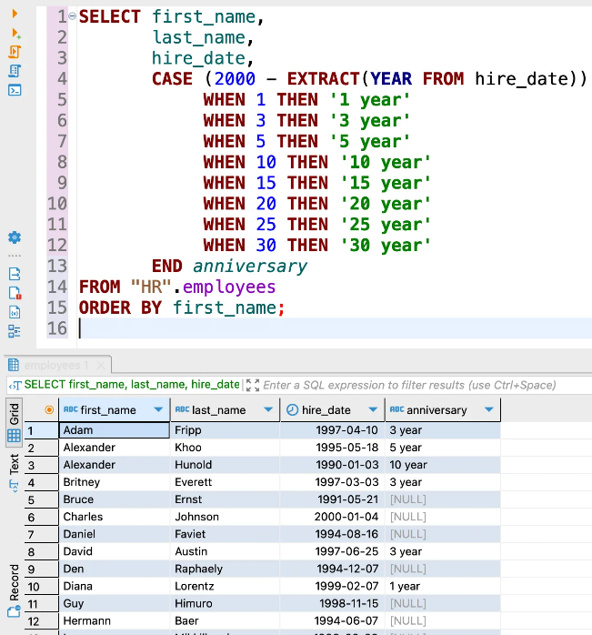
</div>

As you already noticed in the example above, the function **EXTRACT** returns the year,
when the employee joined the company. 
during which the worker works in the company, and we subtract the year of joining to
companies 
used to calculate the difference.

Then we compare the result with the numbers **1, 3, 5, 10, 15, 20, 25,
30**.

- If year of operation is one of these numbers, the **CASE** expression returns
anniversary of the employee's work.

- If the employee's year of work does not correspond to any of these numbers,
the **CASE** expression returns **NULL**.

<h2 align="center">CASE search expression</h2>

The **CASE** expression compares an expression to the set of expressions **(when_expression_1,
when_expression_2, when_expression_3, ...)** using the statement
of equality **(=)**.

If you want to use other comparison operators, such as more
than **(>)**, less than **(<)** etc. you need
apply **CASE** search expression.

Below is an example of a **CASE** search expression:

```sql
SELECT first_name
    , last_name
    , salary
    , CASE
        WHEN salary < 3000 THEN 'Low'
        WHEN salary >= 3000 AND salary <= 5000 THEN 'Average'
        WHEN salary > 5000 THEN 'High'
        ELSE 'Unknown'
      END AS evaluation
FROM HR.employees;
```

The database system calculates a logical expression for each
the **WHEN** clause in the order specified in the **CASE** expression.

If the boolean expression in the **WHEN** clause evaluates to **true** then
The search operator **CASE** returns the result from
corresponding **THEN** and stops the check. 
true expressions, we will get an answer that corresponds to the first of them.

- If no boolean expression returns **true**,
the **CASE** expression returns the **else_result** specified in the
**ELSE** clauses.

- As with a simple **CASE** expression, the **ELSE** clause is optional.

- If you omit the **ELSE** clause and no logical expression is received
**true**, the **CASE** expression will return **NULL**.

<h2 align="center">An example of a CASE search expression</h2>

```sql
SELECT
    first_name
  , last_name
  , CASE
        WHEN salary < 3000 THEN 'Low'
        WHEN salary >= 3000
             AND salary <= 5000 THEN 'Average'
        WHEN salary > 5000 THEN 'High'
    END AS evaluation
FROM HR.employees;
```

- If the salary is less than **3000**, the **CASE** expression returns the value
**"Low"** (low).

- If the salary is in the range from **3000** to **5000**,
**"Average"** value is returned.

- When salary is greater than **5000**, the **CASE** expression returns a value
**"High"** (high).

<h2 align="center">So, let's briefly summarize the main points:</h2>

- The **CASE** expression is a powerful tool for executing conditionals
operations and replacing values ​​in SQL queries.

- The **CASE** expression allows you to change the query logic depending on the given
conditions, making it useful for a variety of processing scenarios
data

- **CASE** expression can be used to replace column values,
creating new columns or defining values ​​for grouping or
data sorting.

- A **CASE** expression can contain multiple conditions and results which
are checked sequentially, and use an **ELSE** block for
defining the default value.

- Using **CASE** allows for extended functionality
SQL queries, providing greater flexibility and capability
personalization of query results.

In general, the **CASE** expression is an important tool for conditional control
logic and data processing in SQL. 
manipulate data effectively, providing more accurate and tailored
query results.

<h2 align="center">Functions and procedures in SQL</h2>

Functions and procedures in SQL are key components of a query language that
allow you to create reusable blocks of code and execute
complex operations on data in the database. 
creating and using functions and procedures in SQL is of great importance with
several reasons.

Functions and procedures allow for modularity and repeatability
using code or queries that help improve performance and
avoiding duplication. 
perform certain tasks, and use them in various requests and
programs that ensure efficient development and maintenance of databases.

Functions and procedures allow you to perform complex operations on data,
which take into account the calculation, processing, aggregation and change of data in the database
data 
procedures that execute a set of instructions. 
more complex requests and operations that meet the needs of your project
or business logic.

To explain in simple words, instead of writing every time
the same queries, it is more convenient to group them together and store them so that
it was possible to use them many times. 
each time the request logic changes, a new one can be passed
parameter for functions and stored procedures.

<h2 align="center">Difference between functions and procedures</h2>

In SQL, functions and procedures are two different types of objects that can
be created and used to perform data operations. 
the difference between functions and procedures is how they return
the results

<div align="center">
  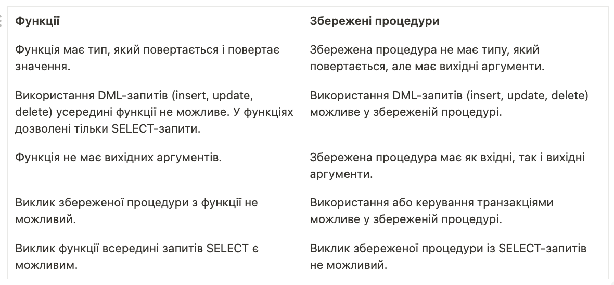
</div>

So, functions are used to perform calculations and return results,
whereas procedures serve to perform sequential actions and change state
data 
and database management.

<h2 align="center">Creating functions</h2>

Let's look at the process of creating a function in PostgreSQL. 
code illustrates how to create a function:

```sql
CREATE OR REPLACE FUNCTION function_name(param_list)
RETURNS return_type
AS $$
DECLARE
    -- variable declaration
BEGIN
    -- logic
END;
$$ LANGUAGE plpgsql;
```

<h2 align="center">Explanation of operators:</h2>

- **create \[or replace\] function function_name** --- creates or
replaces the function, if it exists, with the specified name and parameters;

- **returns return_type** --- the data type returned by the function;

- **plpgsql** language--- indicates a PostgreSQL procedural extension;

- inside the sign **\$** --- this is the body of the function;

- **declare** --- shows how variables are declared or initialized;

- code block **\[begin --- end\]** --- contains all function logic;

- **begin** --- indicates the beginning of requests;

- **end** --- indicates the end of the function.

The following example illustrates creating and calling a single function. 
the function returns the total number of records in the **employees** table:

```sql
CREATE OR REPLACE FUNCTION totalRecords()
RETURNS integer AS $total$
DECLARE
    total integer;
BEGIN
    SELECT COUNT(*) INTO total
    FROM "HR".employees;
    RETURN total;
END;
$total$ LANGUAGE plpgsql;
```

Now let's call this function and check the entries in the table
**employees**.

```sql
SELECT totalRecords()
```
<div align="center">
  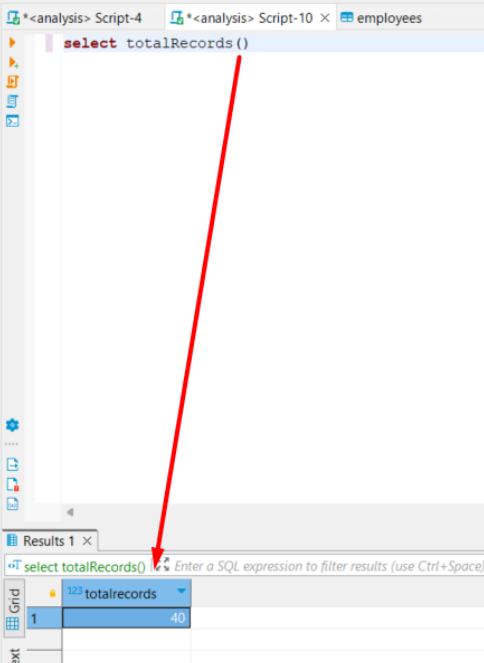
</div>

So our function returned the number of rows in the **employees** table,
for this we just had to call her. 
the possibility of re-applying this function in different parts
query, which simplifies writing code.

List of all functions available in our database element tree:

<div align="center">
  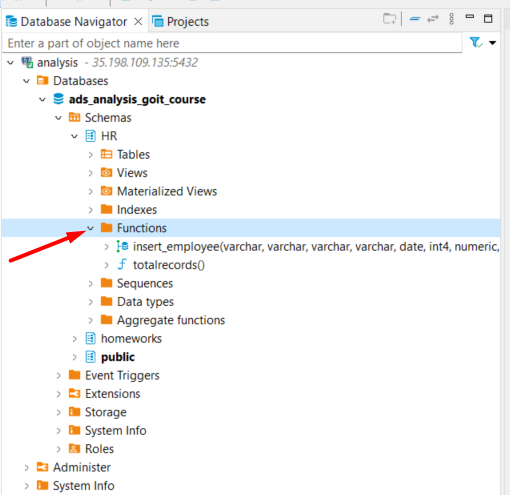
</div>

<h2 align="center">Create a stored procedure</h2>

Creating a stored procedure as shown in the code block below is almost
similar to creating a function, but with a slight difference --- it doesn't have one
**return**. 

```sql
CREATE [OR REPLACE] PROCEDURE procedure_name(parameter_list)
LANGUAGE language_name AS $$
stored_procedure_body;
$$;
```

Let's consider an example of the procedure for adding a new employee:

```sql
-- Procedure: insert_employee
CREATE OR REPLACE PROCEDURE insert_employee(
    p_first_name                 VARCHAR(50),
    p_last_name                  VARCHAR(50),
    p_email                      VARCHAR(255),
    p_phone_number               VARCHAR(50),
    p_hire_date                  DATE,
    p_job_id                     VARCHAR(50),
    p_salary                     NUMERIC(11,2),
    p_manager_id                 INT,
    p_department_id              INT,
    p_identifier                 VARCHAR(100),
    p_name                       VARCHAR(255),
    p_description                TEXT,
    p_type                       VARCHAR(100),
    p_state                      VARCHAR(100),
    p_resource_name              VARCHAR(255),
    p_resource_account_level     VARCHAR(100),
    p_update_status              VARCHAR(100)
)
LANGUAGE plpgsql
AS $$
BEGIN
    INSERT INTO employees (
        first_name,
        last_name,
        email,
        phone_number,
        hire_date,
        job_id,
        salary,
        manager_id,
        department_id,
        "ідентифікатор",
        "Імʼя",
        опис,
        тип,
        штат,
        "Назва ресурсу",
        "Рівень облікового номера ресурсу",
        "Стан оновлення"
    ) VALUES (
        p_first_name,
        p_last_name,
        p_email,
        p_phone_number,
        p_hire_date,
        p_job_id,
        p_salary,
        p_manager_id,
        p_department_id,
        p_identifier,
        p_name,
        p_description,
        p_type,
        p_state,
        p_resource_name,
        p_resource_account_level,
        p_update_status
    );
END;
$$;

-- Example call
CALL insert_employee(
  'John',                       -- first_name
  'Doe',                        -- last_name
  'john.doe@example.com',       -- email
  '+123456789',                 -- phone_number
  '2023-06-07'::date,           -- hire_date
  'DEV01',                      -- job_id
  5000.00,                      -- salary
  NULL,                         -- manager_id
  NULL,                         -- department_id
  'identifier-123',             -- "ідентифікатор"
  'John Doe',                   -- "Імʼя"
  'Short product description',  -- опис
  'employee',                   -- тип
  'active',                     -- штат
  'resource name',              -- "Назва ресурсу"
  'account level',              -- "Рівень облікового номера ресурсу"
  'update status'               -- "Стан оновлення"
);
```

What did this procedure give us? 
records to the database** and can **reuse** this one
object when it is convenient for us.

<h2 align="center">Conclusions</h2>

So, functions and procedures are used to create grouped
blocks of code that can be called from SQL queries or from other code. 
provide a convenient way to structure and reuse
using logic and can also assign roles to side effects.

However, it is recommended to be careful before using the features and procedures
develop logic and carefully plan the use of these objects,
as improper use can lead to the accumulation of large
number of internal database objects and affect performance.

Knowledge of SQL functions and procedures is essential for data analysts because
they allow **to create advanced queries, automate processing
data, facilitate database management and improve performance
systems**. 
effective and flexible data processing and analysis solutions.

Familiarity with functions and procedures in SQL opens wide
capabilities and makes this topic essential for anyone working with databases
data and performs data analysis.
