<h2 align="center">Оптимізація запитів SQL</h2>

**Оптимізація запитів SQL** є важливою складовою систем керування базами
даних, так само як будь-який інший компонент. Якщо не оптимізувати
запити, які отримують доступ до даних, продуктивність бази даних може
знизитися. У багатьох випадках це сповільнення може завадити
користувачам швидко отримати доступ до необхідної інформації.

Поговоримо про різні методи оптимізації запитів SQL, які можна
використовувати для покращення їхньої продуктивності.

1.  Замість (\*) використовуй **імена стовпців** в операторі SELECT

Якщо ти хочеш вибрати **лише певну кількість стовпців**, тоді слід
використовувати імена стовпців замість (\*) в операторі SELECT.

Хоча (\*) простіше написати, базі даних знадобиться більше часу на
обробку такого запиту. **Обмеживши кількість вибраних стовпців, ти можеш
зменшити розмір таблиці результатів, скоротити мережевий трафік і
підвищити загальну продуктивність запиту.**

2.  У реляційних базах даних, таких як PostgreSQL,
    оператор **HAVING** використовується для фільтрації результатів
    групування, тоді як оператор **WHERE** --- для фільтрації рядків
    перед групуванням.

**Рекомендується використовувати оператор WHERE для визначення фільтрів,
коли це можливо. Це забезпечує більш оптимальну роботу запиту.**

<h2 align="center">Важливо</h2>

*Оператор **HAVING** усе ще є корисним, коли тобі потрібно фільтрувати
результати групування на основі обчислених значень агрегатних функцій.
Але якщо в тебе немає потреби використовувати агрегатні функції або
групувати дані, краще використовувати оператор **WHERE** для фільтрації
рядків перед групуванням.*

3.  Оператор **DISTINCT** використовується для видалення дублікатів із
    результатів запиту, тобто він забезпечує унікальність рядків. Але в
    деяких випадках його використовують без потреби, що призводить до
    зайвої обробки даних і втрати продуктивності.

Ось кілька ситуацій, коли варто уникати зайвого
використання **DISTINCT**:

-   Колонки в запиті вже є унікальними. Якщо результати запиту вже
    гарантують унікальність значень рядків, то
    використання **DISTINCT** є зайвим. Наприклад, якщо в тебе
    є **PRIMARY KEY** або унікальні індекси на колонки, результати
    будуть унікальними за замовчуванням.

-   Зайва повторюваність таблиць у **JOIN**. Іноді неправильне
    використання операцій **JOIN** може призводити до виникнення
    дублікатів у результаті запиту. У такому випадку слід виправити
    логіку з\'єднання таблиць, щоб уникнути дублікатів, замість того щоб
    використовувати **DISTINCT** для їх видалення.

-   Відсутність дублікатів у вихідних даних. Якщо вихідні дані вже не
    містять дублікатів, наприклад, через використання агрегатних
    функцій, то використання **DISTINCT** є зайвим.

**Уникнення непотрібного використання DISTINCT може покращити
продуктивність запиту, оскільки обробка й видалення дублікатів можуть
бути витратними операціями.**

Тому, якщо це можливо, варто перевірити, чи дійсно потрібно
використовувати **DISTINCT** у запиті та оптимізувати його.

4.  Використання **JOIN** замість **SUBQUERY**

У **підзапиті** виконується окремий запит до бази даних для отримання
підмножини даних, яку потім використовують в основному запиті.
**Підзапити** можуть бути корисні в деяких ситуаціях, але водночас у
деяких випадках вони можуть бути неефективними і спричиняти додаткове
навантаження на базу даних.

Операція **JOIN** дозволяє з\'єднувати різні таблиці на основі умови
з\'єднання.

Використання **JOIN** замість підзапиту може мати кілька переваг:

-   Менше обробки даних. При використанні **JOIN** усі дані, необхідні
    для об\'єднання, використовуються в одному запиті, що може призвести
    до меншого обсягу даних, які потрібно обробляти й передавати між
    базою даних і застосунком.

-   Більш ефективне виконання. Використання **JOIN** дозволяє базі даних
    використовувати більш оптимальні плани виконання запиту, такі як
    застосування індексів і з\'єднання на ранніх етапах запиту.

-   Краща читабельність запиту. Використання **JOIN** зазвичай
    забезпечує кращу читабельність запиту, особливо у складних запитах
    із багатьма таблицями й умовами з\'єднання.

Однак варто враховувати, що в деяких ситуаціях **підзапити** можуть бути
доцільними або навіть необхідними. Наприклад, коли потрібно обмежити
результати групування або використати **підзапит** для отримання
підмножини даних перед використанням **JOIN**.

<h2 align="center">Висновки</h2>

Ми розглянули лише кілька рекомендацій щодо оптимізації SQL-запитів. Під
час роботи й набуття досвіду ти зможеш розширити цей список для
підвищення продуктивності та ефективності роботи з базами даних.

Тут залишаємо для тебе ключові моменти щодо оптимізації, які варто
запам\'ятати:

-   Оптимізація SQL-запитів спрямована на покращення часу виконання
    запитів, скорочення використання ресурсів та оптимальне використання
    індексів і структур даних.

-   Правильне проєктування бази даних з урахуванням нормалізації,
    індексації та оптимального розподілу даних може значно покращити
    продуктивність запитів.

-   Аналіз і профілювання запитів дозволяють ідентифікувати складні
    місця та проблемні запити, які потребують оптимізації.

-   Правильне використання
    операторів **SELECT, HAVING, WHERE, DISCTINCT, JOIN** і підзапитів може
    значно покращити продуктивність запитів.

-   Постійний моніторинг та оновлення статистики бази даних допомагають
    підтримувати оптимальну продуктивність запитів у довгостроковій
    перспективі.

-   Оптимізація запитів SQL є процесом, який вимагає аналізу,
    експериментів і постійного вдосконалення для досягнення найкращих
    результатів.

Важливо пам\'ятати, що оптимізація запитів SQL є специфічною для кожної
бази даних і потребує індивідуального підходу. Постійне навчання та
вдосконалення в галузі оптимізації запитів допоможуть досягти
оптимальної продуктивності та ефективності роботи з даними в SQL.

<h2 align="center">JSON --- структурований формат обміну даними</h2>

**JSON** розшифровується як **JavaScript Object Notation**.

**JSON** --- це відкритий стандартний формат, який складається з пар
«ключ-значення».

Основним призначенням **JSON** є передача даних між сервером і
вебпрограмою. На відміну від інших форматів, **JSON** --- це текст, який
читається людиною.

PostgreSQL підтримує власний тип даних **JSON** з версії 9.2. Він надає
багато функцій і операторів для роботи з даними **JSON**.

Давай почнемо зі створення нової таблиці для практики з типом даних
JSON.

```sql
CREATE TABLE orders (
    id serial NOT NULL PRIMARY KEY
, info json NOT NULL
);
```

Таблиця **orders** містить два стовпці:

-   Стовпець **«ID» **є первинним ключем ідентифікації замовлення.
-   Стовпець **«Info»** зберігає дані у формі **JSON**.

Перш ніж вставити дані у стовпець **JSON**, важливо переконатися, що
дані мають дійсний формат **JSON**.

Наступний оператор **INSERT** додає новий рядок до таблиці **orders**.

```sql
INSERT INTO orders (info)
VALUES (
'{
    "customer": "John Doe"
    , "items": {
            "product": "Beer"
        , "qty": 6
        }
}'
);
```

Це означає, що John Doe придбав 6 пляшок beers

Наступний оператор додає кілька рядків одночасно.

```sql
INSERT INTO orders (info)
VALUES
(
    '{"customer": "Lily Bush", "items": {"product": "Diaper", "qty": 24}}'
)
, (
    '{"customer": "Josh William", "items": {"product": "Toy Car", "qty": 1}}'
)
, (
    '{"customer": "Mary Clark", "items": {"product": "Toy Train", "qty": 2}}'
);
```

Щоб отримати дані у форматі **JSON**, використовуй звичайний **SELECT**.

```sql
SELECT info FROM orders;
```
<div align="center">
  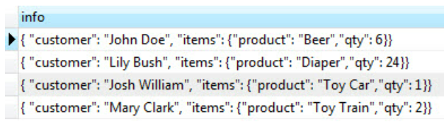
</div>

PostgreSQL повертає набір результатів у форматі JSON.

<h2 align="center">Оператори JSON у PostgreSQL</h2>

**PostgreSQL** надає два власні оператори, щоб допомогти тобі отримати
дані **JSON**.

-   **->** повертає значення поля об'єкта JSON за ключем.
-   **->>** повертає значення поля об'єкта JSON за текстом.

Наступний запит використовує оператор -> для отримання всіх клієнтів у
форматі JSON:

<div align="center">
  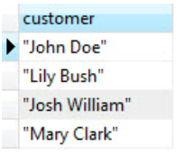
</div>
```sql
SELECT
    info -> 'customer' AS customer
,   info -> 'items'    AS items
FROM orders;
```

А наступний запит використовує оператор -\>\>, щоб отримати всіх
клієнтів у вигляді тексту:

```sql
SELECT info -\>\> \'customer\' AS customer

```
<div align="center">
  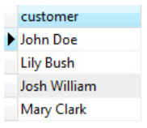
</div>

Оскільки оператор -> повертає об'єкт JSON, ти можеш поєднати його
з оператором ->>, щоб отримати певний вузол. Наприклад, наступний
оператор повертає всі продані продукти:

```sql
SELECT info -> 'items' ->> 'product' as product
ORDER BY product;
```

<div align="center">
  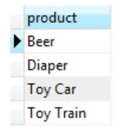
</div>

Спочатку **info -> 'items'** повертає елементи як об'єкти **JSON**.
А потім **info -> 'items' ->> 'product'** повертає всі продукти як текст.

<h2 align="center">Оператор JSON у реченні WHERE</h2>

Ми можемо використовувати оператори **JSON** у розділі **WHERE**,
щоб фільтрувати рядки.

Наприклад, щоб дізнатися, хто купив **Diaper**, ми використовуємо такий
запит:
```sql
SELECT
    info ->> 'customer' AS customer
,   info -> 'items' ->> 'product' AS product
FROM orders
    WHERE info -> 'items' ->> 'product' = 'Diaper';
```

<div align="center">
  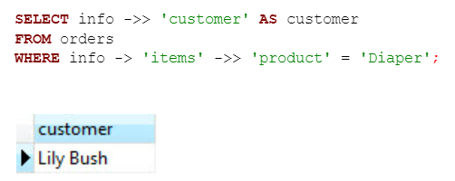
</div>

Щоб дізнатися, хто купив два товари одночасно, ми використовуємо такий
запит:

```sql
SELECT info ->> 'customer' AS customer
     , info -> 'items' ->> 'product' AS product
FROM orders
    WHERE CAST(info -> 'items' ->> 'qty' AS INTEGER) = 2;
```

<div align="center">
  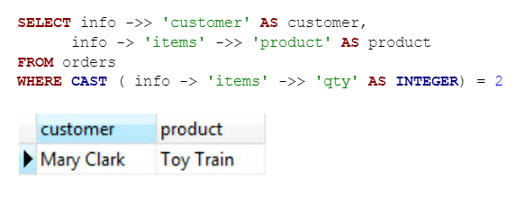
</div>

Зверни увагу, що ми використовували приведення типу, щоб перетворити **qty** в **INTEGER**.

<h2 align="center">Застосування агрегатних функцій до даних JSON</h2>

Ми можемо застосовувати агрегатні функції, такі
як **MIN, MAX, AVERAGE, SUM** тощо, до даних **JSON**.

Наприклад, наступний оператор повертає мінімальну кількість, максимальну
кількість, середню кількість і загальну кількість проданих продуктів.

```sql
SELECT
    MIN(CAST(info -> 'items' ->> 'qty' AS INTEGER))
  , MAX(CAST(info -> 'items' ->> 'qty' AS INTEGER))
  , SUM(CAST(info -> 'items' ->> 'qty' AS INTEGER))
  , AVG(CAST(info -> 'items' ->> 'qty' AS INTEGER))
FROM orders;
```

<div align="center">
  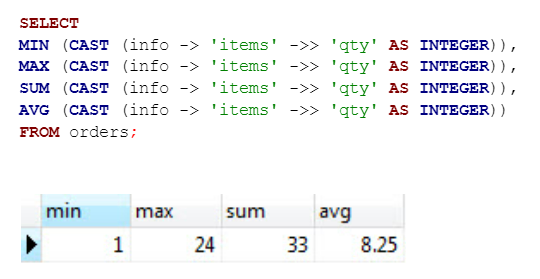
</div>

<h2 align="center">Функція json_each</h2>

Функція **json_each () **дозволяє розширити зовнішній об'єкт JSON у
набір пар «ключ-значення». Дивись наступний запит:

```sql
SELECT json_each (info)
FROM orders;
```

<div align="center">
  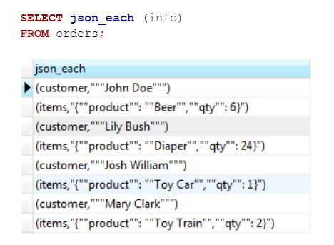
</div>

<h2 align="center">Функція json_each_text</h2>

Якщо ти хочеш отримати набір пар «ключ-значення» у вигляді
тексту, замість цього використовуй функцію **json_each_text ().**

Функція **json_object_keys**

Щоб отримати набір ключів у зовнішньому об'єкті **JSON**,
використовуй функцію **json_object_keys ().**

Наступний запит повертає всі ключі вкладеного об'єкта **items** у
стовпці **info**.

```sql
SELECT json_object_keys ( info->'items' )
FROM orders;
```

<div align="center">
  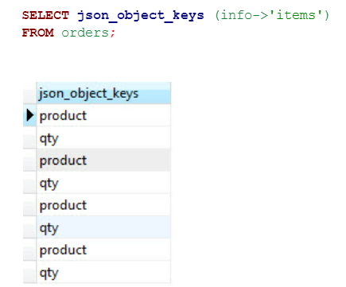
</div>

<h2 align="center">Переваги використання JSON</h2>

Використання JSON у базі даних PostgreSQL має декілька переваг:

-   **Гнучкість даних**. **JSON** дозволяє зберігати структуровані дані
    без вимог до фіксованої схеми бази даних. Ти можеш зберігати дані з
    різною структурою в одному стовпці, що дозволяє легко зберігати
    набори даних з різноманітною структурою, які можуть змінюватися з
    часом.

-   **Простота обробки**. **PostgreSQL** надає широкий набір функцій для
    роботи з даними у форматі **JSON**. Ти можеш здійснювати пошук,
    фільтрацію, сортування й агрегацію за допомогою вбудованих
    операторів та функцій **JSON**. Крім того, **PostgreSQL** має
    підтримку для індексування та повнотекстового пошуку даних **JSON**.

-   **Інтеграція із застосунками**. **JSON** є популярним форматом для
    обміну даними між різними застосунками й системами. Використання
    **JSON** у базі даних дозволяє легко обмінюватися даними з іншими
    застосунками та вебсервісами, що підтримують **JSON**.

-   **Наявність операторів і функцій. PostgreSQL** надає широкий набір
    операторів і функцій для роботи із **JSON**. Ти можеш виконувати
    операції з об\'єктами **JSON**, отримувати доступ до елементів,
    виконувати пошук за ключем або значенням, здійснювати маніпуляції з
    масивами **JSON** та багато іншого.

-   **Підтримка вбудованих типів даних. PostgreSQL** має вбудовані типи
    даних для зберігання **JSON**, такі як **json** (без перевірки на
    правильність синтаксису) і **jsonb** (з перевіркою на правильність
    синтаксису та більш ефективним зберіганням). Використання jsonb
    дозволяє виконувати більш ефективні операції пошуку та фільтрації
    **JSON**-даних.

Загалом використання формату **JSON** у базі даних **PostgreSQL**
дозволяє зберігати, опрацьовувати й обмінюватися структурованими даними
гнучким та ефективним способом.
| Завдання | PostgreSQL | MS SQL Server (T-SQL) | Oracle SQL |
|---|---:|---:|---:|
| Вибірка (отримати текстове значення) | `json_column ->> 'path'`<br/>Приклад: `info ->> 'customer'` | `JSON_VALUE(json_column, '$.path')`<br/>Приклад: `JSON_VALUE(info, '$.customer')` | `JSON_VALUE(json_column, '$.path')`<br/>Приклад: `JSON_VALUE(info, '$.customer')` |
| Вибірка (отримати JSON-об'єкт) | `json_column -> 'path'`<br/>Приклад: `info -> 'items'` | Для отримання об'єкта використовують `OPENJSON` або парсинг; `JSON_QUERY(json_column, '$.path')` | `JSON_QUERY(json_column, '$.path')` |
| Фільтрація (WHERE) | `info -> 'items' ->> 'product' = 'Diaper'`<br/>або `CAST(info -> 'items' ->> 'qty' AS INTEGER) = 2` | `JSON_VALUE(json_column, '$.path.subpath') = 'value'`<br/>або `CAST(JSON_VALUE(json_column, '$.path.qty') AS INT) = 2` | `JSON_VALUE(json_column, '$.path.subpath') = 'value'`<br/>або `TO_NUMBER(JSON_VALUE(json_column, '$.path.qty')) = 2` |

Примітки:
- У PostgreSQL `->` повертає JSON, `->>` повертає текст.
- У T‑SQL та Oracle для простих скалярних значень використовується `JSON_VALUE`, для повернення підоб'єктів — `JSON_QUERY` / `OPENJSON`.
- Підставляйте реальні імена стовпців і шляхів (`json_column`, `$.path`) відповідно до схеми.

<h2 align="center">Робота з датами та часовими даними в SQL</h2>

Уміння обробляти **часові масиви** інформації є дуже важливим у роботі
аналітика, адже це надає можливості для:

-   **Сортування і фільтрації даних.** У SQL дані можна сортувати за
    датою та часом, що дозволяє здійснювати ефективний пошук і
    фільтрацію за певними періодами. Наприклад, ти можеш вибрати всі
    записи, які були створені протягом останньої години, або всі
    замовлення за певний період.

-   **Обчислення інтервалів.** SQL дозволяє виконувати розрахунки на
    основі дат і часу. Наприклад, ти можеш обчислити тривалість між
    двома датами, знайти середній час обробки замовлення або визначити,
    скільки днів залишилося до певної події.

-   **Групування й агрегації даних.** Ти можеш групувати дані за певними
    інтервалами часу (наприклад, за днями, тижнями або місяцями) і
    використовувати агрегатні функції (такі як **SUM, COUNT, AVG**) для
    обчислення статистичних даних або отримання зведених результатів.

-   **Роботи з часовими рядами.** Часові ряди є важливою складовою
    багатьох галузей, таких як фінансовий аналіз, прогнозування попиту,
    вебаналітика тощо. SQL надає можливість зберігати, оновлювати,
    аналізувати й виконувати операції з часовими рядами, що дозволяє
    отримувати цінну інформацію з цих даних.

-   **Планування й керування**. SQL може бути використана для планування
    та керування розкладом подій, завдань або процесів, що відбуваються
    в певний час. Ти можеш створювати регулярні завдання, встановлювати
    таймери чи автоматично виконувати певні дії на основі певних дат або
    часових подій.

<h2 align="center">Типи даних для зберігання дат і часу</h2>

У **PostgreSQL** існує кілька типів даних для зберігання дат і часу.
Основними серед них є **DATE, TIME, TIMESTAMP** та їхні варіації.

Ось короткий опис кожного типу:

-   **DATE** --- Цей тип даних використовується для зберігання дати без
    часу. Він відображає дату у форматі **«YYYY-MM-DD».** Наприклад,
    **«2023-06-09».**

-   **TIME** --- Цей тип даних призначений для зберігання часу без дати.
    Він відображає час у форматі **«HH:MI:SS»** (години, хвилини,
    секунди). Наприклад, **«12:34:56».**

-   **TIMESTAMP** --- Цей тип даних використовується для зберігання дати
    та часу. Він відображає дату і час у форматі **«YYYY-MM-DD
    HH:MI:SS».** Наприклад, **«2023-06-09 12:34:56».**

-   **TIMESTAMP WITH TIME ZONE** --- Цей тип даних призначений для
    зберігання дати та часу, який містить інформацію про часовий пояс.
    Він відображає дату та час у форматі **«YYYY-MM-DD HH:MI:SS TZ».**
    Наприклад, **«2023-06-09 12:34:56 +03».**

-   **INTERVAL** --- Цей тип даних використовується для зберігання
    інтервалів часу, наприклад, різниці між двома датами або часами.

Ці типи даних дозволяють зберігати й виконувати операції з датами і
часом у PostgreSQL.

<h2 align="center">Функції CURRENT_DATE і CURRENT_TIMESTAMP</h2>

У PostgreSQL є дві функції: **CURRENT_DATE і CURRENT_TIMESTAMP** --- які
повертають поточну дату та час відповідно.

-   **CURRENT_DATE**

Ця функція повертає поточну дату (без часу) у форматі **DATE**. Вона
корисна, коли тобі потрібно отримати лише дату без зазначення часу.

Приклад використання CURRENT_DATE:

```sql
SELECT CURRENT_DATE;
```
-   **CURRENT_TIMESTAMP**

Ця функція повертає поточну дату та час у форматі **TIMESTAMP**. Вона
містить як дату, так і час з точністю до мілісекунди. Використовується,
коли тобі потрібно відобразити точний час і дату.

Приклад використання **CURRENT_TIMESTAMP**:

```sql
SELECT CURRENT_TIMESTAMP;
```
Обидві функції: **CURRENT_DATE** і **CURRENT_TIMESTAMP** --- не
приймають аргументів і повертають значення відповідного типу дати. Вони
корисні для отримання поточної дати та часу при виконанні запитів у
PostgreSQL.

-   **Функція date_trunc**

Функція **date_trunc** у PostgreSQL використовується для обрізання або
відсікання частини дати або часу відповідно до певної одиниці
вимірювання.

Це дозволяє округлити значення до більшої або меншої одиниці
вимірювання, залежно від потреби.

Синтаксис функції date_trunc такий:
```sql
date_trunc('unit', timestamp)
```
У цьому синтаксисі:

-   **unit** вказує одиницю, до якої треба обрізати частину дати або часу.
-   **timestamp** --- дата або час, який потрібно обрізати.

Для демонстрації використаємо таблицю employees зі схеми відділу HR:

```sql
SELECT
    date_trunc(\'year\'
    , hire_date
    ) AS truncated_date
FROM HR.employees;
```

<div align="center">
  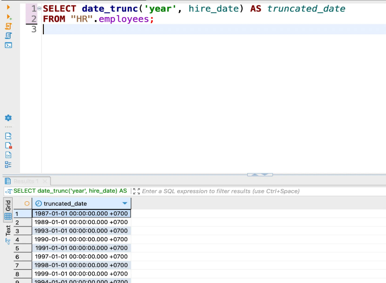
</div>

У цьому прикладі ми використовуємо функцію **date_trunc** для обрізання
дати в полі **hire_date** до рівня року. Результат буде містити лише
рік, а місяці, дні, години, хвилини та секунди залишаться у своїх
початкових значеннях.

Таким чином, функція **date_trunc** дозволяє обрізати дату або час до
певної одиниці вимірювання, що може бути корисним при агрегації або
групуванні даних за певним періодом.

-   **Функція date_add**

У PostgreSQL відсутня вбудована функція **date_add**, але ти можеш
досягти аналогічного результату, використовуючи оператор **+** та
інтервали для додавання до дат.

Оператор **+** у PostgreSQL може бути використаний для додавання
інтервалів до дати або часу. Ти можеш використовувати різні одиниці
вимірювання, такі як **year, month, day, hour, minute, second** тощо.

Наприклад, ми маємо таблицю **employees** зі схеми відділу **HR** і нам
потрібно додати один рік до значення **hire_date** для кожного
співробітника:

```sql
SELECT hire_date + INTERVAL \'1 year\' AS new_date

```
FROM \"HR\".employees;

<div align="center">
  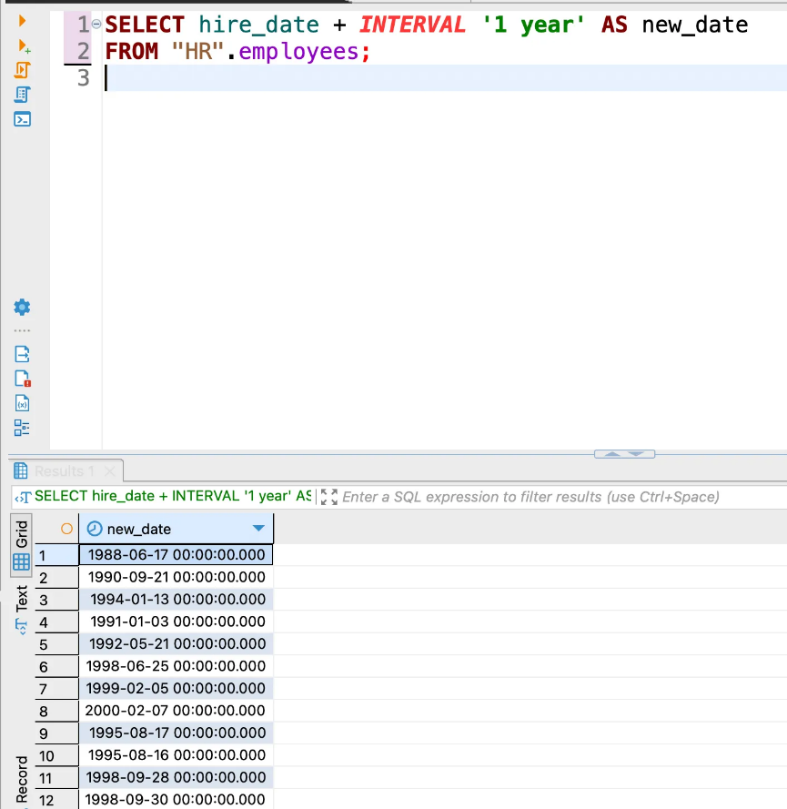
</div>

У цьому прикладі **INTERVAL «1 year»** вказує, що ми додаємо 1 рік до
дати. Результатом є значення **new_date**, яке є **hire_date**,
збільшене на 1 рік.

-   **Функція date_diff**

У багатьох СУБД існує функція **date_diff**, яка повертає різницю між
двома датами, проте в Postgre ситуація трішки відрізняється.

Ти можеш використовувати функцію **date_part** для отримання різниці між
двома датами або часами в певній одиниці вимірювання.

Функція **date_part** дозволяє отримати значення певної одиниці
(наприклад, рік, місяць, день, годину, хвилину, секунду) з дати або
часу. Ти можеш використати цю функцію для отримання значень із двох дат
або часів та обчислення їх різниці.

Ось синтаксис функції **date_part**:
```sql
date_part('unit', timestamp)
```
У цьому синтаксисі:
-   **unit** --- одиниця вимірювання, для якої ти хочеш отримати
    значення.
-   **timestamp** --- дата або час, з яких ти отримуєш значення.

Наприклад, для обчислення різниці в роках між двома датами з
таблиці **employees** зі схеми відділу **HR** ти можеш скористатися
таким запитом:

```sql
SELECT date_part( 'year', age( '2023-01-01', hire_date ) ) AS diff_years
FROM HR.employees;
```

<div align="center">
  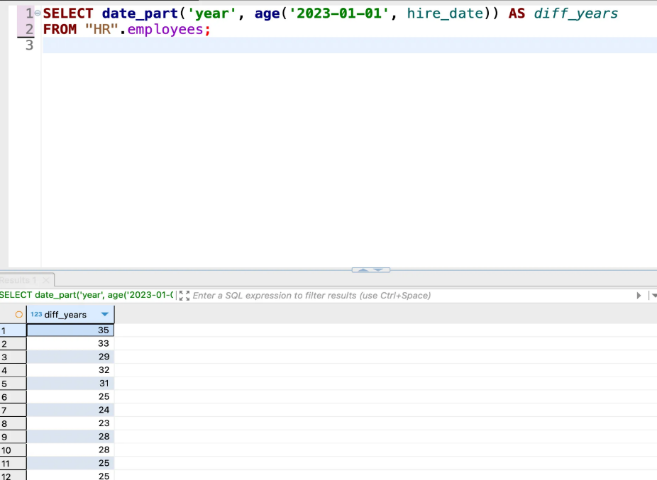
</div>

У цьому прикладі ми використовуємо функцію **age**, яка повертає різницю
між двома датами або часами у форматі **interval**. Потім за
допомогою функції **date_part** ми отримуємо різницю в роках із
цього **interval**.

Отже, хоча у PostgreSQL немає вбудованої функції **date_diff**, ти можеш
використовувати комбінацію функцій **age** і **date_part**, щоб
обчислити різницю між двома датами або часами в певній одиниці
вимірювання.

-   **Функція EXTRACT**

У PostgreSQL функція **EXTRACT** використовується для отримання значення
певної одиниці вимірювання з дати або часу. Вона дозволяє отримати
значення року, місяця, дня, години, хвилини, секунди або іншої одиниці
вимірювання з дати або часу.

Ось синтаксис функції **EXTRACT**:
```sql
EXTRACT( 'unit' FROM timestamp )
```
У цьому синтаксисі:
-   **unit** --- одиниця вимірювання, яку ти хочеш отримати.
-   **timestamp** --- дата або час, з яких ти отримуєш значення.

Наприклад, для отримання значення року з поля **hire_date** у
таблиці **employees** зі схеми відділу **HR** можна скористатися таким
запитом:

```sql
SELECT EXTRACT(year FROM hire_date) AS hire_year
FROM HR.employees;
```
<div align="center">
  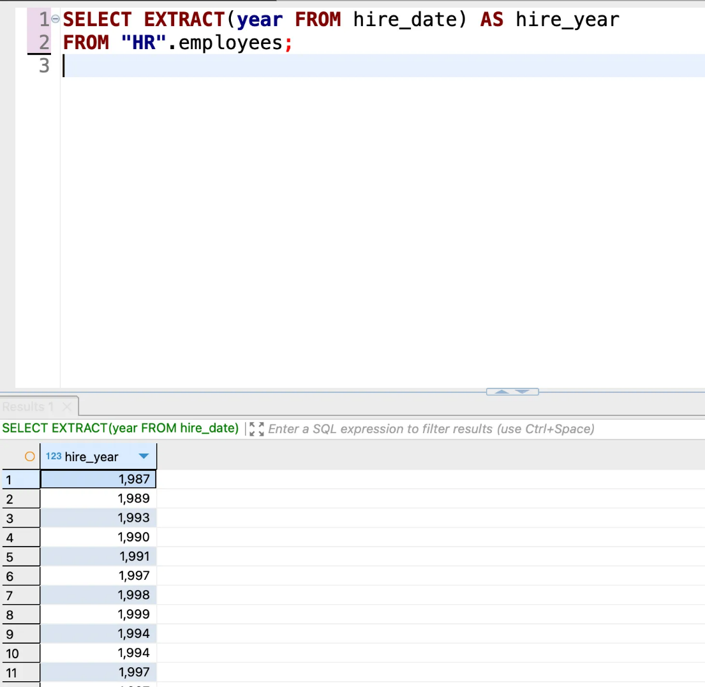
</div>

У цьому прикладі ми використовуємо функцію **EXTRACT** для отримання
значення року з поля **hire_date**. Результатом буде
значення **hire_year**, яке представляє рік з кожного запису.

**EXTRACT** також можна використовувати для отримання інших одиниць
вимірювання, наприклад, місяця, дня, години, хвилини, секунди тощо.
Наприклад, для отримання значення місяця з **hire_date** ти можеш
замінити **year** на **month** у запиті.

<h2 align="center">Функції date and time type conversion</h2>

У PostgreSQL для конвертації типів дати та часу
використовуються функції **CAST** і **TO_CHAR**.

-   **Конвертація в рядок (string)**

Для перетворення типу дати або часу в рядок
використовується функція **TO_CHAR**.

Наприклад, для конвертації поля **hire_date** з типу **date** у рядок
формату **«YYYY-MM-DD»** у таблиці **employees** зі схеми відділу **HR**
ти можеш використати такий запит:

```sql
SELECT TO_CHAR( hire_date, 'YYYY-MM-DD' ) AS hire_date_str
FROM HR.employees;
```

<div align="center">
  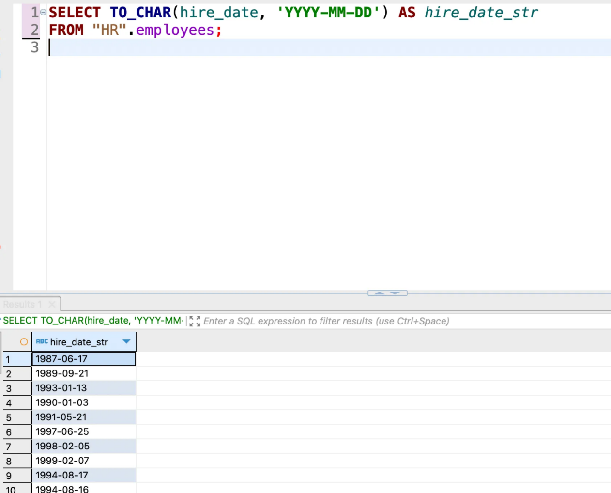
</div>

Результат буде містити значення **hire_date** у вигляді рядків у форматі
<h2 align="center">«YYYY-MM-DD».</h2>

-   **Конвертація з рядка (string) на тип дати або часу**

Для перетворення рядка на тип дати або часу
використовується функція **CAST**.

Наприклад, для конвертації рядка **«2022-05-10»** у тип **date** можна
скористатися таким запитом:

```sql
SELECT CAST('2022-05-10' AS date) AS converted_date;
```
<div align="center">
  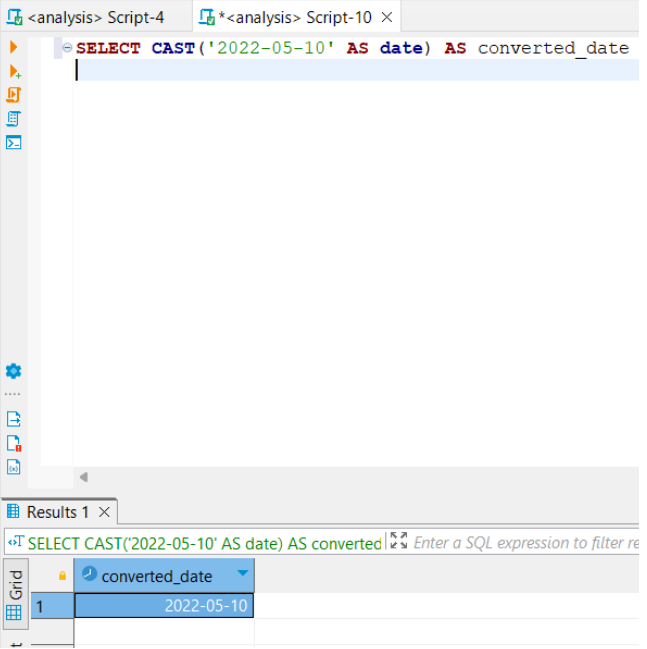
</div>

Результат буде містити значення **«2022-05-10»** у форматі типу
**date**.

Отже, функція **TO_CHAR** використовується для конвертації типів дати та
часу в рядок, а функція **CAST** дозволяє конвертувати рядок у тип дати
або часу.

<h2 align="center">Висновки</h2>

Робота з датами та часом у SQL з використанням типів даних **DATE,
TIME** і **TIMESTAMP** є важливою частиною розробки баз даних та аналізу
даних. Ось основні висновки щодо цієї теми:

-   Тип даних **DATE** використовується для зберігання лише дати без
    часу. Він дає можливість виконувати операції з датами, такі як
    порівняння, отримання компонентів дати, арифметичні операції з
    датами.

-   Тип даних **TIME** використовується для зберігання лише часу без
    дати. Він дозволяє виконувати операції з часом, такі як порівняння,
    отримання компонентів часу, арифметичні операції з часом.

-   Тип даних **TIMESTAMP** представляє комбінацію дати і часу. Він
    дозволяє зберігати точні відмітки часу й надає можливість виконувати
    операції з датою і часом одночасно.

-   SQL надає різні функції та оператори для роботи з датами та часом.
    Вона містить функції для форматування дати та часу, отримання
    компонентів дати та часу, виконання арифметичних операцій і
    перетворення між різними форматами.

-   Під час роботи з датами та часом у SQL варто враховувати локалізацію
    та часові пояси. SQL надає функції для роботи з часовими поясами та
    перетворення часу між різними часовими поясами.

-   Правильне використання типів даних **DATE, TIME** і **TIMESTAMP** у
    SQL дозволяє ефективно аналізувати часові дані в базі даних, такі як
    записи подій, транзакції або зміни, і керувати ними.

Загалом розуміння і вміння працювати з датами та часом в SQL є важливою
навичкою для аналітиків даних, що дозволяє ефективно обробляти й
аналізувати часові дані в базах даних.

<h2 align="center">Віконні функції (Window functions)</h2>

Для кращого розуміння цієї теми створимо додаткові таблиці.

<div align="center">
  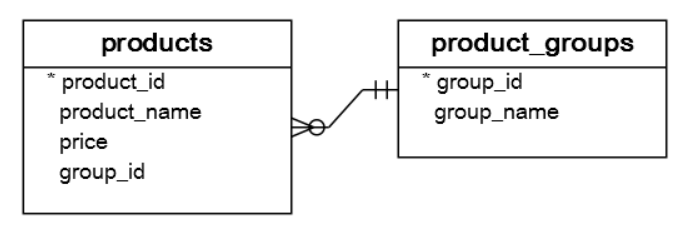
</div>

```sql
CREATE TABLE product_groups (
    group_id serial PRIMARY KEY
  , group_name VARCHAR(255) NOT NULL
);

CREATE TABLE products (
    product_id serial PRIMARY KEY
  , product_name VARCHAR(255) NOT NULL
  , price DECIMAL(11, 2)
  , group_id INT NOT NULL
  , FOREIGN KEY (group_id) REFERENCES product_groups (group_id)
);
```

Також додамо деяку інформацію до наших таблиць:

```sql
INSERT INTO product_groups (group_name)
VALUES
 ('Smartphone')
 , ('Laptop')
 , ('Tablet')
;

INSERT INTO products (product_name, group_id, price)
VALUES
 ('Microsoft Lumia', 1, 200)
 , ('HTC One', 1, 400)
 , ('Nexus', 1, 500)
 , ('iPhone', 1, 900)
 , ('HP Elite', 2, 1200)
 , ('Lenovo Thinkpad', 2, 700)
 , ('Sone VAIO', 2, 700)
 , ('Dell Vostro', 2, 800)
 , ('iPad', 3, 700)
 , ('Kindle Fire', 3, 150)
 , ('Samsung Galaxy Tab', 3, 200)
;
```

<div align="center">
  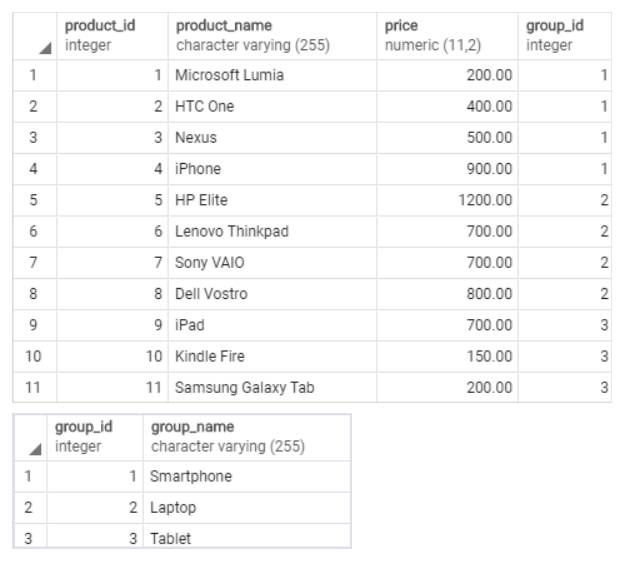
</div>

<h2 align="center">Порівняння агрегатних функцій з віконними функціями</h2>

Найпростіший спосіб зрозуміти віконні функції --- почати з
перегляду [**[агрегатних
функцій]{.underline}**](https://www.postgresqltutorial.com/postgresql-aggregate-functions/). Агрегатна
функція об'єднує дані з набору рядків в один рядок.

У наступному прикладі використовується агрегатна
функція [**AVG**](https://www.postgresqltutorial.com/postgresql-avg-function/) для
обчислення середньої ціни всіх продуктів у таблиці **products**.

```sql
SELECT AVG(price)
FROM products;
```
<div align="center">
  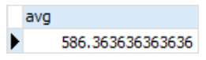
</div>

Щоб застосувати агрегатну функцію до підмножини рядків, ми
використовуємо **GROUP BY**. Наступний приклад повертає середню ціну для
кожної групи продуктів.

```sql
SELECT
    group_name
,   AVG(price)
FROM products
INNER JOIN product_groups USING (group_id)
GROUP BY group_name;
```
<div align="center">
  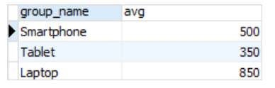
</div>

Як ми бачимо, агрегатні функції зменшують кількість рядків.

Подібно до агрегатної функції, віконна функція працює з набором рядків.

Однак це не зменшує кількість рядків, які повертає запит.

Термін **«вікно»** описує набір рядків, у яких виконується віконна
функція.

Віконна функція повертає значення з рядків у межах вікна.

Наприклад, у наступному запиті повертаються назва продукту, ціна, назва
групи

продуктів разом із середніми цінами для кожної групи продуктів.

```sql
SELECT product_name
    , price
    , group_name
    , AVG(price) OVER (
        PARTITION BY group_name
      ) AS avg_price_per_group
FROM products
INNER JOIN product_groups USING (group_id);
```

<div align="center">
  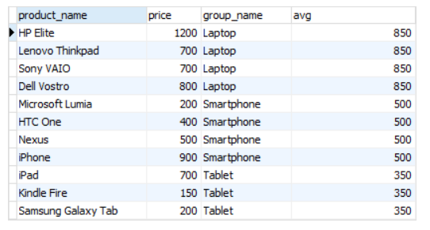
</div>

У цьому запиті використовується віконна функція **AVG (price) OVER
(PARTITION BY group_name)**.

Розглянемо, як вона працює:

1.  Спочатку з таблиці products отримуються дані про назву
    продукту **(product_name),** ціну** (price)** і назву
    групи **(group_name).**

2.  За допомогою **INNER JOIN** таблиці **products** із
    таблицею **product_groups** злито за спільним стовпцем **group_id**.
    Це дозволяє отримати інформацію про групу, до якої належить кожен
    продукт.

3.  Віконна функція **AVG (price) OVER (PARTITION BY
    group_name)** використовується для обчислення середньої
    ціни** (price)** в межах кожної групи **(group_name).** Це означає,
    що дані будуть групуватися за значенням **group_name** і для кожної
    окремої групи буде обчислюватися середня ціна.

Результат запиту буде містити всі вибрані стовпці **(product_name,
price, group_name)**, а також додатковий стовпець, який відображає
середню ціну **( AVG (price) OVER (PARTITION BY group_name ))** для
кожної групи продуктів.

Основна ідея віконних функцій полягає в можливості обчислювати значення
з урахуванням контексту визначеного вікна (у цьому випадку група
продуктів) замість окремих рядків.

У цьому запиті **AVG (price) OVER ( PARTITION BY group_name )** обчислює
середню ціну для кожної групи продуктів, дозволяючи аналізувати ціни в
межах кожної окремої групи замість аналізу всіх продуктів загалом.

<h2 align="center">Синтаксис віконних функцій PostgreSQL</h2>

У PostgreSQL синтаксис віконних функцій містить ключові
слова **OVER** і **PARTITION BY**, а також вказівники вікна, такі
як **ORDER BY, ROWS, RANGE** тощо.

Основний синтаксис віконних функцій у Postgre виглядає так:
```sql
<функція>
OVER ([PARTITION BY <стовпець1>, <стовпець2>, ...]
[ORDER BY <стовпець> [ASC|DESC], ...]
[ROWS <розмір_вікна>] [<додаткові_вказівники_вікна>]
)
```
Де:

-   **<функція>** --- це вираз, який відображає віконну функцію,
    наприклад, **SUM, AVG, RANK** тощо.

-   **PARTITION BY <стовпець1>, <стовпець2>,** ... --- вказує, за
    якими стовпцями слід групувати дані перед обчисленням віконної
    функції.

-   **ORDER BY <стовпець> [ASC|DESC],** ... --- визначає порядок
    сортування рядків, у межах яких відбувається обчислення віконної
    функції.

-   **ROWS <розмір_вікна> **--- вказує, які рядки повинні бути
    включені до вікна. Це можуть бути, наприклад, попередні **N** рядків
    **(ROWS BETWEEN <start> PRECEDING AND <end> FOLLOWING)** або
    діапазон значень **(RANGE BETWEEN <start> AND <end>).**

-   **\<додаткові_вказівники_вікна\>** --- додаткові вказівники вікна,
    такі як **ROWS BETWEEN** **UNBOUNDED PRECEDING AND CURRENT ROW,
    GROUPS, EXCLUDE** тощо.

Ти можеш використовувати цей синтаксис для визначення віконних функцій у
PostgreSQL, де **OVER** вказує початок віконної функції, а вказівники
вікна дозволяють тобі налаштовувати контекст обчислення функції.

<h2 align="center">Список віконних функцій PostgreSQL</h2>

У PostgreSQL доступно багато віконних функцій, які можна використовувати
для аналізу й обробки даних. Ось кілька поширених віконних функцій у
PostgreSQL:

-   **ROW_NUMBER ()** --- Присвоює \*\*\*\* унікальний номер кожному
    рядку в межах вікна. Номери рядків відповідають порядку вибірки без
    сортування.

-   **RANK ()** --- Призначає ранг кожному рядку, відповідно до
    вказаного виразу сортування. Рядки з однаковими значеннями отримують
    однаковий ранг, пропускаючи наступні ранги.

-   **DENSE_RANK ()** --- Призначає «щільний» ранг кожному рядку,
    відповідно до вказаного виразу сортування. Рядки з однаковими
    значеннями отримують однаковий ранг, не пропускаючи наступні ранги.

-   **NTILE (n)** --- Розбиває вибірку на n груп і присвоює кожному
    рядку номер групи, до якої він належить.

-   **LAG (expression \[, offset \[, default\]\])** --- Повертає
    значення виразу, що передує поточному рядку у вікні. Можна вказати
    зсув і значення за замовчуванням для випадку, коли попереднє
    значення недоступне.

-   **LEAD (expression \[, offset \[, default\]\])** --- Повертає
    значення виразу, що слідує за поточним рядком у вікні. Можна вказати
    зсув і значення за замовчуванням для випадку, коли наступне значення
    недоступне.

-   **FIRST_VALUE (expression)** --- Повертає значення виразу для
    першого рядка у вікні.

-   **LAST_VALUE (expression)** --- Повертає значення виразу для
    останнього рядка у вікні.

-   **SUM (expression)** --- Обчислює суму значень виразу в межах вікна.

-   **AVG (expression)** --- Обчислює середнє значення виразу в межах
    вікна.

Це лише кілька прикладів віконних функцій, доступних у PostgreSQL.

Віконні функції дозволяють виконувати розширений аналіз та обробку
даних, використовуючи контекст вікна, яке охоплює певні рядки або групи
рядків у результаті запиту. Познайомимося з тими, що найчастіше
трапляються в роботі аналітика.

Функції **ROW_NUMBER, RANK** і **DENSE_RANK**

-   **ROW_NUMBER ()** --- Ця функція призначає унікальний порядковий
    номер кожному рядку в межах вікна. Номери рядків відповідають
    порядку, в якому рядки вибрані без сортування. Інакше кажучи, перший
    рядок отримує номер 1, другий --- 2 і так далі.

-   **RANK ()** --- Ця функція призначає ранг кожному рядку, відповідно
    до вказаного порядку сортування. Ранги можуть пропускатись, якщо є
    рядки з однаковими значеннями. Наприклад, якщо два рядки мають
    однакове значення й займають друге та третє місця, то наступний
    рядок отримає ранг 4.

-   **DENSE_RANK ()** --- Ця функція призначає «щільний» ранг кожному
    рядку, відповідно до вказаного порядку сортування. Ранги не
    пропускаються, навіть якщо є рядки з однаковими значеннями.
    Наприклад, якщо два рядки мають однакове значення і займають друге
    та третє місця, то наступний рядок отримає ранг 3.

Розглянемо три запити та їхні результати.

<h2 align="center">Запит 1</h2>

```sql
SELECT product_name
    , group_name
    , price
    , ROW_NUMBER()
        OVER (
            PARTITION BY group_name
            ORDER BY price
        ) AS row_number
FROM products
INNER JOIN product_groups USING (group_id);
```

<div align="center">
  
</div>

У першому запиті використовується функція ROW_NUMBER (). Ця
функція призначає унікальний порядковий номер кожному рядку в межах
вікна, відповідно до вказаного порядку без сортування. Тобто перший
рядок буде під номером 1, другий рядок --- під номером 2 і так далі.

<h2 align="center">Запит 2</h2>

```sql
SELECT product_name
    , group_name
    , price
    , RANK() OVER (
        PARTITION BY group_name
        ORDER BY price
      ) AS rank_in_group
FROM products
INNER JOIN product_groups USING (group_id);
```

<div align="center">
  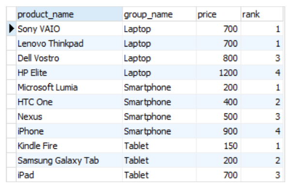
</div>

У другому запиті використовується функція RANK (). Ця функція призначає
ранг кожному рядку, відповідно до вказаного порядку сортування. Ранги
можуть пропускатись, якщо є рядки з однаковими значеннями. Наприклад,
якщо два рядки мають однакове значення й займають друге та третє місця,
то наступний рядок отримає ранг 4.

<h2 align="center">Запит 3</h2>

```sql
SELECT product_name
    , group_name
    , price
    , DENSE_RANK() OVER (
        PARTITION BY group_name
        ORDER BY price
      ) AS dense_rank_in_group
FROM products
INNER JOIN product_groups USING (group_id);
```

<div align="center">
  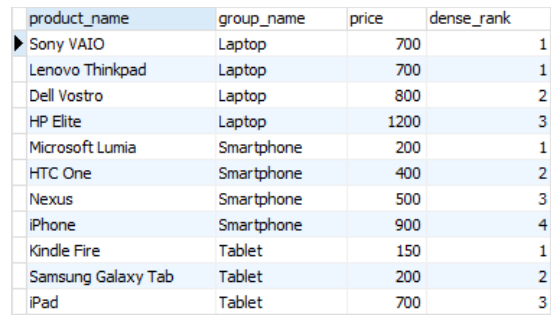
</div>

У третьому запиті використовується функція **DENSE_RANK ()**. Ця
функція призначає «щільний» ранг кожному рядку, відповідно до вказаного
порядку сортування. Ранги не пропускаються, навіть якщо є рядки з
однаковими значеннями. Наприклад, якщо два рядки мають однакове значення
й займають друге та третє місця, то наступний рядок отримає ранг 3.

<h2 align="center">Функції FIRST_VALUE і LAST_VALUE</h2>

У PostgreSQL існують дві віконні функції, які дозволяють отримати
значення першого й останнього рядків у межах
вікна: **FIRST_VALUE()** та **LAST_VALUE().**

Ось їх опис:

-   **FIRST_VALUE (expression)** --- Ця функція повертає значення виразу
    для першого рядка вікна. Вираз може бути будь-яким стовпцем або
    виразом, який ти хочеш отримати з першого рядка. Значення
    повертається для кожного рядка в межах вікна.

-   **LAST_VALUE (expression)** --- Ця функція повертає значення виразу
    для останнього рядка вікна. Вираз може бути будь-яким стовпцем або
    виразом, який ти хочеш отримати з останнього рядка. Значення
    повертається для кожного рядка в межах вікна.

Наступний оператор використовує **FIRST_VALUE (price)** для повернення
найнижчої ціни для кожної групи продуктів.

```sql
SELECT product_name
    , group_name
    , price
    , FIRST_VALUE(price) OVER (
        PARTITION BY group_name
        ORDER BY price
      ) AS lowest_price_per_group
FROM products
INNER JOIN product_groups USING (group_id);
```

<div align="center">
  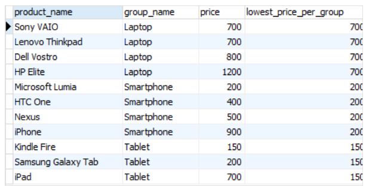
</div>

Наступний оператор використовує **LAST_VALUE (price)** функцію для
повернення найвищої ціни для кожної групи продуктів.

```sql
SELECT product_name
    , group_name
    , price
    , LAST_VALUE(price) OVER (
        PARTITION BY group_name
        ORDER BY price
        RANGE BETWEEN UNBOUNDED PRECEDING AND UNBOUNDED FOLLOWING
      ) AS highest_price_per_group
FROM products
INNER JOIN product_groups USING (group_id);
```

<div align="center">
  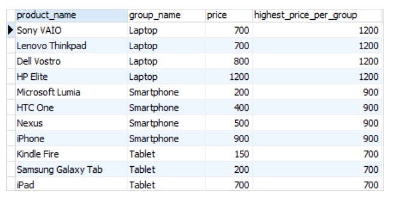
</div>

<h2 align="center">Вираз RANGE BETWEEN UNBOUNDED PRECEDING AND UNBOUNDED FOLLOWING</h2>

📌 ***RANGE BETWEEN UNBOUNDED PRECEDING AND UNBOUNDED FOLLOWING** --- це
вираз у межах віконного виразу SQL, який визначає діапазон (range) для
вікна, що охоплює всі рядки від першого до останнього рядка вікна, без
будь-яких обмежень.*

Коли використовується вираз **RANGE BETWEEN UNBOUNDED PRECEDING AND
UNBOUNDED FOLLOWING**, він вказує, що віконний фрейм повинен охоплювати
всі рядки від початку вікна до його кінця, без обмежень за значеннями
стовпців, використаних для сортування.

Це означає, що функції агрегації або віконні функції, які використовують
цей вираз, будуть обчислювати значення на основі всіх рядків вікна,
незалежно від значень стовпців сортування.

<h2 align="center">Функції LAG і LEAD</h2>

У PostgreSQL існують дві віконні функції, які дозволяють отримувати
значення попереднього рядка **(LAG)** та наступного рядка **(LEAD)** в
межах вікна.

Ось їх опис:

-   **LAG (expression [, offset [, default]] )** --- Ця функція
    повертає значення виразу для попереднього рядка вікна. Вираз може
    бути будь-яким стовпцем або виразом, який ти хочеш отримати з
    попереднього рядка.

-   Параметр **offset** визначає, скільки рядків назад від поточного
    рядка вікна необхідно переглянути (за замовчуванням **offset = 1**,
    тобто попередній рядок).

-   Параметр **default** вказує значення, яке буде повернено, якщо
    попередній рядок не існує (за замовчуванням **default = NULL**).

<h2 align="center">Приклад використання функції LAG</h2>

Наступний оператор використовує функцію **LAG ()** для отримання цін із
попереднього рядка й обчислення різниці між ціною поточного рядка та
попереднього рядка.

```sql
SELECT
    product_name
  , group_name
  , price
  , LAG(price, 1) OVER (
        PARTITION BY group_name
        ORDER BY price
    ) AS prev_price
  , price - LAG(price, 1) OVER (
        PARTITION BY group_name
        ORDER BY price
    ) AS cur_prev_diff
FROM products
INNER JOIN product_groups USING (group_id);
```

<div align="center">
  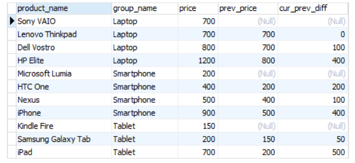
</div>

-   **LEAD (expression [, offset [, default]])** --- Ця функція
    повертає значення виразу для наступного рядка вікна. Вираз може бути
    будь-яким стовпцем або виразом, який ти хочеш отримати з наступного
    рядка.

-   Параметр **offset** визначає, скільки рядків уперед від поточного
    рядка вікна необхідно переглянути (за замовчуванням **offset = 1**,
    тобто наступний рядок).

-   Параметр **default** вказує значення, яке буде повернено, якщо
    наступний рядок не існує (за замовчуванням **default = NULL**).

<h2 align="center">Приклад використання функції LEAD</h2>

Наступний оператор використовує функцію **LEAD ()** для отримання цін із
наступного рядка й обчислення різниці між ціною поточного рядка та
наступного рядка.
```sql
SELECT
    product_name
,   group_name
,   price
,   LEAD(price, 1) OVER (
        PARTITION BY group_name
        ORDER BY price
    ) AS next_price
,   price - LEAD(price, 1) OVER (
        PARTITION BY group_name
        ORDER BY price
    ) AS cur_next_diff
FROM products
INNER JOIN product_groups USING (group_id);
```

<div align="center">
  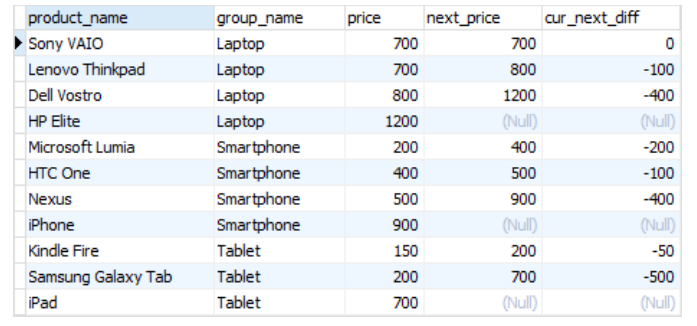
</div>

<h2 align="center">Висновки</h2>

Віконні функції в SQL надають можливість виконувати обчислення,
агрегацію та аналіз даних у межах певних вікон або груп рядків.
Вони доповнюють стандартні агрегатні функції, які працюють з усіма
рядками в наборі результатів.

Основні переваги віконних функцій:

-   **Розширена функціональність**. Віконні функції дозволяють
    виконувати розрахунки й агрегації на підмножинах даних, визначених у
    межах вікон. Це дозволяє здійснювати складні обчислення й
    аналізувати дані на більш гранульованому рівні.

-   **Гнучкість**. Віконні функції можуть бути налаштовані з
    використанням різних параметрів, таких як сортування, розбиття на
    групи й діапазони. Це дозволяє виконувати обчислення залежно від
    конкретних умов і впливати на розподіл результатів.

-   **Ефективність**. Віконні функції дозволяють виконувати обчислення
    на базі вікон без необхідності використовувати підзапити або
    з\'єднання таблиць. Це може покращити продуктивність запитів і
    зменшити складність запиту.

Застосування віконних функцій може бути широким --- від **розрахунку
агрегатних показників до аналізу трендів, рейтингів, змін і патернів у
даних**. Вони дозволяють здійснювати більш гнучкий і потужний аналіз
даних, що відкриває нові можливості для отримання інсайтів із великих
обсягів даних.

<h2 align="center">Найкращі практики написання та форматування коду</h2>

Щоб бути успішним аналітиком даних, необхідно не лише мати глибокі
знання аналітичних методів, а й уміти ефективно писати та форматувати
SQL-код.

Тому ми зібрали для тебе найкращі практики написання та форматування
коду в SQL, спеціально в контексті аналітики даних. Ці рекомендації
допоможуть покращити читабельність, підтримку й ефективність SQL-коду,
що зі свого боку дозволить заощадити час, уникнути помилок та підвищити
якість аналітичних рішень.

Сьогодні розглянемо основні принципи та стандарти форматування,
правильне найменування об\'єктів бази даних, використання коментарів і
документації.

<h2 align="center">Хороший стиль</h2>

Хороший стиль написання коду є невід\'ємною частиною розробки
програмного забезпечення та SQL-запитів. Ось кілька ключових аспектів,
які сприяють створенню чистого, зрозумілого та підтримуваного коду:

-   **Ідентифікатори й імена.** Правильне й осмислене найменування
    ідентифікаторів та об\'єктів бази даних відіграє важливу роль у
    зрозумілості коду. Також важливо, щоб вони були написані в єдиному
    стилі.

-   **Пробіли і відступи**. Правильне форматування коду з використанням
    пропусків і відступів має велике значення для покращення його
    зрозумілості. Логічне розташування пропусків і відступів допоможе
    створювати код з більш зрозумілою структурою.

-   **Дата і час**. Щоб забезпечити сумісність і консистентність даних,
    використовуй стандарт **[ISO
    8601](https://en.wikipedia.org/wiki/ISO_8601): YYYY-MM-DD і HH:MM:SS.SSSSS **---
    для отримання дати та часу в SQL.

-   **Функції SQL.** Одним із важливих аспектів хорошого стилю є
    використання стандартних SQL-функцій замість специфічних функцій,
    які надаються конкретним постачальником бази даних. Це забезпечує
    кращу переносимість запиту.

-   **Код**. Лаконічність коду відіграє важливу роль у його зрозумілості
    та підтримці. Прикладами зайвого коду можуть бути непотрібні лапки,
    дужки або надмірне використання оператора WHERE.

-   **Коментарі**. Коментарі є невід\'ємною частиною хорошого стилю.
    Бажано використовувати коментарі у стилі C **--- / (початок) і \*/
    (кінець)\*.** Або можна додавати --- перед коментарем, тоді кінцем
    коментаря буде новий рядок.

Нижче наведені приклади запитів, які оформлені відповідно до принципів
хорошого стилю:

<div align="center">
  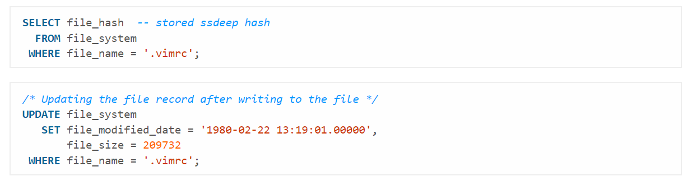
</div>

<h2 align="center">Поганий стиль</h2>

Поганий стиль коду може призвести до низької зрозумілості, складнощів у
підтримці та розумінні коду іншими розробниками. Розглянемо кілька
прикладів, щоб уникнути поширених помилок і поганого стилю в SQL-коді:

-   **CamelCase**. Використання CamelCase (де кожне слово починається з
    великої літери, крім першого) для назв таблиць, стовпців або інших
    об\'єктів бази даних може знизити зрозумілість коду. Рекомендується
    використовувати роздільник між словами, такий як підкреслення або
    пунктуаційний знак, щоб назви були більш зрозумілими,
    наприклад, order_date замість orderDate.

-   **Префікси та [[угорська
    нотація]{.underline}](https://en.wikipedia.org/wiki/Hungarian_notation)**.
    Використання префіксів, таких як sp\_ для збережених процедур
    або tbl\_ для таблиць є зайвим. Ці префікси не несуть додаткової
    інформації та ускладнюють читання коду. Рекомендується
    використовувати змістовні назви без префіксів.

-   **Множина**. Використання множини для назв таблиць або стовпців може
    викликати плутанину. Рекомендується використовувати більш природні
    колективні поняття для назв, щоб покращити розуміння коду.
    Наприклад, staff замість employees або people замість individuals.

-   **Ідентифікатори в лапках**. Якщо тобі дійсно необхідно використати
    ідентифікатори в лапках, то слід використовувати подвійні лапки,
    визначені у
    стандарті [[SQL-92]{.underline}](https://en.wikipedia.org/wiki/SQL-92).
    Це забезпечить кращу переносимість коду між різними системами
    керування базами даних.

<h2 align="center">Умови найменування</h2>

-   Переконайся, що ім'я є **унікальним** і не є зарезервованим ключовим
    словом.

-   Максимальна довжина становить 30 байтів --- на практиці це 30
    символів, якщо ти не використовуєш багатобайтовий набір символів.

-   **Імена повинні починатися з літери** й не можуть закінчуватися
    символом підкреслення.

-   Використовуй лише літери, цифри та підкреслення в іменах.

-   **Уникай використання кількох послідовних символів підкреслення**
    --- їх важко прочитати.

-   **Використовуй символи підкреслення там, де ти природно додав
    би/додала б пробіл** до назви (наприклад, ім'я буде **first_name**,
    а не **first name**).

-   **Уникай скорочень**, і якщо тобі потрібно їх використовувати,
    переконайся, що вони зрозумілі або широко застосовуються.

<div align="center">
  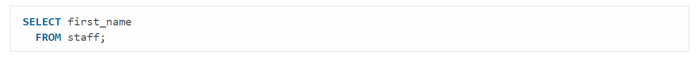
</div>

<h2 align="center">Таблиці</h2>

-   **Використовуй збірну назву** або, що менш ідеально, форму множини.
    Наприклад (у порядку переваги), staff і employees.

-   **Не використовуй префікс tbl**, або будь-який інший такий описовий
    префікс, або угорську нотацію.

-   **Ніколи не називай таблицю так само, як один з її стовпців**, і
    навпаки.

-   Уникай, де це можливо, об'єднання двох імен таблиць разом, щоб
    створити назву таблиці зв'язків. Замість cars_mechanics віддавай
    перевагу services.

<h2 align="center">Стовпці</h2>

-   **Завжди використовуй назву в однині**.

-   **Якщо можливо, уникай простого використання id** як основного
    ідентифікатора для таблиці (або використовуй конвенції, прийняті
    спільнотою).

-   **Не додавай стовпець з такою самою назвою, як у таблиці**, і
    навпаки.

-   **Завжди використовуй нижній регістр**, за винятком тих випадків,
    коли верхній регістр може мати сенс, наприклад, власні назви.

<h2 align="center">Псевдонім або кореляції</h2>

-   Повинні певним чином пов'язуватися з об'єктом або виразом, який вони
    створюють.

-   Як правило, ім'я кореляції має починатися з першої літери кожного
    слова в назві об\'єкта.

-   Якщо вже існує кореляція з такою самою назвою, додай число.

-   **Завжди додавай ключове слово AS** --- це полегшує читання,
    оскільки воно є явним.

-   Для обчислюваних даних (**SUM()** або **AVG()**) використовуй ім'я,
    яке ти б дав/-ла їм, якби цей стовпець був визначений у схемі.

<h2 align="center">Збережені процедури</h2>

Назва має містити дієслово.

Не використовуй префікс **sp\_**, або будь-який інший описовий префікс,
чи угорську нотацію.

<h2 align="center">Однорідні суфікси</h2>

Наступні суфікси мають універсальне значення, що забезпечує легке
читання та розуміння стовпців із коду SQL. Використовуй правильний
суфікс там, де це доречно.

-   **\_id** --- унікальний ідентифікатор, наприклад, стовпець, що є
    первинним ключем;

-   **\_status** --- значення прапорця або інший статус будь-якого типу,
    наприклад, publication_status;

-   **\_total** --- загальна сума або сума набору значень;

-   **\_num** --- позначає, що поле містить будь-який тип чисел;

-   **\_name** --- позначає таке ім'я, як first_name;

-   **\_seq** --- містить безперервну послідовність значень;

-   **\_date** --- позначає стовпець, що містить дату;

-   **\_tally** --- підрахунок;

-   **\_size** --- розмір чогось, наприклад, файлу або одягу;

-   **\_addr** --- адреса для запису, може бути фізичною або
    нематеріальною, наприклад, ip_addr.

<h2 align="center">Зарезервовані слова</h2>

Найкраще уникати скорочених ключових слів і використовувати повні
ключові слова, якщо вони доступні (віддавай
перевагу **ABSOLUTE** замість **ABS**).

Не використовуй ключові слова, специфічні для сервера баз даних, якщо
існує відповідне ключове слово **ANSI SQL**, яке виконує таку саму
функцію. Це допомагає зробити код більш переносимим.

<div align="center">
  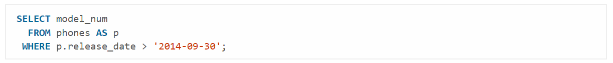
</div>

<h2 align="center">Порожній простір</h2>

Для полегшення читання коду важливо використовувати правильне та
узгоджене доповнення пробілів.

```sql
SELECT product_name
, group_name
, price
, LAG(price, 1) OVER (
    PARTITION BY group_name
    ORDER BY price
) AS prev_price
, price - LAG(price, 1) OVER (
    PARTITION BY group_name
    ORDER BY price
) AS cur_prev_diff
FROM products
INNER JOIN product_groups USING (group_id)
    WHERE price > 1000
        AND group_name IN ('Електроніка', 'Побутова техніка')
ORDER BY group_name
       , price DESC;
```

Цей стиль форматування поєднує переваги вертикального вирівнювання з
ізоляцією складних виразів, що забезпечує максимальну читабельність,
підтримуваність та стійкість до помилок при редагуванні.

1.  **Використання ком на початку рядка (Prefix Commas)**

Коми розміщуються на початку кожного рядка, що містить елемент списку
(SELECT або ORDER BY).

Чітка Ізоляція:

-   Кожен елемент списку починається з розділювача (коми), що робить
    кожен рядок незалежним й зручним до сприйняття.

-   Стійкість до Помилок (Debugging): Щоб закоментувати або видалити
    стовпець (group_name), Вам не потрібно змінювати попередній рядок і
    видаляти кому. Це мінімізує ризик синтаксичних помилок і прискорює
    тестування.

-   Легке Додавання: Додавання нового стовпця завжди відбувається шляхом
    вставлення нового рядка, що починається з ,.

2.  **Вертикальне розділення віконних функцій (LAG OVER)**

-   **clause** **OVER** має бути розділена на окремі рядки з додатковим
    відступом.

-   Чітке Виділення Логіки: Віконні функції **(LAG, ROW_NUMBER, SUM**
    тощо) є найскладнішими частинами запиту. Виділення вмісту **OVER**
    на окремі рядки **(PARTITION BY, ORDER BY)** робить логіку
    визначення вікна миттєво зрозумілою.

-   Читабельність Складових Частин: Замість одного довгого рядка, який
    ховається за полем зору, логіка вирівнюється вертикально, що нагадує
    структуру **GROUP BY** та **ORDER BY**.

3.  **Групування та відступи clause**

-   **Основні clause** **(FROM, WHERE, ORDER BY)** починаються на новому
    рядку без відступу.

-   **Логічні Блоки**: З\'єднання **(INNER JOIN)** та умови фільтрації
    (WHERE) починаються на новому рядку, але наступні елементи **(USING,
    AND)** також мають відступи для візуального зв\'язку з батьківською
    clause.

-   **Умови Фільтрації**: Кожна незалежна умова у **WHERE** (з\'єднана
    **AND** або **OR**) має бути на новому рядку, щоб чітко бачити
    логіку фільтрації.

Такий стиль забезпечує послідовність та прозорість коду, що є критичним
для довгострокової підтримки та співпраці.
